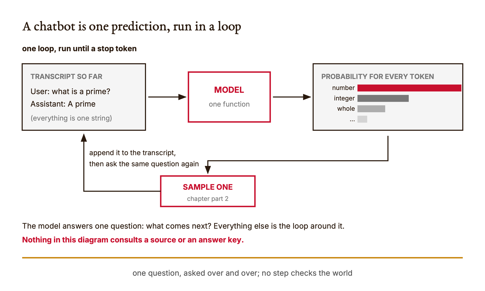
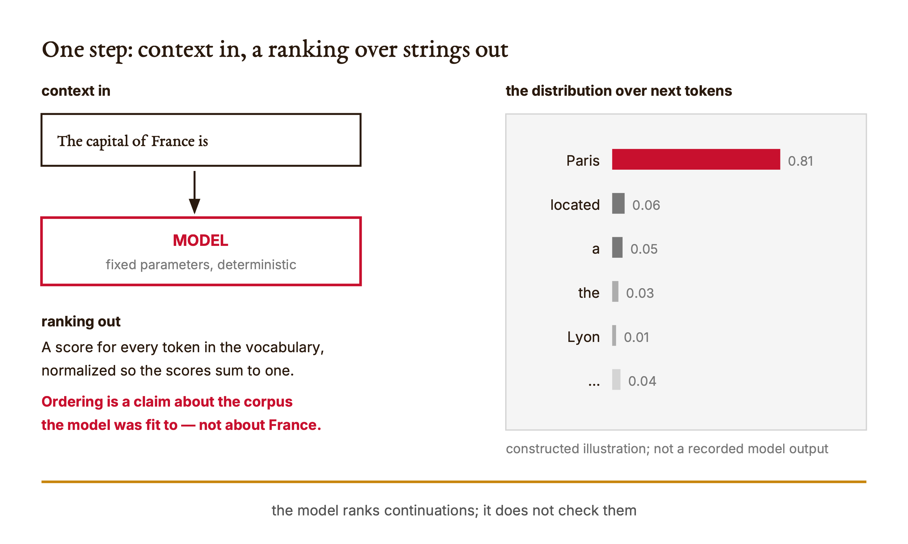
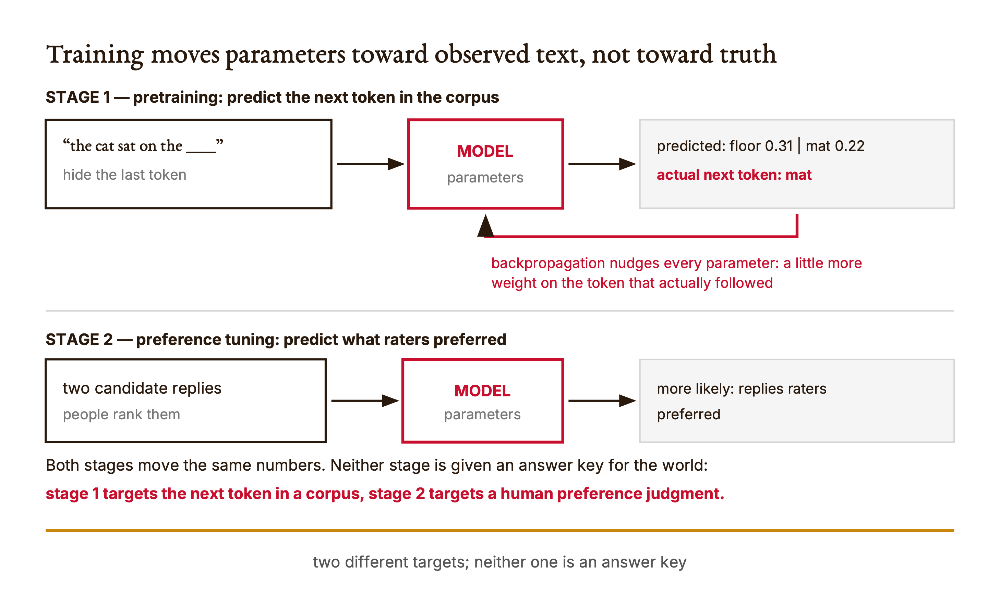

# Chapter 1 — Randomness and first prompts

*The answer changed. First, find out what you actually measured.*

Suppose you ask Claude the same question twice. The first answer is short. The second has a different example, a different qualification, perhaps a different conclusion. You now have two outputs and several possible explanations. The temptation is to pick the explanation that sounds most familiar: the prompt was vague, the model was creative, the system was unreliable. None of those descriptions identifies the moving part. You have observed a difference. You have not yet isolated its cause.

The chapter comes in two parts. Part 1 describes what a language model actually computes — one prediction, run in a loop — and where its numbers come from, because you cannot isolate a moving part in a machine you have not looked inside. Part 2 shrinks that machine to three outcomes and three numbers, small enough that you can inspect every intermediate value, and then uses it to design an honest experiment. The toy will not reproduce Claude. That limitation is its educational advantage: there is nowhere for an unexplained operation to hide behind the scale of a production system.

Both parts serve one distinction, and it is worth stating before either begins. A score is not a probability. A probability is not an observed frequency. An observed frequency is not a correctness judgment. We will be able to make one outcome increasingly likely without adding a single piece of evidence that the outcome is correct, and make a run repeatable without making its answer true. Those are not edge cases. They follow from what the program is designed to compute.

This book's exercises assume access to Claude Code. Enrolled Northeastern students should begin with the university's [Claude portal](https://claude.northeastern.edu/) and the repository's [access guide](../docs/neu-claude-access.md); public readers need their own Claude Code-enabled account. Course-specific access instructions remain outside the numbered book. Your Claude Code conversation and a direct API request are different activities with different access and usage arrangements. This chapter's Python experiment needs no API key and spends no direct API credits. Claude can help you inspect your work through your existing account; the numerical results printed here come from an offline program, not a fabricated conversation with Claude.

## What you will be able to do

By the end, you should be able to describe a chatbot as a next-token predictor inside a loop, say what pretraining and preference tuning each target, restate a training-scale slogan as an arithmetic derivation with its assumptions named, and state the stochastic-parrot argument in a form its authors would recognize. You should also be able to calculate a three-outcome distribution, explain why subtracting the largest score preserves it, predict how positive temperature changes its concentration, compare a recorded sample with the distribution that generated it, identify a claim the experiment cannot support, and build a test that catches a misleading interpretation.

Part 1 needs no code. Part 2 needs Python functions, lists, and basic arithmetic with exponentials; it does not need a model SDK. Before reading the reference implementation, make a prediction and write a first attempt in your own learning-artifacts directory. The point is not to hide available code from you. It is to give you a first explanation that later evidence can correct. The paired [lesson](../lessons/01-randomness-and-first-prompts/docs/en.md) supplies the runnable learning sequence and its existing knowledge check.

## Part 1 — What a language model does

### The unfinished script

Imagine a page of dialogue between a person and an assistant, with the assistant's half torn away. Now imagine a machine that takes any stretch of text and returns a plausible continuation — not *the* continuation, but a ranked field of candidates with numbers attached. You could rebuild the missing half mechanically. Feed in what survives. Take a candidate for the first fragment of the reply. Append it. Feed the longer text back in. Repeat until the machine proposes an ending.

That procedure is not an analogy for a chatbot. It is a description of one. The framing comes from Grant Sanderson's short explainer *Large Language Models explained briefly* (3Blue1Brown), and it is worth taking literally rather than as a simplification for beginners. When you send a message to Claude, no component in the system is answering your question. One component is repeatedly answering a different question — what plausibly comes next in this text? — and a loop around it turns those answers into something that reads like a reply.

<!-- [FIGURE: Cajal production brief. A chatbot is one prediction, run in a loop. Include transcript so far, model, probability for every token, sample one, append and repeat. Show the confirmed relationship that no step in the loop consults a source or an answer key. Exclude unverified relationships, decorative elements, product-interface simulation, gradients, shadows, rounded corners, three-dimensional effects, and color-only meaning. The SVG and PNG are generated publication assets; retain this comment as figure provenance.] -->

*Figure 1.1 — A chatbot is one prediction, run in a loop*

Hold onto the shape of that diagram, because the rest of this book studies what can and cannot be attached to it. Nothing in the loop reads a document, checks an answer key, or knows whether the growing text is true. Retrieval, tools, permissions, and approval gates all arrive in later chapters as attempts to supply something the loop does not contain.

### One question, asked over and over

Be precise about the unit. The machine does not predict words. It predicts **tokens** — fragments drawn from a fixed vocabulary, where a common word may be one token, a rare word several, and a space is usually part of the token that follows it. `unbelievable` might arrive in three pieces. This matters more than it sounds: character-level tasks like counting letters or reversing a string are awkward for a system whose atoms are subword chunks, and prompts that ask for exact character counts are asking the machine to reason about a unit it does not natively see.

The output for one step is not a token. It is a number for every token in the vocabulary — tens of thousands of them — arranged so the numbers are nonnegative and sum to one. Every candidate continuation gets a share, including absurd ones. The absurd ones get small shares. Nothing is excluded; things are merely ranked.

<!-- [FIGURE: Cajal production brief. One step: context in, a ranking over strings out. Include the context string, the model, and a probability for every vocabulary token. Show the confirmed relationship that ordering describes the training corpus and not the world. Exclude unverified relationships, decorative elements, product-interface simulation, gradients, shadows, rounded corners, three-dimensional effects, and color-only meaning. The SVG and PNG are generated publication assets; retain this comment as figure provenance.] -->

*Figure 1.2 — One step: context in, a ranking over strings out*

Read the caption of that figure carefully, because it contains the chapter's whole argument in one line. The distribution ranks *continuations of a string*. Its shape was fixed by fitting parameters to a body of text. If `Paris` receives a high probability after `The capital of France is`, the number is reporting something about how that phrase tends to continue in the corpus the model was fit to. It is not the output of a lookup against an atlas. The two agree here. Their agreement is a fact about the corpus, not a mechanism that guarantees agreement in the next case.

That is the load-bearing distinction of this chapter, and it will not become false later in the book. It only becomes better managed.

### The transcript is the whole trick

If the model only continues text, how does it hold a conversation? By being handed text that looks like a conversation. Under the interface, a chat is a single string with role markers, something with the shape of:

```text
System: You are a careful assistant. Cite the provided source or say you do not know.
User: What does the attached policy say about late submissions?
Assistant:
```

The model's job is to continue *that* string, and the most plausible continuation of a string ending in `Assistant:` is an assistant-sounding reply. What gets shown to you is the part after the last marker. Roles are not modes the software switches into. They are text in a document that the machine is completing.

Two practical consequences follow, and both explain behavior you will otherwise find baffling. First, a **system prompt is not an enforcement mechanism.** It is a paragraph placed near the top of a document, competing for influence with every other paragraph, including ones a user may paste in later. Chapter 5 will show that access control has to be enforced by the runtime, not requested in the preamble; this is the reason why. Second, **the model does not remember your last conversation** — the entire transcript is resupplied every turn. What feels like memory is a growing string, which is also why long conversations behave differently from short ones and why Chapter 7 treats context as something you engineer rather than something you have.

Try the mechanism directly. Paste this into Claude and read what comes back with the loop in mind:

```text
Continue this text. Do not answer as an assistant; just continue the string
as literal text, including whatever comes next after the final colon.

The following is a transcript of a support call.
Caller: my package never arrived.
Agent:
```

You are asking for the mechanism without the costume. Save what you get in your learning artifacts alongside the exact prompt and date — you will compare it against a normal request later in this chapter.

### Where the numbers come from

The parameters that fix all those probabilities — hundreds of billions of continuous values in current systems — were never set by hand. They start random, which means the model starts by producing noise. They are then adjusted, over and over, by a procedure with a very narrow objective.

Take a passage of text. Hide the next token. Ask the model for its distribution. Compare that distribution with the token that actually followed. Then use **backpropagation** to nudge every parameter slightly, so that next time this context arises the true token gets a little more probability and everything else a little less. Repeat across an enormous corpus. Nothing in this loop is told what is true. The target is what the corpus did next.

This stage is called **pretraining**, and it produces something that completes internet text rather than something that behaves like an assistant. A second stage adjusts for that. People are shown candidate replies and asked which they prefer; those judgments are used to shift the parameters toward what raters approved of. The technique traces to Christiano et al., *Deep Reinforcement Learning from Human Preferences* (arXiv:1706.03741, 2017) and was applied to instruction-following language models by Ouyang et al., *Training language models to follow instructions with human feedback* (arXiv:2203.02155, 2022).

<!-- [FIGURE: Cajal production brief. Training moves parameters toward observed text, not toward truth. Include pretraining next-token target, backpropagation nudge, and preference tuning on rater judgments. Show the confirmed relationship that neither stage receives an answer key. Exclude unverified relationships, decorative elements, product-interface simulation, gradients, shadows, rounded corners, three-dimensional effects, and color-only meaning. The SVG and PNG are generated publication assets; retain this comment as figure provenance.] -->

*Figure 1.3 — Training moves parameters toward observed text, not toward truth*

Notice what the second stage changes and what it does not. It moves the model toward replies people approved of. Approval and correctness overlap heavily — raters generally prefer accurate answers — but they are different targets, and where they diverge the training signal follows approval. A confident, well-organized, wrong answer is exactly the kind of output that can be preferred by a rater who does not know the answer either. This is not a scandal about any particular company's process. It follows from what the objective is.

### Scale, in units you can check

Numbers about training scale circulate as slogans, and slogans are where this book insists on doing the arithmetic. GPT-3 is a useful anchor because its details were published: 175 billion parameters, roughly 300 billion training tokens, and a reported total training compute of 3.14 × 10²³ floating-point operations (Brown et al., *Language Models are Few-Shot Learners*, arXiv:2005.14165, 2020). Later frontier models are substantially larger, and their figures are frequently undisclosed.

You have probably heard the reading comparison: it would take a person thousands of years to read that much text. Run it yourself. The [derivation script](../research/llm_scale.py) makes every assumption an argument, and its [recorded output](../research/llm-scale.json) holds the results. Three hundred billion tokens at about 0.75 words per token is 225 billion words. Reading nonstop at 250 words per minute, that is **1,711 years**. At 200 words per minute it is 2,139 years. At 150, it is 2,852.

Sit with the spread for a moment. The headline figure is not a measurement. It is a division whose answer moves by more than a thousand years depending on a reading rate nobody stated. That does not make the comparison useless — every version of it says *more text than a person could read in many lifetimes*, which is the actual point. It makes the comparison an illustration with a hidden parameter, and finding hidden parameters in impressive-sounding numbers is a skill this course keeps asking you to use.

The compute figure behaves the same way. Suppose you could perform one billion operations per second by hand. GPT-3's reported training compute would take you about **9.95 million years**. You may have heard "over 100 million years"; that claim requires roughly 3.2 × 10²⁴ operations, about ten times GPT-3's budget, which is plausible for later systems but is a different claim about a different model. Both sentences can be true. They are not the same sentence, and a reader who cannot tell them apart cannot audit either.

### Inside one prediction step

The architecture that made this scale practical is the **transformer** (Vaswani et al., *Attention Is All You Need*, arXiv:1706.03762, 2017). Its relevant property here is parallelism. Earlier language models walked through text one position at a time, which is hard to spread across hardware built to do many operations simultaneously. A transformer takes the whole context at once.

Inside, four things happen. Each token becomes a list of numbers, because the fitting procedure only works on continuous values. Then **attention** lets those lists read each other and revise themselves according to context — the vector for `bank` after `river` ends up somewhere different from the vector for `bank` after `savings`. Then a feed-forward layer adds patterns stored during training. Then both operations repeat, layer after layer. At the end, the vector at the final position — which by now has been influenced by everything else in the context — is turned into one score per vocabulary token, and those scores are normalized into a distribution.

<!-- [FIGURE: Cajal production brief. Inside one prediction step. Include token vectors, attention revision by context, feed-forward layer, repeated layers, final-position vector, one score per vocabulary token, normalization. Show the confirmed relationship that context mixing ends in scores and then a normalization. Exclude unverified relationships, decorative elements, product-interface simulation, gradients, shadows, rounded corners, three-dimensional effects, and color-only meaning. The SVG and PNG are generated publication assets; retain this comment as figure provenance.] -->

*Figure 1.4 — Inside one prediction step*

That last step is where Part 2 begins. The normalization turning scores into a distribution is a specific, small, inspectable transformation, and you are going to build it from arithmetic in a few pages. Everything to its left in the figure is out of reach at this scale; the final arrow is not.

One more property belongs here because it constrains every honest claim you will make about these systems. Researchers designed the operations. They did not design the behavior. What the model does emerges from how those parameters were fitted, which is why nobody — including the people who built it — can read off why a particular prediction was made. "The model decided X because Y" is, absent specific interpretability evidence, a story about a system rather than a measurement of one.

### Stochastic parrots

The most influential name for the skeptical reading of all this is the **stochastic parrot**, from Bender, Gebru, McMillan-Major, and Shmitchell, *On the Dangers of Stochastic Parrots: Can Language Models Be Too Big?* (FAccT '21). Their claim, in outline: a language model stitches together sequences of linguistic form it observed in training according to probabilistic information about how those forms combine, with no access to meaning. Fluency is not comprehension. The coherence you perceive is supplied largely by you, because humans reliably attribute intent to well-formed text.

The argument has a conceptual half and an empirical half, and conflating them is the usual mistake. The conceptual half, developed in Bender and Koller's *Climbing towards NLU* (ACL 2020), holds that meaning is a relation between form and something outside language — communicative intent, reference to a world — and that a system trained on form alone has no channel to that outside. The empirical half is about consequences: the environmental and financial costs of training at scale, the impossibility of auditing web-scale corpora that encode dominant and abusive viewpoints, and the harms of deploying systems whose fluency invites unearned trust.

The paper is contested, and you should know where. Critics argue the conceptual half is largely definitional — it settles by stipulation what ought to be investigated — and point to work probing internal representations that appear to track non-linguistic structure, which sits awkwardly with "no reference to meaning." Defenders reply that internal structure is not grounded reference, and that the empirical half stands regardless of how the philosophy resolves. Both replies are reasonable. This book does not settle it, and you should be suspicious of a course that claims to.

What you can do is notice how the phrase gets used. In practice "stochastic parrot" is often deployed as a conversation-ender meaning *it's just autocomplete, there is nothing to see here* — a weaker and lazier claim than the paper's. Systems that merely replayed observed sequences would not generalize to strings absent from training, and they demonstrably do. Treating the term as an insult costs you the argument's actual content.

Here is the version this chapter will stand behind, because Part 2 will demonstrate it in code rather than assert it. **The mechanism ranks continuations, and ranking a continuation highly is not evidence that it is true.** You do not need a position on machine understanding to accept that. You need only look at what the transformation receives as input and notice that an answer key is not among its arguments.

### What Part 1 licenses you to say

You can now say that a chatbot is a next-token predictor inside a loop, that roles are text rather than modes, that training targets observed text and rater preference rather than truth, and that a prediction ends in a normalization over vocabulary scores. You can restate a scale slogan as a division and name its hidden assumption, and state the stochastic-parrot argument in a form its authors would recognize.

You cannot yet say what any of this implies about the variation you actually observe. Ask the same question twice and the answers differ — but the parameters did not change between runs, and neither did the architecture. Something else moved. Part 2 shrinks the system until that moving part is the only thing left in the room.

## Part 2 — Randomness you can inspect

### Three scores are not yet three chances

Our constructed input is the list `[1, 2, 3]`. Call its entries scores, or logits when referring to the function's parameter name. The word does not give these numbers extra authority. In this example I have chosen them; no model produced them. The outcomes are indexed zero, one, and two. Keeping the index separate from the score matters: outcome two has score three. Confusing those two numbers is an easy way to misread the output before any difficult mathematics arrives.

The list expresses an ordering: the third entry is largest. It does not yet express chances. Probabilities must be nonnegative and sum to one. These scores sum to six. Dividing each by six would produce one possible distribution, but it would be a different transformation from the one implemented in the lesson. We are not trying to invent any normalization that happens to work on this one positive list. We are trying to explain a particular mechanism that also accepts negative finite scores.

The mechanism exponentiates score differences, then divides by the total weight. An exponential converts any finite real input into a positive mathematical value. That gives us weights suitable for normalization. The important relation is not that score three becomes some impressive number. It is how the weight for score three compares with the weight for score two. Ratios survive normalization and tell us what the transformation is doing.

Let the score for outcome i be z_i, let T be a positive temperature, and let p_i be the probability assigned to that outcome. The mathematical transformation is:

```math
p_i = \frac{\exp(z_i/T)}{\sum_j \exp(z_j/T)}.
```

The index j walks over all available outcomes. The denominator is the total weight. Each numerator contributes one part of that total, so the resulting probabilities sum to one in exact arithmetic. This is a statement about the transformation. It is not a statement that the inputs were sensible or the outcome labels were true.

Before calculating anything, predict the ordering. Will the largest score still have the largest probability? For positive T, dividing by T preserves score order, the exponential preserves it again, and every weight is divided by the same positive total. The ordering survives. Changing a positive temperature can change how strongly the largest score dominates; it cannot make a smaller score become the largest probability under this formula.

That prediction is useful because it is more general than a remembered decimal. If your implementation gives the smallest score the largest probability, you do not need to compare your output against a screenshot. You have a reason to suspect an error. Perhaps you negated the score differences. Perhaps you paired probabilities with the wrong outcome labels. An explanation has become a debugging instrument.

### The subtraction that changes nothing important

The [reference implementation](../lessons/01-randomness-and-first-prompts/code/main.py) does not directly exponentiate the original scores. It first finds their maximum and subtracts it from every entry. For `[1, 2, 3]`, the shifted scores are `[-2, -1, 0]`. At temperature one, the corresponding weights are approximately `0.135335`, `0.367879`, and `1`. Their sum is approximately `1.503215`. Dividing each weight by that sum produces the probabilities recorded in the research run.

Why is subtraction allowed? Let m be the maximum score. Replacing z_i with z_i minus m gives:

```math
\frac{\exp((z_i-m)/T)}{\sum_j \exp((z_j-m)/T)}
=
\frac{\exp(z_i/T)\exp(-m/T)}{\exp(-m/T)\sum_j \exp(z_j/T)}.
```

The common factor cancels. We have changed the intermediate weights, not the intended normalized distribution. That distinction is the whole design choice. The computer does not need unnecessarily large intermediate exponentials to express a ratio. After subtracting the maximum, the largest exponent is zero and its exponential is one. The other exponentials are no larger than one.

The lesson tests this choice with equal large scores, `[1000, 1000]`, and expects `[0.5, 0.5]`. The shifted calculation is especially transparent: subtracting the maximum leaves `[0, 0]`, exponentiation gives `[1, 1]`, and normalization divides both by two. The large shared offset never needed to survive into the weights. It carries no information about their relative preference. The [test file](../lessons/01-randomness-and-first-prompts/code/tests/test_main.py) is evidence for this concrete case, not a proof that every imaginable numeric input is handled perfectly.

Here is the central implementation, reproduced from the lesson so that the mathematics has a visible destination. Build your own attempt before using this as a reference.

```python
import math

def probabilities(logits, temperature=1.0):
    if not logits or not math.isfinite(temperature) or temperature <= 0:
        raise ValueError("Need logits and a positive finite temperature")
    if not all(math.isfinite(x) for x in logits):
        raise ValueError("Logits must be finite")
    peak = max(logits)
    weights = [math.exp((x - peak) / temperature) for x in logits]
    total = sum(weights)
    return [weight / total for weight in weights]
```

The input checks are part of the mechanism, not decoration. An empty list offers no outcome to normalize. A zero temperature would make the displayed division invalid. A negative temperature would reverse the ordering we just relied on, so this interface excludes it. Nonfinite scores or a nonfinite temperature fall outside the function's accepted numeric domain. When you explain the program, include those exclusions. A function is partly defined by what it refuses to compute.

Notice what the code does not promise. It is a short teaching implementation, not a universal numeric-validation library. Its checks do not constitute a complete policy for arbitrary Python objects. Floating-point arithmetic also has representational limits. The maximum-subtraction technique avoids large positive exponentials here, but that does not entitle us to declare the program immune to all extreme-input behavior. Keep the tested claim narrower than the slogan “numerically stable.”

The distinction between a mathematical identity and an implementation result is worth practicing now. The cancellation above establishes equality in the mathematical expression. A numerical test compares values represented by a computer. In the lesson, the sum check uses approximate equality rather than requiring every floating-point sum to be exactly one. This is not an invitation to ignore errors; it is a reason to choose an assertion that matches the calculation.

If the probabilities sum to something close to one, you have passed one check. You have not checked that the ordering is right, that equal scores receive equal probabilities, that invalid temperature is rejected, or that sampling consumes the probabilities correctly. Several small tests can expose different mistakes. A single aggregate property is useful precisely when you resist asking it to certify the entire program.

### Temperature is a concentration control, not a fact checker

Return to the ratio between two outcomes. Normalization cancels out of that ratio:

```math
\frac{p_i}{p_k} = \exp\left(\frac{z_i-z_k}{T}\right).
```

Here k names another outcome. This expression explains the temperature effect without requiring a slogan about creativity. If z_i exceeds z_k, their positive difference is divided by T. A smaller positive T makes that exponent larger and increases the probability ratio. A larger T makes it smaller and brings the ratio closer to one. The transformation is changing relative concentration.

Predict the result before inspecting the table. With scores `[1, 2, 3]`, will temperature `0.5` or temperature `2` give more probability to outcome two? Which will give more probability to outcome zero? Write both predictions. Merely predicting the winning outcome misses most of the experiment, because the winning outcome stays the same throughout.

The following values come from the [recorded offline worked examples](../research/worked-examples.json), under key `chapters.01`. They were computed using the course implementation; the research script also checks agreement with a direct-exponential calculation for these moderate inputs.

| Temperature | Outcome 0, score 1 | Outcome 1, score 2 | Outcome 2, score 3 |
| --- | ---: | ---: | ---: |
| 0.5 | 0.0158762400 | 0.1173104278 | 0.8668133322 |
| 1.0 | 0.0900305732 | 0.2447284711 | 0.6652409558 |
| 2.0 | 0.1863237232 | 0.3071958857 | 0.5064803911 |

The largest score remains the favorite, but its share moves from about eighty-seven percent to about fifty-one percent across the displayed temperatures. The smallest score gains probability as the distribution flattens. This is a controlled result: the scores, outcome ordering, and transformation stay fixed while temperature changes. Nothing in that operation supplies evidence about the meaning of any selected answer.

We can make the limitation painfully concrete. Suppose, as an explicitly constructed hypothetical, the three labels are proposed answers to a question whose independently checked answer is label zero. Leave the scores unchanged. Lowering temperature concentrates selection on label two, which is wrong under the stipulated answer key. The transformation is functioning as designed. The failure is in treating its preference as a truth guarantee.

Do not report that hypothetical as an observed Claude error. It is a counterexample built from our own labels and scores, and its purpose is logical: no change in concentration can supply information the program never receives.

There is a second misconception hiding nearby. A low temperature is not the same operation as choosing the largest score directly. Our function requires a positive temperature, and at the displayed temperatures it returns a distribution. A sampler can still choose an outcome other than the largest. Do not pass zero and assume this implementation will switch to a special deterministic mode. The interface explicitly rejects zero. A product's settings and special cases would need separate documentation; this toy interface is not a promise about which controls any Claude model exposes.

<!-- [FIGURE: Cajal production brief. Temperature reshapes concentration, not ordering. Include scores, T = 0.5, T = 1, T = 2. Show the confirmed relationship that same outcome order; different concentration. Exclude unverified relationships, decorative elements, product-interface simulation, gradients, shadows, rounded corners, three-dimensional effects, and color-only meaning. The SVG and PNG are generated publication assets; retain this comment as figure provenance.] -->

*Figure 1.5 — Temperature reshapes concentration, not ordering*

### A distribution is not the sample you happened to see

The probability function returns a recipe for selection. It does not return a thousand outcomes. The next function makes that transition. It creates a local pseudorandom generator, asks for weighted selections, counts which indices appeared, and returns a dictionary of counts.

```python
import random
from collections import Counter

def sample(logits, count=1000, seed=7, temperature=1.0):
    if type(count) is not int or count < 0:
        raise ValueError("Count must be nonnegative")
    rng = random.Random(seed)
    return dict(Counter(rng.choices(
        range(len(logits)),
        probabilities(logits, temperature),
        k=count,
    )))
```

The choices are outcome indices, not the logit values. The count is the requested number of draws. The seed initializes the local generator. Temperature is passed to the probability calculation. Separating these arguments gives us distinct experimental controls. Change the count and you change how many observations you collect. Change the seed and you change the selected sequence under otherwise fixed conditions. Change temperature and you change the weights from which selections are made.

Python's [random documentation](https://docs.python.org/3/library/random.html), consulted for the research packet on 2026-09-06, describes separately instantiated generator state and weighted choices with replacement. Those are the narrow library behaviors we use here. We are not using this generator for secrets or making a promise about identical results across all future interpreter versions. The saved run records Python 3.14.6 so that a reader can distinguish a concrete execution environment from an unspecified claim of universal repeatability.

With replacement means an outcome remains available after it has been selected. A draw does not remove that outcome's index from the population. The counts accumulate observations of the same three possibilities. That is why seeing outcome two once does not use it up. The function does not allocate a fixed quota to each outcome and then shuffle the quota. It performs weighted selections and counts what occurred.

At temperature one, the distribution assigns about `0.6652409558` to outcome two. Multiplying by one thousand gives about `665.24`, an expected count under the distribution. It cannot be a literal observed count because a count is an integer. More importantly, the program is not instructed to return the nearest integer to each expected count. It samples. The observed count in the saved seed-seven run is 630.

Here are the actual counts, put into outcome order rather than the insertion order of a returned dictionary:

| Temperature | Outcome 0 count | Outcome 1 count | Outcome 2 count | Total |
| --- | ---: | ---: | ---: | ---: |
| 0.5 | 18 | 133 | 849 | 1,000 |
| 1.0 | 102 | 268 | 630 | 1,000 |
| 2.0 | 202 | 329 | 469 | 1,000 |

These counts are evidence of the recorded executions, not exact expressions of the theoretical probabilities. At temperature one, outcome two's observed share is `630 / 1000`, or `0.63`. The distribution's probability is approximately `0.66524`. Keeping both numbers in the report is better than choosing whichever seems more persuasive. They answer different questions: what chance was assigned, and what fraction appeared in this sample?

Nor should you look at one gap and immediately pronounce the sampler broken. You first need an acceptance criterion appropriate to the experiment. The existing reproducibility test checks that the same call returns the same counts in its environment. That tests repeatability, not whether one sample matches every theoretical proportion within an arbitrary tolerance. A test that demands exact proportional counts would be testing an allocation algorithm the program does not implement.

The return type has another small consequence. A counting dictionary need not contain a key for an outcome that was never selected. When preparing a table, retrieve missing counts as zero rather than assuming every index is present. This becomes particularly visible with a small requested sample. A missing key means zero recorded selections in that return value; it does not mean the outcome was removed from the probability model.

Now reconsider the seed. Setting it is useful because it lets you return to a particular experiment while debugging. It does not give the sample privileged factual status. If a fixed sequence repeatedly selects our hypothetically wrong label, repeatability preserves the mistake. The seed is an instrument for replaying a computational process, not for judging the content of the result.

### First prompts: the same experiment, one floor up

The toy has a seed argument. Claude does not expose one to you, so run the comparison you can actually run. These four prompts are deliberately boring: each isolates one variable, and each produces a record you can keep. Paste them as written, save the actual responses with the date and the displayed model label, and never substitute a remembered summary for a transcript.

**1 — Does the same input give the same output?** Open four separate new conversations and send this once in each. Do not send it four times in one conversation; that changes the input, because the transcript grows.

```text
In exactly one sentence, explain why a shuffled deck of cards is a bad
source of randomness for a security key.
```

Record all four. Note what is stable — the claim, roughly — and what moves: examples, hedges, clause order. You are looking at the same thing you saw in the counts table, one level up.

**2 — Shrink the distribution and watch variation fall.** Same procedure, four fresh conversations:

```text
Answer with one word only, no punctuation and no explanation.
What is the capital of Australia?
```

Compare the spread against prompt 1's. A constrained output format leaves the model fewer high-probability continuations to choose among, so the answers converge. This is the closest thing you have to lowering temperature without a temperature control — and note what it did *not* do. It made the answer more repeatable. It did nothing to make it more true.

**3 — Fluency without support.** In a fresh conversation:

```text
State one specific quantitative finding from a peer-reviewed paper on
spaced repetition, with the authors, year, and the exact number.
Then, separately, rate your confidence that this citation is real.
```

Now check the citation yourself. Whatever you find, the response was fluent and well-formed either way. That is the point of Figure 1.2 arriving as a transcript instead of a diagram: the ranking machinery produced a confident-looking string, and confidence was never one of its inputs.

**4 — Claude as a reviewer of your reasoning, after you have reasoned.** Once you have written your own prediction for Part 2's experiment:

```text
Here is my prediction and my reasoning: [paste yours].
Do not tell me whether I am right. Instead, name the single assumption
my reasoning depends on most, and describe an input that would make it fail.
```

Withholding the verdict is deliberate. You want the boundary case, not the grade.

### Build It: give each check one job

Before you open the reference solution, write your implementation in the learner workspace. Start with the probability transformation. Use a short list whose ordering you can inspect by eye. Explain each intermediate quantity in a comment or a separate note: shifted score, weight, total, probability. A variable name becomes useful when you can say what would count as an impossible value for it.

Then add boundary checks. The existing lesson tests cover a sum near one, equal large scores, a temperature comparison, repeatable sampling, rejection of zero temperature, and rejection of an infinite score. Read these as six distinct questions. Do not compress them into “the code works.” A later defect might preserve five answers while breaking the sixth.

When you want assistance, use the fourth prompt above: ask Claude to critique your prediction, identify a boundary you missed, or explain a test failure only after you have attempted an explanation yourself. Keep its proposed explanation separate from the result of running the program. A plausible diagnosis is a hypothesis until you check it against the implementation and the failing input.

An especially useful review request is to ask which assertion could pass despite the particular bug you suspect. Suppose probabilities have been paired with the wrong labels. Their sum might still be one. Suppose the generator is reinitialized unexpectedly. One repeatability test might still pass. Thinking about tests this way prevents the green check mark from becoming a substitute for a model of the code.

Do not improve the reference solution in place as your first learning move. Your own version provides a visible record of decisions and revisions. Once you can explain its behavior, compare it with the reference and identify a meaningful difference. Perhaps yours handles a boundary more explicitly. Perhaps the reference makes a simpler tradeoff. The comparison should name behavior, not merely line count or stylistic preference.

### Use It and Ship It: make the report more precise than the screenshot

The chapter's artifact is a sampling report. Its value is not that it contains a table with three neat rows. Its value is that another reader can connect the table to inputs, code, execution conditions, and a claim. If any of those links is missing, a polished presentation can conceal an experiment that is difficult to interpret.

Begin with the prediction you wrote before running. Preserve it even if it was wrong. Then record the constructed scores, temperatures, count, seed, interpreter, and commands used. Include both the probabilities and observed counts. Finally, state what changed your explanation. A report that quietly replaces the original prediction with the correct answer destroys the very comparison that makes this exercise informative.

Use a claim such as: “In the recorded local run, decreasing temperature from two to one-half concentrated the assigned probability on the largest score; the resulting sample counts are recorded separately.” That sentence identifies the operation, the quantities, and the observation. It does not claim that Claude became more accurate or that a production setting was available. Precision is doing work here, not merely making the prose sound cautious.

Keep the Claude transcripts you collected above as a separate experiment with its own record: actual prompts, actual responses, displayed model label, date, and interface. Do not fill an absent transcript with a fixture and call it a run. The toy program helps you formulate questions about variation; it does not reveal the cause of any particular change in a service response.

For the integrated report, imagine a reviewer who sees the outcome-two count of 849 and asks whether that proves the answer is correct. Your report should make the response straightforward: 849 is a count of an index selected in a constructed experiment. Correctness would need an answer key or source check tied to a meaningful claim. The report succeeds when that boundary remains visible even to someone who has not read every line of code.

### Verify and reflect

Verification begins with a claim small enough to test. For this chapter, that might be the equality of the shifted and direct formulations on moderate inputs, rejection of an invalid temperature, or repetition of a seeded call. Name which claim each check addresses. The [worked-example script](../research/worked_examples.py) preserves the research calculation and its assertions; its accompanying JSON preserves the observed values. Neither file substitutes for your own prediction and implementation work.

After running the tests, select one passing case and explain it without reading Claude's explanation. Walk from the input to the returned value. Then select one rejected input and explain why refusal belongs to the function's contract. These are different capabilities. A learner can memorize the happy-path formula while remaining unable to say what should happen at the boundary.

Finally, inspect the report's strongest sentence. Does its verb match the evidence? “Recorded” describes an observation. “Computed” describes a calculation. “Established correctness” requires a correctness criterion the sampler never receives. Replacing an overclaim is not a cosmetic edit. It changes the implied job of the system and what a reader might feel entitled to do with its output.

The most useful reflection is often local: which distinction did you originally collapse? Scores and probabilities? Probabilities and frequencies? Repeatability and truth? Name the input or calculation that separated them again. That gives you a concrete habit to carry forward instead of the generic resolution to be more careful with AI.

## Assessments — ungraded practice

These Assessments develop the chapter's capabilities and carry no points. Use the paired lesson's existing [knowledge check](../lessons/01-randomness-and-first-prompts/quiz.json) before viewing its explanations. The prompts below extend practice; they are not a competing quiz bank. Preserve predictions before execution, and keep your solutions in your own learning artifacts rather than altering the reference implementation.

### Warm-up

1. **Score, weight, probability — introductory; objective: explain the transformation.** For the constructed scores `[1, 2, 3]`, label every quantity between the input and returned probabilities. State which values must sum to one and which need not. Explain why dividing the original scores by their sum is a different rule from the lesson's exponential transformation. Do this before looking at the reference function, then identify one correction you made after comparing.

2. **Equal preference — introductory; objective: calculate and test.** Choose two equal finite scores other than the demo input. Predict their probabilities before executing your implementation. Write an assertion that represents the prediction and explain why the shared absolute score should not determine their relative preference. Record the actual output without claiming that a successful two-outcome test covers every possible input.

3. **A boundary with a reason — introductory; objective: explain refusal.** Choose one invalid temperature or nonfinite score from the accepted-domain discussion. State the expected behavior, then run the case. Explain why the function should reject it instead of inventing a convenient result. Distinguish a deliberate interface restriction from a mysterious Python failure you have not yet diagnosed.

### Application

4. **Temperature before decimals — intermediate; objective: predict concentration.** Choose three unequal moderate scores and compare temperatures one-half and two. Predict the ordering and which outcome gains probability before calculating either distribution. Use the probability-ratio expression to justify your prediction. Record the result and identify the smallest claim your experiment supports; do not attach a correctness label unless you separately define an answer key.

5. **One sample, two descriptions — intermediate; objective: compare assigned and observed quantities.** For a fixed distribution, seed, and count, record both probabilities and counts. Convert counts to observed proportions. Explain why a gap between the two columns is not automatically a bug. Propose a check that would catch a genuine implementation mistake without demanding that a finite sample exactly equal its assigned proportions.

6. **Sample-size experiment — intermediate; objective: design a controlled comparison.** Run your chosen distribution at two different sample sizes while recording all other inputs. Write your expectation first. Describe the observed differences without claiming a universal law from two runs. Identify which comparison is about raw counts and which is about proportions, and explain why changing both seed and temperature at the same time would complicate your interpretation.

7. **The absent key — intermediate; objective: handle a representation boundary.** Use a sufficiently small sample to investigate whether every outcome index appears in the returned dictionary. Design a reporting function that represents an unobserved outcome as zero without changing the underlying probabilities. Explain why “not observed in this run” and “not a possible outcome” are different statements. Keep your report truthful even if your first chosen seed happens to include every outcome.

### Synthesis

8. **Repeatable and wrong — advanced; objective: critique a correctness claim.** Construct labeled outcomes with an explicitly hypothetical answer key in which the largest score belongs to a wrong answer. Compare two positive temperatures and preserve the selected counts. Write a short review explaining why concentration and repeatability do not fix the mistaken preference. State what additional input or check would be needed to assess truth, without pretending this fixture was generated by Claude.

9. **A report another person can audit — advanced; objective: integrate evidence.** Assemble your predictions, implementation decisions, actual outputs, tests, and limitations into the sampling report. Ask another reader, or Claude as a preliminary reviewer, to identify one unsupported sentence. Verify that criticism yourself. Revise the sentence while preserving the original in your learning record so the change in your reasoning remains inspectable.

### Challenge

10. **A misleading green test — stretch; objective: create a counterexample.** Deliberately introduce a small bug into a copy of your learner implementation that still allows one existing assertion to pass. Do not alter the reference. Explain the bug, identify the surviving assertion, and add a different test that exposes the defect. Your explanation should show why the first assertion was insufficient rather than dismissing automated tests altogether.

11. **What would transfer? — stretch; objective: separate model and system claims.** List the conclusions supported by the three-outcome experiment and compare them with the questions you would ask about an actual Claude interaction. Identify which questions would require documented interface details, actual transcripts, or independently checked source material. Do not run paid requests to fill those gaps. Design the evidence plan and label anything not yet observed.

## What you can now explain

You can describe a chatbot as one prediction inside a loop, name what pretraining and preference tuning each target, and locate the normalization at the end of Figure 1.4 as the same transformation you then built by hand. That connection is the point of the two parts: the toy is not a metaphor for the last step of a real model, it is that step, at a scale you can print.

You can start with three arbitrary finite scores and describe the route to a distribution — why exponentiation supplies positive weights, why normalization matters, and why subtracting a common maximum changes intermediate numbers without changing the intended ratios. That is more useful than recognizing the name softmax. It gives you quantities to inspect when a program is wrong.

You can also predict the effect of positive temperature through a ratio rather than a personality metaphor. A smaller positive temperature emphasizes existing score differences; a larger one reduces their relative effect. Neither operation reads an answer key. If someone presents a concentrated distribution as evidence of truth, you have a constructed counterexample and a precise description of the missing check.

You can separate assigned probability from observed share. The table of probabilities describes the sampling rule; the table of counts records what occurred in specific runs. A seed helps replay the computation in a recorded environment. It does not transform a sampled label into a supported claim. This distinction lets you write a report that another person can audit without silently inheriting your assumptions.

Finally, you can give a test a limited, useful job. Sum, symmetry, ordering, rejection, and repeatability are different properties. A passing check is evidence for its stated property under its tested conditions. The habit is to ask what would still be wrong if this test passed. That question will become more consequential when the program stops selecting a label and starts selecting an action.

## The next boundary

We have made variation inspectable, but an answer still needs a definition of acceptability. Suppose a response is stable, repeatable, and neatly formatted. It may still claim that the source says red when the source says blue. The sampler cannot reject that mismatch because it never receives the source's meaning as a condition to check.

The next chapter moves the boundary outward. We will build a contract around an answer: required fields, types, source identifiers, and an evaluation set. Then we will deliberately send that contract a false statement that satisfies its structural rules. The point is not to discredit structure. Structure earns its place by rejecting specific failures. The mistake is asking it to reject failures it was never written to recognize.

Carry your sampling report forward as the first piece of an evidence trail. It should already distinguish inputs, transformations, observations, and judgments. Chapter 2 adds a new question to that trail: when the program says an answer passed, exactly which obligation did it pass? A useful answer will name the obligation rather than asking a single green result to stand for everything we care about.

## Computational Skepticism

The companion's chapter on probability and confidence supplies a relevant diagnostic: keep confidence claims separate from observed correctness. See [Probability and confidence](../docs/computational-skepticism.md#probability-and-confidence), which identifies the calibration passage. In this chapter, the numerical probabilities concern selection among constructed indices. They are not measured probabilities that an answer is true.

Apply that distinction to one sentence in your report. State the event to which its probability refers. If the event is “the sampler selects outcome two,” do not quietly replace it with “outcome two is correct.” Choosing the sampling temperature here is also not an experiment fitting a calibration parameter against labeled held-out outcomes. This note contributes an auditing question, not a claim that we performed such a calibration study.

## Irreducibly Human

In *Irreducibly Human*, I distinguish useful offloading from surrendering the foundational capability needed to evaluate the result. The relevant passage is chapter 1's baseline-knowledge discussion, located through [Foundations before offloading](../docs/irreducibly-human.md#foundations-before-offloading). Here I use that as a curricular prescription, not as an empirical claim that this short exercise measures a long-term cognitive effect.

**AI should** help diagnose errors after your first attempt, suggest boundary cases, run authorized checks, and organize actual results. It should label hypothetical examples and distinguish proposed explanations from observations. It should not invent your initial prediction or write a claim that you personally understood something you have not explained.

**Human should** make the prediction, build the initial mechanism, explain the transformation and one rejection case, and decide what the evidence supports. The protected work is not typing every character unaided. It is developing the model of the program that lets you notice when an attractive explanation is wrong.

Record one delegated task and one judgment you retained in the existing sampling report. Then give an unaided explanation of why a repeatable sample can still select a wrong answer. If that explanation is missing, the next step is another pass through the three numbers, not a more elaborate prompt that conceals the gap.
