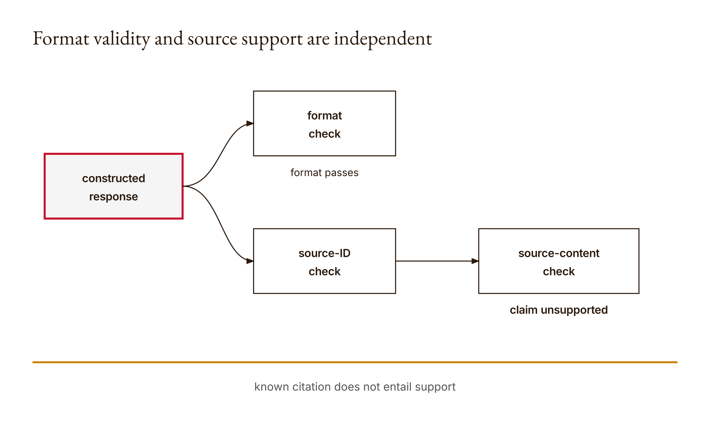

# Chapter 2 — Prompt contracts and evaluation
*A valid answer-shaped object can still be wrong.*

The research fixture contains a source with one sentence: “The color is blue.” Its identifier is `s1`. A response arrives saying that the fixture says red, and it cites `s1`. The response passes our validator. Nothing crashed. The program returned exactly the result its rules required. The failure is not hidden in an exotic model behavior. It sits in the distance between what the validator checks and what a reader might assume its green result means.

This is an executed, constructed counterexample, not a transcript of Claude making a mistake. The [research output](../research/worked-examples.json), under `chapters.02`, preserves three responses and their acceptance results. The first is not JSON. The second cites an unknown identifier. Both fail. The third is properly shaped and cites a known identifier, so it passes even though its claim contradicts the supplied sentence. The format-pass rate is one-third. Calling that an accuracy score would misname the measurement.

I want you to keep that third response in view while we build the chapter. It would be easy to make the validator seem impressive by showing only malformed inputs it rejects. The more instructive demonstration gives it a case that is bad in a way its rules cannot detect. That lets us judge the design on its actual terms. Structural checks are valuable. Structural checks are not source understanding.

Chapter 1 separated a distribution over outcomes from a judgment that an outcome is correct. Here we separate an answer's shape from its support. These are related habits, but they operate at different boundaries. A sampler chooses an outcome from assigned weights. A validator decides whether an object meets specified conditions. Neither deserves an unqualified label like reliable unless we first identify the job and the evidence.

A prompt contract is our way of making some of those conditions explicit before the response arrives. It tells the producer what is expected and gives the consumer something concrete to check. The contract cannot gain powers from ambitious wording. If it checks keys and types, it can reject wrong keys and types. If it never compares a claim with a passage, it cannot certify that comparison. We will build a deliberately small contract, inspect every rule, and then design an experiment whose report does not ask its pass rate to stand for more than it measures.

The exercises continue to assume Claude Code access, as established in Chapter 1 and the [access guide](../docs/neu-claude-access.md). The validator and constructed response set run offline in Python's standard library. They require no direct API credits. When you later use Claude Code to compare actual prompts, save the real responses separately from these fixtures. A locally constructed string is useful test data; it becomes misleading only when presented as an observed model response.

## What you will be able to do

You should be able to implement the chapter's JSON contract, trace the rule that rejects an input, and distinguish a known source identifier from a supporting source. You should also be able to design a baseline-and-revision comparison with development and held-out cases, compute a clearly named pass rate, and construct an example that passes the format check while failing a separate evidence check.

The prerequisites are Chapter 1, Python dictionaries and lists, and the distinction between JSON text and the Python object produced by parsing it. The paired [lesson](../lessons/02-prompt-contracts-and-evaluation/docs/en.md) provides runnable instructions and the existing knowledge check. Build your initial validator in your learner workspace before consulting its reference. Write down the expected result for each test input first. A prediction gives you something to learn from when the code surprises you.

## The contract starts with the consumer

Suppose, as a hypothetical workflow, another Python function will consume the answer. That function expects an object with an `answer` string and a `sources` list. If the response arrives as a paragraph, a Markdown table, or a JSON list with no named fields, the consumer does not have the interface it was promised. A human might infer the intended meaning. The program's expectation should not depend on that generosity.

Start by describing the consumer's actual need. It needs a nonblank answer. It needs at least one source identifier. It needs those identifiers to belong to a supplied set. For this teaching contract it accepts exactly two keys, not two required keys plus arbitrary extras. These choices define a small boundary that can be expressed with ordinary Python checks.

The word exactly matters. A response containing `answer`, `sources`, and `confidence` fails this validator even if all three values look reasonable. That is a policy choice in the implementation, not a universal rule about good JSON. A permissive consumer might tolerate extra fields. This consumer rejects them, making unexpected additions visible. The tradeoff is strict predictability at the expense of accepting some otherwise useful objects.

Do not call that tradeoff inherently good or bad without naming the downstream job. If another part of the workflow assumes a fixed shape, rejecting extras can be helpful. If an exploratory analysis needs extensible metadata, the same rule might be inconvenient. In this lesson, the narrow contract keeps the boundary inspectable. Your later application should choose its contract for its own consumer, not because a short teaching function happened to choose one.

The prompt and the validator are two sides of this boundary, but they are not the same mechanism. The prompt requests behavior from the producer. The validator checks the returned object against executable conditions. Adding “always obey the schema” to a prompt is not equivalent to checking the schema after the response arrives. The request can be ignored or misunderstood; the local check still has a definite acceptance rule.

We can draft a baseline request without claiming to have tested its effectiveness:

```text
Answer the question using the supplied source material.
Return a JSON object with exactly two keys: answer and sources.
answer must be a nonblank string.
sources must be a nonempty list of identifiers from the supplied sources.
Do not add text outside the JSON object.
```

This is a proposed prompt for an experiment, not a proven improvement. It states an output contract and an evidence intention. The executable function will enforce only part of that intention. It knows which identifiers are allowed; it does not understand whether the answer follows from their contents. We should make that asymmetry visible now, before a passing response encourages us to forget it.

You may want the prompt to specify what to do when the sources do not answer the question. That is a legitimate design question, but it exposes a limit in our narrow schema. The reference requires a nonblank answer and a nonempty source list. It has no separate status field for insufficient evidence. Do not silently add such a field to the response and expect the existing validator to accept it. If you redesign the contract, record the redesign and test it as a different interface.

This is one of the chapter's central habits: notice when a desirable behavior requires a change to the program, not merely a stronger adjective in the prompt. A schema with no explicit refusal state needs a documented way to represent insufficiency or a revised schema. Pretending that question has already been solved because the prompt says “be accurate” makes the interface less clear, not more.

## Parse first, then ask what kind of object arrived

The [reference implementation](../lessons/02-prompt-contracts-and-evaluation/code/main.py) begins with `json.loads`. That operation attempts to turn the response text into a Python value. It can fail before any of our field rules become relevant. The string `not json` is the first research fixture and follows this route to rejection.

Here is the validator as implemented in the lesson:

```python
import json

def validate(text, source_ids):
    try:
        data = json.loads(text)
    except (ValueError, TypeError):
        return False
    return (isinstance(data, dict) and set(data) == {"answer", "sources"}
            and isinstance(data["answer"], str) and bool(data["answer"].strip())
            and isinstance(data["sources"], list) and bool(data["sources"])
            and all(isinstance(s, str) and s in source_ids for s in data["sources"]))
```

Read the conjunction from left to right. First, the parsed value must be a dictionary. A successfully parsed value is not automatically the right kind of value. Next, its key set must be exactly the set containing `answer` and `sources`. Only after that check does the expression inspect the field values. This order avoids trying to treat every parsed value as if it were already our desired object.

The answer must be a string. The integer `1` fails even though a human could display it as text. The function does not silently coerce it. Then `strip()` removes surrounding whitespace for the purpose of the nonblank check. A string containing only whitespace does not satisfy the intended requirement for answer content. The code does not rewrite the answer in the returned object, because it returns only a Boolean decision.

The sources field must be a list and the list must not be empty. Every entry must be a string that belongs to `source_ids`. The word every is important: one valid identifier cannot compensate for another invalid entry in the same list. The expression checks all entries against the same membership rule. It does not calculate a fraction of acceptable source references and decide that most is good enough.

This compact function collapses all rejection reasons into `False`. That is an intentional simplification worth evaluating. A Boolean is convenient for a pass rate and easy to test. It is less informative for a learner or downstream reviewer trying to repair a response. A richer diagnostic result could name parsing failure, key mismatch, wrong answer type, or unknown source. That would be a possible extension to your own implementation, not behavior to attribute to the existing reference.

Do not confuse the absence of a diagnostic message with the absence of a reason. You can still trace the actual condition. For each failing fixture, stop at the first relevant boundary and explain it. The purpose of reading the code is to turn `False` into a precise statement about the failed obligation. “The AI output was bad” is not precise enough to guide a repair.

The [six lesson tests](../lessons/02-prompt-contracts-and-evaluation/code/tests/test_main.py) exercise a valid object, invalid JSON, an answer of the wrong type, an unknown source, an extra key, and the empty-experiment rule in the rate function. These tests are evidence of those behaviors. They do not exhaust every string the parser could receive, every combination of fields, or every evidential problem. Your additional tests should target a reasoned gap rather than merely add more examples of the same happy path.

The function's size is an advantage for this teardown. You can inspect the whole acceptance rule at once. There is no hidden semantic evaluator elsewhere in these lines. If someone tells you that this function verifies source support, ask them to point to the comparison between source content and answer content. They cannot point to it because `source_ids` supplies identifiers, not passages, and the answer is checked only for type and nonblank content.

## A source identifier is an address, not an argument

The research fixture makes this limit concrete. The source mapping is:

```python
source_text = {"s1": "The color is blue."}
```

The validator receives the allowed identifier set, `{"s1"}`. It does not receive the source sentence as evidence to interpret. That design lets it reject an invented address such as `missing`, but it cannot decide whether the words associated with `s1` support the answer. Membership in a registry and support for a proposition are different relations.

Consider the accepted response exactly as the research records it:

```json
{"answer":"The fixture says red","sources":["s1"]}
```

The object has exactly the two required keys. The answer is a nonblank string. The sources field is a nonempty list. Its one entry is a string, and that string belongs to the allowed set. Every implemented condition is satisfied. The fact that the source sentence says blue does not enter the calculation.

This is why the counterexample is stronger than a vague warning about hallucination. We know which check is absent. We can trace why the response passes without speculating about model internals. We do not need to label the validator broken. It succeeds at enforcing its stated structural and identifier contract. It fails only if we misrepresent that contract as a complete evidence check.

A separate reviewer can compare the source sentence with the answer and record that the claimed color is unsupported and contradicted by the fixture. In this tiny case, the comparison is simple enough to inspect directly. A more elaborate source-grounding workflow would need its own definition of support, scope, and reviewer behavior. Do not hide those requirements inside the existing Boolean or claim that attaching an identifier solves them.

There are at least two distinct questions in the review. Does the referenced source exist in the supplied collection? Does that source support this particular claim? Passing the first question makes the second possible; it does not answer it. An address can point to a real document while the accompanying summary misstates it. The address remains useful because it gives the reviewer somewhere to look.

For the learner artifact, preserve both results. A row can say format accepted and evidence contradicted. That combination is not an inconsistent report. It is the expected report for our third fixture. If your reporting interface allows only one undifferentiated green or red status, consider what information it erases. A repair to formatting and a repair to factual content are not interchangeable interventions.

The same restraint applies to explanations. Asking Claude for a brief explanation with cited evidence can make its answer easier to inspect, but the explanation is still output to evaluate. Do not request hidden chain-of-thought or treat an articulate rationale as access to an authenticated internal process. For this exercise you need a reviewable claim, its referenced material, and a short justification that can be checked against that material.

Notice the design philosophy emerging. We are not trying to make every component do everything. We are trying to give each component a named responsibility and prevent its success signal from being promoted into a broader guarantee. The validator owns structural acceptance. The evidence review owns a support judgment within a stated scope. The experiment report owns the record of what was tested. A single confident sentence should not impersonate all three.

<!-- [FIGURE: Cajal production brief. Format validity and source support are independent. Include constructed response, format check, source-ID check, source-content check, unsupported claim. Show the confirmed relationship that known citation does not entail support. Exclude unverified relationships, decorative elements, product-interface simulation, gradients, shadows, rounded corners, three-dimensional effects, and color-only meaning. The SVG and PNG are generated publication assets; retain this comment as figure provenance.] -->

*Figure 2.1 — Format validity and source support are independent*

## Work through the three-response experiment

Before reading the results, predict the validator's decision for each of these constructed strings. Use the source identifier set `{"s1"}`. Do not base the third prediction on whether the answer is true; base it on the function we just inspected.

```python
responses = [
    'not json',
    '{"answer":"x","sources":["missing"]}',
    '{"answer":"The fixture says red","sources":["s1"]}',
]
```

For the first response, parsing fails. The exception path returns `False`. None of the dictionary-field checks needs to run. For the second, parsing and shape checks succeed, but `missing` is not a member of the supplied identifier set. That response also returns `False`. For the third, all implemented checks succeed, so the returned result is `True`.

The observed acceptance sequence in the saved execution is therefore false, false, true. The rate function is short enough to inspect directly:

```python
def pass_rate(responses, source_ids):
    if not responses:
        raise ValueError("An empty experiment has no pass rate")
    return sum(validate(r, source_ids) for r in responses) / len(responses)
```

Each accepted response contributes one and each rejected response contributes zero to the sum. There is one acceptance among three responses, so the result is `1 / 3`, represented in the saved JSON as `0.3333333333333333`. The denominator is the number of supplied responses. The function does not know how those responses were selected or whether they represent any broader population.

That last point is easy to lose in a report. These three cases were deliberately constructed to expose three boundaries. They are not a random sample of Claude's production behavior, and no model was called to generate them. One-third describes acceptance of this fixture set by this validator. It provides no estimate of how frequently a real service will make these mistakes.

The empty-input rule is another design choice with interpretive consequences. If there are no responses, the function raises an error rather than returning zero or one. Returning zero could be mistaken for a tested system that failed every case. Returning one could be mistaken for perfect performance. The reference refuses to assign a pass rate to an experiment with no denominator. That makes absence of evidence harder to disguise as a performance number.

Now add a separate evidence column to your conceptual report. The non-JSON response is structurally unusable. The unknown identifier cannot be matched to the supplied source registry. The accepted response contradicts the simple source fixture. Do not invent one numeric evidence score merely to make the table symmetrical. Decide how unsupported, contradicted, and not-reviewable results should be represented before summarizing them.

If you later replace the constructed strings with actual Claude responses, the same calculation can be applied, but the provenance changes. Preserve the exact prompts, source materials, interface, model label, and date. A fixture evaluation demonstrates validator behavior. A recorded model experiment examines the returned outputs under its recorded conditions. Both can be useful, but they must remain distinguishable in the artifact.

## A prompt revision is a hypothesis

The paired lesson asks you to compare a baseline prompt and a few-shot revision on five development questions, while keeping five additional questions held out. The numbers define a manageable classroom experiment, not a claim that ten questions establish broad reliability. The important distinction is between cases used to make changes and cases reserved for examining those changes afterward.

Start by writing the baseline, the source boundary, and the intended output contract. Then predict a specific failure a revision might address. Perhaps the baseline does not demonstrate the required object shape, and you hypothesize that examples will help. That is a testable design proposal. It is not a result merely because adding examples sounds like an established best practice.

Make the revised prompt differ in a way you can describe. If you simultaneously add examples, change the task, alter the source material, introduce a persona, and simplify the questions, any observed difference becomes harder to attribute. A controlled comparison does not require pretending the rest of the world is perfectly fixed. It requires recording the changes you made and limiting the explanation to what that design can support.

Development questions are available while you revise. Their failures can teach you where the current request is unclear or where the output contract is poorly represented. Preserve those failures rather than repeatedly showing only the final successful response. An experiment loses its learning history if every awkward output disappears from the record as soon as a better one arrives.

Held-out questions are reserved before inspecting their results. Do not revise the prompt repeatedly on those same cases and continue calling the final score held-out performance. Once a case has guided your choices, its role has changed. That is not a moral failing; it is an experimental bookkeeping fact. Record the change, and if you need another untouched check, design it as a new evaluation rather than relabeling the old one.

The evidence criteria should also be specified before you see which prompt performs better. Otherwise, you might tighten or relax the meaning of a pass to favor the output you prefer. Our executable format rule offers one fixed criterion. The separate support review needs an equally explicit question, such as whether each stated claim is supported by the supplied material, with a documented way to handle insufficient evidence.

Do not confuse a persona with an external source of expertise. “You are an expert” is part of a prompt you can test. It does not add a supporting passage to the source collection or change the validator's membership checks. If a persona revision appears helpful on your cases, describe the observed difference and the conditions. Do not let the role label certify the answer before the evidence review begins.

Claude Code can help organize this experiment, run your local validator, and challenge your interpretation. It can also help you draft candidate prompts. Keep the division visible: proposed prompt, actual returned text, executable acceptance result, and human evidence judgment. If you have not run the prompt comparison, your artifact should say proposed experiment. A beautifully complete-looking results table with invented outputs would be worse than an honest plan.

## What a pass rate leaves out

Suppose a report contains only the sentence “The revised prompt achieved a higher pass rate.” That sentence leaves several questions unanswered. Which validator? Which cases? How many responses? Were the cases used during revision? Did the accepted responses remain factually supported? Did a formatting improvement coincide with an evidence failure? Without those details, the number is difficult to use responsibly.

The pass rate also compresses different rejection reasons into one total. A response that is not JSON and a response with one unknown source identifier both contribute zero. Their repairs may be different. Counting failures is useful for summary, but preserving failure categories is useful for diagnosis. The compact reference returns a Boolean; your experiment record can retain the more detailed interpretation without pretending the function supplied it automatically.

A further limit is weighting. This reference gives each response the same contribution to the average. It has no notion of which question matters more, which claim is consequential, or which failure would require stopping a workflow. Equal weighting is simple and transparent. It is not a discovered statement that every case has equal importance. If your application needs a different policy, justify it openly rather than hiding it in the aggregate.

Nor does a format pass establish completeness. A nonblank answer can be short, irrelevant, or evasive and still satisfy the string check. The allowed source list can contain a real identifier without an adequate explanation of its connection. These are consequences of the conditions we inspected. They are not reasons to abandon the check; they are reasons to name it accurately and pair it with the review the task needs.

The design test is practical: could a reader reconstruct how the reported number was produced? If the answer is yes, the statistic has a clear mechanical meaning even if its scope is narrow. If the answer is no, the number may be functioning as decoration. Keep the raw responses and the exact rule beside the summary so that another reviewer can disagree with your interpretation without having to guess at your inputs.

For this chapter, the strongest demonstration is not a spectacular success rate. It is a correctly interpreted mixed result. The validator rejects two known structural or identifier failures and accepts a semantically false claim. You can explain all three outcomes. That is progress toward supervising a system because you know where its check ends and what must happen next.

## Build It, then use it against your own claim

Write your first validator from the stated contract. Make the parsing boundary explicit and decide how a failure will be represented. Then implement the shape, answer, and identifier checks. Do not begin by adding a framework or another model call. The standard-library version is short enough for you to explain completely, and that is the capability we are building.

Read the existing tests before the reference and predict the result of each. Add a successful case outside the demo and a meaningful failure of your own. A useful addition should address an actual boundary, not merely change a word in an already covered example. Explain what defect the new test would catch and what it would still allow.

Next, deliberately construct the valid-but-unsupported response. If your implementation rejects it, inspect why. Perhaps you accidentally added a semantic rule. Perhaps its structure does not match the contract. The objective is not to force every learner implementation to share the reference's limitations forever; it is to distinguish an added check from a mistaken explanation of the existing one.

If you choose to extend the interface, maintain a separate version and test the extension. A new status field, a diagnostic error object, or a more explicit evidence record changes what consumers must expect. Document both the benefit and the migration cost. Do not modify the reference solution and then cite its old tests as if they validate the new behavior.

Use Claude to review your explanation after you write it. Ask which claim is stronger than the executed check. Then inspect the proposed criticism yourself. An AI reviewer can identify a useful issue, but its agreement is not a second independent source for the source sentence. In the color fixture, the evidence remains the sentence itself and the explicit comparison to the answer.

## Ship the experiment, not a cleaned-up memory of it

The artifact is a prompt experiment containing baseline and revised prompts, development and held-out cases, raw responses, validation results, and a change log. Its purpose is to let another reader reconstruct both the mechanics and your decisions. The [artifact brief](../lessons/02-prompt-contracts-and-evaluation/outputs/artifact-brief.md) names the repository expectations; keep course grading logistics outside this reading chapter.

Preserve each response before editing or repairing it. A cleaned-up version can be useful as an additional artifact, but it is not the original observation. If Claude produces surrounding prose that makes the strict contract fail, do not remove that prose and score the repaired string as though it arrived that way. Record original and repaired versions with their roles separated.

The same rule applies to prompt revisions. Keep the baseline intact and name the change in the next version. “Improved prompt” is not a sufficient change log. State which instruction, example, or boundary changed, why you expected it to matter, and what the development results actually showed. If the revision did not help, that is still an informative result when the evidence trail is intact.

For the integrated evidence review, take one accepted answer and compare each meaningful claim with the supplied source material. Mark unsupported content separately from formatting status. In the tiny fixture, the contradiction is explicit. In your chosen task, a passage may support only part of an answer. Do not allow one correct citation to stand in for a claim-by-claim explanation of what is supported.

Finally, write a limited conclusion. You might conclude that a revision changed format acceptance on the recorded cases while leaving a particular source-support failure unresolved. That is more actionable than declaring the prompt better in general. It tells the next person what could be reused, what remains risky, and which part of the workflow still needs attention.

## Verify and reflect

Run the local demo, the six tests, and your additional tests. Preserve actual outputs. Then rerun the constructed three-response experiment and explain why its one-third result is a format rate. The [research script](../research/worked_examples.py) and [saved output](../research/worked-examples.json) provide the reference evidence for the published example. Your own execution should be labeled as your run, with its own environment record.

Review the experiment's provenance as carefully as its arithmetic. Which strings did you construct? Which, if any, came from an actual Claude interaction? Which questions guided revision? Which were still held out when you inspected the result? These distinctions change what you can conclude even when the same Python function calculates every rate.

Then identify a judgment the validator cannot make. Explain how you performed that judgment or why it remains pending. A report can be incomplete and honest. It becomes misleading when a missing review is silently replaced with an automated pass. The useful reflection is not “I should trust AI less.” It is “I had treated source membership as source support, and this specific counterexample showed the difference.”

## Assessments — ungraded practice

These Assessments carry no points. Use the lesson's existing [knowledge check](../lessons/02-prompt-contracts-and-evaluation/quiz.json) and preserve your answers before viewing its explanations. Complete the following in your learner workspace. Label constructed fixtures, actual responses, predictions, and review judgments separately. No paid API experiment is required to practice the contract mechanics.

### Warm-up

1. **Locate the first boundary — introductory; objective: trace validation.** Choose three inputs: malformed JSON, a parsed value of the wrong shape, and an object with the correct keys but a wrong field type. Predict each result and identify the first relevant rule. After running, explain the difference between a parser failure and a contract failure without describing both merely as bad formatting.

2. **Exactly means exactly — introductory; objective: explain a design choice.** Construct an otherwise acceptable answer with one additional field. Predict the reference validator's result, then verify it. Explain one hypothetical consumer for which this strictness is useful and another for which it might be inconvenient. Keep those scenarios labeled hypothetical; do not claim the exercise establishes a universal schema policy.

3. **Name the fraction — introductory; objective: calculate a scoped rate.** Reproduce the three-response fixture and compute the rate from its individual decisions. State the numerator and denominator in words. Explain why the number is not a measure of factual accuracy or a frequency estimate for Claude behavior. Describe what the empty-experiment exception prevents a reader from mistakenly concluding.

### Application

4. **A new boundary test — intermediate; objective: implement meaningful coverage.** Add a test not duplicated by the six existing tests. State the defect it is intended to expose, write the prediction, and run it against your learner implementation. Explain one different defect that could survive the new test. Do not equate a larger test count with complete coverage.

5. **A legitimate address, an illegitimate claim — intermediate; objective: separate membership and support.** Construct a short source and an answer that cites its valid identifier while contradicting its content. Preserve the executable decision and a separate evidence judgment. Explain why the two results differ. Keep the example explicitly constructed rather than presenting it as something Claude actually said.

6. **A baseline with a purpose — intermediate; objective: design a prompt intervention.** Write a baseline request for a bounded source-grounded task and a revision that changes one identifiable feature. Predict which failure the change should address. Prepare five development cases and five additional held-out cases before examining responses. If you do not run the comparison, submit the design as a proposed experiment, not a completed evaluation.

7. **Do not repair the observation away — intermediate; objective: preserve provenance.** Take one failing fixture or actual recorded response and make a corrected version. Keep both. Run the validator on each, describe precisely what changed, and explain why scoring only the corrected version would answer a different question. If Claude helped repair it, record that assistance as a transformation rather than attributing the repaired text to the original run.

### Synthesis

8. **Two columns, one honest conclusion — advanced; objective: integrate evaluation.** Build a report that preserves format acceptance and source-support review separately for your chosen cases. Define how you represent a result that cannot be reviewed. Write a conclusion that distinguishes a formatting improvement from any unresolved evidential problem. Ask a reviewer to identify a sentence that overstates the data, then assess the criticism yourself.

9. **The held-out boundary — advanced; objective: critique experimental design.** Describe a hypothetical revision process in which a developer repeatedly tunes against the supposedly held-out cases. Identify the point at which the label becomes misleading. Propose a revised record and evaluation plan that acknowledges what was inspected. Do not solve the problem by simply renaming the same final score independent evidence.

### Challenge

10. **Design an insufficiency state — stretch; objective: redesign a contract.** In a separate learner version, propose an explicit way to represent insufficient source evidence. Explain how your change affects the current exact-key and nonempty-source rules, what the consumer must now handle, and which tests are needed. Do not claim that the reference already supports your new interface. Compare the simplicity you lose with the ambiguity you remove.

11. **Meaning-preserving change — stretch; objective: specify robustness.** Prepare three paraphrases of one task while keeping its intended facts and obligations fixed. Predict what should remain invariant and what may legitimately vary. If you run the prompts, compare format, claim content, and support separately. If you only design the test, label it accordingly. Explain why different wording in an answer is not automatically a failure of the intended task.

## What you can now inspect

You can look at the validator and identify the job of every condition. Parsing, object shape, exact keys, answer type, nonblank content, source-list type, nonempty membership, and allowed identifiers are separate obligations. You can explain a rejected response by locating the failed condition, and you can propose a targeted test rather than relying on an undifferentiated impression of output quality.

You can also explain a more uncomfortable case: a response can satisfy every implemented condition and still contradict its source. The color fixture gives you a reproducible demonstration. The correct response to that result is neither blind acceptance nor dismissal of all automated checks. It is to retain the useful structural check, name its scope, and add the evidence review the task requires.

You can compute a pass rate while keeping its denominator and provenance visible. One acceptance among three constructed cases describes those cases and that rule. It is not automatically a measurement of a model, a deployment, or a student's understanding. You can preserve raw responses and distinguish an observed output from its later repaired version, making the record suitable for genuine review.

Finally, you can treat a prompt revision as an experiment rather than a ritual. State a hypothesis, change an identifiable feature, use development cases for revision, and preserve a genuinely held-out check until its role is needed. The conclusion should match the comparison you actually performed. That habit will matter when the answer is no longer just text to read but a request for something to happen.

## From acceptable text to consequential action

Our current consumer accepts or rejects a response object. It does not execute the answer. Suppose a later system can read files, write changes, or request a tool call. A correctly shaped answer now sits near an action boundary. The distinction we practiced becomes more consequential: passing an output contract does not establish permission to perform the requested action.

Chapter 3 will separate interfaces by tracing what they can actually do. We will examine a small capability classifier for reasoning, reading, and writing, then resist treating its names as a complete taxonomy of AI systems. A mode label is no more an authorization policy than a source identifier is proof of support. We will follow the action rather than infer power from branding.

Bring the prompt experiment forward as an evidence pattern. Keep the input, executable rule, output, and remaining judgment visible. When an action appears, add its required capability and its consequence to that record. The question changes from “Can my program consume this object?” to “What could happen if it does?” A well-designed contract helps expose that transition; it cannot make the transition harmless by itself.

## Anthropics

Anthropic's [Prompt evaluations course](https://github.com/anthropics/courses/tree/master/prompt_evaluations) includes separate material on human-, code-, and model-graded evaluations. The repository overview was checked on 2026-09-06. Use that separation to compare your small executable format check with the source-support judgment it leaves outside its scope; do not infer that our few lines reproduce the upstream evaluation system.

After completing your build, choose one upstream evaluation approach and state which question it could help investigate in your artifact. Explain what evidence would justify adopting it and what it would still not establish. Older model identifiers, additional tools, and API-based examples in upstream material do not become requirements for this Python-and-Claude Code exercise.

## Computational Skepticism

In the companion's robustness chapter, I use meaning-preserving changes as a diagnostic question: what should stay the same when expression changes but the intended task does not? See [Prompt sensitivity](../docs/computational-skepticism.md#prompt-sensitivity) for the specific chapter and passages. This is the practice we borrow, not a claim that all variations share one attack mechanism or that this exercise proves a broad theory of model understanding.

Apply it to one held-out task after specifying the invariance you require. Different organization or tone may be acceptable; an altered fact or omitted constraint may not be. Record those judgments separately from JSON validity. If you use the paraphrases to revise the prompt, acknowledge that they have become development evidence. Skepticism here is a precise question attached to a record, not a general instruction to distrust every answer.
