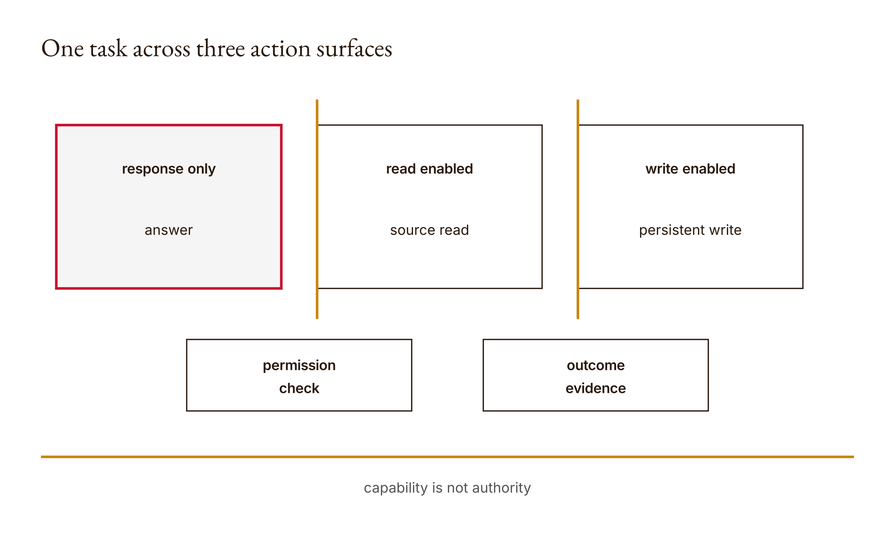

# Chapter 3 — Chat, assistant, and agent
*Follow the state change, not the label on the window.*

Suppose you ask an AI system to fix a report. In one interaction, it tells you which paragraphs to change. In another, it reads the report and offers a revision grounded in that file. In a third, it saves an edited report. All three interactions can end with polished prose. They have not performed the same work. Only the third hypothetical includes a persistent file change, and that difference matters even if the final messages look almost identical.

Now make the request smaller: summarize a folder without changing its files. The system reads a document, produces a summary, and then helpfully saves a cleaned-up version over the original. The edit might be excellent. It is still outside the stipulated no-change task. Capability explains how the edit could happen. It does not explain why it was authorized. A good result and an authorized action are different judgments.

These are constructed scenarios, not claims about a recorded Claude session. I use them because they expose the question this chapter will make inspectable: what did the system actually have the ability to do, and what evidence says it did it? A product name is not enough. Neither is a final message that says done. We need to follow inputs, operations, and state.

The Python mechanism is deliberately small. We give three teaching surfaces different sets of capabilities, compute which required capabilities are missing, and classify a simplified list of events. The labels are `chat`, `assistant`, and `agent`. Those labels belong to this exercise. They are not a verified map of current product features, and they are not a claim that every system bearing a name has the same permissions or architecture.

This restraint makes the example more useful, not less. If we treat the names as universal, the lesson becomes a vocabulary test that can mislead you when interfaces change. If we treat them as handles for explicit capability sets, we can inspect the operation directly. We can also see what the classifier discards: order, targets, authority, evidence quality, and whether the logged event really happened.

The first two chapters established a pattern. A probability is not a truth judgment. A format pass is not source support. Here the pattern reaches actions: capability is not authorization, an event label is not independent proof, and a write is not necessarily dynamic agency. We will keep those distinctions separate while choosing an interface sufficient for a bounded task.

## What you will be able to do

You should be able to represent a task as required capabilities, calculate the missing set for a teaching surface, and explain how the event classifier chooses its label. You should also be able to identify an action-bearing event, state the permission evidence it would require in an actual workflow, and choose a sufficient interface without assuming that more capability is automatically better.

The prerequisites are Chapters 1 and 2, Python lists and sets, and a basic idea of persistent state: a file remains changed after a response is no longer on screen. The paired [lesson](../lessons/03-chat-assistant-agent/docs/en.md) supplies runnable instructions and the existing knowledge check. Its Python reference is offline. Claude Code remains the assumed learning assistant, through your existing account; this classifier needs no direct API calls or credits.

Before opening the reference, predict which operations a read-only task needs and which it does not. Build your initial set comparison in your learner workspace. This is small enough that you can calculate its expected result by hand. That makes it a good place to practice explaining a design instead of merely accepting code that returns a plausible answer.

## A response and a file are different kinds of result

In the first hypothetical interaction, the output is advice. Someone must still decide whether to apply it. The second adds source access: the system can inspect material supplied to it or made available through a reading operation. The third adds a mutation: some stored artifact changes. Each expansion changes what the workflow can accomplish and what needs to be observed.

Do not reduce this to a claim that text is harmless and files are dangerous. Text can influence decisions, and a file edit can be trivial and well authorized. The distinction is operational. A persistent change introduces a before-and-after state that can be checked separately from the final explanation. If the task is to modify a report, a proposed revision and a saved revision are different deliverables.

This matters for completion claims. “Here is how to fix the paragraph” is not the same as “The paragraph in the specified file has changed.” The second statement needs evidence about the file. A transcript containing proposed text can support a claim about the proposal. It cannot by itself establish that the proposal was written to the intended location. The evidence should follow the object whose state is being claimed.

For the folder-summary task, we can write a narrow acceptance statement: inspect the specified source material, return a source-grounded summary, and leave the source files unchanged. That statement includes both a positive requirement and a boundary. Reading is needed. Writing the originals is not. If the system offers to save a separate draft, that is a proposed scope change to evaluate, not a reason to pretend the original request included it.

The teaching program will not inspect a real folder. It will represent the required operations symbolically. That is enough to explain a capability comparison. It is not enough to demonstrate filesystem safety. We should resist the urge to credit the little set function with protections it does not implement. Later chapters will build a more explicit path and permission boundary.

Why begin with a symbolic model? Because it forces us to name the operations before surrounding them with a complicated runtime. If we cannot agree whether the task needs a write, a larger tool stack will not resolve the ambiguity. It may simply make an ambiguous request easier to execute. The useful first move is to state what work is in scope.

The same principle applies to reading. A response may use text already present in the conversation rather than perform a new filesystem read. In our simplified event vocabulary, we must say what we choose to count as a `read` event. Do not infer one merely because an answer mentions a document. In an actual experiment, record the input path by which the document became available and the evidence of the relevant operation.

## Capabilities as sets

The [reference implementation](../lessons/03-chat-assistant-agent/code/main.py) defines three sets:

```python
SURFACES = {
    "chat": {"reason"},
    "assistant": {"reason", "read"},
    "agent": {"reason", "read", "write"},
}
```

The strings are categories within the teaching model. `reason` represents response-level processing, `read` represents access to information through the modeled reading capability, and `write` represents a modeled ability to change state. The program does not measure reasoning quality or create access permissions by inserting a string into a set. It stores a declared description that later functions can compare.

The sets are nested. Every capability assigned to `chat` appears in `assistant`; every capability assigned to `assistant` appears in `agent`. This gives the exercise a simple ordering. It is a design convenience, not a theorem about real interfaces. Actual systems may have capabilities that do not fit a single nested ladder. This model has only the three sets we explicitly defined.

Let R be the set of capabilities a task requires, and let C be the set declared for a surface. The missing set is R minus C: the capabilities in the requirement that do not appear in the surface. In symbols:

$$
M = R \setminus C.
$$

M names the missing capabilities. If M is empty, the declared set covers the declared requirements. Notice the two uses of declared. A correct set calculation can still be based on an incomplete task description or an inaccurate description of the runtime. The arithmetic does not authenticate its inputs.

The implementation makes that comparison directly:

```python
def missing(surface, required):
    if surface not in SURFACES:
        raise ValueError("Unknown teaching surface")
    return sorted(set(required) - SURFACES[surface])
```

It first rejects an unknown surface name. Then it converts the requirements into a set, subtracts the selected capability set, sorts the remainder, and returns a list. Set conversion removes duplicated requirement labels. Sorting gives the returned missing labels a consistent presentation. Neither operation adds information about the task itself.

Consider a constructed task that requires both `read` and `write`. For `chat`, neither is present, so the missing list contains both. For `assistant`, reading is present but writing is absent, so the missing list contains `write`. For `agent`, both are present, so the list is empty. These are the results preserved in the [worked-example output](../research/worked-examples.json), under `chapters.03`.

| Teaching surface | Declared capabilities | Missing for read and write |
| --- | --- | --- |
| chat | reason | read, write |
| assistant | reason, read | write |
| agent | reason, read, write | none |

The table is useful because every cell can be reconstructed from the sets. It does not need a marketing description or a subjective judgment that one interface feels more agentic. You can point to the required operation and check whether it appears in the declared capability set. That is the narrow question this function answers.

Now change the task rather than the interface. A read-only source inspection requires `read`, not `write`. Within this nested teaching model, `assistant` covers that requirement without the additional write capability of `agent`. This gives us a reason to choose the smaller sufficient surface for the specified job. The reason is not that the larger surface is inherently untrustworthy. It is that the task does not require its extra operation.

There is a subtle boundary in the function worth noticing. It validates the surface name, but it does not explicitly validate every required label against the three recognized event names. An unfamiliar requirement would remain in the missing set. That can be a useful signal that the declared surfaces do not cover the task, but it is not the same policy as rejecting an unknown event. Explain the actual code rather than assuming its two functions use identical validation rules.

## Event traces answer a different question

Capability sets describe what a surface is declared able to do. Event traces describe what is recorded as having happened. The distinction is similar to the difference between a distribution and a sample in Chapter 1: one describes available behavior, the other records a particular sequence. Our classifier consumes a list of event names, not the capability table.

Here is its complete implementation:

```python
def classify(events):
    allowed = {"reason", "read", "write"}
    if set(events) - allowed:
        raise ValueError("Unknown event")
    if "write" in events:
        return "agent"
    return "assistant" if "read" in events else "chat"
```

First it rejects any event name outside the allowed set. Then it gives `write` precedence: if a write appears anywhere in the list, the result is `agent`. If there is no write but there is a read, the result is `assistant`. Otherwise it returns `chat`. That last branch includes a list containing only `reason`; by inspection it also includes an empty list. The result is a category under this rule, not proof that any particular amount of reasoning occurred.

This is a classification by event presence. It ignores order and repetition. A list with one read and a list with several reads can receive the same label. A write near the beginning and a write near the end both trigger the write branch. This compression is acceptable for the tiny teaching question, but it loses information that a real action review would need.

Do not call the discarded information irrelevant merely because the function discards it. Reading a source before editing its summary and reading it only after an edit can have different meanings for a workflow. Our function cannot distinguish them if both lists contain the same event categories. It is a lossy summary, and a good report should keep the original trace beside the summary.

The reference also does not record targets. A `write` label could stand for changing a disposable draft or overwriting an original source in a constructed scenario. Those actions receive the same classification even though the task boundary may treat them differently. The classifier needs only the existence of the category. Authorization needs a more specific account of what is being changed.

Nor does an event string prove that an operation actually succeeded. The function trusts the list it is given. If someone supplies `write`, the classifier returns the write-based label without inspecting the filesystem. That is an input contract, not a forensic capability. An actual report must distinguish a proposed write, an attempted write, a completed write, and an independently observed state change if those distinctions matter to the claim.

This is why the teaching term action surface needs a concrete interpretation. It names the operations available at a boundary. It is not the system's self-description, and it is not the final sentence in a transcript. A reliable comparison begins by asking what the runtime exposed and what the recorded evidence shows, while keeping the granularity of that evidence explicit.

## One task, three constructed traces

Use this hypothetical folder task: “Read the supplied source report and prepare a summary. Do not alter the source.” We will represent three possible interaction records. They are constructed event lists, not recordings from current Claude products. Their purpose is to make the classifier's reasoning visible.

The first list is `['reason']`. Under the rule it is labeled `chat`. In the scenario, imagine the response offers general advice about writing a summary but does not access the specified source. That might be useful advice, but it does not establish completion of the source-reading requirement. The capability comparison identifies the missing `read` operation for the teaching chat surface.

The second list is `['reason', 'read', 'reason']`. It contains a read and no write, so the classifier labels it `assistant`. This trace is consistent with the modeled read-only operation boundary. Consistent with is the right phrase: the simplified labels do not prove that the intended report was read or that the summary was faithful. Those questions require target and content evidence beyond the list.

The third list is `['reason', 'read', 'write']`. The classifier labels it `agent` because a write appears. If, in this stipulated scenario, the write altered the original source, it would violate the no-change instruction. The classification does not report that violation. It reports the presence of a write event. The permission judgment comes from comparing the specific operation with the task boundary.

Before you run these lists through your own implementation, predict the labels and identify the evidence each list lacks. The labels are the easy part. The more important explanation names the missing targets, results, and permission record. If your report says the second trace is safe and the third unsafe based only on these three strings, it has already asked the model for more than it contains.

We can express the worked comparison without pretending to have observed any real file changes:

| Constructed trace | Classifier result by inspection | What still needs evidence |
| --- | --- | --- |
| reason | chat | Whether required source access occurred through any recorded route |
| reason, read, reason | assistant | Which source was read and whether the summary follows it |
| reason, read, write | agent | What changed, whether the write succeeded, and whether it was authorized |

The published research run directly checks the `read` classification and the missing-capability comparison. The other trace labels above are transparent derivations from the displayed function and proposed cases for your own run. Keep that distinction between recorded execution and code reasoning visible. Both support learning, but only one should be described as an observed run.

Now consider how the task would change if you explicitly asked for a separate summary file in a disposable learner directory. The required set would include writing. A write-capable surface could be sufficient, but the target still matters: a new draft in the authorized directory is not permission to overwrite the source. The three-capability model cannot express that target restriction. It tells you where you need a richer policy next.

That is the real payoff of a small model. It does not merely produce a label. It reveals the moment at which a label is too coarse for the question. Once you need to distinguish two kinds of write by target or consequence, adding confidence to the existing classification will not help. You need more information and a more specific boundary.

<!-- [FIGURE: Cajal production brief. One task across three action surfaces. Include response only, read enabled, write enabled, permission check, outcome evidence. Show the confirmed relationship that capability is not authority. Exclude unverified relationships, decorative elements, product-interface simulation, gradients, shadows, rounded corners, three-dimensional effects, and color-only meaning. The SVG and PNG are generated publication assets; retain this comment as figure provenance.] -->

*Figure 3.1 — One task across three action surfaces*

## Capability does not confer authority

An empty missing set says that the declared surface covers the declared requirements. It does not say the requester owns the target, that affected people consented, that the source may be uploaded, or that a write is appropriate. None of those facts appears in the set subtraction. They cannot be recovered by reading its empty result more enthusiastically.

In the folder task, permission can be made concrete without a grand theory. Name the allowed source, the output location, and the operation the user requested. If the request is read-only, record that. If an edit is authorized, identify the intended target. A vague permission to help with a report should not silently become permission for unrelated changes elsewhere in a workspace.

This chapter does not implement a permission engine. The distinction is conceptual and evidenced by the absence of permission inputs in the functions. The later tools-and-permissions lesson will make a narrow runtime check visible in Python. For now, your job is to avoid presenting a capability inventory as if it already enforces a policy.

There is a reciprocal mistake too: inability is not the same as prohibition. If the teaching chat surface lacks writing, the missing set indicates it cannot cover a write requirement under the model. It does not establish that a write would have been forbidden if another authorized tool performed it. Feasibility and permission answer different questions. Keeping them separate prevents a technical limitation from masquerading as a moral judgment.

Likewise, a permission request does not prove the proposed action is useful. The human may authorize a draft that turns out to be poor. The system may propose a better target or a narrower operation. Those judgments need evidence and explanation. The useful architecture keeps proposed action, authority, execution, and quality review distinguishable, rather than treating one approval or capability flag as a certificate for all of them.

For your artifact, add a permission column in plain language. It can say that a constructed scenario stipulates a read-only request, or that an actual user authorized a specific disposable write. Do not invent an approver, and do not treat a simulated person in a fixture as real consent. If the permission evidence is absent, write absent or pending. The integrity of the record depends on preserving that gap.

## Choosing sufficient autonomy

Within our nested teaching sets, choosing the least capable sufficient surface is straightforward once the task is accurately described. A task needing only the modeled response operation fits `chat`. A task needing reading but not writing fits `assistant`. A task requiring writing needs the write-capable set. The calculation is simple because the design deliberately restricts the options.

The harder work is deciding what the task truly requires. “Fix this report” might mean explain problems, produce a proposed replacement, save a new version, or alter the original. Those are different scopes. A system can ask a clarifying question when the difference changes what it would do. It can also proceed on a narrow, stated interpretation when that is sufficient and does not invent new authority. What it should not do is conceal the scope choice behind a generic done message.

More capability can reduce the need for manual handoffs in a workflow, but this chapter has not measured productivity or error rates. We can still evaluate a local tradeoff: granting write capability makes persistent changes possible and therefore adds a state-change boundary to inspect. If no required result needs that boundary, the additional capability does not solve a stated requirement in our model.

Less capability is not automatically a complete solution either. A response-only interface may be unable to produce the artifact the task requires. If the user authorized a file change and expects it to exist, returning advice alone is incomplete. Choosing sufficient autonomy means matching the outcome, not always minimizing the tool set regardless of the requested work.

The term autonomy itself needs restraint here. Our classifier treats a write event as sufficient for its `agent` label. It does not ask who chose the sequence of operations. A predefined program can write a file. A model-directed process can make several decisions without writing one. These are different architectural questions from the event-presence rule we implemented.

Anthropic's [Building effective agents](https://www.anthropic.com/engineering/building-effective-agents), published in December 2024 and included in the research packet, distinguishes predefined workflows from systems whose process is dynamically directed by the model. That distinction is not equivalent to our write-based category. Use it to see the missing axis: the location of control over the next step. The next chapter will make a controller explicit.

In your comparison, therefore, keep at least two sentences separate. One states which capabilities are needed. Another states who or what chooses the next operation in the proposed workflow. A third may describe the review required before a consequential action. Combining them into “use an agent” makes the recommendation shorter but less useful.

## Build It: a small classifier with visible limits

Implement the three declared capability sets and the missing function in your learner workspace. Start with the read-and-write requirement from the research example. Predict the missing list for each surface. Then run the comparison and reconcile the output with your set calculation. The point is to make every returned item explainable, not to find a clever one-line implementation.

Next implement the event classifier and test the three constructed traces. Read the reference only after your attempt. If your version uses a different rule, name the difference. Perhaps you accidentally classify by the final event rather than by the presence of any write. That can produce the same answer for one list and a different answer for another. Design the smallest case that exposes the distinction.

The existing tests include unknown events and unknown surfaces. Preserve those rejection boundaries in your explanation. An unexpected label should not silently be treated as harmless reasoning just because the classifier lacks a category for it. At the same time, do not infer that rejecting a string named `delete-everything` prevents actual deletion in a runtime. The function is validating its vocabulary, not mediating operating-system calls.

That last distinction is especially important. A test can show that the classifier refuses an unknown event name. It does not show that a malicious or erroneous program cannot perform an operation and omit it from the supplied list. Event validation assumes something about the source of the events. A future system that depends on the trace must design and check that recording boundary separately.

Use Claude Code to critique your missing-capability explanation and propose boundary cases after you have written your own. Ask it what the classifier cannot infer. Then verify each proposed limitation against the input and code. The absence of targets, permission fields, and success results is directly inspectable. You do not need speculative claims about intelligence to identify those limits.

## Use It: turn an interface comparison into an evidence comparison

The paired lesson invites a comparison using Claude chat, a source-supplied interaction, and Claude Code in a disposable Python repository. Treat that as an experiment to perform and document, not as a result already supplied by this chapter. Record the actual interface and operations available during your run. Do not assume a permanent capability assignment from a name.

Use harmless source material and a narrowly scoped task. If the experiment includes a write, make the target a disposable learner artifact and obtain the relevant authorization. Record files before and after the operation. The specific before-and-after evidence should match the claim you make: a proposed paragraph is not a saved file, and a saved file is not necessarily the intended content.

In a source-supplied interaction, record how the source was supplied. Was its text pasted into the conversation, attached through the interface, or read by a tool? These routes may produce similar-looking answers, but the observation record differs. Your symbolic trace should be an explicitly defined abstraction of that record, not a guess that the system must have performed a particular operation because the answer sounds informed.

Also record the difference between proposed and executed actions. A response may offer to save a file, ask for permission, or explain a command without running it. None of those is the completed write event our hypothetical trace stipulates. A useful comparison preserves these intermediate states rather than collapsing every intention into an accomplishment.

The experiment can remain partially complete if one interface is unavailable. Do not manufacture its row. Mark it not run and state what is missing. You can still execute the offline classifier on constructed traces, provided those traces are labeled constructed. An honest mixture of observed and hypothetical records is usable when the provenance is explicit; an invented completion is not.

## Ship It: the action-surface comparison

Your artifact should connect each task to inputs, declared or observed capabilities, proposed actions, actual state changes, and evidence. The [artifact brief](../lessons/03-chat-assistant-agent/outputs/artifact-brief.md) names the repository's expectations. Add the permission and supervision distinctions developed here to that existing comparison, rather than creating a disconnected essay that cannot be traced to a run.

For the folder task, a useful row names the source, the requested outcome, whether a read occurred, whether a write occurred, and what supports each observation. If no state change was requested, preserve that boundary. If a new output file was requested, distinguish it from the source file. The file target is not a minor implementation detail when it determines whether the action stayed in scope.

Your conclusion should recommend an interface for a stated task under stated assumptions. It might say that the read-enabled teaching surface is sufficient for the no-write summary task, while a separately authorized saved draft needs writing. It should not proclaim that one product is universally better or safer. The evidence does not cover such a claim, and the task does not require it.

Record Claude's contribution to the artifact: proposed cases, code review, execution assistance, or organization of evidence. Keep your own decision about scope and sufficiency visible. If you changed the required capability set after inspecting the task more carefully, preserve both versions and explain the change. That is a substantive learning event, not an embarrassment to erase.

## Verify and reflect

Run the demo, six lesson tests, and your additional cases. Explain both the result and the route through the code. Then inspect a stronger claim in your comparison, such as a statement that a file was changed or that an action was authorized. Identify evidence for that statement outside the simple classifier. If you cannot, narrow the claim.

Ask what information the classification discarded. In this implementation, sequence details, repetition, targets, results, and authority are absent from the returned label. Preserve whatever your actual task needs in the underlying record. A useful summary should make a large record easier to navigate, not become an excuse to throw away the evidence needed to evaluate it.

Finally, revisit your initial interpretation of “fix this report.” Did you originally hear advice, a draft, or an actual edit? Did the requested scope support that interpretation? This reflection connects the Python sets to the human task. The code can calculate missing capabilities perfectly while the task model is wrong. Learning to notice that mismatch is the part that transfers beyond this three-label exercise.

## Assessments — ungraded practice

These Assessments carry no points. Use the paired lesson's existing [knowledge check](../lessons/03-chat-assistant-agent/quiz.json) and preserve your initial answers before consulting explanations. Keep constructed traces distinct from actual recorded operations. Do not use this practice as authorization to modify unrelated files or publish anything.

### Warm-up

1. **Calculate the missing set — introductory; objective: represent requirements.** For the constructed read-and-write task, calculate the missing capabilities of all three teaching surfaces by hand. Explain each set subtraction before executing your implementation. Then change the requirement to read only and explain which recommendation changes. State the assumption that makes the sets nested and why that assumption is not a universal product taxonomy.

2. **Trace the classifier — introductory; objective: explain event presence.** Classify a reason-only list, a list containing a read but no write, and a list containing a write. Identify the branch used in each case. Explain why the result says nothing about the quality of the reasoned response or the target of the write. Do not substitute a real product name for the rule's actual logic.

3. **Unknown is not harmless — introductory; objective: inspect validation.** Supply an unknown event name and an unknown surface name in separate tests. Predict and record the results. Explain why vocabulary rejection is useful and why it does not constitute enforcement of operating-system permissions. Identify the boundary that would need to be implemented before such a security claim could be made.

### Application

4. **Same label, different sequence — intermediate; objective: identify information loss.** Construct two event lists with the same categories in different orders. Run the classifier and compare its results. Explain a hypothetical workflow in which the order would matter, then identify the additional evidence your report would need. Keep the scenario hypothetical rather than implying the simple function observed the consequences.

5. **A narrowly scoped folder task — intermediate; objective: choose sufficient capability.** Define a harmless source-summary task that forbids changing the originals. State its required capabilities and choose the smallest sufficient teaching surface. Explain what source evidence and summary review would still be necessary. Then describe the explicit scope change that would justify saving a separate draft, without treating that change as already authorized.

6. **A new boundary test — intermediate; objective: test a distinct defect.** Add a successful case outside the demo and one failure case to your learner implementation. For each, name the possible defect it is designed to expose. Explain how another defect could survive both tests. Use the reference only after your first attempt, and keep your changes separate from the course solution.

7. **Proposed is not executed — intermediate; objective: classify evidence.** Create an explicitly hypothetical record containing a proposed edit, a permission request, and a completed edit with a before-and-after observation. Explain which parts can justify a write event under your trace definition. Do not invent a real person's approval. State how you would label missing execution evidence in an actual report.

### Synthesis

8. **Three-interface comparison — advanced; objective: integrate observation and scope.** Use the paired lesson's comparison design on harmless material where access is available. Record the actual interface, input route, available operations, and evidence. Mark unperformed rows not run; use constructed traces only with explicit labels. Recommend a surface for the bounded task without claiming the observed capabilities are permanent product specifications.

9. **Capable but not authorized — advanced; objective: separate authority.** Construct a scenario in which the missing set is empty but the proposed write exceeds the stated task. Explain why the set calculation still succeeds and identify the exact additional permission question. Then revise the workflow so it can proceed within the existing scope or request the necessary decision. Do not solve the problem by declaring that good intentions create authorization.

### Challenge

10. **Misleading names — stretch; objective: critique a taxonomy.** Design two hypothetical systems whose names encourage the wrong capability inference. Describe their actual operation sets and classify recorded or constructed events using the lesson rule. Then explain why a write-capable predefined workflow and a model-directed process are not distinguished by this classifier. Keep architecture and action capability as separate axes.

11. **A richer event record — stretch; objective: redesign for evidence.** Propose, in your learner workspace, an event representation that adds target, proposed-versus-executed status, and outcome evidence. Explain how it improves review and what it still cannot authenticate. Do not claim that adding fields makes their contents true. Identify one check at the recording boundary and one judgment that remains outside the data structure.

## What you can now distinguish

You can represent a bounded task as a set of required capabilities and compare it with a declared surface. An empty difference means the declared capabilities cover the declared requirements. That is a useful feasibility result. You can also state its assumptions, so a missing or inaccurate task requirement does not disappear behind correct set arithmetic.

You can classify the teaching event lists by the actual rule: write presence first, then read presence, otherwise chat. You can explain why the result is a coarse summary and preserve the information it loses. Order, target, success, authority, and content quality do not arrive in the returned label. You know where to look for that evidence instead of treating the category as a complete account of the interaction.

You can separate a response from a persistent artifact, a proposed action from an executed one, and capability from permission. Those distinctions allow a completion report to say what happened without silently expanding the requested scope. They also make an incomplete result easier to repair: you can identify whether the missing piece is source access, an authorized write, an outcome check, or a decision about the task.

Finally, you can recommend sufficient capability rather than maximum capability by habit. Within this model, the recommendation follows from the task. Outside it, you know to inspect the actual runtime and evidence rather than infer features from a product name. That is the transferable skill: follow the operation and its consequence, then choose the boundary that fits.

## The next operation needs a controller

We have described what a system can do and summarized what a trace says it did. We have not built the mechanism that decides which operation comes next. A set of tools is not a loop. Something must take the current state, select an action, execute it, observe the result, and decide whether to continue.

Chapter 4 will make that controller visible in Python. We will give it a finite action budget and inspect a trace in which a finish action produces a finished status even when the final answer is wrong. The pattern should now feel familiar. Just as a capability label does not confer permission, a terminal state does not establish the correctness of the result that accompanies it.

Bring your action-surface comparison into that next experiment. It tells you which operations the controller might request. The loop will add sequence and stopping behavior, but it will not erase the need for source checks and authority boundaries. Each new component adds a specific capability. Our job is to understand that addition without allowing its success signal to swallow every other question.

## Anthropics

Compare the chapter's event-presence rule with [Building effective agents](https://www.anthropic.com/engineering/building-effective-agents), checked for the research packet on 2026-09-06. The upstream workflow-versus-agent distinction concerns how the process is directed; our classifier concerns which simplified operation categories appear. They answer different questions.

For your artifact, describe one hypothetical predefined workflow that writes and one model-directed process that does not need to write. Explain why the teaching rule alone cannot distinguish their control structures. This comparison uses Anthropic's guidance to sharpen the boundary of our Python model, not to claim the model reproduces Anthropic's implementation.

## Conducting AI

In *Conducting AI*, chapter 3's copy-editor, research-assistant, and supercollaborator levels organize work by the supervision its output requires. See [Usage and supervision](../docs/conducting-ai.md#usage-and-supervision). This is my teaching framework, not a measured product ranking. It adds a different axis to this chapter's capability inventory.

Use that axis concretely. A bounded text transformation calls for comparison with its input; a source-dependent answer calls for checking its support; a proposed problem framing calls for examining its assumptions and objective. The same tool permissions can remain in place across all three tasks. Do not assume the review burden stays unchanged merely because the interface does.

Add a supervision column to the existing action-surface comparison. Name what must be inspected and what knowledge the reviewer needs. Do not import a blanket claim that a glance always suffices for an edit or that a human cannot receive useful help with framing. The practical question is whether the review you actually perform addresses the particular work you asked the system to do.
