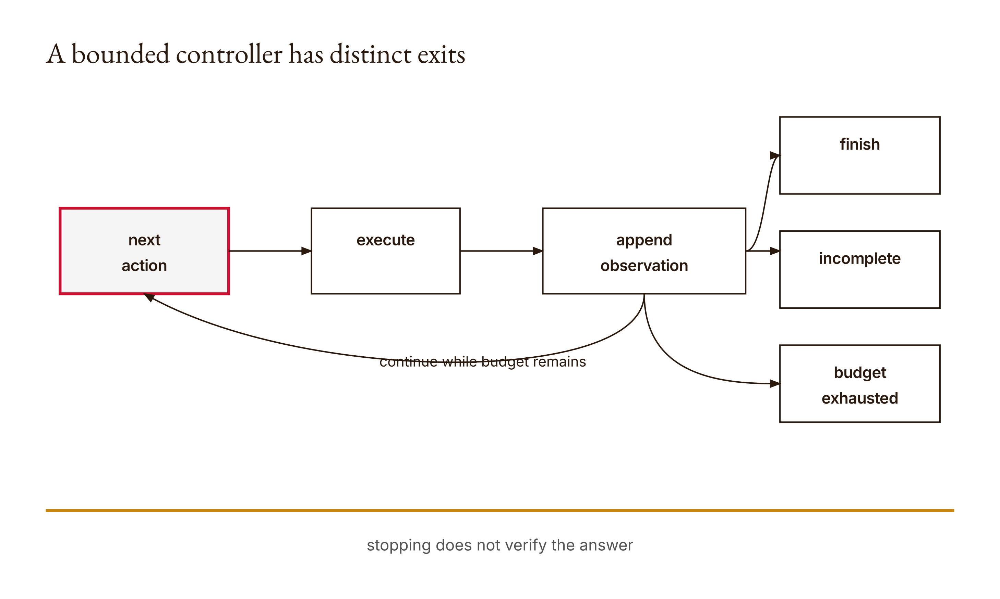

# Chapter 4 — The agent loop
*Stopping is a control-flow event. Success needs evidence.*

Suppose a system looks up the same record again and again. Each lookup succeeds. Each observation is logged. The trace gets longer, but the task does not get closer to a supported answer. From inside a poorly described report, activity can look like progress. From outside, the relevant question is simpler: what changed that makes completion more justified than it was one turn ago?

Our offline research run gives this hypothetical a concrete boundary. A repeated-lookup policy with a turn budget of two stops after two recorded actions and returns `budget-exhausted`. The program does not invent a final answer to make the run appear complete. That is a useful behavior. It is also only one part of a trustworthy controller.

Another constructed run looks up a record whose value is blue and then finishes with red. The returned status is `finished`. The contradiction is visible in the answer and observation, but the controller never compares them. It accepts a finish action as a request to stop, not as a proven statement that the answer follows from the records. Both outcomes are preserved under `chapters.04` in the [research results](../research/worked-examples.json).

These two cases establish the tension for this chapter. We want a loop that cannot consume an unbounded number of ordinary turns. We also want to avoid confusing its stopping rule with an outcome check. A controller can enforce a budget and still finish incorrectly. A policy can provide an answer and still leave the evidence missing. Making those pieces separate gives us somewhere to place the checks each one needs.

I will use a scripted policy rather than a live model call. That choice makes each decision inspectable and repeatable in this experiment. It does not reproduce Claude's private reasoning or current agent implementation. You will see an iterator supplying action dictionaries, a dispatcher handling a lookup, and a trace accumulating observations. The machinery is small enough to explain from the first action to the final return.

Chapter 3 distinguished capability from authority. Here we add sequence and termination. The question is no longer only whether an operation appears in the available set. It is which action arrives next, what observation follows, what gets recorded, and which condition ends the run. Those questions are necessary for an agentic workflow, but answering them still does not grant permission to act or establish that the final claim is true.

## What you will be able to do

You should be able to implement the bounded controller, trace a turn by hand, distinguish policy exhaustion from budget exhaustion, and explain the meaning of `finished`. You should also be able to design a repeated-action test, identify an outcome check missing from a completion claim, and propose a repetition detector with a case that could make it stop too early.

The prerequisites are Chapter 3, Python loops, dictionaries, iterators, and return values. The paired [lesson](../lessons/04-the-agent-loop/docs/en.md) supplies the runnable sequence and existing knowledge check. This mechanism runs offline with Python's standard library. Claude Code remains available through your assumed account for help with your learner implementation, but no direct API call is part of the worked example.

Before reading the reference, write down what you expect if the policy provides no actions, if it provides one lookup and then ends, and if it provides a finish action with no supporting lookup. Do not answer all three with the word failure or success. Predict the actual kind of termination. That precision will make the implementation easier to inspect.

## The policy chooses; the controller organizes

The controller accepts three inputs: a policy, a mapping of records, and a maximum number of turns. In this reference, policy means an iterable of action dictionaries. The controller creates an iterator and asks it for the next item on each turn. A prepared list is enough to serve as the policy in our experiment.

That is a deliberately limited use of the word policy. The list is not a learned model. It does not change its next action based on the observation produced by the controller. The code does not send feedback into it. By separating the source of actions from the mechanism that processes them, we can test controller behavior before introducing a model-backed decision step.

The records mapping represents the lookup environment. A lookup action names a key, and the controller retrieves the corresponding value or the string `not found`. The controller does not alter this mapping during the run. The persistent state it constructs internally is the trace: a list of turn records containing an action name and observation.

A more adaptive system would need a defined route from observations back to its next decision. Do not describe that route as implemented merely because the code uses the name policy. The reference consumes an iterator; the examples provide scripted actions. This is a controller skeleton with observable behavior, not a complete feedback-driven intelligence.

The distinction helps with debugging. If an action sequence is poor but the controller dispatches it exactly as specified, the problem may be in the sequence rather than the dispatcher. If the correct sequence is supplied but the program returns the wrong termination status, the controller is the likely place to inspect. Keeping the pieces separate lets a test target the mechanism responsible for the observed error.

It also helps with later integration. A model-backed policy would be a new source of action requests. It should not inherit the power to redefine every runtime limit simply because it supplies the next action. The turn budget belongs to the controller in this exercise. The policy's choice of words does not create another iteration after the loop has exhausted its range.

Do not overextend that limit into a wall-clock guarantee. The loop bounds how many turns it begins under the demonstrated operations. It does not implement timeouts around an arbitrary iterator or a slow external tool. If obtaining the next item never returns, an iteration count alone would not interrupt that wait. The reference uses ordinary constructed inputs and an in-memory lookup; broader runtime guarantees require broader mechanisms.

## Read the controller as a sequence of boundaries

Here is the [reference implementation](../lessons/04-the-agent-loop/code/main.py):

```python
def run(policy, records, max_turns=4):
    if type(max_turns) is not int or max_turns < 1:
        raise ValueError("Positive turn budget required")
    trace = []
    iterator = iter(policy)
    for turn in range(max_turns):
        try:
            action = next(iterator)
        except StopIteration:
            return {"status": "incomplete", "trace": trace}
        name = action.get("name")
        if name == "finish":
            return {"status": "finished",
                    "answer": action.get("answer", ""), "trace": trace}
        observation = (records.get(action.get("key"), "not found")
                       if name == "lookup" else "error: tool not allowed")
        trace.append({"turn": turn + 1, "action": name,
                      "observation": observation})
    return {"status": "budget-exhausted", "trace": trace}
```

The first boundary is the budget. It must be an integer of at least one. The use of `type(max_turns) is int` is an explicit type choice in this implementation; the function is not accepting any object that can vaguely behave like a number. A bad budget is rejected before the trace or iterator is used. The existing tests include rejection of zero.

The second boundary is policy availability. The call to `next(iterator)` may raise `StopIteration`, meaning the iterable supplied no next action. The controller then returns `incomplete` with the trace it has accumulated. It does not assume that silence means the task was completed. An exhausted supply of scripted actions is a different condition from receiving the explicit finish action.

The third boundary is the action name. `finish` causes an immediate return. `lookup` produces an observation from the record mapping. Any other name produces the error observation `error: tool not allowed`. That observation is appended to the trace, and the loop can continue if another turn is available. An unrecognized name is not dispatched as an arbitrary tool.

This is a very small dispatcher, not a general security subsystem. It recognizes one read-only operation and one stop request. It does not execute shell commands merely because the action name is `shell`; the lesson test checks that such a name yields the not-allowed message. That behavior is concrete and useful. It does not establish permissions for a larger runtime that exists outside this function.

The fourth boundary is the end of the `for` loop. If no earlier return occurs, all available turns have been used, and the result is `budget-exhausted`. The function does not inspect whether the policy has more items waiting. It reports the budget boundary it reached. This detail will matter in the edge cases shortly.

The accepted action shape is also worth reading honestly. The code expects each action to offer `.get`. It does not contain a complete schema validator like Chapter 2's function. A malformed non-dictionary action can fail in a way not represented by the three normal statuses. If you add action validation in your learner version, describe it as an extension. Do not imply the reference already handles every malformed policy gracefully.

The controller's small size is an invitation to be exact. You can identify every return statement and every trace append. That is better than assigning the whole function a vague description such as robust agent loop. We should be able to say exactly which boundary produced a particular result and which failure remains outside the implemented contract.

## Actions become observations, but not necessarily knowledge

A lookup action is a dictionary such as `{"name": "lookup", "key": "color"}`. The dispatcher reads the key from the action and asks the record mapping for its value. If the mapping contains `{"color": "blue"}`, the observation is the string `blue`. The trace records that observation beside the turn number and action name.

That trace is evidence of the local operation's result. It is not a record of private reasoning. It also does not establish that the mapping is a trustworthy account of the real world. For our constructed example, the mapping is an explicit fixture. We can verify the consistency of the final answer with it without pretending that the fixture itself is a surveyed fact about anything outside the exercise.

The distinction gives the word grounded a precise local meaning. An answer of blue after looking up a record containing blue can be checked for agreement with that record. It does not become universally true by agreement with a mapping we invented. The evidence boundary is the supplied fixture, and the report should say so.

There is a limitation in the trace fields. The record contains the action name but not the lookup key. If several keys could return the same value, the trace alone may not tell you which was requested. For the published worked example, we preserve the scripted policy as well as the result, so the key remains available in the evidence packet. A future application needing self-contained operation records should consider what arguments its trace must retain.

Do not add all possible data to a log by habit. Some tasks involve sensitive inputs, and this reference does not define a retention or redaction policy. The teaching question is narrower: what information is necessary to support the claim you intend to make? For the harmless color fixture, retaining the key is easy. For other tasks, the evidence design needs an explicit data boundary rather than an indiscriminate transcript dump.

The controller's state update is the append to `trace`. It does not update the source records and does not send the observation into the scripted list. Repeating a lookup against the unchanged mapping therefore need not add a new source value. It adds another observation of the same operation. A longer trace is more recorded activity, not automatically more evidence for the final claim.

That distinction is the antidote to the opening scenario. If a system repeats a successful but unhelpful lookup, success at the tool boundary does not imply progress at the task boundary. You need an account of what information was missing and whether the observation reduced that gap. Our controller does not calculate such a progress measure. The artifact should not pretend it does.

## A finished wrong answer

Use the constructed records `{"color": "blue"}` and a policy containing two actions: first a lookup of `color`, then a finish with answer `red`. The default budget of four leaves room for both. Predict the status, answer, and trace length before running. Ask specifically whether the finish action itself will be appended to the trace.

On the first turn, the controller obtains the lookup action. It is not a finish, so dispatch continues to the record lookup. The observation is blue. The trace gains a record with turn one, action lookup, and observation blue. The loop then begins another turn.

On the second turn, the controller obtains the finish action. It returns immediately with status `finished`, answer red, and the existing trace. It does not execute the observation-and-append lines for that action. The returned trace therefore contains the lookup, not a separate finish record. The outer result carries the stop status and answer.

This is the behavior observed in the [worked-example execution](../research/worked-examples.json). It matters for reporting. If your artifact wants a complete sequence including the terminal action, you must preserve the policy or add a separately labeled terminal record. Do not silently claim that every consumed action appears in the reference trace. The placement of the return before the append makes that claim false.

Now compare answer and observation. Red does not agree with blue in this fixture. A separate check can reject the claimed answer against the supplied record. The controller does not perform that check. Its status remains an accurate description of its own stopping event: it received finish. The mistake would be interpreting that status as verified task success.

The existing test that finishes without an answer illustrates another boundary. `action.get("answer", "")` supplies an empty string when the field is absent. The function can return `finished` without a substantive answer. That is useful evidence about the reference's interface, and another reason not to read the status as proof that the task's output requirements were met.

There is no need to fix this by renaming all termination statuses failure. Doing so would lose useful distinctions. Instead, separate controller status from outcome evaluation. A result can be finished at the control-flow layer and contradicted at the evidence layer. That two-part report is more informative than either an unqualified success or an undifferentiated failure.

Suppose you design an outcome checker for this tiny task. It might compare the final answer with the value of the named fixture record. State its scope: exact agreement for a constructed key-value question. Do not claim that a string comparison solves general source-grounded reasoning. The value of the small check is that its target and limitation are visible.

## Budget exhaustion is not policy exhaustion

Consider a policy that repeatedly supplies a lookup action and a budget of two. Each turn consumes one action and records one observation. After the second append, the loop has no remaining iteration. The controller returns `budget-exhausted`. The saved research run preserves this outcome with two trace entries.

The program does not need the supplied policy to be finite in order to limit these ordinary completed turns. An iterator that keeps yielding lookup dictionaries can still be consumed only as many times as the `range` permits. The important qualification is completed turns: the iteration count does not implement a timeout if fetching an item or executing a tool were to block indefinitely. Our fixture does neither.

Now use a finite policy containing one lookup and keep the budget at four. The first turn records the observation. On the next turn, asking for another action raises `StopIteration`. The result is `incomplete`. The available action sequence ended before the controller received finish and before all four iterations were consumed.

Reduce that same one-lookup policy's budget to one. After recording the lookup, the loop exits without asking the iterator for another item. The result is `budget-exhausted`, not `incomplete`. The controller has not observed policy exhaustion because it never made the additional `next` call. This result is covered by the lesson's one-turn budget test.

That edge case is not a contradiction. The two statuses report different observed control boundaries. With a larger budget, the controller can discover the iterator has ended. With a budget of one, it reaches its own limit first. An accurate explanation follows the execution path rather than imagining knowledge the controller did not acquire.

The finish action also needs a turn in which to be consumed. A policy containing lookup and then finish cannot complete through that finish if the budget permits only the first lookup turn. This follows directly from the loop order. If your intended budget meant number of tool calls rather than number of action-consumption turns, you would need a different implementation and tests. Names like turn budget can hide such a policy choice unless you define the unit.

For your trace report, record the configured budget and the returned status alongside the trace. A trace length of one is not enough to reconstruct the stop reason. It could accompany different terminal paths. The terminal result is part of the evidence, not a decorative field to omit once the table of observations looks complete.

<!-- [FIGURE: Cajal production brief. A bounded controller has distinct exits. Include next action, execute, append observation, finish, incomplete, budget exhausted. Show the confirmed relationship that stopping does not verify the answer. Exclude unverified relationships, decorative elements, product-interface simulation, gradients, shadows, rounded corners, three-dimensional effects, and color-only meaning. The SVG and PNG are generated publication assets; retain this comment as figure provenance.] -->

*Figure 4.1 — A bounded controller has distinct exits*

## Repetition detectors have false positives too

The turn budget limits the number of completed iterations, but it does not detect that two actions are the same or that two observations add no new information. The reference contains no repetition detector. That makes a useful learner extension: propose a rule that notices an unproductive cycle, then find a case in which the rule could stop useful work.

Start by defining what repeat means. Matching only the action name is too coarse for many hypothetical tasks. Two lookups can request different keys. Matching name and key is more specific, but even that does not always imply a useless repeat if the underlying environment can change. Our fixture mapping stays unchanged during the run; a different system might not. The detector's assumptions should be stated with its rule.

A rule based on identical observations has another ambiguity. Two different records can legitimately contain the same value. If the task requires checking both, seeing the same text twice does not necessarily mean the second lookup was pointless. The observation alone may not identify the evidence obligation being satisfied. This is one reason preserving arguments can matter in a richer trace.

These are proposed design cases, not measured performance claims. Their purpose is to prevent you from replacing one blunt mechanism with another and calling it intelligence. A repetition detector should have a stated target failure and a test that challenges its stopping behavior. The budget remains a separate backstop even if your detector works on the examples you chose.

You can also choose a less ambitious intervention: report suspected repetition rather than automatically terminate. That trades decisive stopping for a reviewable signal. Whether it is sufficient depends on the workflow's cost and authority boundaries, which this toy program does not measure. State the tradeoff rather than claiming there is one universally correct detector.

The learning objective is to connect a stop rule to a reason. A loop should not continue merely because another action exists, and it should not stop useful work merely because a superficial pattern repeats. The controller needs a defined termination policy; the reviewer needs evidence that the policy fits the task. The set of tests should include the case that makes your preferred rule uncomfortable.

## Build It: separate the exits before adding complexity

Write your learner controller with a positive turn budget and a scripted action source. Begin with empty policy, lookup, and finish cases. Preserve distinct statuses for the defined exits. Do not start by connecting a paid model call. Scripted actions let you isolate the runtime behavior you need to understand before introducing another source of variability.

Trace the location of every return. Identify which fields are present in each returned dictionary. The finished result includes an answer; the other normal results do not manufacture one. The trace grows only on non-finish actions. Those are interface facts that downstream code may depend on, so include them in your explanation and tests.

Next, test an unknown action name. In the reference, it becomes an error observation and still consumes an iteration. The program does not automatically terminate on that error. A learner extension might choose to stop, retry, or escalate for certain errors, but that is a new policy. Record it as such and test the changed behavior rather than describing your preferred behavior as already present.

Read the [existing tests](../lessons/04-the-agent-loop/code/tests/test_main.py) before consulting the reference implementation. They cover empty policy, a finish action, budget exhaustion, lookup results, disallowed tools, and invalid budget. Add tests addressing the distinctions you found in this chapter: a wrong finished answer, a finish beyond the available turn count, or the difference between a consumed terminal action and a trace entry.

Ask Claude Code to challenge your explanation after you can trace one run unaided. It can help find an omitted branch or suggest a small fixture. Its proposed diagnosis should then be checked against the actual return path. Do not turn a fluent description of an agent loop into evidence that your code handles a case you have not exercised.

## Use It: map visible operations without inventing inner reasoning

The paired lesson suggests examining a Claude Code bug fix and a document task through an available Claude interface. Treat those as separate, actual experiments if you perform them. Record visible observations and tool results, and map them to the controller's broad action-and-observation structure. Do not claim that the production system uses this exact Python loop.

A visible trace is not a window into private reasoning. It can show a requested tool action, returned output, and a final message. That is enough to ask useful questions about sequence and evidence. It is not grounds for inventing an internal deliberation narrative or stating that the model knew a fact because a trace happened to contain it.

Keep permission differences visible. A bug-fix task in a disposable repository and a document task may have different allowed sources and writable targets. This controller's in-memory lookup does not enforce those external boundaries. The comparison should name them rather than use the shared word agent to flatten the difference.

If you do not perform one of the interface experiments, mark it not run. You can still complete the offline controller and the constructed failure traces. The chapter's mechanics do not require fabricated live outputs, and the artifact becomes more trustworthy when it distinguishes work performed from work proposed.

For an actual completion claim, identify the independent outcome evidence. In a bug fix, that might include the relevant changed file and the tests actually executed. In a source-summary task, it includes comparison with the specified sources. Do not assume the final done message supplies all of this. The lesson of finish(red) is to look outside the stop signal for the claim's support.

## Ship It: preserve the failure trace

The artifact is an agent trace with turn number, action, observation, stop reason, and the evidence that would justify completion. The [artifact brief](../lessons/04-the-agent-loop/outputs/artifact-brief.md) gives the repository expectations. Keep the original policy fixture, the record mapping, budget, and returned object together so another reader can reconstruct the path.

Include the repeated-action run and the wrong-answer finish run. Do not remove them because they make the controller appear less impressive. They explain its boundaries. A failure trace is a reusable example for later tests, and it makes a stronger teaching artifact than a clean happy-path transcript with no account of what the program would do when the policy is wrong.

Your conclusion should distinguish at least three layers: the policy supplied an action, the controller processed it and stopped under a named rule, and a separate check assessed the answer against the task evidence. Where a layer is absent, say so. The reference's wrong finish demonstrates that the first two can occur without the third succeeding.

Record your own change in interpretation. Perhaps you expected finish to be included in the trace, or expected a one-item policy always to return incomplete after its item. Preserve the prediction and explain the line of code that changed your view. That is a meaningful account of learning because the evidence can be inspected, not merely asserted.

## Verify and reflect

Run the demo, the six lesson tests, and your added cases. The [research script](../research/worked_examples.py) preserves the published counterexamples and their assertions. Use its actual JSON output to compare the observed statuses, then explain each return without relying on the fact that a test passed. A status name is useful only if you can say what event it denotes.

Review any claim that the loop is bounded. Specify the unit and assumptions. Here the configured limit bounds ordinary completed turns in the demonstrated loop; it is not a general timeout, memory cap, credential policy, or correctness check. A precise statement helps the next chapter add the missing boundaries instead of assuming one limit protects everything.

Then inspect the artifact for invented success. Did you supply an answer when the controller returned incomplete? Did you summarize budget exhaustion as successful completion because the trace looked productive? Did you call an answer supported without comparing it to the record? Correct those statements while preserving the original mistaken interpretation in your learning record.

The reflection should name the actual confusion. “I thought stopping meant succeeding” is a start. “The finish branch returns before any comparison between red and the recorded blue observation” is better. It connects the general lesson to a concrete mechanism you can recognize when the surrounding system becomes larger.

## Assessments — ungraded practice

These Assessments carry no points. Use the paired lesson's existing [knowledge check](../lessons/04-the-agent-loop/quiz.json), preserving your initial answers before reading explanations. Keep fixtures labeled and do not introduce paid API requests to test a controller whose behavior can be isolated offline. Your learner implementation should remain separate from the reference.

### Warm-up

1. **Trace one turn — introductory; objective: explain dispatch.** Choose a harmless lookup key and fixture value. Predict the first trace entry, then run the case. Identify the action source, the dispatcher condition, the observation, and the state update. Explain which information the trace omits and where you preserved it in the surrounding artifact.

2. **Three exits — introductory; objective: distinguish termination.** Construct one case for incomplete, one for finished, and one for budget-exhausted. Predict the returned fields and explain the relevant return statement. Do not call all three success or failure without qualification. State the independent outcome question that remains after the controller status is known.

3. **Finish without evidence — introductory; objective: inspect a boundary.** Supply a finish action without a preceding lookup and inspect the result. Then consider the default for a missing answer field. Explain what the result proves about control flow and what it does not prove about the task. Keep this as a constructed test, not a claim about a real service's behavior.

### Application

4. **The last available turn — intermediate; objective: test a budget boundary.** Use a policy with lookup followed by finish and compare two carefully chosen budgets. Predict which actions will be consumed and which will be recorded. Explain the unit counted by max_turns. If you propose a tool-call budget instead, describe the different rule and tests it would require.

5. **A repeated iterator — intermediate; objective: demonstrate bounded iteration.** Supply an iterator that keeps yielding a harmless lookup action. Use a small positive turn budget and record the resulting trace and status. Explain why the budget stops ordinary repeated actions in this experiment and why the result is not a proof of a wall-clock timeout for arbitrary blocking code.

6. **A wrong finished answer — intermediate; objective: separate outcome checking.** Reproduce the blue-record, red-answer counterexample. Preserve the controller result and add a separately labeled comparison against the fixture. Explain why finished and contradicted can both be accurate labels at different layers. Do not silently alter the controller status to conceal its actual semantics.

7. **An error observation — intermediate; objective: trace disallowed actions.** Supply an unknown action name, then another permitted action if the budget allows it. Predict whether the controller stops immediately or continues. Record the actual result and propose one alternative error policy in your learner version. Explain its tradeoff and distinguish your extension from the reference behavior.

### Synthesis

8. **The evidence packet — advanced; objective: integrate provenance.** Assemble policy, records, budget, trace, stop reason, and outcome check for both a supported answer and a deliberately unsupported answer. Identify which parts are recorded execution and which are your interpretation. Ask a reviewer to locate an unsupported completion claim, then verify the criticism against the preserved artifacts.

9. **A production analogy with boundaries — advanced; objective: transfer cautiously.** Map visible operations from an authorized Claude Code task, or an explicitly hypothetical task if none was run, onto action, observation, and stop. State where the analogy ends. Do not invent private reasoning, unavailable tool results, or a claim that the production runtime uses this exact controller.

### Challenge

10. **A repetition detector that can be wrong — stretch; objective: evaluate a stopping rule.** Implement a detector in a separate learner version. Define whether it compares names, arguments, observations, or some combination. Construct both a pointless repeated-action case and a useful repetition that challenges the detector. Explain a false positive or limitation and keep the turn budget as a separately defined boundary.

11. **Richer termination evidence — stretch; objective: redesign the trace.** Propose a trace format that records a terminal action and the relevant lookup arguments without claiming their contents are authenticated. Explain what downstream review becomes possible and what additional risks or data-retention decisions appear. Identify which field supports the stop reason and which separate check supports the final answer.

## What you can now diagnose

You can trace a bounded controller without hiding its work behind the word agent. An iterator supplies an action, the dispatcher selects the permitted operation or an error observation, and the trace records the resulting nonterminal turn. The loop stops through explicit return paths. You can name the input and branch responsible for each normal status.

You can distinguish the policy running out of actions from the controller running out of turns. You can explain why a one-action policy can produce different stop reasons under different budgets, and why a finish request needs an available turn to be consumed. These are small details with large reporting consequences: the observed stop reason depends on the path actually taken, not on what you know is waiting beyond it.

You can also explain why a finished result is not automatically supported. The red answer after a blue lookup gives a reproducible counterexample. The controller accepts the stop request without comparing the final answer to the evidence. A separate outcome check is needed, and its scope should be stated as carefully as the scope of the controller itself.

Finally, you can critique a proposed improvement rather than simply add it. A repetition detector needs a definition of repetition and a test that exposes an over-eager stop. A richer trace needs fields that support the intended claim without pretending that recorded text authenticates itself. Each extension earns its place through a concrete job, evidence, and an acknowledged limit.

## A bounded loop can still cross a boundary once

The controller now limits repeated ordinary actions. That is progress. It does not answer the next question: what if the first action is outside the authorized scope? A budget of one can still allow one wrong target or one unauthorized mutation in a system that exposes such tools. Iteration count and permission are separate controls.

Chapter 5 will inspect that boundary through filesystem paths. A name that looks relative can resolve to a target outside an approved root. A permitted read does not imply a permitted write. We will use disposable fixtures to test traversal, symlinks, and approval checks, while refusing to describe a short teaching function as a complete production sandbox.

Carry the trace discipline forward. The next artifact should preserve the requested action, resolved target, decision, and observation needed to explain what happened. A good controller makes the sequence visible. A good boundary makes the allowed operation explicit. Neither eliminates the need to compare the resulting state with the task the human actually authorized.

## Anthropics

Anthropic's [Building effective agents](https://www.anthropic.com/engineering/building-effective-agents), included in the research packet and checked on 2026-09-06, provides a useful comparison for model-directed processes and their surrounding workflow. Keep that architectural guidance distinct from this scripted iterator.

Mark where a model-backed decision source would replace the prepared actions in your learner design. Then identify the controller limits and evidence checks that should remain explicit outside that source. This is an adaptation task, not a claim that our short loop reproduces Anthropic's runtime or that an API integration has already been executed.

## Computational Skepticism

The companion's chapter on agentic validation shifts the review question from the system's completion report to the outcome its actions produced. See [Agent outcomes](../docs/computational-skepticism.md#agent-outcomes) for the relevant passages. Here we borrow that diagnostic practice without importing the manuscript's broader empirical narratives or universal claims about agent capabilities.

Apply it directly to finish(red). Preserve the finished status as the controller's actual result, then compare the answer with the blue fixture observation. Name the check that rejects the completion claim and the evidence it uses. The skeptical move is not to deny that the controller stopped; it is to refuse to let stopping stand in for the task result that still requires verification.
