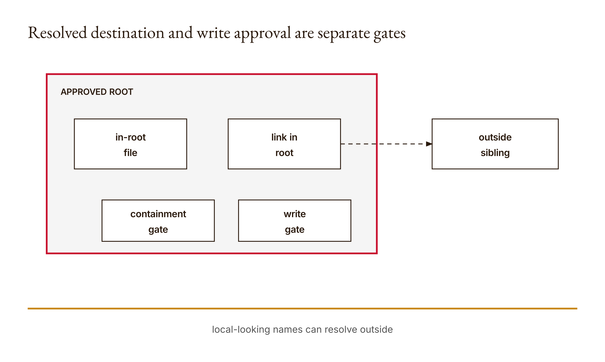

# Chapter 5 — Tools, permissions, and boundaries
*The path looks local. Where does it actually lead?*

Suppose a tool is allowed to read files in a small course folder. A request arrives for `notes.txt`, which looks ordinary. Another arrives for `../notes.txt`, which asks to move to the parent before locating the file. A third names an entry inside the folder that is actually a symbolic link to somewhere outside it. All three are strings. Their spelling alone is not a sufficient account of the target the filesystem will use.

The research fixture tests this boundary in disposable directories. An in-root target is accepted for reading. A traversal target, a link pointing outside the root, and an unapproved write are rejected. Those are actual results of the local preflight function, preserved under `chapters.05` in the [research output](../research/worked-examples.json). They do not establish that we built a complete filesystem sandbox. The function returns a path; it does not read or write the target.

That last sentence is the center of the chapter. We are going to inspect a useful boundary and be precise about the layer at which it operates. Resolving a name and checking containment can reject the illustrated escaping targets. Requiring a separate approval flag can distinguish reads from writes in the function's contract. Neither operation authenticates a human, mediates every possible file access, or makes a later write correct.

Chapter 4 bounded a controller's turns. A bounded controller can still request the wrong thing once. Here we narrow the requested operation and target before anything is performed. The aim is not to persuade a model to feel cautious. It is to express a small decision rule in executable Python and examine the cases that pass and fail it.

I want you to start with a prediction. If the approved root is a folder named course, should a different folder named course-other pass because its name starts with the same letters? Should a write inside course pass merely because the location is acceptable? Should an approved execute operation pass even though the function allows only reading and writing? The answer to each question comes from a different part of the rule. Keeping those parts separate is how we make the policy inspectable.

The scenarios are teaching fixtures, not invitations to probe someone else's files. Use disposable material under a narrowly scoped temporary directory. Claude Code remains the assumed learning assistant through your account, but the Python boundary requires no direct API call. Do not change institutional permissions, disable safeguards, or expose restricted material to complete this exercise. The [paired lesson](../lessons/05-tools-and-permissions/docs/en.md) keeps the practical task bounded.

## What you will be able to do

You should be able to trace a requested path to the resolved target used by this function, distinguish containment from string-prefix similarity, and implement the read/write approval boundary. You should also be able to explain the observed traversal and symlink rejections and state why a preflight result is not an operating-system sandbox or a completed file operation.

You need Chapter 4, Python exceptions, and basic path concepts: parent directories, absolute and relative paths, and symbolic links. We will explain how those concepts matter to this specific implementation rather than survey every filesystem feature. Write your first version in your learner workspace after reading the expected behavior, then compare it with the reference once you can explain a passing and a rejected case.

## A name is a request for a destination

A path is not merely a label printed in a report. It is an instruction for locating an object through a filesystem namespace. A relative path depends on the base from which it is interpreted. Parent components can move outward. A symbolic link can redirect a name toward another location. The preflight function must therefore choose what representation of the target it is evaluating.

The reference begins by resolving the approved root. It then combines that base with the supplied target and resolves the result. Python's [pathlib documentation](https://docs.python.org/3/library/pathlib.html), included in the research packet and consulted on 2026-09-06, describes `resolve()` as resolving symbolic links and eliminating parent components. That is the narrow behavior we rely on. It does not turn the returned pathname into an immutable handle to an object.

Consider the difference between a name containing `..` and its resolved destination. A textual check that merely rejects a suspicious-looking string is not the mechanism implemented here. The function asks whether the resolved target is within the resolved root. The target's spelling matters insofar as it determines that destination, but the containment check uses the resolved path representation.

This is a useful design choice because different spellings can identify the same location. It also lets an apparently local link be checked against the location to which it resolves in the fixture. The meaning of in-root is tied to the resolved comparison, not to where a short string happens to begin.

Do not infer that every path with a parent component necessarily escapes. A path can move into a subdirectory and back to its parent while remaining inside the allowed root. Conversely, a path without a visible parent component can lead outside through a link. The policy's target is containment, not a moral judgment about particular characters. A precise implementation should enforce the intended relation rather than rely on the visual innocence of the request.

There is another important distinction: resolving a path does not necessarily mean the final file exists. The reference calls `resolve()` without enabling strict existence checking. Its demo explicitly says no file is read or written. A returned `Path` therefore should not be reported as evidence that a file was successfully opened. Existence, object type, access at operation time, and successful completion are separate questions.

This matters especially for writes. A future output file may not yet exist, while its intended parent lies inside the root. The preflight might accept its location under the displayed policy. That acceptance does not create the file, make its contents valid, or establish that the surrounding directories are ready for the write. The consuming operation would need to handle those conditions.

## Three decisions in eleven lines

Here is the [reference implementation](../lessons/05-tools-and-permissions/code/main.py):

```python
from pathlib import Path

def authorize(root, target, operation, approved=False):
    if operation not in {"read", "write"}:
        raise PermissionError("Operation is not allowed")
    base = Path(root).resolve()
    path = (base / target).resolve()
    if not path.is_relative_to(base):
        raise PermissionError("Path escapes the data boundary")
    if operation == "write" and approved is not True:
        raise PermissionError("Write requires human approval")
    return path
```

The first decision concerns the operation vocabulary. Only read and write are allowed. The function rejects execute even if the approval argument is true and the target would otherwise be inside the root. Approval is not a universal override of the operation allowlist. The order and independence of these checks make that policy visible.

The second decision concerns the target. Resolve the root, resolve the combined path, and require the target to be relative to the base in the path-containment sense. A sibling directory with a similar prefix is not a child merely because its characters begin the same way. This is why a path relation is more appropriate than a plain string-prefix comparison for the demonstrated boundary.

The third decision concerns writes. A write needs `approved is True`. A read does not require that flag in this policy. The exact identity comparison means the function is asking for the Boolean value True, not any arbitrary truthy object. This is an interface rule. It does not prove that a human reviewed the request that produced the value.

The return value is the resolved path. There is no `open`, `read_text`, or `write_text` in these lines. The function is named authorize, but the name must not inflate the implemented guarantee. It checks a proposed operation under a supplied root and approval value. It is not the component that performs the operation or authenticates the source of those inputs.

Read the input dependencies carefully. If the caller supplies an overly broad root, the containment check will enforce that broad root. If the caller supplies True without a real approval process, the function has no separate evidence with which to dispute it. The boundary depends on trustworthy configuration and integration. Correct local logic cannot repair every bad input it is deliberately told to accept as policy.

This is the same pattern as the earlier chapters, now attached to a filesystem target. The probability function did not validate the truth of outcome labels. The format validator did not validate source support. The capability classifier did not authenticate its event list. Here the path check does not authenticate its approval flag. The lesson is to identify the trust input and specify what must justify it elsewhere.

## Containment is not a shared prefix

Imagine two sibling directories under a disposable parent: course and course-other. A target inside course-other should not be accepted under a policy allowing only course. A string test that asks whether the target starts with the text naming course can confuse those siblings. The displayed function uses the resolved path's relation to the base instead.

The [lesson tests](../lessons/05-tools-and-permissions/code/tests/test_main.py) include precisely this kind of sibling-prefix rejection. They also include a parent traversal request. Those tests give the design a concrete adversarial question: can a name that looks related to the root lead to a target outside it and still pass? The reference rejects the illustrated cases.

Do not turn this into an unqualified claim about every possible operating system, filesystem configuration, or concurrent mutation. The recorded tests exercise specific inputs in a local environment. The function is short enough to inspect, and the results support those behavior claims. A complete security guarantee would need a much wider account of how files are opened and how the environment can change.

For a hand trace, separate the intermediate values. First record the root argument. Next record its resolved base. Then record the target argument and the resolved combined path. Finally record whether containment passed. If you record only the original target string and a denial, another reviewer may have difficulty seeing why the boundary fired.

Keep disposable runtime paths distinct from permanent example names. Temporary directories may receive different names on each run. That does not make the test uninterpretable if the report identifies their roles: approved root, outside sibling, target, and resolved destination. The meaningful invariant is the containment relationship, not a particular random suffix chosen for a temporary folder.

An absolute target is another reason to inspect the combined result rather than assume concatenation means containment. The code uses pathlib's path composition, then resolves and checks the resulting path. It is the final containment decision that matters. The lesson's outside absolute sibling target is rejected. Do not claim that placing a root variable before a target expression automatically forces the target inside it.

The reporting habit is straightforward: show what was asked for, what target was evaluated, and which rule decided. That small record turns a permission denial from an unexplained obstacle into a reproducible boundary result. It also makes an accidental acceptance easier to diagnose if your learner implementation differs from the reference.

## The symlink that leaves the folder

The research script creates a symbolic link inside a temporary root that points outside the root. The link's name is locally situated; its resolved destination is not. When the function resolves the target and tests containment, the request is rejected. This is an executed fixture, preserved in the [research script](../research/worked_examples.py) and its output.

The mechanism is worth tracing without exaggeration. The root is resolved. The target referring to the link is combined with that root. Resolving follows the link to the outside destination. The containment test then sees an outside path and raises `PermissionError`. No read of the outside file is needed to demonstrate the rejection, because the function's job is to evaluate the path before such an operation.

This case shows why “the name is inside the folder” and “the resolved target is inside the folder” are different claims. A directory listing can show a local entry whose destination is elsewhere. A policy written only in terms of visible entry names could miss the distinction. Our specific preflight handles the constructed outside-pointing link by resolving it first.

Now consider the time boundary. The function checks and returns. Some later caller may open a file. The reference does not bind the check and operation into one indivisible mechanism, and it does not protect the namespace from changes by another process. A path component or other relevant filesystem state could change before use. The research run does not attempt to prove resistance to those races.

Be precise about the example, however. If the caller actually uses the returned resolved path, merely changing the original symbolic-link entry need not redirect that returned path. It would be misleading to claim that every original-link replacement automatically defeats this implementation. The broader gap is that the function performs a preflight pathname check and returns a pathname; it does not establish all properties of the later object access under concurrent changes.

A careless caller can create an additional problem by checking one path and then opening the original unchecked target instead of the returned resolved path. That would break the intended integration even without proving a sophisticated filesystem race. The teaching function cannot force callers to use its result. When reviewing a larger program, follow the actual value used at the operation, not just the presence of a call named authorize somewhere earlier.

These limits do not erase the observed symlink rejection. They locate it. The function rejected the outside destination in the constructed, stable fixture. That is the result we can report. The missing protection against every later mutation is a separate limitation to document, not a reason to pretend the test never accomplished anything.

## Read and write are different authority questions

An in-root read is accepted by this policy without a separate approval flag. That is a deliberate rule for the exercise. It is not a universal statement that every file under any root is appropriate to read, upload, or disclose. The approved root must already reflect the task's data boundary. If it contains material the workflow should not access, the policy's configuration is wrong for that task.

A write inside the same root is rejected unless the approval argument is exactly True. This separates two questions: is the target in the allowed location, and has the additional write condition been satisfied? Passing containment cannot substitute for the write condition. The same target can be accepted for reading and rejected for writing without any inconsistency.

The lesson tests an accepted write proposal with True and a rejected write proposal without it. Again, accepted proposal is the correct phrase. The function returns a path but does not modify a file. A report that says the test wrote x because the returned path's name is x would be confusing an authorization result with execution.

What does the flag represent? In this model, it stands for an approval decision supplied from outside the function. It is not a user interface, a signature, an identity check, or a record that someone saw the precise change. If you place True in a fixture, label it a simulated approval input. Do not attribute it to a real person or claim consent occurred.

For an actual workflow, the permission record should identify the relevant scope. Approval to create a disposable draft is not automatically approval to overwrite an original. Approval for one target is not an open-ended license to modify a directory. Our Boolean cannot encode those distinctions alone. The surrounding process must bind its decision to the actual requested operation and target, or use a richer representation.

This is where prompt language and runtime logic must not be confused. A model can propose an action and explain why it wants to perform it. That proposal can be useful input to review. It does not get to generate its own independent human approval merely by including a confident explanation or the word approved in text. The source of the approval value matters as much as its type.

The policy also refuses operations outside its allowlist even with approval set. That preserves a clear limit in the example. If your task needs a different operation, change the policy deliberately and review the new risk and tests. Do not stretch the meaning of write to include anything a tool might execute. A small vocabulary is useful only when its entries remain specific enough to enforce.

## Work through the boundary matrix

Use a disposable parent with an approved subdirectory and a separate outside location. The research fixture already exercises an in-root read, traversal, an outside-pointing symlink, and a write without approval. The existing lesson tests additionally inspect the Boolean-approved write return and rejection of execute. These sources let us explain the matrix without inventing live system behavior.

For the in-root read, the operation is allowed, the resolved target is contained, and no write approval is required. The returned value is the resolved path. The result supports the claim that this proposal passed preflight. It does not show that the target exists or was read.

For traversal, the operation vocabulary can still be valid while the resolved target escapes. The containment branch raises an exception. The problem is the destination, not the fact that the request is spelled read. A read can still be out of scope.

For the outside-pointing link, the locally named entry resolves outside and follows the same rejection branch. The mechanism differs from a parent component, but the final policy question is the same containment relation. This is a useful reason to test both cases rather than assume one string pattern covers every route.

For an in-root write with no approval, the first two checks pass and the third rejects the proposal. This is the case that proves location and operation authority are separate in the implementation. With the fixture approval value True, the write proposal passes and a path is returned; no mutation follows inside the function.

For execute, the first check rejects immediately. The function does not need to resolve the path or inspect the approval value to decide that the operation is outside its vocabulary. That early refusal makes the operation policy explicit and avoids pretending that target containment alone makes every operation acceptable.

| Proposal | Relevant result | What it establishes |
| --- | --- | --- |
| Contained read | Path returned | Proposal passes the displayed preflight |
| Escaping traversal | PermissionError | Resolved target fails containment |
| Outside-pointing link | PermissionError | Resolved destination fails containment in the fixture |
| Contained write, no approval | PermissionError | Containment does not waive write approval |
| Contained write, True fixture | Path returned | Simulated approval input satisfies this check |
| Execute | PermissionError | Approval cannot override the operation allowlist |

This table is not a security certification. It is a map from implemented conditions to observed or directly tested results. The distinction makes it reusable: another reader can locate the relevant branch and decide which additional question their application still needs to answer.

<!-- [FIGURE: Cajal production brief. Resolved destination and write approval are separate gates. Include approved root, in-root file, link in root, outside sibling, containment gate, write gate. Show the confirmed relationship that local-looking names can resolve outside. Exclude unverified relationships, decorative elements, product-interface simulation, gradients, shadows, rounded corners, three-dimensional effects, and color-only meaning. The SVG and PNG are generated publication assets; retain this comment as figure provenance.] -->

*Figure 5.1 — Resolved destination and write approval are separate gates*

## Build It: make denials explainable

Implement the operation allowlist, path resolution, containment check, and write condition in your learner workspace. Do not begin by giving a tool broad filesystem access so you can test whether it behaves politely. The fixture should be disposable and the operation under examination should be the preflight function itself.

Read the six existing tests before the reference. Predict not just acceptance or rejection, but which rule produces the result. Then write your first version and compare it with those predictions. If the sibling-prefix case passes, inspect whether you used a string test where a path relation was needed. If an unapproved write passes, inspect whether your write condition is independent of containment.

Keep your tests narrow enough to explain. A failure that combines an unknown operation, an escaping path, and missing approval may be rejected, but it does not isolate which boundary you meant to test. Use cases that allow earlier checks to pass when you want to test a later one. That way the exception path supports a specific claim.

Add a meaningful successful case outside the demo as well as a denial case. A policy that rejects everything can appear secure under a test set containing only forbidden proposals, yet be unusable for the authorized task. The positive case verifies that the intended operation remains possible at the preflight layer. It does not weaken the boundary to test its useful side.

For the symlink fixture, keep both source and destination in a disposable test arrangement even when the destination lies outside the approved subdirectory. Outside the allowed root need not mean a real personal or system file. The containment property can be demonstrated without putting unrelated material at risk. Clean up through the temporary-directory lifecycle rather than broad deletion commands.

Use Claude Code to review the test design after you have made your predictions. Ask it whether a passing assertion could still hide the defect you care about. Then check its response against the actual branches. A generated assurance that the code is secure should be narrowed to the conditions it can demonstrate. The artifact should retain the tests and limitations, not just the reassurance.

## Use It: compare with an actual permission boundary

The lesson asks you to inspect the permission configuration available in your Claude Code environment. Treat that as a read-only comparison, not authorization to change university settings or disable protections. Record what is actually configured and what you can verify from the relevant documentation. Product details can change, so do not substitute this chapter's toy Boolean for a current product policy.

Anthropic's [Claude Code permissions documentation](https://code.claude.com/docs/en/permissions), checked in the research packet on 2026-09-06, describes runtime permission rules. The useful comparison is that executable rules mediate actions rather than relying solely on prompt prose. Our function models only a small path-and-operation preflight and does not reproduce the product's permission system.

Choose a narrowly scoped task on harmless learner material. Name what may be read, what may be changed if anything, and what evidence would support the claim that the boundary was respected. If no write is needed, do not add one for dramatic effect. The task should determine the surface you inspect, continuing the reasoning from Chapter 3.

If you perform an authorized edit through a real tool, record the actual target and inspect the resulting change. Keep that execution separate from the offline authorize call. Passing preflight, receiving runtime permission, performing an operation, and reviewing the diff are distinct events. The fact that they occur in one workflow does not make them interchangeable.

If configuration access is unavailable, mark that portion not inspected. You can still complete the offline fixture and state what you would compare. Do not guess institutional rules, invent a screenshot, or report a protection as enabled because you remember that a product can support it. A permission report is most useful when it describes the actual boundary in use.

## What the toy boundary cannot guarantee

The first limitation is coverage. The function protects nothing that bypasses it. A larger program could call authorize and then use a different path or operation. Reviewing integration therefore means following the returned value into the actual file operation and checking that every relevant route is mediated. The local tests do not demonstrate that property for an arbitrary application.

The second limitation is authentication. The function has no independent account of who supplied the root or approval value. A True fixture is sufficient for the Boolean check but not proof of consent. A trustworthy workflow needs a real source for that decision and a scope that corresponds to the proposed action. This lesson does not implement that identity or approval system.

The third limitation is time and filesystem state. The resolved path is checked before use. The function does not make a later open atomic with the check or prevent changes to relevant path components. The successful rejection of one stable outside-pointing link does not prove resistance to every concurrent filesystem scenario. Do not claim a race exploit was executed unless you actually performed and recorded a safe test of one.

The fourth limitation is meaning. An approved write can contain a bad change. The function does not inspect a diff, test a program, or evaluate whether the output serves the user's purpose. Permission answers whether the modeled proposal satisfies a boundary; quality review asks whether the proposed content is acceptable. The next chapter will take that latter question seriously.

The fifth limitation is data policy beyond location. A contained file may still contain restricted information, and a later workflow may disclose it somewhere inappropriate. This preflight has no destination-channel policy, retention schedule, or content classification. A root is one useful boundary, not a complete description of all data obligations.

These limitations should not become an excuse for vague helplessness. The function has a well-defined educational job, and the fixture shows it doing that job. The right response is to preserve the useful check and identify the additional mechanisms needed for a particular deployment. Precision lets engineering accumulate protections without allowing one small protection to impersonate the whole system.

## Ship It: a permission policy with evidence

The artifact should state the approved root, allowed operations, approval owner or simulated approval source, denial cases, and actual test results. Use the [artifact brief](../lessons/05-tools-and-permissions/outputs/artifact-brief.md) for repository expectations. Keep NEU grading logistics outside this chapter and keep your learner changes separate from the reference.

For each proposal, preserve the requested target and the resolved role it played in the fixture. Record whether the function returned or raised, and identify the relevant branch. If a later file operation was not performed, say so. A preflight-only experiment is complete on its own terms when its stated task was to test preflight behavior.

Include at least one denial that matters to your eventual capstone. Explain the connection narrowly. If the capstone needs to save a draft under an approved directory, the write-approval and target checks are relevant. They do not establish that the draft is correct or that the complete capstone is secure. Name the supported claim and the next check it would require.

Record the source of each approval value. For tests, write simulated fixture. For an actual action, preserve the relevant real authorization without exposing private information. Never turn a Boolean in a script into a claim that a named person approved something. This is a simple rule with substantial value: the evidence record must not invent the human act it is supposed to document.

Finally, state one decision you revised after testing. Perhaps you replaced a string-prefix comparison with a path relation or stopped describing a returned path as a completed read. Preserve the original prediction and the result that changed it. That makes the permission policy an account of learning as well as an implementation artifact.

## Verify and reflect

Run the demo, the six tests, and your additional fixture cases. Compare with the [saved research results](../research/worked-examples.json) while keeping your own environment and output record. The research script demonstrates the stable symlink and traversal cases in disposable directories. It is evidence for those cases, not a claim that every security property has been tested.

Then audit the report's nouns and verbs. Does authorize mean a preflight decision or a complete approval system? Does read mean permission to read or an actual completed read? Does safe mean contained under this root or secure against every attack? Replace ambiguous language with the specific event and condition that occurred.

Ask one final integration question: if another function receives the returned Path, what must it still do correctly? The answer should include using the checked target consistently, handling actual operation failures, and preserving the appropriate permission and review boundaries. Do not attempt to solve all those problems by adding an adjective to the function name.

## Assessments — ungraded practice

These Assessments carry no points. Use the paired lesson's existing [knowledge check](../lessons/05-tools-and-permissions/quiz.json) and preserve predictions before viewing explanations. All filesystem experiments must use disposable fixtures. Do not read unrelated data, broaden permissions, or perform destructive operations to demonstrate a boundary that can be tested harmlessly.

### Warm-up

1. **Trace the destination — introductory; objective: explain resolution.** Choose an in-root fixture target and record the root argument, resolved base, target argument, and resolved target. Predict whether preflight returns. Explain why the returned path is not evidence of a completed read. Keep the fixture simple enough that each intermediate value has a clear role.

2. **Three checks, three reasons — introductory; objective: identify policy branches.** Construct separate cases for an unknown operation, an escaping destination, and an unapproved contained write. Predict the branch responsible for each refusal. Explain why combining all three defects in one proposal would make the test less useful for isolating the later checks.

3. **Inside does not mean approved — introductory; objective: separate location and authority.** Use the same contained target for read and write proposals with approval absent. Predict and run both. Explain the policy difference and what a fixture True would establish if supplied. Do not describe the fixture as a real person's consent or the returned path as a performed mutation.

### Application

4. **Sibling-prefix rejection — intermediate; objective: test containment.** Create disposable sibling directories with similar names and demonstrate that the outside sibling fails under the approved root. Explain why a character-prefix rule would ask the wrong question. Preserve the actual resolved relationships rather than relying only on a screenshot of directory names.

5. **Traversal without real data — intermediate; objective: implement a denial case.** Construct a parent-traversal target within a disposable parent arrangement. Predict its resolved role and the expected exception. Run the preflight and preserve the result. Explain why the demonstration does not require reading an unrelated personal or system file outside the approved root.

6. **A local link with an outside destination — intermediate; objective: inspect symbolic links.** Create an in-root symlink pointing to a disposable outside location. Predict and verify rejection. Explain the relationship between entry location and resolved target. State the limits of this stable fixture and do not claim you demonstrated resistance to concurrent filesystem changes.

7. **Useful acceptance — intermediate; objective: test the permitted side.** Add a successful case outside the demo and explain which legitimate task it represents. Pair it with a relevant denial case. Show why a function that rejected every proposal could pass a denial-only suite yet fail the intended workflow. Keep actual file operations separate from preflight results.

### Synthesis

8. **A capstone boundary proposal — advanced; objective: integrate scope.** Describe a narrowly scoped file task for your capstone. Name the root, operations, approval source, and evidence needed after execution. Map each requirement to the toy function or to a missing mechanism. Do not claim the function covers data retention, identity, or content quality merely because the path is contained.

9. **Check one value, use another — advanced; objective: review integration.** In a harmless learner example, show a caller design that checks a path but later uses a different unchecked value. Explain why the presence of authorize is insufficient. Propose a corrected data flow and a test that would expose the mismatch. Do not perform an out-of-scope real file operation to illustrate it.

### Challenge

10. **A precise race discussion — stretch; objective: evaluate limits.** Describe a hypothetical change between preflight and use that the function does not prevent. Distinguish use of the returned resolved path from reopening the original link name. Identify what your argument establishes and what would require an actual safely designed experiment. Do not present a speculative sequence as an observed exploit.

11. **Richer approval scope — stretch; objective: redesign authority representation.** Propose a learner-only approval record that names the operation and target rather than only a Boolean. Explain how a caller would check correspondence and which identity problem remains unsolved. Add a mismatched-target test. Keep simulated approvals labeled and avoid claiming that adding fields authenticates their contents.

## What you can now defend

You can explain why the path's destination matters more than its reassuring appearance. Resolving the approved root and requested target gives this preflight a concrete containment relation to check. You can trace parent traversal, a similar-looking sibling, and an outside-pointing link to the relevant rejection, while keeping the claim bounded to the tested behavior.

You can also explain the independence of operation, location, and write approval. An allowed operation can still target an outside location. A contained target can still fail the write condition. A True approval input cannot override an operation outside the allowlist. These distinctions let your test cases isolate real policy decisions rather than gather a miscellaneous set of failures.

You can distinguish a returned Path from a completed file operation and a Boolean approval fixture from a human act. That precision protects the evidence trail from a subtle form of invention: describing a preflight result as if a person approved and a tool executed the proposal. The record should state the actual layer at which something happened.

Finally, you can name the missing mechanisms without dismissing the useful one. This preflight does not authenticate its caller, mediate every route, freeze filesystem state, evaluate content, or define all data obligations. Its value is a small, inspectable boundary. A larger system must integrate and supplement it, and your report can now say where and why.

## An authorized change can still be a bad change

Suppose a proposed write passes every check in this chapter and is performed under a real, appropriately scoped approval. The target is correct. The operation is allowed. The file changes. We still have not asked whether the new contents are any good. A permission boundary should not be required to answer that question because it never inspects the proposed diff.

Chapter 6 turns to evidence-based review of a change. We will compare a small incorrect implementation, an inadequate patch, and a correct patch on constructed inputs. The review will preserve the difference between a proposed edit, tests actually run, and a human decision about whether the change is acceptable.

Carry the boundary record forward. It establishes which target and operation were in scope. The diff and test evidence will establish different properties of the content. A professional workflow needs both. Permission without quality review can authorize a mistake; quality without permission can produce an excellent change to the wrong thing.

## Anthropics

Compare the Python operation allowlist with [Claude Code permissions](https://code.claude.com/docs/en/permissions), checked for the research packet on 2026-09-06. The relevant connection is runtime enforcement: requesting caution in prose is not the same as constraining tool actions through permission rules. Our teaching function is only a preflight illustration, not a reproduction of the product's safeguards.

Inspect the actual configuration available to your course environment without changing institutional settings. Document one enforceable boundary and one question your small path function cannot answer. Keep any unavailable information marked uninspected. The comparison should sharpen your permission policy, not encourage bypassing a boundary in order to make the demonstration more dramatic.
