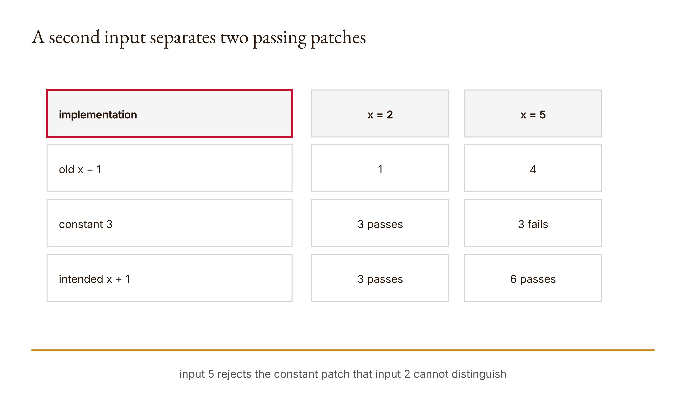

# Chapter 6 — Claude Code and evidence-based diff review
*The patch is small. The claim attached to it may not be.*

Suppose a function should add one to its input. The current version subtracts one. A proposed patch makes the visible regression test pass, and the changed line looks pleasantly short. There is only one problem: the patch returns the constant three. It works for the test input two and fails for five. Nothing about the patch's size reveals the defect. Nothing about one green test proves the intended rule has been restored.

This is not a story about a real Claude Code failure. It is a constructed comparison executed against the course's offline review exercise. For inputs two and five, the old function `x - 1` returns one and four. The inadequate patch returns three and three. The intended `x + 1` patch returns three and six. The exact results are preserved under `chapters.06` in the [research output](../research/worked-examples.json). The same research run also shows that the review function rejects a proposal when its approval flag is false.

Those two observations belong together. Tests can expose behavior, but a Boolean saying checks passed does not execute them. A human approval field can be required, but a Boolean saying approved does not authenticate a person. The lesson's review function is a compact policy aggregator. It receives assertions about changed files, checks, and approval, then returns reasons or a merge-ready status. Our job is to understand exactly what that result means and what evidence must exist outside it.

Chapter 5 established that an authorized path can still receive a bad change. This chapter moves from the file boundary to the content boundary. We will reproduce a defect, inspect a proposed diff, run a test designed for the stated behavior, look for collateral effects, and reach one of three decisions: accept, revise, or reject. The decision should follow the evidence trail rather than the final sentence an AI system produces about its own work.

The paired workflow assumes Claude Code through your course or personal account. The core Python example runs offline and requires no direct API credits. If you use Claude Code to propose a patch in a disposable repository, preserve the actual plan, diff, commands, and outputs. Do not replace an unavailable or failed Claude session with invented dialogue. A human-readable review packet is more valuable than a seamless story that conceals what did not run.

## What you will be able to do

By the end, you should be able to explain a unified diff as changed behavior rather than decoration, write a regression test that distinguishes an intended rule from a convenient constant, and trace every reason returned by the review function. You should also be able to defend an accept, revise, or reject decision using executed checks and scope evidence while keeping human approval separate from automated results.

You need Chapters 4 and 5, basic Python functions, unit tests, and the idea of before-and-after file content. The paired [lesson](../lessons/06-claude-code-and-diff-review/docs/en.md) supplies the runnable sequence and existing knowledge check. Begin in your learner workspace. Write the failing behavior and prediction before asking Claude for a patch. That order preserves the problem you intended to solve instead of allowing the proposed implementation to redefine it.

## Reproduce before you repair

A bug report such as “the result is wrong” is too weak to guide a bounded change. It does not identify an input, expected result, observed result, or scope. The first useful artifact is a reproduction: the smallest legitimate case that demonstrates the gap between intended and current behavior.

For our constructed function, state the rule in plain language: return the input plus one. Choose at least two inputs before seeing a patch. With two and five, the expected results are three and six. The old implementation returns one and four, so both cases demonstrate subtraction rather than addition. The pair is more informative than either case alone because it makes a constant replacement easier to detect.

The distinction between reproducing a defect and proving its complete cause matters. Observing `old(2) == 1` contradicts the stated plus-one requirement. It does not, by itself, establish how the source is written. Reading the implementation reveals the `x - 1` expression. A review packet should keep behavior and inspection evidence separate enough that another person can reconstruct the conclusion.

Write the regression test before the proposed fix when practical. This protects the test from being tailored to the implementation you just saw. The test is still your design and can still be incomplete, but its provenance is clearer: it represents the expected behavior rather than a retrospective way to bless a patch.

One test using input two permits the constant-three patch. This is not a reason to dismiss regression tests. It is evidence that the selected case did not distinguish the intended function from every wrong function we care about. Adding five supplies another constraint. The pair still does not prove correctness for all Python inputs, but it rejects the demonstrated constant repair.

The review habit is to ask which different implementation could pass the current test. You do not need an adversarial imagination capable of enumerating all programs. One plausible counterexample is enough to reveal that the evidence supports a narrower claim than “the bug is completely fixed.”

## Read a diff as a behavioral proposal

The [reference implementation](../lessons/06-claude-code-and-diff-review/code/main.py) uses Python's standard-library `difflib` to produce a unified diff:

```python
import difflib

def diff(before, after):
    return "".join(difflib.unified_diff(
        before.splitlines(True),
        after.splitlines(True),
        fromfile="before.py",
        tofile="after.py",
    ))
```

For the lesson's simple strings, the output labels a before file and after file, removes `return x - 1`, and adds `return x + 1`. The leading minus and plus lines are change notation. They are not arithmetic performed by the diff itself. The diff reports a textual transformation; the reviewer connects that transformation to expected behavior.

A useful review explains the changed expression. Replacing subtraction with addition changes the returned value by two relative to the old implementation for the same numeric input. More importantly, it changes the rule from one below x to one above x. That explanation transfers across inputs. “The plus sign looks right” does not.

The diff is evidence of what text differs between two supplied strings. It does not prove either string was loaded from the intended repository file. It does not run the code. It does not show untracked changes omitted from the comparison. In an actual Claude Code workflow, record the command and scope used to inspect changes and connect the displayed diff to the working tree you are reviewing.

Small diffs can reduce the amount of material a reviewer must inspect, but small is not equivalent to safe. A one-character operator change can alter every call. A large generated fixture change can be mechanically uninteresting but still deserve provenance and scope checks. Review effort should follow behavioral consequence and uncertainty, not line count alone.

<!-- [FIGURE: Cajal production brief. A second input separates two passing patches. Include old x−1, constant 3, intended x+1, input 2, input 5. Show the confirmed relationship that one test cannot distinguish both implementations. Exclude unverified relationships, decorative elements, product-interface simulation, gradients, shadows, rounded corners, three-dimensional effects, and color-only meaning. The SVG and PNG are generated publication assets; retain this comment as figure provenance.] -->

*Figure 6.1 — A second input separates two passing patches*

## Scope is a testable property, not a mood

The lesson's `review` function accepts the changed filenames and an allowed list. It calculates whether any changed file lies outside that list. This is a useful scope check because it turns “please keep the patch focused” into a concrete comparison.

```python
def review(changed, allowed, checks_passed, approved):
    reasons = []
    if not changed:
        reasons.append("no changes")
    if set(changed) - set(allowed):
        reasons.append("out of scope")
    if checks_passed is not True:
        reasons.append("checks failed or absent")
    if approved is not True:
        reasons.append("human review required")
    return {"merge_ready": not reasons, "reasons": reasons}
```

An empty changed list is rejected. A claimed fix with no recorded file change deserves explanation: perhaps the change was never applied, perhaps the relevant artifact lies elsewhere, or perhaps the wrong comparison was used. The function names only `no changes`; diagnosis remains outside its Boolean aggregation.

The set difference between changed and allowed files exposes any changed name not in the allowed set. It does not inspect line-level scope inside an allowed file. A patch can rewrite unrelated functions in `app.py` and still pass if `app.py` is permitted. Filename scope is useful and incomplete.

Likewise, a renamed or generated file may require a richer representation than a simple list. The teaching model is designed to make one question visible, not to reproduce every version-control state. In your actual review packet, preserve the real diff status and explain how it maps to the simplified changed-file input.

Do not respond to this limitation by making the allowed list the whole repository. That would make the check easier to satisfy while erasing the boundary it was intended to enforce. Start from the task: which files should this fix need to change? If the patch reveals a legitimate dependency outside the initial scope, pause and revise the scope explicitly rather than retroactively pretending it was always included.

Scope review and correctness review can disagree. A perfectly scoped patch can be wrong. A behaviorally correct patch can include an unrelated change. The review function accumulates multiple reasons instead of stopping at the first. This design preserves the possibility that more than one obligation failed.

## Flags are claims about evidence

The `checks_passed` argument is not a test runner. If a caller supplies True, the function accepts that assertion. It has no command, output, timestamp, environment, or association between a check and the current diff. The appropriate artifact must supply those pieces.

This makes the field useful as a summary only when its provenance is visible. A review packet can contain exact commands and outputs, identify their exit status, and then derive the Boolean for the policy summary. Supplying True by hand in a fixture demonstrates the branch; it does not demonstrate that a real check passed.

The `approved` argument has the same structural limitation. The function requires literal True. It does not authenticate a reviewer or prove that the reviewer saw this version of the diff. Chapter 13 will bind a simulated decision to a proposal fingerprint, while still refusing to treat a digest as identity. Here the lesson is simpler: a required flag ensures the caller cannot omit approval without failing this check, but the meaning of the value depends on the surrounding process.

The research example calls the review with approval false and observes `human review required`. That is an executed control-path result, not evidence that a person declined the patch. Conversely, the lesson test supplies True and sees merge-ready when other requirements pass. That is a simulated input, not a human act.

There is a useful design philosophy in this simplicity. The function aggregates conditions without pretending to generate their evidence. This keeps it small and testable. The cost is that integration bears the burden of constructing trustworthy inputs. A dashboard is only as honest as the records behind its green indicators.

## Work through three implementations

Represent the old and candidate functions as tiny Python expressions or functions in a disposable learner file:

```python
def old(x):
    return x - 1

def inadequate_patch(x):
    return 3

def intended_patch(x):
    return x + 1
```

Before running them, predict the output table for inputs two and five. The old function gives one and four. The constant gives three for both. The plus-one version gives three and six. These exact outputs were executed in the research pass; they are not hypothetical decimals reconstructed from memory.

Now imagine a regression test containing only `assert candidate(2) == 3`. Both candidate patches pass. If the review packet records only that command, it supports the claim that the candidate returns three for input two. It does not distinguish the intended rule from the constant. Add the second case and the constant patch fails.

The two-input test still leaves unanswered questions. What input types are supported? What happens at boundary values? Is this function part of a larger invariant? The exercise does not supply a complete specification, so do not fabricate one. State that the selected checks cover the declared integer examples and the intended transformation illustrated by them.

Next inspect the textual diff for each candidate. The constant patch removes dependence on x. That semantic observation motivates the second test. This is review at its best: code reading suggests a risk, and an executable check examines it. Neither replaces the other.

Finally construct review summaries. For a candidate changing only `app.py`, with actual targeted checks passed but no human decision, the result must not be merge-ready. For the same simulated inputs with approved True, the function can return merge-ready. Label the second a policy fixture. A real merge decision requires the actual reviewer and current patch context the Boolean cannot provide.

## Accept, revise, or reject

An accept decision should name the version reviewed, the scope inspected, the checks run, and remaining limitations. “Looks good” hides the basis of judgment. “Accept the x+1 patch for the declared integer behavior after the two regression inputs and existing suite passed; broader type behavior was not evaluated” is more useful.

Revise is appropriate when the goal remains valid but the evidence or implementation is insufficient. The constant patch is a clean revise case. It demonstrates the expected result for one input but fails a second case representing the same stated rule. The next action is not to broaden approval; it is to change the implementation or narrow the claim honestly.

Reject is appropriate when the proposal conflicts with scope, requirement, or risk in a way that should not proceed as presented. An unrelated file change can justify rejection even if the regression passes. Rejection is not a claim that every line is technically bad. It is a decision about the proposal as a package under the current task boundary.

These labels are human review outcomes, not values the AI should invent on behalf of a person. Claude can summarize evidence, challenge a rationale, and propose a recommendation. The responsible reviewer owns the decision where the workflow assigns that responsibility.

The interesting tradeoff is speed versus inspectability. Automatic acceptance can reduce delay for well-specified low-risk changes, but this chapter has not established criteria for removing review. Manual review can become ceremonial if the evidence is weak or the change volume exceeds attention. The response is to improve the packet and scope, not to romanticize either automation or a signature.

## Build It and use Claude Code within a bounded repo

Create a disposable Python repository or use your course learner directory. Write the failing regression before the patch. Record the issue, expected behavior, and allowed file list. Ask Claude Code for a plan and inspect whether it matches that boundary before authorizing an edit.

After the edit, inspect the actual diff. Explain the changed behavior line by line where necessary. Run the targeted regression and the existing tests. Preserve commands, outputs, and exit status. A final Claude message that says tests pass is not a substitute for the execution record.

Anthropic's [Claude Code best practices](https://code.claude.com/docs/en/best-practices), checked during research on 2026-09-06, recommends giving work executable checks and separating exploration, planning, and implementation where appropriate. In this chapter those ideas map to concrete artifacts: reproduction, reviewed plan, diff, and test output. The mapping is an adaptation; the toy review function is not Anthropic's runtime.

If the Claude session is unavailable, report that and complete the offline review exercise. Do not manufacture a plan or transcript. You can still analyze the three implementations, run their tests, and prepare a proposed workflow for a later actual tool-assisted change.

## Ship the review packet

The [artifact brief](../lessons/06-claude-code-and-diff-review/outputs/artifact-brief.md) asks for issue, reproduction, plan, before-and-after diff, exact check commands and output, review notes, and merge decision. Arrange these as an argument, not a pile of screenshots.

Begin with scope and expected behavior. Follow with the pre-patch reproduction. Preserve the proposed plan and actual diff. Then attach checks to claims: identify which behavior each command examines. End with the human decision and remaining gaps.

Record Claude's contributions explicitly: plan generation, code proposal, test suggestion, or summary. Record your own contributions: reproduction, scope, review reasoning, additional test, and decision. Percentages are less useful than named actions unless the assignment separately requires an estimate.

Keep failures. The constant patch and its first passing test show why the second test exists. Removing them makes the final packet cleaner and the reasoning harder to audit. A professional review trail should make correction visible.

### A review packet is a chain, not a folder

Putting the right filenames in one directory does not guarantee that the records refer to one another. The issue should identify the behavior reproduced by the failing test. The plan should address that issue and respect the allowed scope. The diff should implement the reviewed plan or explain why it changed. The test outputs should come after the current diff, and the decision should name that same proposal. If one link refers to an earlier version, the packet can look complete while its argument has broken.

Use identifiers that a reader can follow without inventing elaborate infrastructure. A commit hash is useful when a real commit exists; a saved diff digest or dated working-tree description may be sufficient for a classroom draft. What matters is that the review does not quietly combine the plan for one change, the tests for another, and the approval for a third.

Chronology helps but does not solve correspondence by itself. A test run after an edit can still target the wrong module. A diff captured before a generated file update can omit a relevant change. Record the command's working directory and target, then explain how the result bears on the proposed behavior. Evidence becomes useful when its relationship to the claim is explicit.

The packet should also retain negative space. List relevant checks you did not run and files you did not inspect. This does not require an exhaustive catalog of the universe. Name the most plausible remaining gaps given the task. For our tiny function, broader types and inputs remain outside the two-number example. For a real patch, integration, platform, or data assumptions might remain.

Avoid using a screenshot as the only copy of command output. A screenshot may help a reader orient, but searchable text and the underlying changed files are easier to inspect and reproduce. Likewise, a pasted green badge without the command and target tells the reviewer less than it appears to. Presentation should support the evidence chain rather than replace it.

The decision belongs at the end because it depends on the packet, but do not hide it in a paragraph of narrative. State accept, revise, reject, or pending. Then give reasons connected to specific evidence and name the person or role responsible for the real decision. If the decision is only your proposed recommendation for someone else, label it as such.

### Review the negative case with the same care

An unsuccessful patch deserves the same provenance discipline as a successful one. Record what version failed, which command exposed the defect, and whether the failure belongs to the patch or the test environment. Do not delete the evidence once a later revision passes. The transition from failure to correction is often the strongest demonstration that the final test matters.

In our constructed case, the constant patch is not malicious and need not be described as foolish. It is a locally adequate response to one inadequate test. That is what makes it valuable. Many review failures arise from reasonable local optimization against an incomplete specification. The reviewer improves the specification by identifying the behavior the patch neglected.

When a command fails for an unrelated setup reason, preserve that distinction too. A syntax error in the test harness does not establish that the candidate behavior is wrong. Repair the harness, rerun, and retain both records. The final report should not count infrastructure noise as evidence for whichever verdict you already preferred.

If Claude proposes the constant patch, the diagnosis remains about code and evidence. If a human proposes it, the same diagnosis applies. Attribution is important for contribution records, but it does not change the behavior of `return 3`. Review should avoid both automatic deference to AI output and automatic suspicion of it. The implementation and tests deserve direct inspection.

This is one reason the chapter's title includes evidence-based rather than AI-proof. The workflow is not designed to prove that AI involvement is safe in general. It is designed to expose the proposal, scope, checks, and accountable decision so the particular change can be judged.

## A worked review decision from beginning to end

Start with the issue: for integer input x in the declared exercise, the function should return x plus one, but the current implementation returns x minus one. The reproduction uses inputs two and five and records expected three and six against observed one and four. The allowed scope contains only `app.py` and its learner test file.

The first candidate replaces the body with `return 3`. Its diff is in scope. The original input-two regression passes. The input-five case fails because three does not equal six. The appropriate decision is revise: the proposal remains within file scope but does not implement the stated transformation. Supplying checks_passed as True based only on the first case would summarize an evidence set that does not match the declared behavior.

The second candidate replaces subtraction with addition. The diff is still in scope. Both targeted cases produce expected values. Assume, only as a labeled fixture, that the existing lesson checks also passed. The policy function still returns human review required when approved is false. This is correct behavior for the simulated call: evidence is assembled, but no actual person has been represented as making the decision.

For a real classroom review, the learner now examines the current diff and outputs, records the limitations, and chooses or requests the assigned decision. If the responsible human accepts it, that event belongs in the record with the proposal version. The book cannot synthesize that event in advance. The worked example therefore ends with evidence sufficient for a bounded recommendation, not a fabricated signature.

Notice how every layer contributes something different. The issue provides purpose. The reproduction demonstrates the original gap. The diff exposes the proposed mechanism. Targeted checks evaluate behavior. Scope comparison evaluates the change boundary. The human decision determines whether the proposal proceeds under the surrounding workflow. None of these artifacts is redundant merely because the final code line is simple.

Now change one assumption. Suppose the plus-one patch also modifies an unrelated configuration file. The behavior tests can still pass, but the review function adds out of scope. The correct response is not to ignore the file because the arithmetic is right. Inspect why it changed, revert the unrelated edit or explicitly revise scope through the proper process, then rerun the checks on the resulting proposal. The packet should show that transition.

Change another assumption. Suppose the diff is in scope and tests pass, but the claimed requirement was never confirmed. The code may implement plus one perfectly while the real task needed something else. This chapter cannot repair an invalid requirement through testing alone. Preserve the source of the expected behavior and escalate ambiguity before treating exact implementation of the wrong rule as success.

The teardown is complete when you can point to the job of every artifact and the limit of every result. The goal is not paperwork. It is a chain strong enough that another person can disagree with your decision by locating the evidence, not by reconstructing a vanished session from memory.

That chain also makes later maintenance possible. When a new input fails, a future reviewer can see which cases the original decision covered and add evidence without rewriting history. The old acceptance remains a bounded decision about the old proposal; it does not become dishonest merely because a new limitation appears. What would be dishonest is claiming the original packet tested what it never contained. Precise scope lets knowledge grow while preserving an intelligible record of why the earlier change was allowed.

## Verify and reflect

Review evidence must remain attached to the exact proposal.

Run the lesson demo and six tests, then your added regression. Explain what each result establishes. Inspect the current diff after the checks; a passing test from before a later edit is stale evidence for the current proposal.

Audit every strong verb in the patch summary. Does the evidence show, reproduce, support, or fully establish the sentence? “Completely fixes” is rarely justified by two inputs. A narrower verb is not timid when it accurately communicates the tested boundary.

Ask what old test the inadequate patch passed and why. Then explain the second input's power. The learning is not that more tests are always better. It is that a test should discriminate the intended behavior from a plausible defect.

Finally, inspect approval provenance. If the review function received True only in a fixture, say so. If a person actually reviewed the patch, preserve the relevant decision and version without inventing identity evidence. This prepares the ground for later approval gates.

## Assessments — ungraded practice

These Assessments carry no points. Use the paired lesson's [knowledge check](../lessons/06-claude-code-and-diff-review/quiz.json), preserving your answers before viewing explanations.

### Warm-up

1. **Explain the hunk — introductory; objective: read changed behavior.** Generate a unified diff between x-1 and x+1. Explain the removed and added lines without treating diff markers as arithmetic. State one claim the diff supports and one it does not.
2. **Trace every reason — introductory; objective: inspect policy.** Construct separate review calls for no changes, out-of-scope change, absent checks, and missing approval. Predict the reasons list and compare it with execution.
3. **One green case — introductory; objective: critique coverage.** Show why input two accepts both the constant-three and plus-one implementations. Explain the missing behavioral distinction.

### Application

4. **Second input — intermediate; objective: design a targeted regression.** Add an input that rejects the constant patch while representing the same stated rule. Preserve prediction, command, and result.
5. **Scope boundary — intermediate; objective: evaluate changed files.** Construct an allowed-file list and an out-of-scope proposal. Explain what filename comparison catches and what unrelated changes inside an allowed file could survive.
6. **Actual evidence behind True — intermediate; objective: connect execution to summary.** Run a harmless check and show how its output supports a checks-passed summary. Explain why manually supplying True without that record proves only the branch.
7. **Stale check — intermediate; objective: recognize version drift.** Run a test, alter the candidate afterward, and explain why the earlier result no longer justifies the current patch. Restore through a new learner edit, not by changing the reference.

### Synthesis

8. **Full packet — advanced; objective: integrate review evidence.** Assemble issue, reproduction, plan, diff, checks, scope, decision, and limitations for a disposable change. Mark any Claude contribution and any unperformed step honestly.
9. **Revise the claim — advanced; objective: calibrate language.** Find three strong verbs in your report. For each, state the evidence required and rewrite any sentence that exceeds the actual checks.

### Challenge

10. **A different survivor — stretch; objective: create a counterexample.** Design a wrong implementation that passes your current cases. Add one justified test, then explain what remains untested instead of claiming completeness.
11. **Richer review record — stretch; objective: redesign provenance.** Propose a record binding commands and outputs to the reviewed diff. Explain what it improves and why it still cannot authenticate human consent by itself.

## What you can now defend

You can reproduce a defect before editing, read a diff as a proposed behavioral change, and design a regression that distinguishes the intended rule from a convenient patch. You can identify why two and five together tell us more than two alone without pretending they exhaust the input domain.

You can trace the review policy's four obligations: a change exists, changed filenames stay in scope, checks are asserted as passed, and approval is asserted as present. You know that its Booleans summarize evidence rather than create it. That knowledge lets you build a packet another person can challenge.

You can also make a decision whose strength matches the record. Accept, revise, and reject are not emotional reactions to code quality. They are review outcomes attached to a specific proposal, task boundary, and evidence set.

## Which source material reached the system?

The review packet tells us what changed and which tests ran. It does not explain which information was selected before the change was proposed. A source-grounded task can fail upstream if the relevant passage never entered context, even when the resulting patch is syntactically tidy.

Chapter 7 builds a tiny retrieval system. We will turn token counts into vectors, calculate cosine similarity, rank documents, and inspect an omitted synonym case. Then we will ask the question ranking cannot answer: does the selected passage actually support the claim?

## Anthropics

Compare the packet with [Claude Code best practices](https://code.claude.com/docs/en/best-practices), checked on 2026-09-06. Map executable verification, exploration, planning, and implementation to your actual artifacts. Identify which human scope decision remains after every command passes. Do not claim the local `review` function reproduces Claude Code's safeguards.

## Computational Skepticism

The companion's communication chapter treats verb choice as an evidence audit. See [Claims and evidence](../docs/computational-skepticism.md#claims-and-evidence). Apply the practice to your patch summary: replace “completely fixed” with the exact tested behavior, and name untested cases. This is an editorial instrument, not a universal numeric scale of certainty.

## Conducting AI

The relevant practice is audit before verification, located through [Audit before verification](../docs/conducting-ai.md#audit-before-verification). Before running the targeted check, record a provisional verdict, the suspected mechanism, and the exact behavior that would change your view. Preserve that record after testing.

Claude can help propose the mechanism and test. You remain responsible for deciding whether the evidence addresses the actual change and whether the proposal stays within scope. A prior intuition is a reason to investigate, not proof; a passing command is evidence, not permission to merge.
