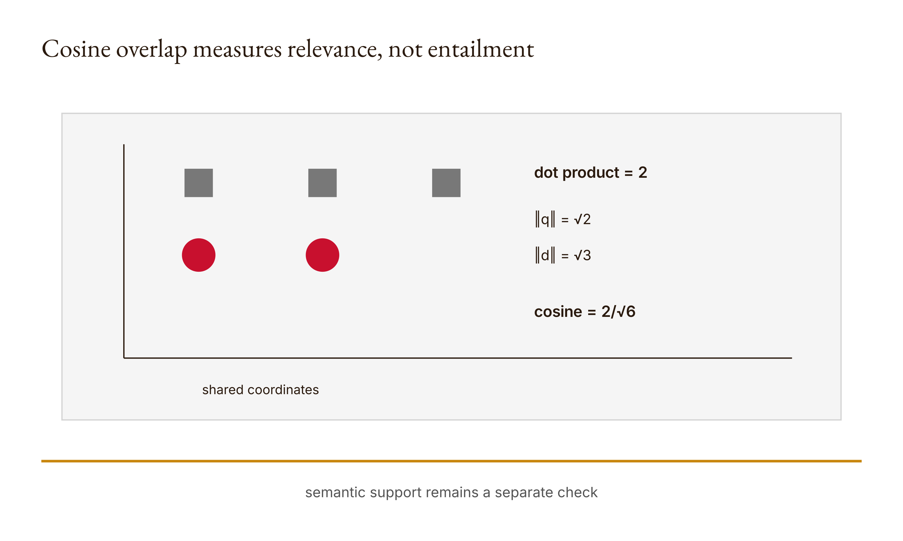

# Chapter 7 — Context retrieval and Claude Cowork
*The nearest passage may still fail to answer the question.*

Suppose a corpus contains a document saying “Office hours by appointment.” The query is “office hours.” Our small retriever ranks that document highly. The result feels satisfying because the shared words are visible. Now change the query to “tuition refund” and put the phrase “fee reimbursement” in the only relevant document. A human reader can see the relationship. The retriever returns nothing because its representation sees no shared token.

Both are constructed cases from the course's offline exercise. The research run records a cosine similarity of `2 / sqrt(6)`, approximately `0.8164965809`, between “office hours” and “office hours appointment.” It also records no result for the synonym pair and deterministic ordering for tied scores. These are results of the displayed count-vector implementation, not measurements of Claude Cowork, neural embeddings, or human semantic understanding.

This chapter takes apart the selection process before any generated answer appears. We will tokenize text, count terms, calculate a dot product and vector lengths, normalize the overlap, sort candidates, and select at most k results. Each step makes a design decision. Lowercasing discards capitalization. The regular expression defines what counts as a word. Count vectors retain repetition while discarding order. Zero-score filtering removes documents with no literal overlap. Top-k truncation hides everything below the cutoff.

The system is simple enough that we can hand-calculate one score. That matters because retrieval often becomes invisible plumbing: a model answers from whatever context reached it, and a reviewer starts by judging the answer rather than asking which evidence was omitted upstream. A plausible response can be generated from an incomplete selection. Debugging generation alone will not repair a missing source.

Chapter 6 reviewed a proposed code change against its diff and tests. Here we move earlier in the pipeline. Which source material reached the system that proposed the change or report? A clean review packet cannot recover a passage that was never in the corpus or was ranked out of the selected context. We need a source inventory and retrieval record alongside the resulting prose.

Claude Code remains the assumed course assistant. The Python retriever runs offline with the standard library and spends no direct API credits. A later Claude Cowork task can use the selected passages, but this chapter does not claim to reproduce Cowork internals. If you perform an actual interface task, preserve its sources, prompt, output, and date. If you do not, keep the task packet labeled as proposed rather than inventing a live run.

## What you will be able to do

You should be able to turn short text into a token-count vector, calculate cosine similarity by hand, predict ranking changes, and explain deterministic tie-breaking. You should also be able to distinguish no overlap from absence in the corpus, identify a claim unsupported by selected passages, and design a cautious abstention rule with a counterexample that exposes its limits.

The prerequisites are Chapters 2 and 6, Python dictionaries and counters, square roots, and basic vector arithmetic. Every symbol used below is introduced from the actual program. The paired [lesson](../lessons/07-context-retrieval-and-cowork/docs/en.md) provides the runnable sequence and existing knowledge check. Build your first version in your learner workspace before consulting the reference.

## A representation decides what can match

The [reference implementation](../lessons/07-context-retrieval-and-cowork/code/main.py) begins with a short vector function:

```python
import re
from collections import Counter

def vector(text):
    return Counter(re.findall(r"\b\w+\b", text.lower()))
```

First the text is lowercased. Then the regular expression extracts sequences of word characters bounded as words. Finally, `Counter` records how many times each extracted token occurs. “Office office hours” becomes a mapping in which office has count two and hours has count one.

Calling this mapping a vector means we can imagine one coordinate for every token in the combined vocabulary. Most coordinates are zero, so the implementation stores only tokens that appear. The coordinate ordering is conceptual; dictionary lookup lets the cosine function ask for a token's count in the other vector without constructing a long dense list.

The representation keeps frequency. It discards word order. “hours office” and “office hours” receive the same vector. It also discards the original capitalization. Those choices make exact lexical overlap easy to calculate, but they prevent the vector from representing every distinction in the text. This is not an accidental failure after retrieval. It is a consequence of the information the representation retains.

Tokenization is another decision. The regular expression's definition of a word is not a universal linguistic analysis. Punctuation can divide or surround tokens, and the behavior of `\w` follows Python's string and regular-expression rules. This chapter uses short English fixtures whose tokenization can be inspected. Do not infer performance for multilingual, code-heavy, or adversarial corpora without testing their actual inputs.

The test `vector("Hi HI")["hi"] == 2` checks both lowercasing and counting for one case. It does not prove that capitalization is always irrelevant to meaning. The function intentionally erases that distinction before scoring. If a task depends on proper nouns, acronyms, or case-sensitive identifiers, that design choice deserves review.

Representations optimize for some comparisons by making others impossible. Count vectors make shared words visible and the arithmetic transparent. They sacrifice order and synonymy. The right question is not whether the representation is intelligent. It is whether its retained features are adequate for the evidence-selection task and whether its misses are visible to the workflow.

## Cosine from first principles

Let q be the query count vector and d be a document count vector. Their dot product multiplies matching coordinates and sums those products:

$$
q \cdot d = \sum_t q_t d_t,
$$

where t ranges over tokens, q_t is the query count for token t, and d_t is the document count. Tokens absent from one side contribute zero. The dot product increases with shared counted terms, but it also grows when vectors grow, so the implementation normalizes by their lengths.

The Euclidean length of q is:

$$
\lVert q \rVert = \sqrt{\sum_t q_t^2}.
$$

Cosine similarity divides the dot product by both lengths:

$$
\operatorname{cosine}(q,d) = \frac{q \cdot d}{\lVert q \rVert\lVert d \rVert}.
$$

The [Stanford information-retrieval text](https://nlp.stanford.edu/IR-book/html/htmledition/dot-products-1.html), consulted in the approved research packet, supports this normalized dot-product formulation. Our use remains a small lexical example. The source does not transform this implementation into a complete production retrieval system.

The code follows the equations directly:

```python
import math

def cosine(left, right):
    dot = sum(value * right.get(term, 0)
              for term, value in left.items())
    norm = math.sqrt(
        sum(v*v for v in left.values()) *
        sum(v*v for v in right.values())
    )
    return dot / norm if norm else 0.0
```

Iterating over the left vector is sufficient for the dot product because any token absent there would contribute zero. Looking up the corresponding right count supplies zero when absent. The norm multiplies the two sums of squares before taking the square root, which is algebraically the same as multiplying the two nonnegative lengths.

If either vector has zero length, the denominator is zero. The function returns `0.0`. That is a design choice avoiding division by zero and treating an empty side as no similarity. It does not claim that an empty query is a meaningful information request.

Now calculate the published example. The query “office hours” has counts office one and hours one. Its squared-length sum is two, so its length is square root of two. The document “office hours appointment” has three tokens, each with count one, so its length is square root of three. The dot product is two because office and hours each contribute one.

Therefore:

$$
\frac{2}{\sqrt{2}\sqrt{3}} = \frac{2}{\sqrt{6}} \approx 0.8164965809.
$$

The saved execution records the same decimal. This agreement is useful because every intermediate term can be reconstructed. It does not prove that the document answers every question involving office hours. It proves a lexical relationship under this representation.

<!-- [FIGURE: Cajal production brief. Cosine overlap measures relevance, not entailment. Include query vector, document vector, dot = 2, lengths √2, √3, cosine 2/√6. Show the confirmed relationship that semantic support remains a separate check. Exclude unverified relationships, decorative elements, product-interface simulation, gradients, shadows, rounded corners, three-dimensional effects, and color-only meaning. The SVG and PNG are generated publication assets; retain this comment as figure provenance.] -->

*Figure 7.1 — Cosine overlap measures relevance, not entailment*

## Ranking turns scores into omissions

The retrieval function scores every declared document, removes nonpositive scores, sorts the remainder, and takes at most k rows:

```python
def retrieve(query, documents, k=2):
    if type(k) is not int or k < 1:
        raise ValueError("k must be positive")
    query_vector = vector(query)
    scores = [(key, cosine(query_vector, vector(text)))
              for key, text in documents.items()]
    return sorted(
        (row for row in scores if row[1] > 0),
        key=lambda row: (-row[1], row[0]),
    )[:k]
```

The positive-integer check defines the accepted k values. A zero or negative k is rejected instead of silently returning nothing. A Boolean is not accepted because the type check asks for exactly int. The function then calculates every score before filtering. Zero-overlap documents disappear from the returned list.

Sorting uses two keys. The negative score puts higher similarities first. The document key breaks ties in ascending order. The research fixture confirms deterministic tie behavior for equal scores. This matters for reproducibility: relying only on incidental mapping order would make equal-score selection harder to explain.

Top-k introduces an exclusion even among positive matches. With k one, only the first ranked candidate remains. A second relevant document can be omitted because another score is larger or because the tie-break key comes later. The returned list should therefore be understood as selected candidates under a particular scoring and cutoff rule, not as all available evidence.

The filtering rule introduces another omission. A semantically related document with zero literal overlap is removed before top-k selection. “Tuition refund” and “fee reimbursement” have disjoint token sets under this vectorizer, so their dot product is zero and the result is excluded. The program does not know that refund and reimbursement can be related in some contexts.

Do not report zero score as proof of irrelevance. It means no counted token overlap under this representation. The relevant source might be absent from the corpus, present but phrased differently, or present with text that the tokenizer represents poorly. Those are different failure locations and suggest different repairs.

Conversely, a high score does not prove adequacy. A document can repeat query terms while discussing a different policy, time period, or population. Lexical similarity is a candidate-selection signal. The next review must inspect the selected passage against the actual claim.

## The synonym miss and a dangerous repair

The practice lab invites a small explicit synonym map. For example, a learner might map tuition to fee and refund to reimbursement before vectorization. That can make the constructed document overlap with the rewritten query. It also changes the representation and creates new opportunities for false positives.

The word fee is not interchangeable with tuition in every sentence. Reimbursement may describe repayment for expenses unrelated to a refund policy. A global substitution can retrieve documents that share the mapped terms but answer a different question. The repair should therefore be treated as a hypothesis and evaluated on both useful matches and misleading matches.

Record the exact map and whether it applies to queries, documents, or both. If you apply it only to the query, the resulting asymmetry is a design choice. If you expand both sides, counts and vector lengths may change. Do not say you improved semantics without specifying the operation and cases examined.

A useful test set contains the intended synonym match and a case where the mapping should not imply support. For example, construct a document about a fee reimbursement for travel and a query about tuition-refund eligibility. Literal mapped overlap may rise while the policy question remains unanswered. Label this as a constructed counterexample, not evidence about a real university rule.

This illustrates a recurring design tension. More recall—returning more potentially useful material—can also return more distractors. More restrictive matching can reduce distractors while omitting paraphrases. The correct balance depends on the downstream task, corpus, and cost of missing versus reviewing candidates. This chapter does not establish one universal threshold.

An abstention rule faces the same problem. Refuse to answer when no document has positive overlap, and you avoid producing from an empty selected set in the synonym fixture. But positive overlap can still be insufficient, so the rule does not establish support. Raise the threshold, and some useful short passages may be excluded. Every threshold needs cases that challenge both sides.

## Relevance and entailment are separate checks

Retrieval asks which documents are similar enough under a rule to inspect first. Evidence review asks whether a selected passage supports a specific claim. The second question cannot be collapsed into the first merely because the score is precise to ten decimal places.

Suppose a selected passage says office hours are available by appointment. A generated answer claims they occur every Tuesday at two. The passage is relevant to office hours but does not supply the Tuesday time. The answer may contain an unsupported addition even though retrieval selected the right general topic.

The review should work claim by claim. Quote or identify the exact source passage within the permitted material, state the answer claim, and record whether the passage supports, contradicts, or does not resolve it. Do not treat a document-level citation as support for every sentence in a paragraph.

The format contract from Chapter 2 can require source identifiers. That is useful for traceability, but the identifier still needs this content comparison. The retriever can supply ranked identifiers. The generator can include them. The reviewer must still assess the relationship between claim and passage.

When the selected context is insufficient, the correct result may be an abstention or request for another source. Do not fill the gap with a plausible answer and cite the nearest passage. A task packet should specify how insufficiency is represented so the system is not pushed toward a fabricated completion.

This is also why supplying an entire corpus is not automatically superior. More text can include the missing evidence, but it can also contain contradictions, irrelevant material, and more content than a bounded task should expose. Context selection is an engineering and data-governance decision. The goal is sufficient, authorized evidence with an inspectable selection path.

Anthropic's [context-engineering article](https://www.anthropic.com/engineering/effective-context-engineering-for-ai-agents), checked during the research pass on 2026-09-06, discusses context as a designed collection of instructions, tools, data, and history. Use it to compare selection strategies, not to claim our count vectors implement Claude's context mechanisms.

## Build It: preserve the scoring path

Implement `vector`, then verify the count for repeated mixed-case text. Implement cosine and calculate the office-hours example by hand before running it. Preserve the tokens, counts, dot product, norms, and final score. A lone decimal makes the mechanism harder to audit.

Then implement retrieval with positive-score filtering and deterministic sorting. Read the [six tests](../lessons/07-context-retrieval-and-cowork/code/tests/test_main.py) before the reference. Predict the empty-vector result, identical-direction score, relevant ranking, zero-overlap exclusion, and invalid-k behavior.

Add a tie test with keys chosen so alphabetical order is visible. Add the synonym miss. Explain why each test addresses a different property. Do not describe the total as complete retrieval coverage.

If you implement a synonym map, keep it in your learner version and record the before-and-after ranking on both intended and false-positive cases. The map is data that influences the result; preserve its provenance rather than hiding it inside a preprocessing function.

Use Claude Code after your initial build to critique the representation and suggest cases. Verify every suggestion against the displayed mechanism. Claude can propose a semantic relationship, but that proposal does not become part of the lexical vector until you explicitly encode it.

## Use It: build a bounded Cowork task packet

The task packet should name the goal, permitted sources, output format, exclusions, and acceptance checks. It should also state how selected passages were obtained. A returned report without the corpus and retrieval record is difficult to audit when a claim lacks support.

Build a small corpus from material you are authorized to use. Record source identity, version or date when relevant, and inclusion criteria. Do not upload restricted material merely because the interface can accept it. The data boundary from Chapter 5 remains in force.

Run retrieval and inspect both selected and omitted candidates. For each required answer claim, identify whether sufficient evidence appears in the selected context. If not, revise the query, representation, corpus, or task scope. Do not revise the final prose alone and assume the evidence problem disappeared.

If you run the task through Claude Cowork, preserve actual interface details and output. This chapter cannot claim which internal retrieval steps the product used. Compare your explicit packet and resulting evidence table with the interface task as an observed workflow, not as proof of internal equivalence.

If the interface is unavailable, ship the offline corpus, retrieval results, and proposed packet. Mark the generation portion not run. The mechanics and evidence design remain assessable without fabricated results or direct API spending.

## Ship It: the source-grounded task packet

### Debug the pipeline in the order information moves

When a final claim is unsupported, start upstream rather than rewriting the answer repeatedly. First ask whether an appropriate source was eligible for the corpus. If it was excluded by a permission or scope decision, retrieval cannot legally repair that absence. The task may need to narrow its claim or obtain authorized evidence.

Second, inspect ingestion. A file can be eligible but absent from the actual document mapping because loading failed, a format was skipped, or the wrong directory was selected. The little reference begins with an already constructed dictionary, so it does not demonstrate ingestion. Your packet must record how source text became a document value if that step matters to the task.

Third, inspect representation. Tokenize the query and candidate. The synonym case stops here: the intended relationship is discarded because the vectors share no coordinate. A generated answer cannot recover that source through this retriever unless another route supplies it. Changing the prompt after retrieval would leave the selection failure intact.

Fourth, inspect scoring and cutoff. A document can have positive overlap and still rank below the selected k. Preserve its score rather than pretending it was never considered. If increasing k brings in the evidence, record the additional context and review burden. Do not report the larger set as automatically better.

Fifth, inspect the generator's use of selected passages. A source can appear in context while the answer ignores it, overgeneralizes it, or combines it with unsupported detail. This is the first stage at which rewriting the answer directly addresses the observed failure. Even here, source support remains a separate review question from fluent revision.

Finally, inspect the report and decision. A careful generation can be mislabeled comprehensive or verified by the surrounding summary. The claim-to-source table should constrain those verbs. Debugging ends when the stated conclusion matches the actual evidence, not when every stage has produced a green marker.

This ordering is not a claim that all production systems implement these exact modules. It is a diagnostic decomposition for the artifact you can inspect. A real interface may combine operations or keep some internals unavailable. You can still record the source boundary, visible inputs, selected context when exposed, output, and independent evidence review.

### Chunk boundaries create another representation

A corpus often divides long sources into passages. This reference treats each dictionary value as a complete document string, so it does not implement chunking. If you add chunks, acknowledge that you have introduced another selection decision before cosine ranking.

A claim and its qualification can fall in adjacent chunks. Retrieving only the claim-shaped fragment can make a passage look stronger than the original source. Conversely, a large chunk can dilute lexical overlap with unrelated terms and change its normalized score. These are hypotheses you can test on declared text, not reasons to assert that one universal chunk size is correct.

Give chunks identifiers that preserve source identity and location. A generated citation to `chunk-7` is difficult to audit if the packet does not connect it to a document and passage. Keep enough context for the human reviewer to inspect whether a qualification was cut away.

Construct a harmless example with two adjacent sentences: one states a policy, the next names an exception. Compare retrieval when they remain together and when split. State what your query selected and whether the answer still needs the omitted qualification. This experiment examines your chunk design; it is not a claim about all document systems.

Chunk overlap can reduce some boundary misses by repeating neighboring text, but it also duplicates tokens and candidates. That can influence ranking and context volume. Record the choice instead of treating overlap as free completeness. Every preprocessing improvement changes what the scorer sees.

The lesson's transparent dictionary is valuable precisely because it postpones these complications. Learn the count-vector and ranking mechanics first. Then, when you add chunking, you can identify which new behavior comes from the new layer rather than attributing every change to the model.

### Build an evidence table that can say no

A useful claim-to-source table needs more than claim and citation columns. Add the exact supporting passage or stable location, a reviewer judgment, and a note about scope or missing qualification. The judgment can distinguish supported, contradicted, insufficient, and not reviewed. These categories should be defined for your task.

Do not force every row into supported merely because the report is supposed to be complete. An insufficient row is actionable evidence. It tells the writer to narrow the sentence, retrieve more material, or abstain. If the table cannot represent a gap, it pressures the reviewer to hide one.

For the office-hours hypothetical, “appointments are mentioned” can be supported by the supplied sentence. “Appointments occur Tuesday at two” is insufficient because the time is absent. Splitting these into atomic claims makes the difference visible. A paragraph-level judgment could conceal that one part is grounded while another is invented.

The source passage itself also deserves provenance. A string entered by the learner is a constructed fixture. A passage copied from a real policy needs an authorized source, version or retrieval date where relevant, and enough location information to revisit it. Do not merge those roles in one table without labeling them.

Ask another reviewer to challenge one supported row. The goal is not to produce disagreement for its own sake. It is to see whether the passage-to-claim relation is understandable to someone who did not construct the packet. If they need missing surrounding text, that is evidence the record should improve.

Claude can perform a preliminary challenge, group claims, and locate possible passages. It should not be represented as the human who owns the final source interpretation. The human reviewer should inspect the original authorized material and decide whether the report's use fits the task and context.

This is how retrieval becomes part of an evidence system rather than a convenience hidden before generation. The score suggests where to look. The packet shows what was available and selected. The table records whether the resulting claims survive inspection. Each component has a job and a limit.

One final discipline keeps the packet honest: preserve the query that actually produced the selection. A revised query may retrieve better evidence, but its success cannot be retroactively attributed to the original run. Keep both, label the revision, and explain what changed. If a human supplied a missing synonym after seeing the failure, record that intervention instead of describing the retriever as though it discovered the relationship unaided. Provenance includes changes to questions as well as changes to sources.

Likewise, distinguish the source collection from the context finally shown to Claude. The corpus may contain twenty items, the retriever may return two, and the interface may receive only one after another filter or manual choice. A complete selection record names each narrowing. Without it, a reviewer may blame the generator for information the workflow never supplied. With it, the remedy can target the actual boundary and retain the restrictions that still serve the task.

The result is not maximal context. It is accountable context: enough authorized material to support the bounded answer, an explicit record of what was left out, and a route for saying the evidence is insufficient.

The [artifact brief](../lessons/07-context-retrieval-and-cowork/outputs/artifact-brief.md) asks for corpus provenance, retrieval results, task packet, report, and claim-to-source table. Make their relationships explicit.

The corpus inventory shows what was eligible. The retrieval record shows what the algorithm selected. The task packet shows what Claude was permitted and asked to use. The report contains the resulting claims. The evidence table connects those claims back to exact passages and records gaps.

Include at least one omitted or insufficient case. A packet containing only the passages that made the final answer look good cannot reveal the selection boundary. Explain whether a missing source was absent from the corpus, scored zero, or fell below k.

Record Claude's contribution and your own. Claude may help organize the report or challenge a claim. You own the source authorization, interpretation of what the evidence supports, and decision to narrow or abstain when it does not.

End with a bounded conclusion. State which claims were supported by which passages under the recorded corpus and which questions remain unresolved. Do not call the report comprehensive unless the source inventory and task justify that word.

## Verify and reflect

Run the demo, lesson tests, and your added cases. Recalculate one cosine score independently. Confirm the returned ordering and k cutoff. Preserve the interpreter and input corpus rather than reporting a score without its representation.

Audit one generated or proposed claim against the original source, not only the selected chunk. Chunk boundaries can omit qualifications. If the claim exceeds the passage, revise or remove it and preserve the reason.

Ask which exclusion changed your view: a source absent from the corpus, a synonym with zero overlap, a positive match below k, or a relevant passage that did not entail the claim. Naming the failure location turns generic distrust into an engineering decision.

Finally, review the words relevant and supported. Relevant should refer to a scoring or human topical judgment you can describe. Supported should refer to a claim-evidence relationship you actually inspected. Do not swap them because both sound favorable.

## Assessments — ungraded practice

These Assessments carry no points. Use the paired lesson's [knowledge check](../lessons/07-context-retrieval-and-cowork/quiz.json) and preserve predictions before viewing explanations.

### Warm-up

1. **Token counts — introductory; objective: construct a vector.** Tokenize a short mixed-case sentence by hand, predict its Counter, and compare with execution. Name one discarded feature.
2. **Dot product — introductory; objective: calculate overlap.** Compute the office-hours dot product and both norms before calculating cosine. Explain every term.
3. **Zero length — introductory; objective: trace a boundary.** Predict cosine with one empty vector and explain the implementation's returned value without calling an empty query meaningful.

### Application

4. **Ranking change — intermediate; objective: predict selection.** Add one query term present in only one document, predict the ranking, then run it. Explain how both dot product and norm can change.
5. **Tie order — intermediate; objective: test determinism.** Construct equal-score documents with distinct keys. Predict the returned order and identify the sorting components.
6. **Synonym miss — intermediate; objective: diagnose representation.** Reproduce tuition refund versus fee reimbursement. State exactly what zero means under the vectorizer.
7. **Top-k omission — intermediate; objective: inspect truncation.** Construct three positive matches with k two. Record the omitted result and explain why omission is not proof of irrelevance.

### Synthesis

8. **Claim-to-source table — advanced; objective: evaluate support.** Build a table for a short report, including one relevant passage that does not support the full claim. Revise the claim or mark it unresolved.
9. **Synonym-map tradeoff — advanced; objective: evaluate a representation change.** Add a small explicit map and test both a useful match and a misleading match. Defend whether to retain it for the bounded task.

### Challenge

10. **Abstention under pressure — stretch; objective: design a refusal rule.** Propose a rule based on retrieval evidence, then construct a positive-score case it should still refuse. State what human review remains.
11. **Corpus audit — stretch; objective: reconstruct exclusions.** Compare sources that should exist, sources ingested, and passages selected. Trace one missing answer to its actual failure location without filling the gap plausibly.

## What you can now trace

You can move from raw text to a sparse count vector and state which information was kept or discarded. You can derive cosine similarity, reproduce `2 / sqrt(6)`, and distinguish the assigned score from a judgment about the source's adequacy.

You can explain how filtering, sorting, tie-breaking, and k create a returned set. You know that a zero-overlap document may be semantically related and a high-overlap document may still be insufficient. That is not a contradiction; the score and support review have different jobs.

You can build a packet that preserves corpus provenance, retrieval decisions, generated claims, and exact evidence. This lets another reviewer diagnose whether a failure began in ingestion, representation, ranking, generation, or interpretation.

## A protocol connects capabilities

Retrieval selects information for a task. The next challenge is connecting a host to a tool that advertises and executes a capability through messages. A well-formed connection can still expose an unsafe or misleading action.

Chapter 8 builds a minimal Model Context Protocol server state machine. We will trace initialization, tool discovery, request identifiers, and error results, then separate protocol compatibility from trust and authorization.

## Anthropics

Use [Effective context engineering for AI agents](https://www.anthropic.com/engineering/effective-context-engineering-for-ai-agents), checked 2026-09-06, to compare deliberate context selection with supplying an entire corpus. Record what your selection retains and omits. Do not imply that lexical counts are neural embeddings or Claude Cowork internals.

## Computational Skepticism

The companion's data-validation chapter asks what a dataset excludes before interpreting what it appears to establish. See [Data and retrieval](../docs/computational-skepticism.md#data-and-retrieval). Apply the question to corpus, ingestion, filtering, and chunk selection.

Distinguish “not retrieved,” “not in the corpus,” and “not true.” Claude can help inventory files and propose missing-source questions. The human should determine which authorized sources define the task and whether an answer's claims follow from them. Add a missing-source finding to the packet instead of manufacturing a plausible completion.
