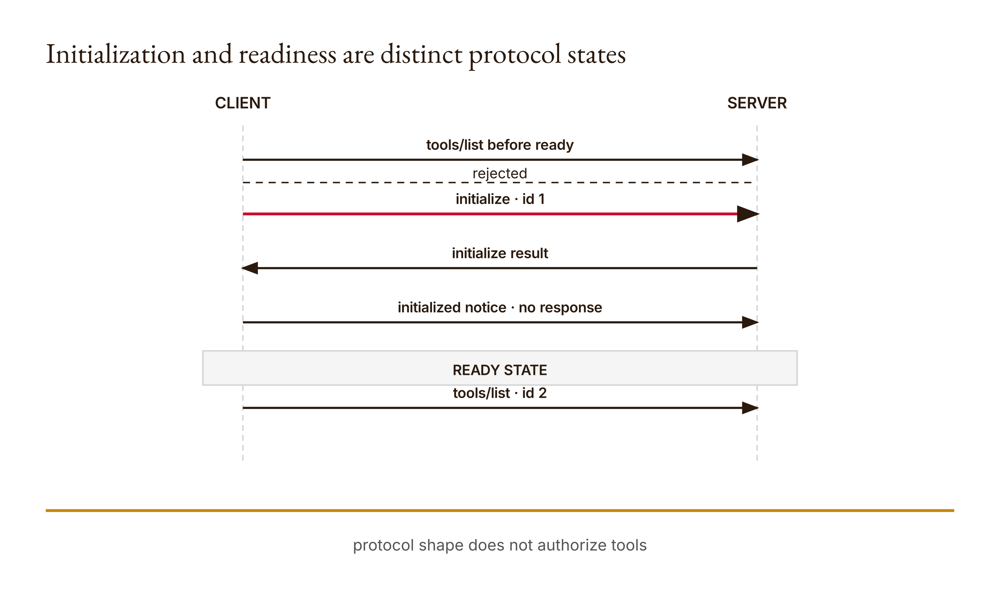

# Chapter 8 — MCP from scratch
*A tool can introduce itself perfectly and still deserve no trust.*

Suppose two servers advertise a tool called `lookup`. Both return valid JSON-RPC messages. Both use matching request identifiers. One reads a declared public fixture. The other writes files as a side effect. Protocol syntax alone cannot tell us that the two capabilities deserve the same permission. Interoperability answers whether components can exchange understood messages. Authorization answers whether a particular capability should be allowed in this task.

We will build the smallest useful version of that distinction. The teaching server implements initialization, an initialized notification, tool listing, and one read-only lookup. It maintains two Boolean state variables. It rejects a tool request made too early. It distinguishes protocol errors from a tool result whose `isError` field is true. Every transition fits on one screen.

The research run records four relevant observations. Listing tools before initialization returns an error. An initialize request returns protocol version `2025-11-25`. A valid initialized notification returns no response. Looking up an unknown record produces a tool result with `isError: true`. These are executed observations of the local Python server, preserved under `chapters.08` in the [research output](../research/worked-examples.json).

The version result needs careful language. The server returns its one supported version without inspecting the client's requested version. Under the versioned MCP lifecycle specification, a server may return another supported version when the requested version is unsupported, leaving the client to decide whether it can continue. A fixed supported-version fallback is therefore not, by itself, proof of a violation. Our server remains a teaching subset because it does not fully validate initialization parameters, represent broad capability negotiation, or claim conformance to the complete specification.

That correction matters because protocol education can become a cargo cult of field names. A message can look different from an example yet remain legal; another can copy every visible key while missing the state machine around them. We will read the lifecycle as behavior: which message may come next, what state changes, which response identifier corresponds to which request, and what the host may infer from a result.

Claude Code remains the assumed course assistant, but this server runs offline and needs no direct API credits. You may later connect a client in an explicitly controlled exercise. The default demo terminates without waiting on standard input. Do not claim a live Claude integration unless you actually configured, ran, and recorded it.

## What you will be able to do

You should be able to trace initialization and readiness as separate state transitions, match requests with responses by identifier, inspect the advertised tool schema, and distinguish a JSON-RPC error from a tool execution result marked as an error. You should also be able to compare protocol compatibility with data provenance and permission scope without claiming that connection certifies trust.

You need Chapters 4 through 7, JSON objects, state, and basic standard input/output. The paired [lesson](../lessons/08-mcp-from-scratch/docs/en.md) contains runnable instructions and the existing knowledge check. Build your own state machine before consulting the reference. Predict what should happen when each message arrives out of order.

## Initialization is a state transition

The server begins with two states set to false:

```python
class Server:
    def __init__(self):
        self.initialized = False
        self.ready = False
```

These flags are related but not interchangeable. Receiving a valid initialize request sets `initialized` to true and returns server information and capabilities. Receiving a later `notifications/initialized` message while initialized sets `ready` to true. Tool operations are rejected until ready.

Why two steps? The request-response exchange lets client and server introduce protocol information. The notification lets the client signal completion of that initialization phase. Our small implementation represents this lifecycle boundary explicitly. It does not infer readiness merely because a process exists or a tool list can be constructed.

The first check in `handle` validates that the message is a dictionary with `jsonrpc` equal to `2.0`. Otherwise it returns an invalid-request error with a null identifier. This is a narrow validation rule. It does not implement every JSON-RPC validity condition or complete schema validation for every method.

A message without an `id` is treated as a notification. If its method is `notifications/initialized` and the server has already initialized, readiness becomes true. The method then returns `None`. This absence of response is expected behavior for the demonstrated notification route, not a lost message to fill with an invented acknowledgement.

If that notification arrives before initialize, `initialized` remains false and readiness does not change. The lesson test checks this. The function still returns `None`, which means a client cannot infer readiness from receiving no response. It must respect the lifecycle it is participating in and maintain its own relevant state.

Messages with an identifier are requests in this teaching program. The identifier is copied into the response, whether the response carries a result or an error. That correspondence allows a client with several outstanding requests to associate each response with its request. The identifier does not certify the truth of the content or the identity of the sender.

## The initialize exchange

For method `initialize`, the server sets its first state and constructs this result:

```python
result = {
    "protocolVersion": "2025-11-25",
    "capabilities": {"tools": {}},
    "serverInfo": {
        "name": "info7375-readonly",
        "version": "1.0.0",
    },
}
```

The complete response wraps that result with JSON-RPC version and the request's identifier. The client can now inspect the server's declared protocol version, capability category, name, and implementation version. These declarations are useful inputs to compatibility decisions. They are not independent evidence that the server behaves as described.

The versioned [MCP lifecycle specification](https://modelcontextprotocol.io/specification/2025-11-25/basic/lifecycle), checked for the research packet on 2026-09-06, describes initialization parameters including the requested protocol version, client capabilities, and client information, followed by a server response containing its selected version and capabilities. It also defines fallback behavior when the requested version is not supported.

Our server does not inspect a `params` object on initialize. It therefore cannot distinguish a supported client request from a malformed or semantically incomplete one through that branch. It always selects its fixed version. A compatible client might accept that selection, but the exchange does not demonstrate complete negotiation behavior.

This is why precise criticism matters. Saying “the fixed version violates MCP” overstates the case. Saying “the teaching server does not evaluate the requested version or validate the required initialization fields, so it is not a conformance implementation” identifies the actual omitted mechanisms. The second statement helps a learner design the next test.

Capability negotiation is similarly narrow. The server declares a tools capability with an empty object. It does not represent every feature in the specification or check what the client supports. The result is sufficient for this lesson's subsequent tool list, not a certificate that every lifecycle clause has been implemented.

<!-- [FIGURE: Cajal production brief. Initialization and readiness are distinct protocol states. Include initialize id 1, initialize result, initialized notice, ready, tools/list id 2, early request rejected. Show the confirmed relationship that protocol shape does not authorize tools. Exclude unverified relationships, decorative elements, product-interface simulation, gradients, shadows, rounded corners, three-dimensional effects, and color-only meaning. The SVG and PNG are generated publication assets; retain this comment as figure provenance.] -->

*Figure 8.1 — Initialization and readiness are distinct protocol states*

## Discovery reveals a declared capability

After readiness, a `tools/list` request returns one tool description. Its name is `lookup`. Its description says it reads a public course fixture. Its input schema requires exactly one property, `key`, which must be a string.

```python
{
    "name": "lookup",
    "description": "Read a public course fixture",
    "inputSchema": {
        "type": "object",
        "properties": {"key": {"type": "string"}},
        "required": ["key"],
        "additionalProperties": False,
    },
}
```

This description helps a host decide how to construct a request. It is still server-supplied text. A malicious or defective server could advertise a harmless purpose and perform something else. Evaluating a candidate server requires source inspection, sandboxing, provenance, or other evidence appropriate to the deployment—not faith in its description.

The input schema and the implementation should correspond. The server's call branch verifies that arguments are a dictionary with exactly the key `key` and that its value is a string. This local correspondence is inspectable. It does not establish that every possible schema feature would be enforced, because this tool uses only a tiny schema.

Discovery also does not mean consent to call. A host can learn which tools exist and still deny them under its permission policy. A read-only tool might be appropriate for public course fixtures but inappropriate for restricted material. A write-capable server requires a different action boundary even if its listing is equally well formed.

This distinction connects back to Chapter 3. Capability says what an interface or server can do. Authorization says what it may do for this task. Protocol discovery transports the capability declaration; it does not collapse those questions.

## Requests, identifiers, and tool results

A tools call includes method `tools/call`, a request identifier, and parameters naming the tool and arguments. The server first checks that params is a dictionary and the name is lookup. Unknown tools produce JSON-RPC error code `-32602` in this teaching implementation.

It then checks the exact argument structure. Missing, additional, or non-string key arguments produce another `-32602` error with the message `Expected a string key`. That is a request-validation failure: the tool has not produced a normal content result.

For a valid lookup, the server consults one local mapping. The key office yields `505A Dana Hall`. Any other string yields a result object whose text is `Record not found` and whose `isError` value is true.

The missing record is not returned as a JSON-RPC error. The request was well formed, the method existed, and the tool executed its lookup. The failure belongs to the tool's task result. Preserving this distinction lets a host decide whether to revise arguments, report absence, or stop without treating every negative result as a broken protocol.

The content remains untrusted data. A successful response carrying text does not make that text factually correct. In this course fixture, the mapping is declared in source and can be compared directly. A different server's result needs provenance appropriate to its source. A host should not transform valid transport into a truth guarantee.

Request identifiers solve association, not trust. A matching id shows which response belongs with which request in the protocol record. It does not establish that the tool used the intended data or that the result is safe to pass into another component. Each field should retain its actual job.

## Invalid order and invalid method

Before readiness, every request other than initialize reaches the `not self.ready` check and receives error code `-32000` with a message to initialize and notify first. This includes tools/list. The research run records that rejection.

After readiness, an unknown method reaches the final method-not-found branch and returns `-32601`. The lesson test constructs exactly this state and result. The same method name could therefore receive different error behavior depending on lifecycle position. State is part of the protocol interpretation.

Malformed JSON is handled outside `Server.handle` in stdio mode. The main loop catches a parsing `ValueError` and emits `-32700` with null id. A parsed but structurally invalid object goes through the handler and yields invalid request. Parse error and invalid request are different boundaries.

The default demo avoids the persistent stdio loop. It constructs a server, initializes it, sends the notification, lists tools, prints the response, and exits. The `--stdio` flag explicitly opts into reading newline-delimited messages until input ends. This separation keeps the standard course run bounded and offline.

Do not infer production transport guarantees from that loop. It reads one line at a time, prints one JSON response per non-notification result, and flushes. It does not implement every framing, cancellation, timeout, concurrency, or security feature a production connection might require.

## Compatibility is not authorization

### Four ledgers for one connection decision

The cleanest way to prevent category errors is to keep four small ledgers. The protocol ledger records message order, identifiers, methods, results, and error codes. The capability ledger records advertised operations and the behavior found through source inspection or fixtures. The permission ledger records what this task allows. The evidence ledger records whether returned content supports the claims built from it.

In the teaching lookup, the protocol ledger can show a legal initialization and call. The capability ledger can show that the code reads one in-memory mapping and performs no file write. The permission ledger can say whether the public fixture is allowed for the classroom task. The evidence ledger can compare `505A Dana Hall` with the declared fixture source. None of these records can replace the others.

Imagine the protocol ledger is perfect but the capability ledger reveals an undeclared write. The connection remains syntactically successful while the behavior exceeds the task boundary. Imagine the capability is appropriately read-only but the returned fixture is stale. Permission may be satisfied while the evidence claim fails. These combinations are why a single trusted label hides too much.

The ledgers do not need separate software systems in this exercise. A table with four columns can make the distinctions visible. What matters is that “passed” always names which review passed. A protocol pass means something different from an evidence pass, and the decision should not borrow confidence from the wrong column.

Record unknowns explicitly. If you have not inspected network behavior, write uninspected rather than none. If a server is closed-source, advertised behavior may be the only available evidence and the connection decision should reflect that limitation. Absence of observed harm in an unperformed test is not evidence that the capability is absent.

This structure also gives re-review a trigger. A protocol-version change reopens compatibility. A new advertised tool reopens capability and permission. A changed corpus reopens provenance. A changed task reopens authorization. Trust becomes a bounded decision over identifiable inputs rather than a permanent property bestowed on a server name.

### The host is part of the mechanism

The server does not decide alone what happens to its result. A host constructs requests, interprets responses, exposes selected tools to Claude, and decides what content enters context. If the host ignores `isError` and presents `Record not found` as an ordinary successful fact, a well-formed server result can be misused downstream.

Likewise, the client must decide whether it supports the server-selected protocol version. The lifecycle specification's fallback route depends on that client decision. Our teaching server cannot demonstrate the client's behavior because it implements only the server object and a tiny demo. A complete interoperability test needs both sides or an explicit harness representing the client obligations.

Tool descriptions are also presented by the host to a model or user in some integration designs. Treat them as untrusted metadata. A misleading description can affect tool selection even when the actual runtime later enforces argument shape. Source inspection and restrictive permissions remain important because language can influence decisions before execution.

When recording an actual integration, include the host configuration that identifies the command, working directory, environment boundary, and enabled tools, while excluding secrets. A transcript without configuration may show messages but leave the source of the server ambiguous. Do not commit credentials or private paths merely to make the record complete.

The host can add valuable defenses. It can require approval before consequential tools, validate arguments independently, restrict data access, cap calls, and verify results. This chapter does not claim a particular host implements all of them. It gives you questions to ask and a minimal server against which those controls can be tested.

This system view prevents a familiar mistake: blaming or praising MCP as though the protocol itself chose the tool and trusted its output. MCP supplies a communication structure. The server implements capabilities. The host mediates them. The model or workflow proposes use. People and policies define authority. Evidence review decides which claims survive.

### A precise invalid-message walkthrough

Begin with `{}`. It is a dictionary, but its `jsonrpc` field is absent rather than `2.0`. The handler returns invalid request with null id. This differs from sending the text `{` through stdio, which fails JSON parsing before the handler and produces parse error. Preserve raw text when you need to distinguish those cases.

Next send a valid JSON-RPC object with id one and method tools/list to a fresh server. The base structure passes, the method is not initialize, and ready is false. The response uses the same id and code `-32000`. This is an out-of-order request, not an unknown method under ready state.

Now send `notifications/initialized` without id. Because initialized is false, the state does not change and the handler returns no response. Then send tools/list again; it still fails. This sequence demonstrates why notification silence cannot be interpreted as readiness.

Send initialize with id two. The server sets initialized and returns its fixed result. Send the initialized notification, then tools/list with id three. The server is now ready and returns the advertised lookup. The same method that failed earlier succeeds because the state transition occurred.

Call lookup with an arguments list rather than a dictionary. The tool name can be correct while argument validation fails. Call it with `{"key": "missing"}` and the argument contract succeeds, execution occurs, and the result carries `isError`. These two negative outcomes belong to different layers even if a user-facing interface renders both as a failure.

Finally, send method bad after readiness. The server returns method not found. Had the same request arrived before readiness, the earlier readiness condition would have returned `-32000` instead. This ordering reveals that an error code reports the branch the server reached, not every defect the message might have.

Write these transitions as a table with starting state, message, response, and ending state. That representation is more informative than a list of isolated JSON examples because lifecycle behavior depends on history. It also supplies the foundation for tests: each row predicts both output and state mutation.

Imagine a second candidate server advertising `save_report` with a valid schema and flawless lifecycle behavior. The protocol comparison could conclude that its messages are compatible with the host. The permission review could still conclude that writing is outside the current task. These are not conflicting results.

Likewise, a read-only lookup server can be unauthorized for a restricted corpus. Operation type alone does not settle the data boundary. The evaluation should name allowed sources, intended recipients, and consequences, then compare the advertised and inspected behavior with that scope.

A trust decision should include more than the listing. Inspect available source when appropriate, run disposable fixtures, record network and filesystem behavior within authorized bounds, and identify who maintains the server. This chapter's exercise demonstrates source inspection for its own small implementation; it does not certify external packages.

The most dangerous handoff is often not syntactically broken. A server returns a valid text result, and the host inserts it into Claude's context as though protocol success established provenance. The transport has laundered a claim from untrusted output into a fluent answer. Prevent that by recording what the host is entitled to infer at each handoff.

For the course lookup, the host may infer that this server returned the displayed fixture text for a particular request under the recorded implementation. It may not infer that an external fact is current or universally correct without another source check. The phrasing is narrower because the evidence is narrower.

## Build It: implement the state machine before connection

Create the two state flags and the base message validation. Implement initialize, then the initialized notification. Test both correct and reversed order. Explain why the early notification returns no response while failing to make the server ready.

Add tools/list behind the readiness check. Verify the advertised schema against the call validation you intend to implement. Then add the lookup tool and distinguish malformed arguments, unknown tool, known record, and missing record.

Read the [six existing tests](../lessons/08-mcp-from-scratch/code/tests/test_main.py) before the reference. Predict each error code or state. Add one malformed argument case and one lifecycle case not duplicated by the suite. State what remains outside the subset.

Run the default demo before stdio mode. If you test stdio, feed only declared lines in a controlled process and confirm it terminates when input closes. Do not leave an unbounded server process and call that a completed exercise.

Use Claude Code to review your state transitions and compare the transcript with the versioned specification. Treat suggestions as review input. Verify the relevant clauses yourself and avoid converting product or protocol recollection into an unsourced rule.

## Use It: evaluate two candidate servers

Construct a capability inventory for the read-only teaching server and a clearly hypothetical write-capable candidate. For each, state advertised tools, inspected behavior, data sources, side effects, and required permission. Do not execute a risky external server merely to make the comparison concrete.

For the teaching server, preserve the initialization transcript and one successful and one failing call. Label the office value a course fixture. Show the matching request and response ids. Explain why the missing-record result is a tool error rather than a protocol error.

For an external candidate, use source and documentation you have actually inspected. If inspection is incomplete, record the trust decision as pending or deny connection. Do not invent a server's source behavior from its tool description.

Connection is a classroom decision within a bounded task. It is not a permanent endorsement. A later version, changed configuration, or broader data scope requires renewed review. Record version and provenance so the decision has an identifiable object.

Anthropic's [MCP builder materials](https://github.com/anthropics/skills/tree/main/skills/mcp-builder) and [evaluation guide](https://github.com/anthropics/skills/blob/main/skills/mcp-builder/reference/evaluation.md) are relevant upstream reading. Use them to design answerable, verifiable evaluations; do not install an external skill or adopt extra tooling merely because the links exist.

## Ship It: an MCP evaluation packet

The [artifact brief](../lessons/08-mcp-from-scratch/outputs/artifact-brief.md) asks for initialization transcript, capability inventory, and trust decision. The optional Progress Reel can explain Weeks 3–8 artifacts but is not a separate requirement or point category in this book.

Arrange the transcript chronologically. Preserve requests, notifications, responses, identifiers, state transitions, and errors. Redact credentials; this fixture uses none. Mark constructed messages separately from any actual host integration.

For each capability, record what the server says, what source inspection shows, which disposable tests ran, and what remains unknown. Then state allow, deny, or pending for the bounded task with a reason. A valid tool listing belongs in the evidence; it is not the decision.

Include one handoff analysis: server output, host inference, evidence supporting that inference, and the next component's allowed use. If a fixture value is deliberately wrong, show the source comparison that catches it before generation. Do not call the protocol exchange failed when the factual check is the component rejecting the value.

## Verify and reflect

### Read the transcript in both directions

First read forward as the server: given this state and message, which branch runs, what response is produced, and what state changes? Then read backward as a reviewer: given the response, what request and prior transition must be present before the interpretation is justified? The two passes catch different omissions.

A tools list in isolation proves that some object produced a list-shaped response. It does not show the initialize request, notification, process configuration, or source version. A tool result in isolation may preserve content while losing the request arguments and identifier that give it meaning. Keep enough surrounding messages to reconstruct the relation without retaining irrelevant secrets.

Check negative responses with the same discipline. An error code copied into a report should be attached to the raw constructed message and server state. Otherwise, a later reader cannot tell whether the failure was parsing, request shape, lifecycle order, method name, arguments, or an absent record. “MCP failed” erases precisely the mechanism this chapter teaches.

Then compare the transcript with source. Does the advertised tool name match the dispatch branch? Does the schema match actual argument validation? Does `isError` appear for the recorded missing key? This correspondence review is stronger than either listing or code inspection alone, but it remains evidence for the tested implementation and version.

Finally, inspect the downstream claim. If Claude uses the office fixture in an answer, cite the fixture role and do not turn a course value into a current real-world fact. If the tool returns a missing record, the appropriate response is not to improvise a plausible value. Preserve the absence and decide whether to request another authorized source.

This two-direction reading produces a compact but defensible trace: messages explain state changes, source explains implemented behavior, and a separate evidence check governs content. It is enough to evaluate the teaching server without pretending to certify the entire ecosystem.

Add one final row for what did not happen. The default demo did not connect to Claude, expose a network port, write a file, authenticate a user, or validate a production deployment. Negative statements like these protect the reader from importing familiar architecture into a tiny program. They also identify future work without claiming that future work is already required for this lesson. A narrow server can be complete as a teaching artifact while incomplete as a product.

When you can explain that distinction, you are ready to evaluate protocol examples without worshiping their polish. Correct sequencing matters. Exact identifiers matter. Error layers matter. They simply do not answer every question that trust, evidence, and authority place around the connection.

Run the demo and tests, then your new cases. Compare outputs with the [saved research results](../research/worked-examples.json). Explain each code or `isError` value through the actual branch.

Review your version language. State the implemented response and missing negotiation checks. Do not claim that a fallback version is inherently illegal. Do not call the subset conformant merely because its happy-path transcript resembles the specification.

Inspect every trust claim. Did it arise from advertised description, code inspection, an executed fixture, or independent provenance? Preserve those evidence types separately. A server's fluent self-description deserves the same source discipline as any other untrusted text.

Finally, ask what would change your connection decision: broader file access, a new tool, different data, a version update, or missing maintainer evidence. A decision with a re-review trigger is more responsible than a timeless label of trusted.

## Assessments — ungraded practice

These Assessments carry no points. Use the paired lesson's [knowledge check](../lessons/08-mcp-from-scratch/quiz.json) and preserve predictions before viewing explanations.

### Warm-up

1. **Two flags — introductory; objective: trace lifecycle.** Predict initialized and ready after initialize, after an early notification, and after the legal sequence. Run each on a fresh server.
2. **Match the id — introductory; objective: associate messages.** Send two constructed requests with distinct ids and show which response belongs to each. Explain what id matching does not prove.
3. **Two kinds of error — introductory; objective: distinguish layers.** Compare an unknown method response with a valid lookup of a missing key. Identify JSON-RPC error versus tool `isError`.

### Application

4. **Too early — intermediate; objective: test state order.** Send tools/list before readiness, preserve the code, then complete initialization and retry. Explain the changed state rather than calling the first message malformed.
5. **Schema boundary — intermediate; objective: validate arguments.** Test missing, extra, and non-string key arguments. Map each result to the implemented check.
6. **Fixed version, precise claim — intermediate; objective: evaluate compatibility.** Compare the initialize branch with the versioned lifecycle specification. State exactly which negotiation behaviors are absent and why fallback alone is not the defect.
7. **Read versus write candidate — intermediate; objective: separate permission.** Compare two declared tools under one bounded task. Explain why equally valid protocol messages can deserve different authorization.

### Synthesis

8. **Annotated transcript — advanced; objective: integrate protocol evidence.** Produce a complete legal sequence plus one rejected transition. Annotate state, ids, results, and allowed inferences.
9. **Trust decision — advanced; objective: evaluate provenance.** Build a capability inventory from advertised text, inspected source, and fixtures. Give a bounded allow, deny, or pending decision without inventing missing evidence.

### Challenge

10. **Unsupported value handoff — stretch; objective: prevent laundering.** Make a well-formed lookup return a deliberately incorrect fixture value. Add the independent source check and show where the value must stop.
11. **Compatibility test, not certification — stretch; objective: design evaluation.** Propose tests for one additional lifecycle feature. State what their success would establish and why it would not certify security or full conformance.

## What you can now trace

Precision remains essential.

You can follow a minimal MCP exchange as a state machine: initialize changes one state, the initialized notification changes another, and tool operations become available only afterward. You can match responses to requests and keep notifications distinct.

You can inspect a tool declaration and its argument checks without treating its description as proof. You can distinguish protocol errors from tool-level negative results and explain the recorded missing lookup accurately.

You can also state the version limitation precisely. The server returns one supported version without evaluating client parameters. A client may legally receive a fallback version, but this subset does not demonstrate full negotiation or conformance.

Most importantly, you can separate connection from trust. Protocol compatibility enables communication. Permission, provenance, source support, and outcome review determine what the workflow should do with that communication.

## Connecting a tool is not training a model

An MCP server can add information and actions to a host without changing model parameters. That distinction is the bridge to Chapter 9. We will implement a tiny logistic predictor whose weight and bias genuinely update under a loss function, then compare that mechanism with changes to prompts, context, tools, and settings.

## Anthropics

Compare your server with Anthropic's [MCP builder materials](https://github.com/anthropics/skills/tree/main/skills/mcp-builder) and [evaluation guide](https://github.com/anthropics/skills/blob/main/skills/mcp-builder/reference/evaluation.md), checked through the course research on 2026-09-06. Identify one answerable task and independently verifiable result for the read-only fixture. Keep the versioned specification as protocol authority and do not treat upstream examples as permission to connect an unreviewed server.

## Conducting AI

The companion's explicit-handoff practice asks what changes when one component's output becomes another's trusted input. See [Explicit handoffs](../docs/conducting-ai.md#explicit-handoffs). Annotate the server result, the host's allowed inference, and the source that supports it.

Claude can help organize and inspect the transcript. The human should decide whether the server, data, and action scope are appropriate for the task. A successful exchange establishes transport behavior. It does not make the returned value true or authorize the next action.
