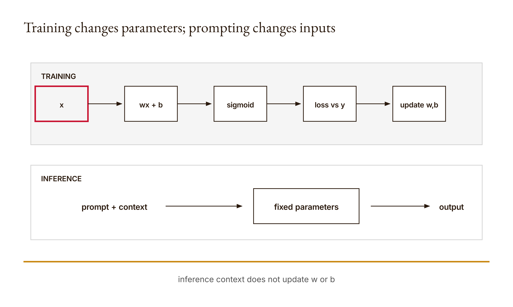

# Chapter 9 — Training mechanics and Claude configuration
*Changing what the model sees is not changing what the model is.*

Suppose you upload documents, revise a system prompt, and get a better answer. It is tempting to say you trained Claude. Something did change: the input available during that interaction. But the word training names a different mechanism. Training changes parameters through an objective and an update rule. Prompting and retrieval change the information supplied to an already configured model for inference.

This chapter builds an actual parameter update in the smallest system that can expose every moving part. We use a one-feature binary logistic classifier with two learned parameters: a weight and a bias. Four constructed examples define the training data. A sigmoid turns each linear score into a probability. A binary logistic loss measures disagreement with labels. Gradient descent updates the parameters.

The research execution gives us exact evidence. Starting from weight and bias zero, one update at learning rate `0.2` changes the weight to `0.15` while the bias remains zero. Average loss falls from `0.6931471806` to `0.5876561461`. A finite-difference calculation at the origin gives a weight gradient approximately `-0.75`, agreeing with the analytic update. After 200 steps the weight is approximately `3.1669517461`, the bias is effectively zero, and training loss is `0.0215209850`.

The research also evaluates four separately specified toy points and classifies all four correctly under a threshold of one-half. That result is not a real-world generalization estimate. The data are tiny, constructed, and separable by sign. The held-out points follow the same simple pattern we designed. Their purpose is to teach the difference between training measurements and evaluation on separately listed inputs, not to establish deployment performance.

Nothing in this exercise modifies Claude's weights. Nothing exposes Claude's logits, optimizer, or training data. The classifier is not a miniature language model in every relevant sense. It is a transparent mechanism for learning two parameters so you can distinguish parameter change from prompt, context, tool, or permission change without relying on metaphor.

## What you will be able to do

You should be able to calculate a sigmoid prediction, explain the stable loss expression, derive and check one gradient update, and evaluate a trained classifier on separate points. You should also be able to classify proposed system changes by the object they modify and reject the claim that lower training loss alone proves held-out or real-world success.

You need Chapters 1, 2, 7, and 8, algebra, averages, exponentials, and introductory derivatives as explained here. The paired [lesson](../lessons/09-training-and-configuration/docs/en.md) provides runnable instructions and the existing knowledge check. The program is offline Python. Claude Code can help inspect your calculation through your existing account; direct API credits are not required.

Before reading the reference, predict the initial probability for every point when both parameters are zero. Then predict the direction of the weight update from the labels and feature signs. Write those predictions down. A model that returns plausible decimals is not a substitute for knowing which direction should reduce this constructed loss.

## A tiny predictor with parameters you can see

For an input feature x, weight w, and bias b, the classifier first computes a linear score:

```math
a = wx + b.
```

It then maps that score through the sigmoid:

```math
\sigma(a) = \frac{1}{1 + e^{-a}}.
```

The returned value lies between zero and one for finite a. We interpret it as the classifier's probability for label one under this model. The threshold rule used in the research evaluation predicts one when the value is at least one-half and zero otherwise.

At `w = 0` and `b = 0`, every score is zero regardless of x. Since `e^0 = 1`, sigmoid zero is one-half. This is the initial prediction for all four training points. The model has not yet encoded a relationship between feature sign and label.

The [reference implementation](../lessons/09-training-and-configuration/code/main.py) computes sigmoid in two branches:

```python
def sigmoid(x):
    if x >= 0:
        return 1 / (1 + math.exp(-x))
    e = math.exp(x)
    return e / (1 + e)
```

The negative branch rewrites the same mathematical quantity to avoid directly evaluating an unnecessarily large positive exponential when x is very negative. The lesson test checks that sigmoid of negative one thousand is approximately zero without overflow. This is evidence for the demonstrated numeric behavior, not a promise about arbitrary types or all floating-point edge cases.

The model has only one feature. A positive learned weight makes positive x values produce positive scores and probabilities above one-half; negative x values produce negative scores and probabilities below one-half when bias remains near zero. That geometry matches our constructed labels. The parameter does not learn a word meaning or causal relationship. It fits the relationship represented in the supplied pairs.

The source used during research, Jurafsky and Martin's logistic-regression chapter draft, supports the weighted-input and sigmoid mechanism. Our numerical results come from the local implementation and independent calculation. Keep conceptual source and execution evidence distinguishable.

<!-- [FIGURE: Cajal production brief. Training changes parameters; prompting changes inputs. Include x, wx+b, sigmoid, loss versus y, gradient update, prompt/context. Show the confirmed relationship that inference context does not update w or b. Exclude unverified relationships, decorative elements, product-interface simulation, gradients, shadows, rounded corners, three-dimensional effects, and color-only meaning. The SVG and PNG are generated publication assets; retain this comment as figure provenance.] -->

*Figure 9.1 — Training changes parameters; prompting changes inputs*

## Loss makes the objective explicit

Each training example is a pair `(x, y)` with finite feature x and binary label y. The ordinary binary cross-entropy for predicted probability p is:

```math
-y\log(p) - (1-y)\log(1-p).
```

The reference evaluates an equivalent stable expression from the score a:

```math
\max(a,0) - ya + \log(1 + e^{-|a|}).
```

It averages this value across the data. The stable form avoids computing logarithms of probabilities rounded too close to zero or one for large scores. We do not need to treat the implementation as magical; it is a numerically safer route to the same logistic objective for the accepted finite inputs.

At the origin every prediction is one-half. The loss for either binary label is negative log one-half, which is approximately `0.6931471806`. Because all four examples share that prediction, the average has the same value. This matches the research execution.

Loss is an objective chosen for this training mechanism. Lower value means better fit under that objective on the data being evaluated. It does not automatically mean better factuality, fairness, causal usefulness, or human value. Those properties would need their own definitions and evidence.

The training function records a list called history, but it appends only the initial loss and the final loss. It does not preserve every iteration. A report showing two values should not call them a complete learning curve. If you want per-step history in your learner version, change the code and document the additional behavior.

The loss function assumes nonempty data because training validates that condition before calling it. Invoking loss directly on an empty list would encounter division by zero; its standalone interface does not duplicate training's checks. Follow the actual call boundary when describing guarantees.

## Derive the first update

The training data are:

```python
[(-2, 0), (-1, 0), (1, 1), (2, 1)]
```

For logistic loss, the derivative with respect to the score for one example is prediction minus label. Call that error e. Since the score is `wx+b`, the contribution to the weight gradient is `e*x`, and the contribution to the bias gradient is e.

At the origin, every prediction is `0.5`. The four errors are therefore `0.5`, `0.5`, `-0.5`, and `-0.5`. Multiply by the corresponding x values:

| x | y | prediction | error p-y | weight contribution (p-y)x |
| ---: | ---: | ---: | ---: | ---: |
| -2 | 0 | 0.5 | 0.5 | -1.0 |
| -1 | 0 | 0.5 | 0.5 | -0.5 |
| 1 | 1 | 0.5 | -0.5 | -0.5 |
| 2 | 1 | 0.5 | -0.5 | -1.0 |

The contributions sum to negative three. Divide by four examples and the average weight gradient is `-0.75`. The errors themselves sum to zero, so the average bias gradient is zero.

Gradient descent subtracts learning rate times gradient. With rate `0.2`:

```math
w_{new} = 0 - 0.2(-0.75) = 0.15,
```

and the bias remains zero. This matches the executed result. The sign makes sense before the decimal does: increasing a positive weight pushes positive examples toward label one and negative examples toward label zero.

The research script also computes a central finite-difference approximation of the weight gradient at zero. It evaluates loss at a small positive and negative perturbation and divides their difference by twice the perturbation. The result is approximately `-0.74999999999`. Agreement within the selected numeric tolerance provides an independent check on the analytic expression for this point.

The finite difference is not independent experimental evidence about the world. It is a second computational route to the derivative. That distinction matters. Independent method can mean independent calculation without meaning independent dataset, reviewer, or causal source.

## The bounded training loop

The training function validates the data, step count, and rate. Labels must be zero or one, features finite, steps a positive integer, and rate positive and finite. It initializes both parameters to zero and records initial loss.

Each step builds errors from the current parameters, averages the gradient contributions, and updates weight and bias. After the requested number of steps, it appends final loss and returns parameters plus the two-value loss list.

```python
for _ in range(steps):
    errors = [(sigmoid(w*x+b)-y, x) for x, y in data]
    w -= rate * sum(e*x for e, x in errors) / len(data)
    b -= rate * sum(e for e, _ in errors) / len(data)
```

This is batch gradient descent on the complete declared dataset. It does not shuffle examples, use minibatches, or adapt the learning rate. Those absences make the calculation easier to trace. They also limit any analogy to large-scale training systems.

After 200 steps, the positive weight strongly separates the sign-pattern data. The final loss is lower than the initial loss, and the existing tests check that relation and the positive direction of the weight. Passing those tests does not prove the optimizer would behave well under every dataset or rate.

Reverse the labels and the preferred weight direction should reverse. That practice case checks whether you understand the relationship rather than memorized the published positive number. Duplicate evaluation points into training and you contaminate the separation between fit and held-out assessment. Apparent improvement on those points becomes harder to interpret because the optimizer has already used them.

## Held-out means separately specified, not magically representative

The reference demo returns training parameters and initial/final training loss. It does not evaluate a held-out set. The chapter's research adds four points explicitly:

```python
held_out = [(-3, 0), (-0.5, 0), (0.5, 1), (3, 1)]
```

With the learned parameters, their predicted probabilities are approximately `0.00007478`, `0.17030378`, `0.82969622`, and `0.99992522`. Thresholding at one-half predicts all four labels correctly.

These points were not passed into the training function. That gives them a separate procedural role. It does not make them representative of a natural population. We designed them around the same sign boundary as the training examples. Four correct labels establish behavior on these four constructed points under the stated threshold.

A responsible report includes both the result and this limitation. “The model generalized” is too broad. “The trained parameters classified four separately specified sign-pattern fixtures correctly” matches the evidence. If you want a broader performance claim, you need a justified sampling process, task definition, and larger evaluation.

Lower training loss alone cannot supply that evidence. A model can fit training examples while failing on new cases. Our held-out evaluation adds information because it applies the learned parameters to inputs not used in the update, but its design remains simple and favorable.

Do not tune repeatedly against these four points and keep calling them untouched held-out evidence. Once they guide parameter or design choices, record their role as development data and create an appropriately independent evaluation if the claim requires one.

## Training, prompts, context, tools, and settings

### Follow the mutable object

When someone says a system learned, ask which stored object changed and through what procedure. In the toy classifier the answer is explicit: floating-point values w and b are updated by averaged gradients over labeled pairs. Save those values, and later predictions can use the learned boundary without replaying the prompt that described the task.

A system prompt is different. Its text becomes part of the input conditions for a model interaction. Revising it can produce a dramatic behavioral change while leaving the model's stored parameters untouched. The prompt may persist in a repository or configuration file, but persistence of an instruction is not persistence of a learned weight. The mutable object is the instruction text.

Few-shot examples are also input. They demonstrate patterns inside the current context. They can influence how an answer is produced, but our course experiment does not run an optimizer over Claude's parameters. If you change an example and observe a different answer, the evidence supports prompt-context sensitivity under the recorded interaction, not a claim that Claude was retrained.

Retrieval changes which source passages enter context. The retriever itself may have configuration or a learned representation in other systems, but Chapter 7's implementation uses fixed count-vector code and a supplied corpus. Adding a document changes the corpus available to inference, not the parameters of the external Claude model.

An MCP server changes the action and information surface exposed through the host. Its code and configuration can persist. Again, the relevant change is capability, not model training. A newly available lookup can make answers better grounded without updating the model that decides to request it.

Permissions alter which proposed operations are allowed. A policy change can make the same model request succeed or fail. Calling that training would hide the governance decision inside a machine-learning word. The behavior changed because the runtime boundary changed.

Inference settings can change selection behavior, as temperature did in Chapter 1's toy sampler. That changes how outcomes are drawn from scores under a run. It is not the gradient update demonstrated here. Even when both mechanisms use a symbol named temperature in different contexts, their role and fitting process must be specified rather than conflated.

This object-centered diagnosis is more durable than product vocabulary. Interfaces evolve and settings move. You can still ask: what state existed before, what state exists after, what process transformed it, and when is the new state used? Those questions make the mechanism auditable.

### Persistence is not proof of training

A common source of confusion is that several non-training changes persist. A saved system prompt remains in a project. A retrieved document remains in a workspace. A permission rule remains in configuration. A memory record remains available in later sessions. Persistence therefore cannot be the sole test for learning.

Training is identified by the parameter-update mechanism, not merely by later influence. In our program, the function returns w and b after using labels and a loss-derived gradient. That is direct implementation evidence. A saved prompt influences future requests through repeated inclusion as input. Both can have durable effects, but their causal route through the software differs.

Likewise, personalization is not automatically training. A system may retrieve stored preferences or prepend them to context. Without evidence of parameter updates, describe the observed memory or context behavior rather than declaring that the model learned the user in the technical sense used here.

This distinction protects experiments. If a revised prompt improves a result, you can reproduce the revision by preserving the text. If a parameter model improves, you need the trained values or a reproducible training procedure. Mixing the mechanisms makes it difficult to know what artifact another person needs in order to reproduce the behavior.

The distinction also protects accountability. A permission expansion is a deliberate policy change whose owner should be visible. Describing it as model learning can make a human governance choice sound like an inevitable property of the system. Name the changed object so the responsible decision remains inspectable.

### The learning rate is part of the experiment

The update value `0.15` does not arise from the data alone. It combines the average gradient `-0.75` with learning rate `0.2`. A different positive rate would take a different first step. The optimizer's path therefore depends on a configuration choice as well as the objective and data.

This does not mean the learning rate is a learned parameter in the displayed function. It is supplied to `train`. The function validates it and uses it to scale gradients, but does not update the rate. Calling every number in a training procedure a model parameter would erase another useful distinction.

A very large rate can overshoot useful regions or produce unstable behavior on some data. A very small rate can make limited-step progress slow. The approved research does not establish a safe universal range, so test chosen values on declared fixtures and report what occurred. Do not write a general optimization theorem from one decreasing-loss run.

The step count is another budget. Two hundred is the demo setting, not a discovered natural stopping point. The function runs exactly that many updates and records final loss. It has no convergence test, validation-based early stopping, or best-checkpoint selection. A lower final training loss shows what occurred after the configured loop; it does not prove the budget was optimal.

If you compare rates or step counts, hold the dataset and initial parameters fixed and preserve all results, including runs that behave poorly. Choose evaluation criteria before selecting the most attractive run. Otherwise the comparison can become a search whose final training number is presented without the selection process that produced it.

### What the bias is doing here

The constructed data are symmetric: for each negative feature with label zero there is a corresponding positive feature with label one. At the origin, the errors sum to zero, so the first bias update is zero. Across training, symmetry keeps the learned bias extremely close to zero in the recorded run.

Do not infer that bias is unnecessary in logistic regression. It shifts the decision boundary when the relationship is not centered at zero. Our result reflects the selected data. Remove one point or change a label, and the symmetry can break.

The decision boundary at probability one-half occurs where `wx+b = 0`, because sigmoid zero is one-half. With positive w and nearly zero b, the boundary lies near x zero. This explains why the held-out negative features fall below one-half and positive features rise above it.

If w were zero, solving `wx+b=0` for x would not define the same boundary. If the threshold changed, the classification decision would move even with the same parameters. Model score, probability mapping, and decision policy are separate layers worth recording.

The held-out probabilities show more than four correct labels. Values farther from zero have more extreme probabilities under the learned positive weight. That is an observed property of this fitted curve on the selected points. It is not evidence that confidence is calibrated against a real outcome population.

This is where Chapter 1's distinction returns. A probability produced by a model is tied to its mathematical mechanism and training objective. Assessing whether such probabilities match observed frequencies requires a calibration study on suitable labeled data. The four sign fixtures cannot support that broader claim.

Now classify system changes by the object they modify.

Training updates learned parameters such as w and b in our toy model. The change persists in the parameter values you save and affects later predictions made with them. It results from data, objective, gradients, and an update process.

A prompt change modifies instructions or other text supplied for an inference. It can strongly affect output without updating model weights. A few-shot prompt adds examples to that input context. Retrieval selects additional source text for the current task. An MCP connection exposes a capability through a host. A permission change alters which actions a runtime will allow. None of these is training merely because behavior changes.

A configuration file can contain several kinds of settings. Some choose context, tools, or runtime behavior. The word configuration does not by itself tell you whether parameters are learned. Trace the mutable object and mechanism instead of classifying by filename.

This distinction is not a ranking. Prompting and retrieval can be the correct tools for task-specific behavior. Training can be expensive, unnecessary, or inappropriate. The goal is to choose and describe the mechanism accurately so results and limitations remain inspectable.

For Claude, record actual interface and configuration details from current official documentation when needed. Do not claim access to proprietary weights or private training procedures. This book's toy update explains a general mechanism through a binary classifier; it does not reverse-engineer Anthropic's models.

## Prediction is not intervention

The classifier estimates its response to x under fitted parameters. Changing x in the Python function changes the prediction. That does not establish what would happen in the world if some real process intervened to change the quantity represented by x.

Suppose x represented a measured behavior and y an outcome. A positive fitted association might reflect causes, consequences, shared causes, selection, or the way data were constructed. Our sign-pattern fixture does not represent a causal study at all. It was selected to make gradient mechanics visible.

This boundary matters because learned prediction can be operationally impressive while answering the wrong decision question. “Which label will the fitted model assign?” and “What outcome would changing this feature cause?” require different assumptions and evidence.

Neither a human intuition nor Claude's plausible story supplies causal identification automatically. A human is responsible for recognizing when a decision asks an intervention question and for obtaining domain and study-design support. AI can help formalize assumptions and calculate implications under an explicit model.

The closing Irreducibly Human note returns to this division of labor without claiming an architectural impossibility. The constraint is informational: causal conclusions need assumptions and evidence not contained in a bare predictive association.

## Build It: make the update inspectable

Implement sigmoid and test zero, a large negative input, and symmetry you can justify. Implement the stable loss and calculate the origin by hand. Then implement one gradient step before writing the full loop.

Read the [six lesson tests](../lessons/09-training-and-configuration/code/tests/test_main.py) before the reference. Predict the direction and rejection cases. Add a finite-difference gradient check and a held-out evaluation in your learner artifacts; do not silently claim these are returned by the original demo.

Run the one-step case at rate `0.2` and reconcile `w = 0.15`. If your value differs, inspect averaging, signs, and use of current parameters. Do not adjust the expected result until the discrepancy is explained.

Then run 200 steps and preserve final parameters and the two recorded losses. Label the loss list accurately. If you add full history, state that your version changed the implementation.

Use Claude Code to challenge your derivation after your own attempt. Verify proposed equations against the code and finite difference. A fluent derivation that disagrees with execution needs investigation, not automatic acceptance.

## Use It and ship the comparison

The [artifact brief](../lessons/09-training-and-configuration/outputs/artifact-brief.md) asks for loss history, before/after parameters, held-out results, and a comparison of parameter learning, prompt changes, and context changes.

Preserve the training data and evaluation points. Record interpreter, step count, rate, initial values, final values, and threshold. State which results came from the lesson and which came from your extension.

For the Claude comparison, prepare a baseline prompt, few-shot prompt, and retrieved-context condition on the same bounded task. If you run them, record actual responses and interface. If not, label the design proposed. In either case, state that these conditions change inputs rather than Claude weights.

Add a table with mutable object, mechanism, persistence, evidence, and remaining limits. Keep permissions and tools separate from model parameters. A system can become more capable through tooling while the model remains unchanged.

End with one predictive claim supported by your actual toy evaluation and one intervention claim it does not establish. This forces the report to distinguish mathematical success from decision authority.

## Verify and reflect

### Audit the comparison with before-and-after evidence

For each row in the mechanism table, record a before state and an after state. For training, this includes parameter values and the data, objective, rate, and update budget that produced them. For a prompt revision, preserve both prompt texts. For retrieval, preserve corpus and selected passages. For a permission change, preserve the relevant rule and authorized decision.

Then ask whether the observed output difference uniquely identifies the mechanism. Usually it does not. A different answer could result from prompt text, retrieved context, tool output, model version, or sampling conditions. The surrounding record is what lets you attribute the change cautiously.

Do not invent unavailable before state. If a service exposes only the current model label and response, say which internal details remain unknown. The toy classifier is valuable because its state is completely visible; that visibility should teach restraint when production state is not.

Finally, make the comparison reproducible at the appropriate layer. Another reader can rerun the Python training from supplied data. They can replay a prompt under recorded but possibly aging service conditions. They can inspect a configuration diff. These are different kinds of reproducibility with different dependencies. Name them accurately rather than treating identical output as the only acceptable repeat.

This audit turns the phrase “we changed the AI” into an answerable set of questions. Which component changed? Who changed it? What evidence records the transformation? What later behavior does the change help explain? If those questions remain unanswered, use a narrower description until the mechanism is known.

Mechanism labels should make the evidence easier to inspect. When they instead conceal the mutable object, they have become branding. Return to the actual state transition and record it.

Run the demo, lesson tests, gradient check, and held-out calculation. Recompute the first update independently. Preserve exact outputs rather than reconstructing them after reading the expected values.

Check every use of history and generalization. Two loss values are initial and final, not a full curve. Four designed points are separate fixtures, not evidence of population performance.

Classify four proposed changes by what they modify. For each, explain how you would observe the change. If the only evidence is different output, do not jump directly to a claim about changed weights.

Finally, inspect your strongest causal verb. Did the experiment show association or intervention? Narrow the claim if the data and design cannot support it.

## Assessments — ungraded practice

These Assessments carry no points. Use the paired lesson's [knowledge check](../lessons/09-training-and-configuration/quiz.json), preserving initial answers before explanations.

### Warm-up

1. **Sigmoid at zero — introductory; objective: calculate a prediction.** Derive one-half from the formula and verify it.
2. **Initial loss — introductory; objective: interpret the objective.** Calculate binary loss at probability one-half for each label and explain the average.
3. **Gradient signs — introductory; objective: trace an update.** Complete the four-row error table and predict the direction of w and b.

### Application

4. **One update — intermediate; objective: implement gradient descent.** Reproduce weight `0.15` at rate `0.2`, recording every sum and average.
5. **Finite difference — intermediate; objective: independently check a gradient.** Approximate the origin gradient and compare within a stated tolerance.
6. **Reverse labels — intermediate; objective: predict parameter behavior.** Reverse labels, predict the learned weight sign, then run the bounded experiment.
7. **Separate evaluation — intermediate; objective: assess held-out behavior.** Evaluate separately specified points and state exactly what the result supports.

### Synthesis

8. **Mechanism table — advanced; objective: distinguish system changes.** Compare training, prompting, few-shot examples, retrieval, tools, permissions, and settings by mutable object and evidence.
9. **Leakage record — advanced; objective: critique evaluation.** Add evaluation points to training, explain how their role changes, and redesign the evidence split.

### Challenge

10. **Loss versus usefulness — stretch; objective: evaluate an objective.** Construct a case where lower training loss does not answer a separate task requirement. State the missing metric.
11. **Prediction versus intervention — stretch; objective: defend a boundary.** Write one supported predictive claim and one unsupported causal claim about a labeled hypothetical application. Name the assumptions needed for the latter.

## What you can now explain

Precision protects every comparison made here.

You can calculate a sigmoid prediction, stable logistic loss, analytic gradient, and parameter update. You can reproduce the first-step values and compare the derivative with a finite-difference route.

You can distinguish initial and final training loss from held-out results and state why four constructed points do not establish real-world generalization. You can also identify when evaluation data have stopped being held out because they guided changes.

Most importantly, you can trace what changed. Training updates learned parameters. Prompts, context, tools, permissions, and inference settings change other parts of a system. Behavioral change alone does not identify the mechanism.

## Now specify what should change

Once we distinguish mutable objects, we can plan a bounded change without hiding behind fluent prose. Chapter 10 builds a plan with objectives, exclusions, dependencies, evidence, and stopping conditions—and then passes meaningless strings through its structural validator to show why required fields are not enough.

## Irreducibly Human

The relevant companion passage distinguishes predictive association from intervention questions. See [Prediction and intervention](../docs/irreducibly-human.md#prediction-and-intervention). We use its information boundary, not a claim that a particular machine architecture can never represent causal reasoning.

**AI should** inspect calculations, run bounded experiments, tabulate predictions, and challenge assumptions. It can compute consequences under an explicitly stated model and help draft an evaluation plan.

**Human should** decide whether the task asks for prediction or intervention, justify the outcome and causal assumptions, obtain relevant domain evidence, and own the decision to act. Human intuition is not sufficient causal proof either.

Record the split in the existing report: one predictive claim supported by the executed fixture and one intervention claim it does not establish. Explain why changing x in the fitted Python function measures the model's response, not necessarily the effect of changing a real-world variable.
