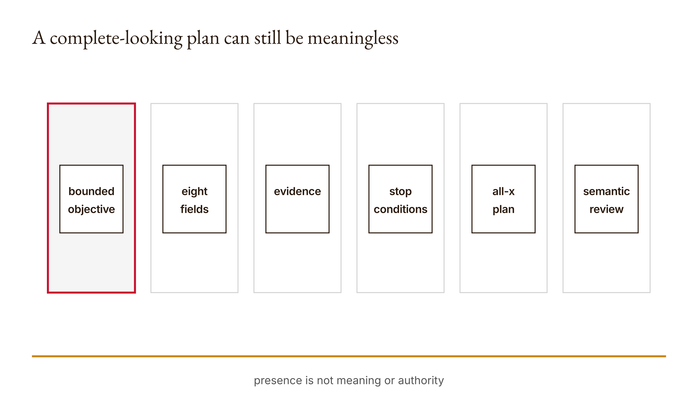

# Chapter 10 — Planning before acting
*A complete form can contain no plan at all.*

Suppose a plan has an objective, inputs, scope, steps, tools, risks, verification, and a stop condition. Every required heading is present. The validator reports no missing fields. The plan is also useless because every value is the single string `x`.

This is not a rhetorical exaggeration. The research script constructs that object and passes it to the course's `missing_fields` function. The returned list is empty. The same research run orders three steps as inspect, build, verify and rejects a dependency cycle. These observations are preserved under `chapters.10` in the [research output](../research/worked-examples.json).

The counterexample does not make field checks pointless. It tells us their job. They catch absence and false-valued entries under a declared list. They do not judge whether an objective matters, a scope is safe, a risk is plausible, a verification step tests the claim, or a stop condition can actually be observed. A structural check earns its place by reliably rejecting structural omissions. Trouble begins when a clean form is presented as a trustworthy plan.

Planning exists to make proposed work inspectable before action. That means exposing the destination, allowed inputs and scope, intended steps, tools, risks, evidence, and stopping rule while change is still cheap. The plan is not hidden reasoning and need not reproduce private deliberation. It is a public action contract another person can critique.

Chapter 9 asked what object will change. This chapter asks whether the proposed sequence is justified and bounded before it changes anything. We will build two mechanisms: a field-presence check and a topological ordering of named dependencies. Then we will put their outputs back in their proper place by subjecting a structurally valid plan to semantic and authority review.

The Python build runs offline and needs no direct API credits. Claude Code can propose or critique a plan through the assumed course account, but the returned plan remains a proposal. If the interface is unavailable, preserve that fact and complete the offline construction. Do not invent a Claude-authored plan or human approval to make the artifact look finished.

## What you will be able to do

You should be able to identify all eight required plan fields, trace missing-field behavior, order an acyclic dependency graph, and explain duplicate, unknown-prerequisite, and cycle rejections. You should also be able to revise a vague step with explicit evidence and authority, reject a structurally valid unsafe plan, and write a handoff condition that another person can apply.

You need Chapters 4 through 9, Python dictionaries and sets, and the idea of a directed dependency graph introduced here. The paired [lesson](../lessons/10-planning-before-acting/docs/en.md) provides the runnable sequence and existing knowledge check. Before reading the reference, predict which fields a one-objective plan lacks and how a build-after-inspect relationship should order.

## The eight fields are eight questions

The reference declares this tuple:

```python
FIELDS = (
    "objective", "inputs", "scope", "steps",
    "tools", "risks", "verification", "stop",
)
```

An objective states the outcome sought, not merely the activity. “Improve the code” hides what should become different. “Make the supplied failing plus-one regression pass without changing files outside the learner module and its test” gives a reviewer behavior and scope to challenge.

Inputs name material the work may rely on. They should include provenance and relevant version where the task depends on changing sources. A list of filenames can be structurally present while omitting the one policy that governs the requested change.

Scope identifies what may change and what must remain untouched. It is not a vague promise to be careful. File paths, permitted operations, excluded systems, and output destinations can turn scope into an inspectable boundary. If the plan needs expansion, revise it before action rather than laundering the expansion through an implementation detail.

Steps describe proposed transitions. A step should have an output another step can consume and a condition by which its completion can be evaluated. “Research” is an activity label. “Record the applicable versioned protocol clauses with URLs and retrieval date” is closer to a handoff.

Tools identify capabilities and their boundaries. Naming Claude Code does not specify permissions, sources, or actions. A useful entry explains why the tool is needed and which operation remains under human approval.

Risks name plausible ways the plan can produce harm, error, or misleading evidence. “There may be risks” technically fills the field and practically does nothing. A risk becomes useful when it is connected to a mitigation, owner, or stop trigger.

Verification states what observation will support the completion claim. It should attach checks to steps and final outcomes. “Review the result” leaves the reviewer guessing; an exact command, expected invariant, or source comparison gives them something to perform.

Stop conditions say when to finish, defer, or halt. Completion and safety stops are both relevant. “Stop when done” is present but circular. “Stop after all scoped tests pass and the named reviewer accepts the current diff; halt earlier if an out-of-scope file changes” defines observable events.

<!-- [FIGURE: Cajal production brief. A complete-looking plan can still be meaningless. Include bounded objective, eight fields, evidence, stop conditions, all-x plan, semantic review. Show the confirmed relationship that presence is not meaning or authority. Exclude unverified relationships, decorative elements, product-interface simulation, gradients, shadows, rounded corners, three-dimensional effects, and color-only meaning. The SVG and PNG are generated publication assets; retain this comment as figure provenance.] -->

*Figure 10.1 — A complete-looking plan can still be meaningless*

## What missing_fields actually checks

The implementation is one line:

```python
def missing_fields(plan):
    return [field for field in FIELDS if not plan.get(field)]
```

For each required name, `plan.get` retrieves its value or returns `None` when absent. Python's truth-value rule then marks absent and other false-valued results as missing. Empty strings, empty lists, zero, false, and null-like `None` all fail this check.

The function does not require a particular type for each field. A nonempty list, string, dictionary, or even an unrelated truthy value can pass. It does not reject extra keys. It does not explain why a value is inadequate. Its output is an ordered list following the FIELDS tuple.

The lesson test confirms that an empty plan lacks eight fields. The demo supplies only an objective, so the remaining seven appear as missing. These cases establish completeness checking at the shallow boundary.

The all-x object exposes the semantic limit. Every lookup returns a nonempty string, so no field is missing under this function. The result is correct for the implemented rule. Calling the plan meaningful would add a judgment the code never made.

This is the same design pattern encountered earlier. A strict format validator can pass false content. A permission flag can be true without authenticating a person. A plan-presence checker can pass empty language. Keep the signal narrow and useful instead of expecting one Boolean or empty list to certify the entire artifact.

A richer validator could check types and some observable properties. It might require steps to be a nonempty list or verification to contain a command. Such checks can catch more structural defects. They still cannot decide whether the command tests the right claim or the objective serves the right person without additional context and judgment.

## Dependencies are directed obligations

The `order` function receives step dictionaries with unique `id` values and optional `after` lists. If step verify has `after: [build]`, then build must appear before verify. Think of the relation as a directed requirement, not a narrative suggestion.

The function first constructs a graph mapping every step id to a set of prerequisite ids. It rejects duplicate identifiers because one key could not unambiguously represent two steps. It then rejects dependencies naming ids absent from the graph.

These validations matter because a missing prerequisite is not the same as a cycle. If verify depends on test but test is absent, the plan references nonexistent work. If two present steps depend on each other, neither can become ready. Their remedies differ.

The ordering loop finds all entries whose prerequisite sets are empty. These are ready steps. It sorts their ids for deterministic output, appends them to the result, removes them from the graph, and deletes their ids from remaining prerequisite sets. It repeats until the graph is empty.

If the graph remains nonempty but contains no ready step, the remaining dependencies contain a cycle. The function raises `Dependency cycle`. A self-dependency is the smallest example and appears in the tests.

The research example gives inspect no prerequisites, build after inspect, and verify after build. The resulting order is inspect, build, verify. This is a valid topological order for that graph. The function does not run the steps or establish that their descriptions are useful.

When several steps are ready simultaneously, alphabetical id order decides which appears first. This deterministic convention is not evidence that alphabetical execution is operationally optimal. The graph says those steps do not depend on one another under the supplied relations; external resource or risk constraints may still matter.

## Acyclic does not mean executable

Give three steps the ids a, b, and c with no dependencies. The function returns them in sorted order. It has no knowledge of what each step requires in the real world. An omitted dependency can make the graph acyclic while the work remains impossible in that order.

Likewise, a step can depend on a predecessor whose output is too vague to use. “Review after build” is structurally coherent, but the reviewer needs a diff, test results, and acceptance criteria. An arrow says one step comes after another. It does not define the handoff object.

A plan can also be unsafe and acyclic. Inspect, delete, verify is a valid ordering if represented without a cycle. The graph has no operation allowlist or approval model. Semantic review must compare each action with scope, authority, and consequence.

This is why planning before acting does not mean automatically executing any valid graph. The plan creates a review surface. It should expose the proposed action early enough that a person or runtime boundary can reject it. Structural validity is a prerequisite for intelligibility, not authorization.

Do not “resolve” every cycle by removing an edge. A cycle can reveal that two steps were poorly defined. If implementation needs review and review needs a completed implementation, distinguish plan review from change review. The first can approve a proposed method; the second can evaluate actual output. Renaming the obligations may reveal a valid sequence.

The practice lab's mutually dependent review and implementation steps are useful for this reason. Ask what each actually needs as input. A reviewed plan can precede implementation. The implementation artifact can then precede final review. The cycle disappears because one overloaded word has been split into two distinct operations.

## Build a plan whose fields have jobs

Use a bounded hypothetical: add one denial test to the Chapter 5 learner permission function. The objective is to demonstrate rejection of an outside-pointing symlink in a disposable fixture without accessing unrelated data. Inputs include the learner code, existing tests, pathlib documentation, and a temporary-directory fixture.

Scope allows the learner test file and, only if evidence requires it, the learner implementation. It excludes the course reference, real personal files, institutional settings, and publication. Tools are Python, Claude Code for review assistance, and the local test runner. No direct API call is needed.

Risks include accidentally targeting a real file, misreporting a stable fixture as race resistance, and editing the reference. Mitigations include a temporary directory, explicit path inspection, and diff review. Verification includes the new targeted test, existing learner tests, and confirmation that only allowed files changed.

The step graph can be:

1. `inspect`: read requirements, current learner code, and existing tests.
2. `fixture`: define the disposable inside root and outside destination, after inspect.
3. `test`: add the predicted denial test, after fixture.
4. `run`: execute targeted and existing tests, after test.
5. `review`: inspect diff, outputs, and claim language, after run.

The stop condition says to finish only when the fixture demonstrates the intended rejection, existing tests pass, the diff stays within scope, and the report limits its claim to the stable preflight case. Halt if any command targets material outside the disposable arrangement or if scope must expand without review.

Every field now contributes to an observable workflow. The plan can still be wrong. Perhaps the learner code's integration differs from the reference or the source documentation has changed. That is why review remains necessary. The improvement over all-x is not that prose is longer; it is that another person can predict actions and challenge evidence.

## Evidence belongs on the edges

The dependency graph tells us when a step is eligible to begin. A trustworthy handoff states what output permits the next step to rely on it. This is stronger than saying the earlier step was reviewed.

For the `run` to `review` edge, the handoff can require the exact commands, exit statuses, output, and current diff hash or version description. The reviewer can then determine whether the checks correspond to the proposal.

For `fixture` to `test`, the handoff can require resolved paths proving that both locations are disposable and that the destination lies outside the approved subdirectory while remaining inside the temporary parent. This lets another student predict what the test exercises.

An edge should also define failure behavior. If the targeted test fails, do not proceed as though review means approval. The work can return to implementation or stop pending diagnosis. If source authorization is missing, do not improvise a replacement input.

The companion *Computational Skepticism* frames this as a handoff condition: a testable contract that lets the receiver know what can be relied upon. We use that practice without treating a complete handoff record as proof the underlying decision is good.

Attach evidence to state-changing edges first. A purely analytical step can also need review, but writes, external communications, and irreversible actions deserve explicit authority and postcondition records. A fluent sequence diagram cannot make an unsafe transition acceptable.

## Stop conditions are part of the design

Many plans describe how to continue and leave stopping to intuition. That makes the controller vulnerable to repeated activity, scope creep, and completion claims unsupported by outcome evidence. Chapter 4 already showed why a turn budget and a finish action answer different questions.

A completion condition should name the observable task outcome. For code, this might include a targeted regression, existing tests, and a reviewed diff. For a document, it might include required sections, source checks, and a named decision. Avoid “when it looks good.”

A safety stop names conditions under which action should halt before completion. Out-of-scope files, missing authorization, restricted inputs, failed independent checks, or an unresolved dependency can be legitimate triggers.

A resource budget limits effort without proving success. Reaching a time or turn limit should produce deferred or incomplete status, not a fabricated final result. The plan should say what partial artifacts to preserve and who decides whether to resume.

Stop rules need owners. An automated test can halt on a failing assertion. A person may need to decide whether a newly discovered risk changes scope. Do not assign a human decision to Claude merely because it can summarize the evidence.

The stop field therefore should contain more than one sentence when the task needs several exits. Structure it as completion, halt, and defer conditions. The presence checker will treat any nonempty representation as present; meaningful review inspects whether the conditions cover the important boundaries.

## Reframing before graphing

A perfectly ordered plan can optimize the wrong objective. Before asking Claude to produce steps, write several candidate formulations. They should differ in what counts as success, not merely synonyms.

For example: minimize the number of failing tests; restore the declared plus-one behavior without unrelated changes; or improve confidence in the learner's ability to explain the bug. A constant patch can satisfy the first narrow formulation on one test while failing the second. A completed patch can satisfy the second while failing the third if the student cannot explain it.

The *Conducting AI* distinctness practice is useful when read operationally: find a proposed result that passes one formulation and fails another. Do not claim two objectives are identical merely because one solution can satisfy both. Shared satisfaction is compatible with distinct criteria.

Select a formulation using feasibility, importance, affected interests, and course purpose. Record what it leaves out. Claude can suggest alternatives and challenge assumptions. The human owns the objective decision because it determines which success the workflow will pursue.

Once selected, put the formulation into objective, scope, verification, and stop fields. If it appears only in introductory prose while the checks measure something else, the executable plan has drifted away from its stated purpose.

## Build It and review before action

Implement `missing_fields` and `order` in your learner workspace. Read the [six tests](../lessons/10-planning-before-acting/code/tests/test_main.py) before the reference. Predict empty order, dependency order, self-cycle, unknown prerequisite, duplicate id, and empty-plan results.

Add the all-x case and explain why it passes the presence function. Add a semantically meaningful plan with one omitted field, then revise it. Preserve the validation failure and human revision in the artifact.

Construct a cycle using overloaded review and implementation steps. Resolve it by identifying distinct inputs and outputs, not by arbitrarily removing the inconvenient edge. Run both graphs and preserve the error and valid order.

Ask Claude Code for a plan using the eight fields only after you have defined the bounded objective and exclusions. Inspect the plan before allowing action. If Claude Code is unavailable, label the plan as your constructed artifact; do not invent its output.

Compare the plan with Anthropic's [Building effective agents](https://www.anthropic.com/engineering/building-effective-agents) and [Claude Code best practices](https://code.claude.com/docs/en/best-practices), checked during research. Use their workflow and planning guidance to sharpen your architecture, not to attribute this eight-field checklist to Anthropic.

## Ship It: the reviewed plan

### Review each field against the others

Eight individually plausible fields can contradict one another. The objective may promise a read-only analysis while the steps include a write. The scope may allow one directory while the tool configuration exposes a broader root. The risk section may identify accidental publication while the stop condition says nothing about an external action. Cross-field review is how the plan becomes one argument rather than eight paragraphs.

Begin with objective and verification. Does the proposed check measure the outcome named by the objective? A test that confirms a file exists does not establish that its contents implement the required behavior. A word count does not establish source support. If the check is only a proxy, name what it can and cannot reject.

Then compare steps with inputs. Every step should have the information it needs, and every sensitive input should have an authorized use. A plan that says “verify sources” but supplies no source location is incomplete in meaning even when its inputs field contains unrelated text. A plan that supplies restricted data to a step outside its purpose has a scope problem rather than a missing-field problem.

Compare tools with steps and scope. If no step requires writing, a write-capable tool may be unnecessary under the bounded design. If a step needs a capability absent from the tools, the plan is infeasible. Capability still does not create authority: an available tool can remain forbidden for this task.

Compare risks with mitigations, owners, and stops. A risk recorded without any response can be honest but incomplete as an action plan. Some risks are accepted explicitly; others trigger mitigation or deferment. State which applies. Do not assign ownership to a fictitious human or use Claude as the signer of a human decision.

Compare dependency edges with actual handoff objects. If review depends on run, what exactly does run produce? If implementation depends on inspect, which constraints from inspection must appear in the implementation plan? A bare id relation gives order without guaranteeing correspondence.

Finally, compare final scope with revisions. A late change to objective can invalidate earlier risk and verification analysis. Preserve versions and rerun the relevant review instead of editing the title and retaining stale supporting fields. Planning is not a one-time form; it is a controlled state that can become stale.

### The plan should contain refusal paths

A plan written only for success pressures every observation into forward motion. Add explicit refusal paths for missing authority, unavailable evidence, out-of-scope changes, and failed checks. Refusal here means the workflow preserves its state and reports what prevents the next transition.

For the symlink-test plan, a resolved target outside the disposable parent is a hard stop, not a reason to continue cautiously. A required edit to the course reference instead of the learner copy is a scope stop. A failed existing test routes back to diagnosis rather than directly to approval.

The response to missing evidence may be narrower. If a source cannot support a claim, the plan can reduce the claim or mark it unresolved. It should not fill the field with plausible language merely to satisfy a completion checklist. A meaningful stop condition protects the integrity of the artifact as well as the filesystem.

Refusal paths need outputs. Record why the step stopped, which evidence was available, and what decision would allow safe resumption. An unexplained halt is hard to distinguish from a crashed workflow. An explicit deferred state lets a human decide without manufacturing a conclusion.

Do not treat every uncertainty as a permanent block. The plan can distinguish missing information obtainable within scope from a decision requiring new authority. Claude can help search approved sources or propose a smaller task. It cannot grant permission the user or institution has not provided.

This design also limits repeated action. If the same check fails with no new evidence, the next step should not be another identical attempt by default. Route to diagnosis, revise the plan, or defer. Activity becomes progress only when it changes the evidence or decision state.

### Estimate cost without pretending certainty

Plans often need resource estimates, but the eight-field function has no dedicated schedule or cost model. Put relevant limits in scope, risks, steps, or stop conditions without fabricating precise forecasts. A bounded estimate can state assumptions and a range, or identify a hard maximum that the controller will enforce.

Direct API credits are not needed for this chapter's offline work. If a future plan includes optional live calls, label them separately and require explicit authorization. Do not allow an estimate to turn an optional experiment into an assumed expense.

Human attention is also a resource. A plan producing hundreds of review items without prioritization may be structurally complete and practically unauditable. State what requires human judgment, how much material is expected, and what sampling or escalation policy is proposed. Do not claim a reviewer approved a volume they have not seen.

The same applies to time. A deadline can constrain scope and justify a reduced objective. It does not make skipped verification acceptable without disclosure. If the evidence cannot be gathered in the available period, the plan should produce a narrower or deferred result.

Estimation should therefore influence scope before action. Remove nonessential outputs, split phases, or choose a more inspectable method. The goal is not to predict the future perfectly. It is to expose constraints early enough that the human can choose a defensible tradeoff.

### Use counterexamples during plan review

For each important field, imagine a plan that satisfies its wording but fails its purpose. The all-x fixture is the extreme version. More realistic counterexamples are even more useful because they resemble plans people might accept.

An objective can be specific but wrong for the stakeholder. Verification can be executable but test a proxy. Scope can be precise but authorize too much. Risks can be detailed but disconnected from action. A stop condition can be observable but trigger only after harm has occurred.

Write one counterexample before approval and ask whether the plan rejects it. If the requirement is source grounding, construct a valid citation that does not support the claim. If the requirement is safe writing, construct an in-scope path with an unapproved operation. Reuse mechanisms from earlier chapters rather than inventing vague danger.

Counterexamples also improve dependency design. Find a state where prerequisites are technically complete but the receiving step lacks a needed artifact. Add the handoff condition, not merely another arrow. The graph should represent why the next step is ready.

Claude can generate candidate counterexamples quickly. The human should decide whether they are plausible for the actual context and which risks deserve load-bearing checks. Preserve rejected counterexamples too when their dismissal reveals an assumption.

This practice turns planning into a pre-mortem with executable consequences. It does not prove the plan cannot fail. It demonstrates that identified failure modes influenced the design before the system acted.

Preserve the original counterexample beside the revised plan. Otherwise the final version can look inevitable and hide the reasoning that shaped its boundaries. A future reviewer should be able to see which failure the new condition was designed to stop and whether later changes have made that condition stale. Planning evidence is most useful when it records not only the chosen sequence but also the rejected path that explains why the sequence exists.

The [artifact brief](../lessons/10-planning-before-acting/outputs/artifact-brief.md) asks for proposed plan, validation failures, human revisions, stop conditions, and final approved scope. Preserve versions rather than replacing the initial proposal.

Include the field-validation result and dependency order, but do not present them as semantic approval. Add a review table with objective fit, source and tool boundaries, risk ownership, evidence, handoff conditions, and decision status.

Record who proposed changes and who owns authorization. Claude can draft and critique. It cannot synthesize the human approval the artifact is supposed to record. If approval is pending, the plan remains pending and should not proceed into consequential action.

Attach one evidence condition to every state-changing step. State what happens when it fails. End with a stop condition another reader can apply without guessing what done means.

## Verify and reflect

Run the demo, lesson tests, all-x counterexample, and your graph cases. Trace each error to duplicate, unknown dependency, or cycle rather than saying ordering failed generically.

Review every field for meaning, authority, and evidence. Ask what unsafe or useless plan could still pass the structural checks. Preserve at least one such counterexample.

Check whether your graph omits real dependencies or invents unnecessary sequencing. Parallel readiness in the function means no declared dependency, not proof that concurrent execution is safe.

Finally, compare initial and revised objectives. Name the decision that changed and which affected interest or evidence motivated it. Planning is valuable when revision happens before the cost of action, not when it simply predicts the steps you already took.

## Assessments — ungraded practice

These Assessments carry no points. Use the paired lesson's [knowledge check](../lessons/10-planning-before-acting/quiz.json), preserving initial answers before explanations.

### Warm-up

1. **Eight fields — introductory; objective: identify omissions.** Run an empty and one-field plan, predict the ordered missing list, and explain the truth-value rule.
2. **One edge — introductory; objective: order dependencies.** Order build after inspect and explain the directed obligation.
3. **Three errors — introductory; objective: distinguish graph failures.** Construct duplicate, unknown-prerequisite, and cycle cases and map each to its check.

### Application

4. **All-x plan — intermediate; objective: critique structural validity.** Reproduce the empty missing list and identify why every field still fails semantic review.
5. **Observable stop — intermediate; objective: revise completion.** Replace “stop when done” with completion, halt, and defer conditions for a bounded task.
6. **Evidence-bearing edge — intermediate; objective: design a handoff.** Add an output, checker, and failure route to one dependency edge.
7. **Resolve the review cycle — intermediate; objective: refine steps.** Split overloaded review into plan review and result review, then rerun ordering.

### Synthesis

8. **Reviewed plan — advanced; objective: integrate scope and evidence.** Produce all eight meaningful fields, graph, validation results, revisions, and pending or actual decision.
9. **Unsafe but valid — advanced; objective: reject a plan.** Construct an acyclic, field-complete plan that exceeds authority. Give specific rejection reasons.

### Challenge

10. **Distinct formulations — stretch; objective: evaluate objectives.** Write three objectives and a result that passes one but fails another. Defend the selected formulation.
11. **Parallel-ready conflict — stretch; objective: expose omitted constraints.** Build two steps with no graph dependency that compete for a resource or authority. Add the missing constraint without claiming every parallel pair is unsafe.

## What you can now defend

Every plan remains a proposal until its responsible review and authorization are actually recorded.

You can explain the exact boundary of a field-presence check and why an empty missing list does not certify plan quality. You can trace deterministic topological ordering and distinguish duplicates, unknown prerequisites, and cycles.

You can turn an activity list into an inspectable plan by naming outputs, evidence, authority, and stop conditions. You can also reject a structurally valid plan for semantic or permission reasons without dismissing the useful checks it passed.

Most importantly, you can review the objective before optimizing the sequence. A flawless graph can execute the wrong problem. Planning earns its place when it makes that mistake visible before action.

## A plan predicts action; a result records it

Chapter 11 follows one planned tool request through validation, dispatch, result association, and independent checking. A plan says what should happen. A tool result supplies evidence about what did happen. The final answer must not skip that chain.

## Anthropics

Compare the dependency graph with [Building effective agents](https://www.anthropic.com/engineering/building-effective-agents) and the bounded workflow with [Claude Code best practices](https://code.claude.com/docs/en/best-practices), checked 2026-09-06. Explain whether the task needs a fixed sequence or model-directed choices. The eight fields remain this course's review instrument.

## Computational Skepticism

The companion's handoff condition asks what testable evidence permits work to cross an edge. See [Delegation and handoffs](../docs/computational-skepticism.md#delegation-and-handoffs). Apply it to one state-changing dependency, including the checker and failure route. An acyclic graph orders work; it does not make the handoff trustworthy.

## Conducting AI

Use the [distinct reframings](../docs/conducting-ai.md#distinct-reframings) practice before planning. Find an outcome that passes one objective and fails another; do not infer identity merely because one solution satisfies both. Claude should propose and critique alternatives. The human should select the formulation, defend whose interests it serves, and record what it leaves out.
