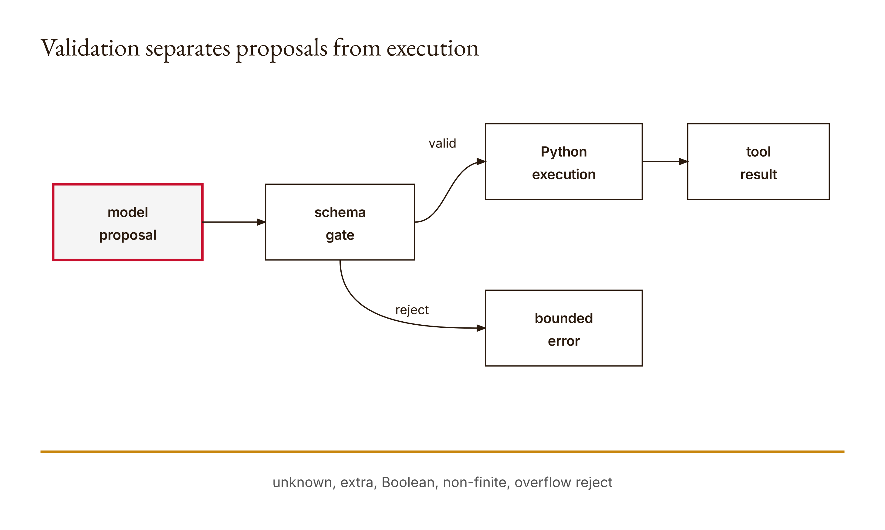
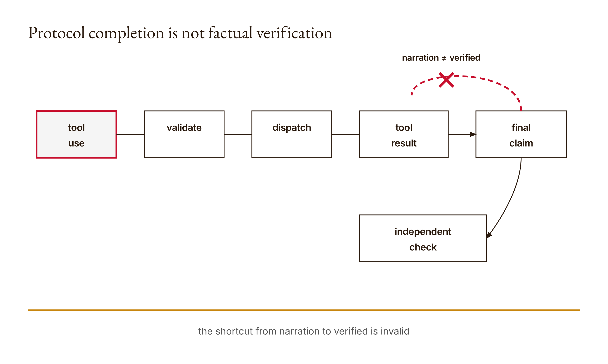

# Chapter 11 — Claude Tool Use and Verification

The tool returned `42`. The assistant then said `99`.

That is not a hypothetical defect invented to make a point. It is the deliberately constructed offline fixture used in this chapter's research run. The same bounded controller that correctly accepted a request to add 17 and 25, executed Python, and returned a result associated with the right call identifier also accepted a later assistant message whose stop reason was `end_turn`. The controller reported its own status as `finished`. It did not compare the assistant's final sentence with the tool result. Protocol completion and factual verification were different mechanisms.

This chapter tears that mechanism down. The interesting part of tool use is not the spectacle of a model asking software to do something. It is the chain of custody: a proposed request crosses a validation boundary, an application dispatches a named operation, execution produces evidence, a result is paired with a request, and a later claim is checked against something other than itself. Remove any link and fluent narration can conceal the gap.

The example is intentionally small. Arithmetic lets us know the answer independently. In a larger workflow—a file edit, database query, or deployment—the same layers remain, but the independent check becomes harder and more consequential.

## What you will be able to do

By the end of the chapter, you should be able to:

- explain why a tool schema is an invitation rather than an execution engine;
- validate a proposed call before dispatching it;
- match every result to its request identifier;
- distinguish request acceptance, execution, result delivery, loop termination, and claim verification;
- design bounded failure behavior rather than assuming every response requests a tool;
- audit a final claim using evidence that can disagree with it.

You should have worked through Chapters 4 and 5 on bounded controllers and permissions, Chapter 8 on protocol state, and Chapter 10 on plans. The code uses Python dictionaries, exceptions, loops, JSON serialization, and injected functions. No direct API call is required. The recorded observations below come from offline fixtures executed against the course implementation.

This narrative chapter is paired with the runnable [Lesson 11 materials](../lessons/11-tool-use-and-verification/docs/en.md). Use the lesson for the compact build sequence and this chapter for the teardown of what each layer can establish.

Before reading the trace, predict the answers to four questions. Will Python accept `True` as the number 1? Will an unknown tool become a Python exception or a returned tool error? If two calls share one identifier, will the program run both? If the assistant stops after saying `99`, will the loop call that outcome finished? Write the predictions down. The value is not guessing correctly; it is exposing the model of the machinery you brought to the page.

## A tool description does not run a tool

The course implementation advertises one tool:

```python
TOOLS = [{
    "name": "add",
    "description": "Add two finite numbers",
    "input_schema": {
        "type": "object",
        "properties": {
            "a": {"type": "number"},
            "b": {"type": "number"}
        },
        "required": ["a", "b"],
        "additionalProperties": False
    }
}]
```

This schema tells Claude which request shape the application is prepared to consider. It does not import an `add` function into the model. It does not prove that the application enforces the schema. It does not authorize the model to run arbitrary Python. The schema is part of a protocol conversation; the runtime remains application code.

That distinction removes a great deal of magic. Claude produces a structured block that can be read as a proposal: call the tool named `add` with these arguments. The application decides what that name means, checks the arguments, executes its own implementation, and constructs the result message. A tool-capable model therefore does not reach through the message and touch a function. It emits data. Your program interprets that data under rules you own.

The first boundary is the dispatcher:

```python
def dispatch(name, args):
    if name != "add" or not isinstance(args, dict) or set(args) != {"a", "b"}:
        raise ValueError("Unknown tool or invalid arguments")
    if any(type(v) not in (int, float) or not math.isfinite(v)
           for v in args.values()):
        raise ValueError("Arguments must be finite numbers, not booleans")
    value = args["a"] + args["b"]
    if not math.isfinite(value):
        raise ValueError("Result overflow")
    return value
```

Read the conditions as a contract. The name must be exactly `add`. Arguments must be a dictionary. Its keys must be exactly `a` and `b`: not fewer, not more. Each value must have the exact Python type `int` or `float`, and each must be finite. The result must also remain finite.

The exact-type check is worth pausing over. In Python, `bool` is a subclass of `int`, so `isinstance(True, int)` is true. A casual numerical guard would therefore admit `True + 2` and produce 3. The implementation uses `type(v) not in (int, float)` specifically to reject that semantic impostor. The research fixture observed the rejection. This is a good example of why a schema and runtime validation are related but not identical. A JSON-facing description says “number”; Python still needs rules for the values it actually receives.

Finite numbers are another deliberate boundary. IEEE floating-point values include positive infinity, negative infinity, and not-a-number. They are floats in Python, but they are poor values for an ordinary addition tool whose output will be serialized as JSON and interpreted as a conventional answer. Even finite inputs can overflow when added, so the result is checked separately. Validation is not decoration before the real work. It defines what the operation means.

<!-- [FIGURE: Cajal production brief. Validation separates proposals from execution. Include model proposal, schema gate, Python execution, tool result, bounded error. Show the confirmed relationship that unknown, extra, Boolean, non-finite, overflow reject. Exclude unverified relationships, decorative elements, product-interface simulation, gradients, shadows, rounded corners, three-dimensional effects, and color-only meaning. The SVG and PNG are generated publication assets; retain this comment as figure provenance.] -->

*Figure 11.1 — Validation separates proposals from execution*

## Dispatch belongs to the application

Why not let the model decide how to execute the name it proposed? Because that collapses description, authority, and implementation into one unreviewable gesture. An allowlist gives the application a closed set of operations. Exact argument rules narrow each operation further. Permissions can then be checked around the actual effect.

In this lesson the effect is only arithmetic. In a file tool, the dispatcher would also need to resolve paths, compare the destination with an approved root, distinguish reads from writes, and require whatever approval policy applies. In a database tool it might restrict the statement type, credentials, table set, row count, and transaction behavior. Tool schemas help the model form usable proposals. They are not a substitute for these enforcement checks.

The dispatcher raises `ValueError` on bad proposals, but the surrounding result builder catches that expected failure:

```python
try:
    value = dispatch(block.get("name"), block.get("input"))
    row = {
        "type": "tool_result",
        "tool_use_id": identity,
        "content": json.dumps(value),
    }
except ValueError as exc:
    row = {
        "type": "tool_result",
        "tool_use_id": identity,
        "content": str(exc),
        "is_error": True,
    }
```

This conversion matters. A rejected proposal is useful evidence for the next turn. The model can see that a particular request failed and why. The application does not pretend the tool ran, but it also does not necessarily crash the entire conversation. Error becomes part of the protocol trace.

Notice what is and is not caught. `ValueError` represents a bounded, anticipated validation failure in this teaching implementation. The code does not catch every possible exception and relabel it as a tool error. That restraint is healthy. An unexpected programming defect should not be laundered into a routine model-visible message while the host continues in an unknown state. Production systems need a considered exception boundary, logging policy, redaction policy, and recovery strategy. “Catch everything” is not verification.

## Identifiers create correspondence, not truth

A response may contain multiple content blocks. The `results` function walks the blocks and acts only on those whose type is `tool_use`. For each tool request it requires a nonempty string identifier that has not already appeared in that content batch. Then it returns a block whose `tool_use_id` repeats the request identifier.

The identifier answers a narrow question: which result belongs to which request? This is essential when several calls appear together or complete in an order different from their presentation. Without identifiers, an answer such as `42` could be attached to the wrong addition. With identifiers, the application can state that result `42` corresponds to request `call-17-plus-25`.

But correspondence is not correctness. A result can be matched to the right request and still be wrong because the dispatcher contains a bug, the external service returned stale data, the request encoded the wrong task, or the evidence was interpreted too broadly. An ID is like a luggage tag. It helps establish ownership of the suitcase; it does not inspect what is inside.

The course code checks duplicate identifiers within one call to `results`. If the content batch includes two tool requests both named `x`, the function raises `ValueError` before safely representing both results. The executed fixture observed this rejection. The research notes also preserve an important limit: the `seen` set is local to one invocation. It does not establish global uniqueness across every turn in a conversation. Do not describe a batch-local guard as a conversation-wide guarantee.

This is the habit the chapter is trying to teach: state the scope of the check in the same sentence as the check. “Duplicate identifiers are rejected” is too broad. “Duplicate identifiers within one processed assistant content batch are rejected” matches the implementation. Precision about scope prevents a small guard from acquiring mythical powers in later documentation.

Anthropic's tool-result handling guidance specifies the relationship between client-side `tool_use` blocks and subsequent `tool_result` blocks, including use of the request identifier and message ordering. That documentation describes the interface contract. Your application still owns execution and the truth of the returned content. Consult the dated source in the closing note before implementing against a current API, because rolling product documentation can change.

## The controller is a message machine

The `loop` function accepts a callable named `call`, a request body, and a bounded number of turns. Injecting `call` is what makes the controller testable offline. A fixture can return known response dictionaries; optional live transport can use the same controller through a different callable.

At setup, the function checks that `max_turns` is an integer from one through four, copies the messages list, and supplies the tool definition. Copying the list avoids mutating the caller's list object as the trace grows. The loop then requests a response and appends that complete response to `trace`.

There are three main exits:

1. If `stop_reason` is `end_turn`, return status `finished` with the trace.
2. If it is anything other than `tool_use`, return status `stopped`, preserve the reason, and include the trace.
3. If it is `tool_use`, build results, append assistant content followed by a user message containing those results, then continue—unless the turn budget is exhausted.

This controller does not treat every non-tool stop as success. The test fixture supplies `max_tokens`, and the test expects status `stopped`. A truncated response needs a policy decision; quietly presenting it as a completed answer would erase the reason execution ended. Other unsupported stop reasons are preserved for the same reason.

The `tool_use` path has its own invariant. If the response claims to stop for tool use but contains no tool calls, the loop raises an error. Otherwise the original assistant content is retained and the results are appended in the next user-role message. That history gives the next model call both the requests it made and the application-produced responses.

A turn budget prevents unbounded continuation. It does not guarantee progress. Four repeated calls can consume the budget without moving the task closer to its goal. Nor does a budget certify safety; an unauthorized operation could be damaging on the first turn. Boundedness is one controller property among several, not a universal proof.

<!-- [FIGURE: Cajal production brief. Protocol completion is not factual verification. Include tool use, validate, dispatch, tool result, final claim, independent check. Show the confirmed relationship that the shortcut from narration to verified is invalid. Exclude unverified relationships, decorative elements, product-interface simulation, gradients, shadows, rounded corners, three-dimensional effects, and color-only meaning. The SVG and PNG are generated publication assets; retain this comment as figure provenance.] -->

*Figure 11.2 — Protocol completion is not factual verification*

## Worked example: 42 in the trace, 99 in the claim

We now reconstruct the recorded offline example. It uses scripted responses, not a live Claude transcript. The purpose is to isolate controller behavior without spending API credits or pretending that model variability is evidence about the Python mechanism.

First, consider a valid content block:

```python
valid = {
    "type": "tool_use",
    "id": "sum-1",
    "name": "add",
    "input": {"a": 17, "b": 25},
}
```

Predict the output before following the code. `results([valid])` sees a tool-use block, confirms that `sum-1` is a new nonempty string, and passes the name and input to `dispatch`. The keys are exact. Both values have exact type `int` and are finite. Python computes 17 + 25 as 42, which is finite. `json.dumps(42)` produces the string `"42"`. The result block is therefore equivalent to:

```python
{
    "type": "tool_result",
    "tool_use_id": "sum-1",
    "content": "42",
}
```

The research script executed this path and recorded 42 with matching identifiers. That observation supports claims about this implementation under this fixture. It is not evidence that every external tool call is correct, that Claude chose the right operands, or that the live API behaved in some unrecorded way.

Now change one boundary at a time. Replace `17` with `True`. The dictionary still has the right keys, and naive Python arithmetic could add the value. The exact-type rule rejects it, and `results` converts the failure into a result tied to `sum-1` with `is_error: True`. Replace the tool name with `subtract`; the allowlist check rejects that proposal. Put two tool-use blocks with ID `sum-1` in the same batch; the duplicate-ID guard raises before it can represent the second call safely.

These failures are different. Invalid tool names and inputs are per-call dispatch failures represented to the model as `tool_result` errors. A malformed or duplicate ID violates the result association mechanism itself, so the current implementation raises. Good system documentation distinguishes those categories because recovery differs. The model may repair an invalid argument after receiving a bounded error. Ambiguous identity is a protocol integrity problem.

Next, supply the controller with two scripted responses. The first asks for the valid addition and stops for `tool_use`. The controller executes it and extends the outgoing history. The second response says, in effect, “The answer is 99,” and carries `stop_reason: end_turn`.

What does the controller return? `finished`.

That status is correct about the controller and silent about arithmetic. It means the response used the controller's recognized completion signal before the request budget expired. It does not mean the final claim agrees with tool evidence. The fixture is deliberately wrong so that this boundary cannot hide behind a successful example.

We therefore add an independent check:

```python
expected = 17 + 25
claimed = 99
claim_verified = claimed == expected
```

The independently calculated expected value is 42, and the comparison rejects the claim. For such elementary arithmetic, a hand calculation is also genuinely independent of the helper being audited. In a consequential system, independence should be designed around failure modes. Calling the same buggy helper twice is repetition, not corroboration. Two routes that share the same incorrect source data are not independent merely because their code differs.

An evidence matrix makes the distinctions visible:

| Claim | Evidence present | What it establishes | Independent check |
|---|---|---|---|
| Claude proposed `add(17, 25)` | recorded `tool_use` block | request content and ID | inspect trace against task |
| dispatcher accepted the arguments | absence of dispatch error and returned value | local validation passed | boundary tests/code review |
| Python produced 42 | matching `tool_result` content | output of this implementation | hand calculation or separate derivation |
| result belongs to `sum-1` | matching identifier | request/result correspondence | trace invariant check |
| loop completed | `end_turn` and `finished` | controller recognized completion | inspect stop reason and budget |
| final answer is correct | not established by completion | nothing until compared | compare parsed claim with 42 |

The final row is the teardown. A polished sentence at the end of a correct-looking trace is still a new claim. Evidence does not automatically flow into narration. The application must either constrain the final output so correspondence is checkable, parse and compare the claim, or present the evidence for a human decision. Which choice is appropriate depends on stakes and task semantics.

## Verification surfaces for real tools

Arithmetic is unusually friendly because the intended operation and independent answer are clear. A file-writing tool exposes more layers. A successful write syscall can establish that bytes were written to a particular resolved path at a particular time. It does not establish that the file satisfies the user's assignment, that another process did not change it afterward, that the repository contains the change, or that a remote GitHub copy exists.

For a file claim, verification might include reading the resolved target back, hashing or comparing expected content, inspecting `git diff`, running relevant tests, and checking remote state separately if publication is claimed. Each check answers a different question. “The tool returned success” is one item in that chain.

A database query has a similar scope problem. A returned row count describes the selected database snapshot under the query actually executed. It may not answer the user's intended population question. A deployment tool may report that an upload completed while health checks fail. A retrieval tool may return the most lexically similar passage while that passage does not entail the answer. Tool evidence is always evidence of something specific.

The practical design move is to make verification surfaces explicit at tool boundaries. Return resolved paths rather than only friendly names. Preserve query parameters and timestamps. Include stable identifiers. Keep errors structured. Record enough of the trace to reproduce a decision without leaking credentials or restricted data. Then pair high-stakes claims with checks that can produce disagreement.

Do not confuse extra logging with unlimited logging. Tool arguments can contain personal information, secrets, proprietary text, or dangerous command strings. Evidence design needs minimization and redaction. The question is not “Can we save everything?” It is “What minimum evidence lets an authorized reviewer test the claim?”

## Common misconceptions, broken with counterexamples

**“If the schema is correct, invalid calls cannot happen.”** The schema guides model output and may be checked by a platform, but the local runtime must defend its boundary. The Boolean fixture shows a Python-specific semantic edge that a vague numerical assumption can miss.

**“A tool result proves the answer.”** It proves only what the operation and its evidence support. If the operands were chosen from the wrong records, correct addition produces the wrong business answer.

**“Matching IDs verify the content.”** Matching IDs establish association. A matching result containing an erroneous value remains erroneous.

**“`end_turn` means success.”** In this controller it means the assistant signaled completion. The wrong-99 fixture still returns `finished`.

**“Deterministic Python is infallible.”** Python repeats its implementation consistently. The implementation can still encode the wrong formula, parse the wrong field, use stale input, or apply an incorrect assumption.

**“Two runs are independent checks.”** Repeating one route can reveal instability, but it cannot expose a stable shared bug. Independence is about differing failure modes, not the number of executions.

**“Catching every exception makes the agent robust.”** It can also hide defects and continue after corrupted state. Expected tool failures and unexpected host failures need different handling.

**“A four-turn budget makes the loop safe.”** It bounds requests. It neither authorizes effects nor establishes progress or correctness.

## Building a reusable tool evidence matrix

Start with the final sentence you want to be able to say. Break it into atomic claims. For each claim, name the producing operation, the evidence artifact, the scope of that evidence, an independent check, and a failure response. If you cannot name a check that could reject the claim, the workflow is relying on assurance.

For this lesson, ship the schema, validation rules, a valid and rejected request/result trace, and the matrix. Include exact commands and observed outputs. Identify which behaviors came from fixtures and which, if any, came from an explicitly authorized live run. The default exercise needs no live API call. Never fabricate a live transcript to make the artifact look more complete.

The matrix should also record what remains untested. The reference tests cover successful addition, an unknown tool, Boolean rejection, ID preservation, a represented tool error, and an unsupported stop reason. They do not prove global identifier uniqueness, security under hostile inputs, safe concurrency, durable logging, live service behavior, or correctness for a different tool.

Add tests because a capstone claim needs them, not to inflate a test count. A file-writing capstone might test traversal rejection and read-back. A data workflow might test missing values and unit conversion. Preserve one failed case and explain the decision it changed. That friction is evidence of learning: it shows where your initial model met the mechanism.

### Choose checks by failure mode

“Independent” is easy to write and surprisingly difficult to design. Begin by listing how the producing route could be wrong. For the addition example, the request could contain the wrong operands, dispatch could map the name to the wrong operation, serialization could change the value, result association could attach it to the wrong ID, or narration could state a different number. A useful check should cross at least one of those boundaries by a different route.

A hand calculation of 17 + 25 avoids the dispatcher and serialization path, so it can expose an arithmetic or implementation error. It does not establish that 17 and 25 were the operands the user intended. Inspecting the original task against the request checks operand selection, but it does not recompute the result. Comparing the final claim to the returned result catches narration drift, but a shared wrong result can make both agree. No single check covers the entire chain.

This suggests a small design procedure:

1. Write the consequential claim in a form that can be false.
2. Draw the operations and transformations that produced it.
3. Name one plausible failure at every transition.
4. Select checks that enter the chain from different evidence sources.
5. Record shared assumptions that remain after the checks agree.
6. Decide in advance what disagreement will stop, retry, or escalate.

The last step prevents verification theater. If a checker disagrees and the controller simply asks the model to choose which number sounds better, the workflow has not used the check. It has converted evidence into another prompt. A stop policy makes disagreement operational.

Suppose a receipt-extraction tool returns a subtotal and Python recomputes the sum of its extracted line items. Agreement establishes internal arithmetic consistency. Both routes still depend on the same extracted line items; a missing receipt row can fool them together. Checking a sample against the source image fails differently. Counting source rows and extracted rows adds another surface. Human review may still be required where handwriting or business rules make the intended interpretation ambiguous.

Verification also has a cost. More checks require time, storage, permissions, and attention. The answer is not to verify everything equally. Tie depth to consequence and reversibility. A temporary formatting preview may need a visual glance. A payment instruction needs identity, amount, destination, authorization, and post-action confirmation. The architecture should make stronger checks available before higher-impact actions, not bolt them onto a celebratory report afterward.

Finally, preserve negative evidence. A rejected Boolean argument, duplicate identifier, or mismatched final claim is not debris to delete from a polished artifact. It shows that the boundary can say no. A system demonstrated only on its happy path has demonstrated production, not control.

Record versions too. A result can change when code, model, schema, dependency, source, or policy changes. The command and output are reproducible evidence only when another reader can identify the mechanism that produced them. Version information does not prove correctness, but without it disagreement may be impossible to diagnose. Evidence needs enough provenance to be tested again. That provenance is part of the result, not administrative garnish added later.

## Integration with the agent built so far

Chapter 4 supplied the bounded controller. Chapter 5 separated capability from authority. Chapter 8 exposed initialization, request identity, and result messages. Chapter 10 required a plan to remain auditable as execution diverges. Tool use brings those components together.

A planned step becomes a model-proposed request. Authorization and schema validation determine whether the application may dispatch it. Execution produces an observation. The result message brings that observation back into the loop. The plan and event trace record what happened. Finally, verification compares consequential claims with evidence outside the model's narration.

Keep the layers separate in code. A model adapter should not silently gain filesystem authority. A dispatcher should not decide that a business outcome is satisfied merely because a function returned. A controller should not rename `end_turn` as `verified`. A presentation layer should not omit errors to make the report cleaner. Separation gives reviewers places to disagree with the system.

The next chapter will complicate the picture with memory. A tool result can be correct when produced and stale when recalled. Provenance, observation time, invalidation, and rechecking become part of the same evidence discipline.

## Assessments — ungraded practice

These are ungraded practice. Preserve predictions, commands, outputs, and revisions; do not submit solutions inline with the prompts.

### Warm-up

1. **Trace association (Understand).** Given two valid `tool_use` blocks with different IDs, write the expected result-block shapes without executing Python. Then run the function and compare. Name the invariant the IDs establish.

2. **Classify claims (Analyze).** Label six statements as request, validation, execution, correspondence, completion, or verification claims. For each, name the smallest evidence that could support it.

3. **Predict a Python boundary (Apply).** Predict outcomes for integer, float, Boolean, infinity, missing-key, and extra-key inputs. Run each case one change at a time and explain any mismatch with your prediction.

### Application

4. **Mixed batch (Apply).** Construct one assistant content batch containing a valid call and an invalid call with distinct IDs. Verify that both receive associated results and that only the rejected operation carries `is_error`.

5. **Duplicate identity (Analyze).** Construct a duplicate-ID batch and record the observed failure. Explain why this implementation raises rather than returning two ambiguous results, and state the scope of the guard precisely.

6. **Stop-reason audit (Apply).** Create fixtures for `end_turn`, `tool_use`, and `max_tokens`. Trace each controller exit and write a sentence that describes its status without implying factual correctness.

7. **Capstone boundary tests (Create).** Add one meaningful success and two failures for the tool used in your capstone. Justify the cases from the harm or confusion they could prevent.

### Synthesis

8. **Evidence matrix (Evaluate).** Build a matrix for one real capstone claim. Separate proposal, validation, authorization, execution, return, narration, and independent check. Identify the first unsupported transition.

9. **Different failure route (Evaluate).** Design an independent check for your tool result. Explain which failure modes it does not share with the original route and name at least one assumption both still share.

10. **File-write transfer (Create).** Adapt the arithmetic trace conceptually to a file-writing tool. Specify the evidence needed to distinguish attempted write, successful write, correct content, committed change, and published repository state.

### Challenge

11. **Verified completion policy (Create).** Design a controller extension that may return `verified` only after a claim-specific checker passes. Include behavior for an unparsable final claim, checker failure, budget exhaustion, and a tool result whose content cannot safely be logged. Test at least one false-positive risk in your design.

After completing the practice, use the existing [Lesson 11 knowledge check](../lessons/11-tool-use-and-verification/quiz.json). Answer before reading its feedback; it is for self-review, not a separate graded exercise.

## Capabilities summary

You can now read a tool loop as a chain of separately testable claims. You can explain why Claude proposes structured calls while Python owns validation and execution. You can preserve request/result identity without mistaking identity for truth. You can treat stop reasons as controller signals, bound continuation, and keep expected tool failures visible. Most importantly, you can place an independent check between a fluent final sentence and the word *verified*.

## Anthropics

Anthropic's official [Handle tool calls](https://platform.claude.com/docs/en/agents-and-tools/tool-use/handle-tool-calls) guidance describes client-tool request/result association and message construction. Compare the current guidance with the course implementation, especially the use of `tool_use` identifiers, matching `tool_result` blocks, and ordering in the next user message. The page was retrieved for the research packet on 2026-09-06; treat it as rolling documentation and check it again when implementing against the live API.

Anthropic's public [tool-use course](https://github.com/anthropics/courses/tree/master/tool_use) offers upstream examples for comparison. Run upstream notebooks only as an explicit optional extension. The course's offline Python mechanism and your Claude Code account are sufficient for the required learning path; direct API credits are not required.

## Computational Skepticism

The companion discussion of explanation and verification asks whether an account of what a system did has been stretched into a claim about the world. This chapter's matching ID is a precise instance: it explains which request produced a result, but it does not warrant that the result answers the user's intended question. Likewise, “the local operation succeeded” can be technically accurate while “the user's outcome now exists” is practically misleading.

Use the audience question on every tool report: what will the reader infer from words such as *saved*, *deleted*, *sent*, *deployed*, or *verified*? Rewrite the report so its scope is explicit. Then seek evidence at the level the reader actually cares about.

## Conducting AI

Verifiability-first orchestration routes each step to the narrowest sufficient capability. Here Claude proposes the call and interprets the trace; deterministic Python owns exact argument validation and arithmetic. That division does not make Python infallible. It makes the mechanism inspectable and gives us stable seams at which to test it.

For your evidence matrix, mark proposal, validation, dispatch, execution, result association, and narration separately. Prefer an independent derivation over a second invocation of the same helper. The conductor's work is choosing the routing and defining what evidence must cross each seam. The model can make the performance fluent; it cannot decide, on fluency alone, that the performance was correct.

## Forward bridge

Today, 42 is supported by a recorded operation and an independent calculation. Tomorrow, a memory system may retrieve “42” after the operands, source, code, or task have changed. A verified result is not permanently verified in every future context. Chapter 12 asks what has to travel with memory so that recall does not turn yesterday's evidence into today's unsupported confidence.
