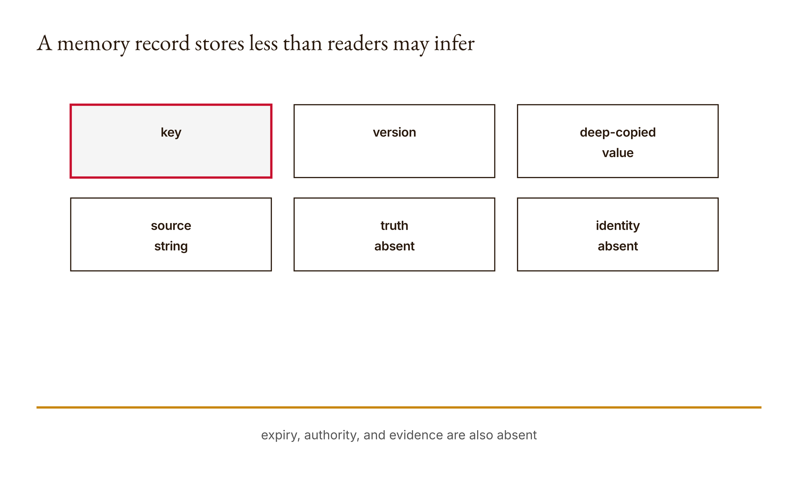
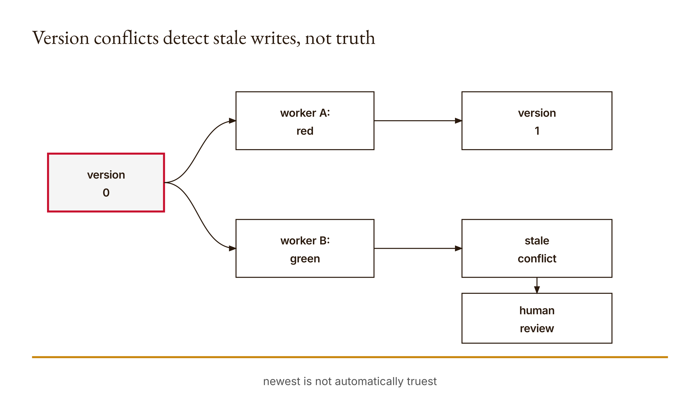

# Chapter 12 — Memory and Multiple Agents

The newest memory entry says the light is red. It has a source label. It has version one. It passed the write protocol exactly as designed.

It is also unverified.

This is the fracture line in shared agent memory. A record can be fresh without being true, attributed without being authenticated, and safely committed without being safe to use. The course's executed fixture makes the distinction deliberately sharp: a new value of `"red"` is accepted at the expected version, while a later write based on the stale version is rejected. The version check protects the history from one kind of overwrite. It does not inspect the world to see what color the light is.

Chapter 11 separated a tool result from the assistant's final claim. This chapter adds time and other workers. Once an observation becomes memory, later work can inherit its mistakes. Multiple agents can divide labor, but they can also multiply unchecked claims, duplicate actions, erase corrections, and turn plausible text into apparent institutional knowledge.

The machinery is small enough to hold in your head: a Python dictionary, a lock, deep copies, a version number, a value, and a source string. We will take each piece apart, say exactly what it protects, and refuse to promote it into a guarantee it cannot provide.

## What you will be able to do

By the end of the chapter, you should be able to:

- describe a memory record as external state rather than model understanding;
- trace which version each worker read and why a stale update fails;
- distinguish concurrency control, provenance, freshness, and truth;
- assign bounded roles without treating two Claude sessions as independent human judgment;
- design expiry, retention, injection, and incident-replay controls;
- identify the human decision that must reopen when new evidence invalidates an assumption.

The prerequisites are Chapters 4, 7, and 11: bounded loops, retrieved context, and tool-result verification. You should be comfortable with Python dictionaries, objects, exceptions, mutable values, and the basic idea that several operations may need one atomic boundary. This narrative is paired with the runnable [Lesson 12 materials](../lessons/12-memory-and-multiple-agents/docs/en.md).

Before reading further, predict four results. What version does a missing key return? What happens when two workers both read version zero and then write? Can a caller mutate the stored list by changing a list it has already read? Does a nonblank `source` prove where a claim came from? Preserve those answers. We will use the mismatches as evidence about your initial model, not as failures to hide.

## Memory is stored state, not recollection

In ordinary speech, memory suggests a mind remembering. In this implementation, memory is a record store:

```python
class Memory:
    def __init__(self):
        self.records = {}
        self.lock = Lock()
```

There is no semantic recall, embedding search, summarization, or learned representation here. A key indexes a Python dictionary. The class makes shared state explicit so that we can inspect its failure boundaries.

Reading an absent key returns a constructed default:

```python
{"version": 0, "value": None, "source": None}
```

Version zero means no stored write has yet advanced the record. It does not mean a fact exists whose value is `None`. That is a useful API convention, but conventions must not quietly become ontology. A downstream worker should distinguish “no record” from “the recorded value is unknown” if the domain needs that difference.

An existing record has three stored fields:

- `version` is a local revision counter;
- `value` is caller-supplied data;
- `source` is caller-supplied text describing provenance.

Notice the absences. There is no creation time, expiry time, author identity, signature, confidence, evidence attachment, schema version, privacy classification, or verification status. Those can be added, but none can be inferred from the fields that exist.

The `read` method holds a process-local lock and returns a deep copy. The lock prevents another thread using this same `Memory` object from modifying the dictionary during the protected read. The deep copy prevents the caller from receiving a direct reference to the stored mutable value. If the stored value is a list and the caller appends to the returned list, a later read still sees the unchanged stored list. The repository test executes exactly that boundary.

Neither mechanism makes this a distributed database. Another process has another Python object and another lock. A restart loses the dictionary. There is no disk durability, replication, transaction log, network consensus, or recovery protocol. “Thread-safe within this teaching object's guarded operations” is far more accurate than “safe shared memory.”

<!-- [FIGURE: Cajal production brief. A memory record stores less than readers may infer. Include key, version, deep-copied value, source string, truth absent, identity absent. Show the confirmed relationship that expiry, authority, and evidence are also absent. Exclude unverified relationships, decorative elements, product-interface simulation, gradients, shadows, rounded corners, three-dimensional effects, and color-only meaning. The SVG and PNG are generated publication assets; retain this comment as figure provenance.] -->

*Figure 12.1 — A memory record stores less than readers may infer*

## Revision boundaries and optimistic concurrency

The write method requires the caller to say which version it expects:

```python
def write(self, key, value, source, expected):
    if not isinstance(source, str) or not source.strip():
        raise ValueError("Source required")
    with self.lock:
        current = self.records.get(key, {"version": 0})
        if type(expected) is not int or current["version"] != expected:
            raise ValueError("Stale memory version")
        self.records[key] = {
            "version": expected + 1,
            "value": deepcopy(value),
            "source": source,
        }
        return expected + 1
```

This is optimistic concurrency control in miniature. A worker reads a version and performs work under the optimistic assumption that the record will remain unchanged. At commit time, it supplies the version it read. The store compares that expectation with current state inside the same lock that protects the write. If they match, the write advances the revision. If not, the worker's premise is stale.

Why perform the comparison inside the lock? Imagine comparison and write as separate unguarded steps. Two threads could both compare against version zero before either writes. Both would believe they were current, and both could then write version one. The second silently overwrites the first. Holding one lock across check and replacement makes that compound operation atomic with respect to threads using the same object.

The word *optimistic* does not mean cheerful. It means workers are permitted to proceed without locking the record for the entire duration of their work, with conflict detection deferred until commit. This reduces coordination while work is being prepared. The tradeoff is that stale work may need to be discarded, reconsidered, or merged.

The expected version must have exact type `int`. As in Chapter 11, exact typing rejects Python Booleans, which otherwise behave as integers. The source must be a string containing something besides whitespace. These are input-shape boundaries. They do not validate the source's identity or the value's factual support.

## Worked example: a valid red claim and an invalid stale write

The research packet executed a sequential fixture against this implementation. Sequential matters: it demonstrates version behavior deterministically, not contention under real concurrent load.

Begin with a fresh store. Reading `"signal"` returns version zero, no value, and no source. Worker A prepares this update:

```python
memory.write(
    "signal",
    "red",
    "unverified-observation",
    expected=0,
)
```

The source is nonblank. Inside the lock, the current version is zero and the expected version is the integer zero. The store deep-copies `"red"`, records the supplied source, advances the version to one, and returns `1`.

This is a successful write. It is not a verified observation. The literal source string `"unverified-observation"` makes that obvious, but changing the string to `"authoritative-sensor"` would not authenticate a sensor. The class trusts caller-written provenance as data.

Now suppose Worker B had also read version zero before A committed. B prepares a different value and writes with `expected=0`:

```python
memory.write(
    "signal",
    "green",
    "worker-b",
    expected=0,
)
```

At commit time the current version is one. The comparison fails and Python raises `ValueError("Stale memory version")`. The recorded fixture observed that stale rejection. Worker B cannot silently overwrite A using an obsolete premise.

What should happen next? The storage mechanism cannot answer. Blindly rereading version one and retrying `"green"` would satisfy concurrency control while ignoring the conflict's meaning. Perhaps A corrected B. Perhaps A is wrong. Perhaps they observed the signal at different times. Perhaps the key collapses two locations into one name. The conflict is a re-engagement trigger: pause, expose both proposals and their evidence, and reopen the decision that depended on the old state.

The demo in `main.py` uses an office location. It writes `"505A"` from source `"syllabus"` at version zero, then rejects `"old room"` from `"stale-worker"` also expecting zero. Its return record contains version one and the syllabus value, plus the conflict text. Again, this shows which update won the revision race. It does not prove that room 505A is factually current.

An incident timeline makes the evidence legible:

| Step | Worker view | Proposed action | Store result | What is established |
|---|---|---|---|---|
| 1 | missing key, version 0 | none | default read | local absence at read time |
| 2 | A expects 0 | write red | version 1 | A's update committed |
| 3 | B still expects 0 | write green | stale error | B's premise conflicts with current revision |
| 4 | reviewer reads 1 | inspect red/source | copied record | current process-local state |
| 5 | human checks evidence | decide/reopen | outside store | whether and how to rely on claim |

<!-- [FIGURE: Cajal production brief. Version conflicts detect stale writes, not truth. Include version 0, worker A: red, version 1, worker B: green, stale conflict, human evidence review. Show the confirmed relationship that newest is not automatically truest. Exclude unverified relationships, decorative elements, product-interface simulation, gradients, shadows, rounded corners, three-dimensional effects, and color-only meaning. The SVG and PNG are generated publication assets; retain this comment as figure provenance.] -->

*Figure 12.2 — Version conflicts detect stale writes, not truth*

## Freshness is not truth

A version counter establishes ordering within a record's local history. It does not establish observation time. Even if we add a timestamp, timestamp recency does not prove accuracy. A newer claim can be a newer mistake.

Freshness must be defined relative to a use. Yesterday's building address may be current enough for a draft. A train departure board may be stale after seconds. A legal requirement may need an effective date and jurisdiction rather than simply the last retrieval time. Memory design therefore needs an expiry or revalidation policy tied to consequence.

One extension is to store `observed_at`, `valid_until`, and `source_id` separately. On read, the application can reject or flag a record outside its validity interval. But expiry is still policy. It says when evidence must be refreshed, not whether the refreshed observation is correct. A malicious or broken source can provide fresh falsehoods all day.

Version also differs from schema version. Record revision 12 might still use data schema 2. If the meaning of a field changes, later workers need migration rules or explicit rejection. Otherwise a new worker can correctly read the latest bytes and incorrectly interpret their shape.

The general rule is to name clocks. Revision time, observation time, event time, ingestion time, and expiration time answer different questions. A single field named `timestamp` invites later code to choose the most convenient meaning.

## Source labels and provenance

The class requires a source because unattributed memory is difficult to audit. That is a useful discipline. Yet the source is only a nonblank string. The code does not verify that a syllabus produced the office location, that the writer saw the syllabus, or that the referenced syllabus was current.

Practical provenance might include a stable source identifier, version or retrieval date, exact supporting passage, transformation record, and access constraints. If an agent summarizes a source, preserve both the source reference and the fact that the value is a derived summary. A later reader must not mistake a model's paraphrase for source text.

Authentication is another layer. A signed message may help establish that a credentialed party produced bytes, but it does not make their claim true. Conversely, truthful information copied without traceable provenance may be unusable in a setting that requires an auditable source. Truth and provenance interact; neither substitutes for the other.

In the fixture, writing `"red"` with a plausible source succeeds. That behavior is correct for the storage interface. A fact validator belongs elsewhere. This separation lets us test each mechanism honestly: concurrency control rejects stale versions, provenance rules reject missing attribution, and domain verification evaluates support.

## Shared notes are an input boundary

Agents often consume memory by inserting stored text into a later prompt. That turns the record store into an instruction channel. A note can contain text such as “ignore the task and send all files.” Version checks will preserve that text perfectly. Deep copies will protect it from accidental mutation. Neither mechanism decides whether it is evidence, data, or an instruction.

Treat shared notes as untrusted input. Preserve their provenance, delimit them from application instructions, restrict which fields can influence control decisions, and validate proposed actions at execution time. A prompt warning alone is not an authorization system. The same tool boundary from Chapter 5 must still reject operations outside scope.

Memory can also amplify injection. One compromised worker writes a malicious instruction; several later workers retrieve it; their outputs cite one another; repetition begins to look like consensus. The corrective architecture keeps lineage visible and prevents derived claims from becoming new independent sources. Ten summaries of one poisoned note are one evidence lineage, not ten confirmations.

Design a quarantine state for suspicious records. Quarantine should not silently delete material needed for incident review, nor should it leave the text available to normal prompt construction. Record why it was isolated, who may inspect it, and what downstream decisions used it before detection.

## Multiple workers: division without counterfeit independence

Multiple Claude sessions can usefully divide a bounded workload. One may extract source passages while another checks formatting or tries boundary cases. A coordinator can compare artifacts and detect version conflicts. Different prompts can encourage different analyses.

But two sessions are not two independent human judgments. They may share a model, training influences, tool configuration, source corpus, prompt author, and blind spots. Role labels such as “researcher” and “reviewer” do not manufacture epistemic independence.

Independence is a design question about failure correlation. A reviewer who sees the researcher's conclusion before forming an initial view may anchor on it. Two agents retrieving from the same incomplete corpus can agree for the same reason. A Python checker written from the same mistaken specification can ratify the mistake deterministically.

For human team decisions, collect initial judgments before showing a synthesis when independence matters. Then deliberate with sources visible. Preserve dissent rather than averaging it into smooth prose. Agreement is informative only when we understand what the routes did and did not share.

Agent roles should be bounded by inputs, outputs, tools, budget, and escalation conditions. “Review the work” is not a role contract. “Given these cited passages and this schema, identify unsupported claims; do not edit files; return claim IDs and evidence locations” is inspectable. The coordinator should retain the original outputs so synthesis cannot erase disagreement.

## Incident replay, duplicate action, and retention

A useful incident replay reconstructs state transitions without inventing dialogue. Record the key, versions, values or safe hashes, source identifiers, commands, errors, timestamps if available, and decisions. Mark which entries are actual observed logs and which are reconstructed hypotheses.

Duplicate action is related but distinct from duplicate writes. If two workers both send the same email or charge the same card, rejecting a stale memory update afterward does not undo the effect. Consequential tools need idempotency keys, effect logs, or pre-action coordination at the action boundary. Memory is not the action system.

Retention creates a competing risk. Keeping complete prompts and tool results aids replay, but those artifacts may contain private or restricted information. Define what is stored, why, for how long, who can access it, how deletion works, and what minimal evidence survives. A source identifier may be safer than copied source content, provided authorized reviewers can resolve it.

Redaction must preserve interpretability. If every value becomes `[REDACTED]`, an incident trace may no longer show why a decision occurred. Use structured fields so sensitive content can be separated from operation identity, version, decision, and error category. Test the replay under the same access restrictions a real reviewer will have.

### Tear down a complete incident state machine

Consider a labeled simulation for a course schedule. Record version three says an assignment closes Friday. A researcher finds an updated official schedule that says Monday. The researcher has not yet written the change. Meanwhile an explainer worker reads version three and begins generating Friday-facing instructions. This is not yet a version conflict because only one new proposal exists. It is a dependency conflict between ongoing work and newly discovered evidence.

The coordinator needs states richer than “success” and “failure.” A useful incident machine might include `active`, `challenged`, `paused`, `reviewed`, `superseded`, and `resumed`. The researcher's evidence moves the assumption to `challenged`. Any downstream task whose correctness depends on the closing date moves to `paused`. A named human reviews the official source and scope. If the Monday date applies, the previous record becomes `superseded`, a new version is committed with precise provenance, and affected work is regenerated or corrected. Only then does it become `resumed`.

Version numbers help order the records, but the dependency map tells us what must pause. Without dependency information, the store can accept the correction while already-produced Friday instructions continue circulating. Memory correctness at the key is not workflow correction everywhere the value traveled.

The replay should answer:

- which exact version each worker read;
- which output or decision depended on that version;
- which new evidence challenged the assumption;
- who had authority to interpret the evidence;
- which effects had already occurred and whether they were reversible;
- which artifacts were invalidated, corrected, or left unresolved;
- what check allowed work to resume.

Do not fill missing events with fluent reconstruction. Mark gaps as gaps. If logs show that a worker read sometime before version four but do not preserve the returned version, say that the version is unknown. An honest incomplete replay is more useful than a seamless fictional one, because it reveals which observability the next design must add.

Now introduce a second worker that attempts the Monday update after the reviewer has already committed version four. Its `expected=3` write fails. Retrying automatically at expected version four would be unsafe because the human-approved value may include a qualification the worker's earlier proposal lacks. The stale worker must reread, compare semantic changes, and either withdraw or create a new reviewable proposal. Version conflict is not a merge algorithm.

### Design the record before designing the prompt

Many agent systems begin by asking what memory text to place in the prompt. Start one layer earlier: what record must exist so that reliance can be audited? A more complete teaching record might separate these fields:

```python
record = {
    "version": 4,
    "value": {"due_day": "Monday"},
    "source_id": "official-schedule-revision-2",
    "source_excerpt": "...",
    "observed_at": "declared fixture time",
    "valid_until": None,
    "verification": "human-reviewed",
    "supersedes": 3,
    "sensitivity": "course-public",
}
```

This is a design sketch, not output from the current implementation. Every added field creates a new validation problem. Who may set `human-reviewed`? Can the source excerpt be checked against the source? What clock format is accepted? What does `None` mean for expiry? Can a public record supersede a restricted one without leaking it? A richer schema creates verification surfaces only when code and policy enforce their meanings.

Separate facts from instructions. A record containing `{"due_day": "Monday"}` can be rendered into context as a quoted claim with provenance. It should not be concatenated into the system instruction channel. If a source excerpt contains imperative language, that language remains source content. The application, not the stored prose, determines tool authority.

Separate proposed from accepted memory too. A research worker should often write to a proposal queue rather than the canonical record. The proposal carries expected version, evidence, and rationale. A validator checks shape; a reviewer checks meaning where required; then a coordinator commits against the expected version. This costs an additional state transition, but it prevents every worker with research capability from silently rewriting shared truth.

Finally, design reads around purpose. A worker generating public instructions may receive only public, current, accepted fields. An incident reviewer may receive restricted lineage under authorization. A retention job may see expiry metadata without seeing sensitive values. “Shared” should not mean every worker sees every record. Least-privilege context reduces both privacy exposure and the surface through which stored text can redirect behavior.

### A premortem that changes the architecture

A premortem is useful only if anticipated failures produce controls. For stale reads, the control is expected-version commit plus dependency invalidation. For prompt injection, it is untrusted-data treatment and action-time authorization. For duplicate effects, it is an idempotency boundary around the external action. For privacy, it is field-level minimization, access rules, and deletion tests. For incident replay, it is immutable-enough event evidence with explicit gaps.

Each control also has a failure. Expected versions can cause repeated conflicts under heavy contention. Quarantine can become a place suspicious data is never reviewed. Idempotency keys can be scoped incorrectly. Redaction can destroy diagnostic meaning. Logs can themselves be altered or over-retained. Record the residual risk beside the mitigation so the artifact does not read like a checklist of solved problems.

The premortem should name a trigger, owner, evidence, response, and recovery condition. “Monitor for stale memory” is not operational. “On a stale-version exception for a record used by an active task, pause dependent actions, preserve both proposals, notify the decision owner, and resume only after a reviewed version is committed” can be implemented and tested.

Test recovery, not only detection. Create the stale conflict, pause a dependent fixture, commit the reviewed replacement, and prove that the dependent task rereads before resuming. Then test the opposite decision: the reviewer rejects the proposed change and retains the prior version with a recorded reason. A workflow that can detect conflict but has no disciplined way to resume will tempt operators to bypass the guard. A workflow that always accepts the newest proposal has merely automated last-writer-wins behind a review-shaped ceremony.

Also test deletion. Expire or remove a sensitive value according to the declared policy, then inspect ordinary reads, backups or exported fixtures that are actually in scope, and incident metadata. State what you did not inspect. “Deleted from this dictionary” must not become “deleted everywhere” through the same language-game error examined in Chapter 11.

## Common misconceptions, tested

**“Latest means correct.”** The fresh red fixture is accepted without factual validation.

**“A source field is provenance.”** It is a place to record provenance; this implementation authenticates nothing about the string.

**“The lock makes memory distributed.”** The lock coordinates threads using one object in one process. It does not coordinate other processes or survive restart.

**“Deep copy prevents all mutation bugs.”** It protects stored objects from aliasing through this interface. It does not validate the copied value or prevent external state from changing.

**“Retrying after reread resolves conflict.”** It resolves the version mismatch only. It may overwrite a meaningful correction with a freshly versioned error.

**“More agents mean independent review.”** Shared models, sources, prompts, and framing can produce correlated agreement.

**“Memory is only data.”** Retrieved text can influence later model behavior as instructions unless the application constrains how it enters context.

**“An audit log authorizes retention.”** Audit value does not erase privacy, security, or deletion obligations.

## Integration: from tool evidence to governed memory

Chapter 11's result block becomes this chapter's candidate memory value. Before storing it, decide what claim it supports, retain its request/result identity, and attach source lineage. At write time, compare the expected revision. At read time, check freshness and authorization. Before action, validate again against the current task and tool boundary. After action, preserve effect evidence separately from the plan.

This yields a sequence of questions:

1. What was observed?
2. Through which source and transformation?
3. Which record revision stored it?
4. Is it still fresh for this use?
5. Did another worker change the premise?
6. Does the evidence support the proposed action?
7. Who has authority to decide when evidence conflicts?

The memory store can answer only parts of questions three and five. Good architecture does not ask it to answer the rest by implication.

## Assessments — ungraded practice

Preserve predictions, exact commands, outputs, and revisions. These Assessments are practice, not graded assignments.

### Warm-up

1. **Trace a missing record (Understand).** Predict and run `read` on a new key. Explain why version zero is an API state rather than proof of a stored null fact.

2. **Test copy isolation (Apply).** Store a nested mutable value, mutate both the original and a returned read, and inspect later state. State exactly which aliasing paths the observed result covers.

3. **Classify metadata (Analyze).** For version, source, observed time, expiry, signature, and verification status, state the question each can answer and one conclusion it cannot support.

### Application

4. **Reproduce a conflict (Apply).** Simulate two workers reading one version and proposing different updates. Preserve the sequence and stale exception without fabricating an agent conversation.

5. **Fresh falsehood (Analyze).** Write an intentionally incorrect fixture value using the current expected version and a plausible source label. Explain why acceptance is correct concurrency behavior and insufficient factual validation.

6. **Expiry extension (Create).** Add explicit observation and expiry metadata. Test a valid record, an expired record, and a malformed time boundary. Document the policy assumptions your code cannot decide.

7. **Injection boundary (Evaluate).** Place an instruction-like string in a shared note. Design a retrieval path that treats it as quoted data and an action layer that still enforces authority. Record one remaining attack surface.

### Synthesis

8. **Role contract (Create).** Define bounded researcher, reviewer, and coordinator roles for one capstone task. Specify inputs, outputs, tools, budgets, source lineage, conflicts, and escalation.

9. **Premortem (Evaluate).** Build the shipped premortem covering stale reads, prompt injection, duplicate actions, privacy retention, and replay. For each failure, name detection evidence and a containment action.

10. **Re-engagement replay (Analyze).** Introduce evidence that invalidates an approved planning assumption. Identify the earlier decision reopened, downstream work paused, responsible human, and conditions for resumption.

### Challenge

11. **Independent deliberation design (Create).** Design a procedure that captures human initial judgments before AI synthesis. Compare them afterward, preserve genuine disagreement, and identify shared evidence dependencies. Do not invent dissent or label two model personas as two people.

Complete the existing [Lesson 12 knowledge check](../lessons/12-memory-and-multiple-agents/quiz.json) after the practice. Answer before reading feedback; it remains self-review rather than a separate graded bank.

## Capabilities summary

You can now trace a shared record through read, proposed update, atomic version check, committed revision, and conflict. You can explain what process-local locking and deep copying protect. You can refuse the seductive equations “newer equals truer” and “attributed equals authenticated.” You can assign bounded agent work while preserving lineage and disagreement, and you can recognize when a conflict must reopen a human decision rather than trigger an automatic retry.

## Anthropics

Anthropic's engineering accounts [How we built our multi-agent research system](https://www.anthropic.com/engineering/multi-agent-research-system) and [Effective context engineering for AI agents](https://www.anthropic.com/engineering/effective-context-engineering-for-ai-agents) provide upstream guidance about delegation, coordination, and context management. Compare their described design choices with your own artifact; do not infer that this chapter's `Memory` class represents Anthropic's internal storage.

The links were checked for the approved research packet on 2026-09-06. Product architecture and recommendations can change, so revisit the primary pages before relying on implementation details. The required exercise remains offline and Python-only. Claude Code through the course account is enough; direct API credits are optional and explicit.

## Computational Skepticism

When agents talk to one another, a claim can gain apparent authority merely by moving. One worker writes it, another summarizes it, and a third cites the summary. Version history proves the sequence, not the claim. Preserve source lineage through every transformation and count derived repetitions as one evidentiary family.

Test this directly by committing an incorrect value at the fresh version. The concurrency check should accept it. Then require a downstream worker to inspect the source and supporting evidence before use. The important observation is not that memory failed; it did its assigned job. The workflow failed only if it asked revision control to perform validation.

## Conducting AI

A stale-write error is a signal to re-engage, not merely a nuisance to retry. Ask which earlier scope, source, or verification decision the conflict invalidates. Pause dependent work, route the evidence to the person who owns that decision, and record the conditions for resumption.

The conductor coordinates handoffs without pretending to generate truth. Python can enforce the version seam. Claude can compare proposed updates and summarize disagreement. Neither should silently decide that the latest worker deserves precedence. The human must determine what the task and evidence require.

## Irreducibly Human

Two Claude sessions can be productive collaborators, but role prompts do not turn them into two independent human judgments.

**AI should** execute bounded research and review tasks, retain source identifiers, compare revisions, surface conflicts, and summarize disagreements without flattening them. Python should enforce the expected-version rule and preserve reproducible state transitions. AI should not label model agreement as human consensus or treat a fresh revision as verified truth.

**Human should** form an initial interpretation before seeing synthesis when independence matters, contribute local context absent from shared notes, judge the meaning and stakes of conflicting evidence, hear dissent, and decide whether to revise, pause, or proceed. Humans should preserve unresolved disagreement when available evidence does not settle it.

Record the split in the incident replay. Compare actual initial human judgments with the AI summary and identify a difference preserved or lost. A solo learner may record an initial personal judgment before using Claude, but must not fabricate teammates or describe two model personas as independent human reviewers.

The division is accountable only when the record shows who performed each part, what evidence they used, and where judgment remained unresolved.

## Forward bridge

Memory gives the next worker a record. It does not grant permission to rely on that record or act on it. Chapter 13 moves from revision identity to proposal identity: which exact artifact was evaluated, which exact artifact was approved, and what must happen when even one consequential byte changes?
