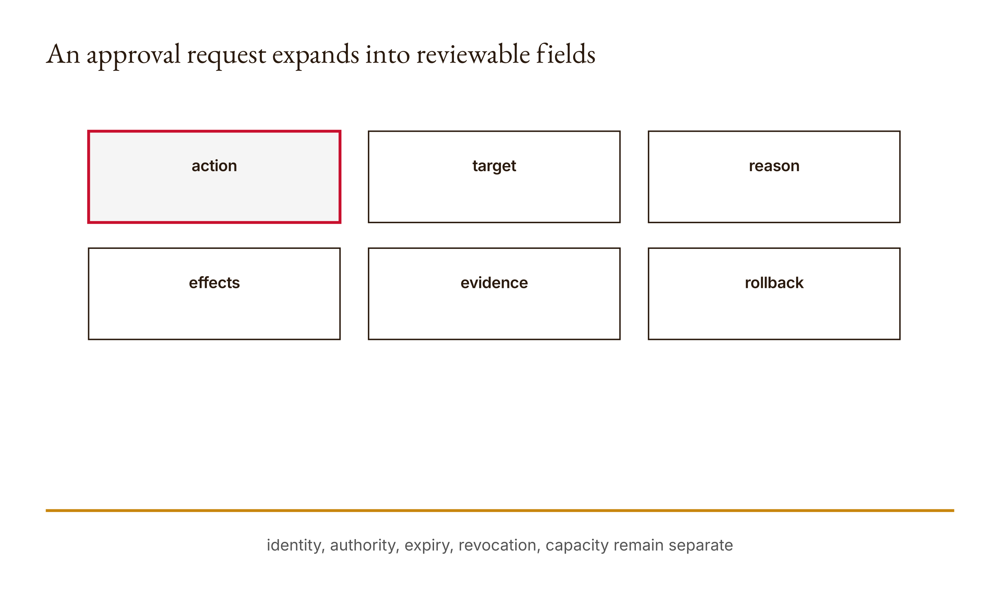
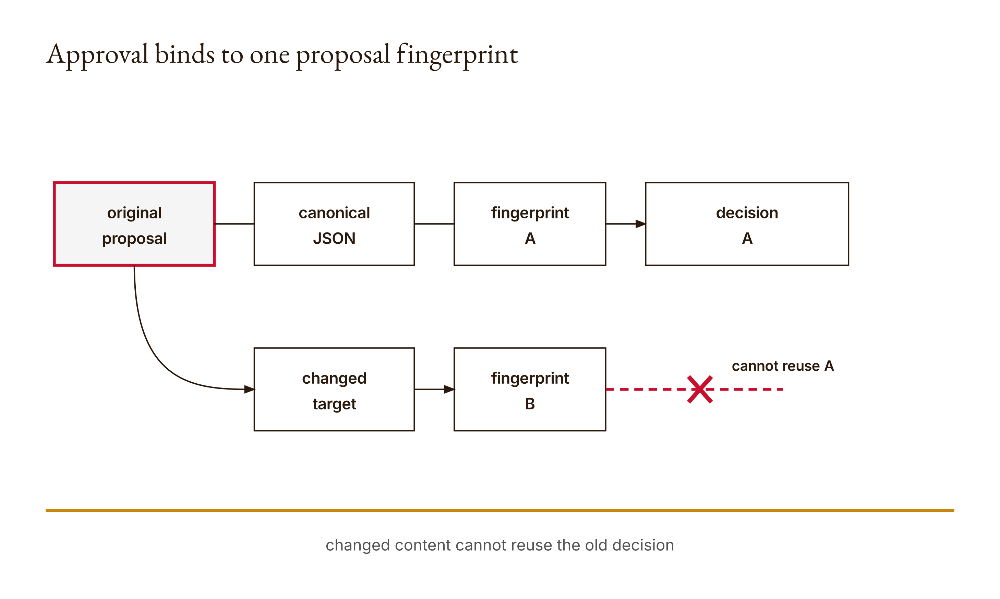

# Chapter 13 — Evaluation and Human Approval Gates

An approval can survive after the thing it approved has disappeared.

That is the opening failure. A reviewer sees a proposal to write `report.md`, examines its evidence, and approves. Later, the target changes to `elsewhere`. If the system retains only a generic `yes`, the old decision can be presented as permission for the new action. The visible ceremony remains—there was a button, a name, a timestamp—but the authorization has drifted away from its object.

The course fixture makes the remedy inspectable. It turns six proposal fields into a stable serialized representation, computes a SHA-256 fingerprint, and records that fingerprint with a simulated decision. The decision matches the original proposal. Change the target and the same decision no longer matches. This demonstrates content binding. It does not demonstrate a real person's consent, the approver's identity, their authority, their comprehension, or the proposal's safety.

This chapter tears down both halves of an approval gate: evaluation produces evidence about a proposal, and authorization records a responsible decision about that exact proposal. Automated checks can prepare the decision. A fingerprint can prevent unnoticed content drift. Neither can perform the human judgment hidden inside the word *approve*.

## What you will be able to do

By the end of the chapter, you should be able to:

- write an approval request that names action, target, reason, effects, evidence, and rollback;
- explain why canonical serialization precedes content fingerprinting;
- bind a simulated decision to one exact proposal and reject changed content;
- separate task evaluation, policy compliance, reviewer burden, and human authorization;
- identify missing identity, authority, expiry, revocation, and replay controls;
- design a gate that supports refusal, deferral, and escalation rather than manufacturing consent.

You should have completed Chapters 5 and 10–12 on authority boundaries, plans, tool evidence, and versioned memory. Hashes are introduced here by their operational role; cryptographic internals are outside the lesson. You need Python dictionaries, JSON, Boolean logic, and tests. This narrative is paired with the runnable [Lesson 13 materials](../lessons/13-evaluation-and-approval-gates/docs/en.md).

Before inspecting the mechanism, predict four outcomes. Will changing dictionary key order change the fingerprint? Will changing only the target change it? Will an approval containing the right fingerprint but no approver name pass? Does a matching fingerprint prove that a particular human approved? Preserve your answers before running anything.

## A gate is not a button

An interface can ask “Allow?” while concealing nearly everything a decision requires. Allow what action? Against which target? For what purpose? With which foreseeable effects? On what evidence? How can it be undone? A generic prompt moves the cognitive burden onto the reviewer at the moment of interruption, often without supplying the needed context.

The reference proposal requires six fields:

```python
FIELDS = (
    "action",
    "target",
    "reason",
    "effects",
    "evidence",
    "rollback",
)
```

The fields are a minimum teaching contract, not a universal governance schema. They force the request to expose basic decision material.

`action` says what operation will occur. “Update” may still be too vague; “overwrite one local Markdown file” is more reviewable. `target` identifies the object or destination. A display name without a resolved path, account, environment, or recipient may conceal the consequential difference. `reason` ties the action to the task rather than merely describing capability. `effects` names anticipated changes, including external and irreversible ones. `evidence` points to checks that support proceeding. `rollback` states how recovery would work and should admit when rollback is partial or impossible.

Filling every field is structural validity. A proposal can contain six fluent, meaningless strings and pass the current `fingerprint` precondition because Python checks only that each retrieved value is truthy. The word “meaningful” in the error message expresses intended use more strongly than the implementation can enforce. Human and domain evaluation still matter.

<!-- [FIGURE: Cajal production brief. An approval request expands into reviewable fields. Include action, target, reason, effects, evidence, rollback. Show the confirmed relationship that identity, authority, expiry, revocation, capacity remain separate. Exclude unverified relationships, decorative elements, product-interface simulation, gradients, shadows, rounded corners, three-dimensional effects, and color-only meaning. The SVG and PNG are generated publication assets; retain this comment as figure provenance.] -->

*Figure 13.1 — An approval request expands into reviewable fields*

## Evaluation comes before authorization

Evaluation asks what happened, what could happen, and how well the proposal meets a stated criterion. Authorization asks whether a responsible person or policy permits the action. These questions interact, but combining them creates misleading gates.

A test suite can evaluate selected behavior. It cannot decide whether a destructive change is worth making. A policy checker can flag an unapproved directory. It cannot determine whether an exception serves the affected people. A model grader can score an output against a rubric. Its score is itself evidence with scope and failure modes, not a human decision.

Build evaluation sets around tasks, expected outcomes, refusal cases, and boundary failures. Preserve trials and transcripts where appropriate, but distinguish them from actual outcomes. A tool trace showing that a command ran is not the same as an observation that the intended state exists. Chapter 11's false final claim is a reminder: success narration is not an outcome check.

Evaluation sets also exclude. A set built from ordinary successful writes may say nothing about symlinks, permission errors, concurrent changes, private data, or malicious paths. Record those exclusions beside the result. “Passed 20 cases” is uninterpretable until a reviewer can see which cases and why they represent the intended use.

At least one evaluation case should require refusal. Otherwise a system that always proceeds can appear perfect. Another should contain a structurally complete but substantively weak proposal. That case tests whether the review process reads meaning rather than treating field presence as safety.

Separate metrics that can pull against one another. Task success may rise while invalid action rate rises. Reviewer burden may fall because the gate hides detail, while informed decisions worsen. Time-to-approval may improve because reviewers click reflexively. A gate design needs a portfolio of evidence, including errors and deferrals, not one celebratory rate.

## Canonical content and its fingerprint

The reference implementation begins by checking the proposal:

```python
def fingerprint(proposal):
    if not isinstance(proposal, dict) or any(
        not proposal.get(key) for key in FIELDS
    ):
        raise ValueError("Six meaningful gate fields required")
```

A non-dictionary fails. A missing field fails. An empty string, zero, false value, empty list, or other falsey value in a required field also fails. Extra fields do not fail; they become part of the serialized proposal and therefore affect its fingerprint. That detail matters. The six named fields are minimum requirements, not an exact-key schema.

Next, Python serializes the entire dictionary:

```python
encoded = json.dumps(
    proposal,
    sort_keys=True,
    separators=(",", ":"),
).encode()
```

JSON objects do not conceptually depend on insertion order, but Python dictionaries preserve one. If two equivalent proposals were serialized in their construction order, they could produce different byte sequences merely because fields were inserted differently. `sort_keys=True` canonicalizes key order for this bounded representation. Compact separators remove default spaces so formatting choices do not alter the bytes.

The six tests confirm that reversing dictionary item order does not change the resulting fingerprint. This is an observed property of the course function for its JSON-compatible fixture, not a claim of universal canonical JSON. Numbers, Unicode normalization, unsupported objects, duplicate keys arriving in raw JSON, and cross-language serialization require additional specifications.

The bytes go to SHA-256 and the function returns a hexadecimal digest:

```python
return hashlib.sha256(encoded).hexdigest()
```

The test expects a length of 64 hexadecimal characters. Operationally, the digest serves as a compact content identity. If the serialized proposal changes, the comparison should fail. The chapter does not use the digest as encryption, secrecy, a signature, or proof of authorship. Hashing public content does not hide it. Anyone can calculate a digest. No private signing key appears in this implementation.

## The approval predicate

The second function asks whether a decision matches the current proposal:

```python
def approved(proposal, decision):
    return (
        isinstance(decision, dict)
        and decision.get("approved") is True
        and isinstance(decision.get("approver"), str)
        and bool(decision["approver"].strip())
        and decision.get("fingerprint") == fingerprint(proposal)
    )
```

Every condition has a narrow meaning. The decision must be a dictionary. `approved` must be the exact Boolean `True`, not a truthy string such as `"yes"`. The approver field must be a nonblank string. The recorded fingerprint must equal a newly computed fingerprint of the proposal now under consideration.

If these conditions hold, the teaching function returns `True`. Read that as “this decision record has the required shape and content binding.” Do not read it as “a real authorized human gave informed consent.” The string `"human"` in the test is fixture data. The implementation has no login, signature, organizational role registry, delegation rule, expiry time, revocation list, decision ID, or evidence that a person saw the proposal.

This naming tension is pedagogically useful. A function called `approved` tempts us to repeat its Boolean as a broad institutional fact. Careful documentation narrows the claim: the predicate validates a small decision-record contract. Production authorization requires additional systems and policies.

<!-- [FIGURE: Cajal production brief. Approval binds to one proposal fingerprint. Include original proposal, canonical JSON, fingerprint A, simulated decision A, changed target, fingerprint B. Show the confirmed relationship that changed content cannot reuse the old decision. Exclude unverified relationships, decorative elements, product-interface simulation, gradients, shadows, rounded corners, three-dimensional effects, and color-only meaning. The SVG and PNG are generated publication assets; retain this comment as figure provenance.] -->

*Figure 13.2 — Approval binds to one proposal fingerprint*

## Worked example: approval that cannot follow a changed target

The demo constructs this proposal:

```python
proposal = {
    "action": "write",
    "target": "report.md",
    "reason": "deliver draft",
    "effects": "one local file",
    "evidence": "source checks passed",
    "rollback": "restore previous file",
}
```

All six required values are nonempty. `fingerprint(proposal)` sorts the keys, uses compact JSON, encodes the text, and returns a 64-character SHA-256 hexadecimal string. The exact recorded digest can be reproduced through the research script; we do not need to pretend it carries semantic meaning. It identifies the serialized content under this function.

Now construct a clearly labeled simulated decision:

```python
decision = {
    "approved": True,
    "approver": "simulated-reviewer",
    "fingerprint": fingerprint(proposal),
}
```

Calling `approved(proposal, decision)` returns true under the teaching predicate. This is a fixture result, not a human sign-off. The decision was generated to test the content-binding mechanism.

Change one field after the simulated decision:

```python
changed = dict(proposal)
changed["target"] = "elsewhere"
```

The changed dictionary serializes to different bytes and receives a different fingerprint. `approved(changed, decision)` returns false because the old digest no longer equals the current proposal's digest. The approved research fixture observed this original-match and changed-content rejection.

The rejection is exactly what we want. The system does not ask whether “elsewhere” is similar, safer, or probably what the reviewer meant. A changed target creates a new decision object. The reviewer must see the new proposal and decide again.

Now change only dictionary insertion order while preserving all key-value pairs. The test demonstrates that the fingerprint remains the same because keys are sorted before serialization. This is a representation change, not a proposal change. A gate should avoid demanding new approval for irrelevant formatting while reliably detecting consequential content changes.

The distinction depends on canonicalization policy. If whitespace inside a string changes, the current fingerprint changes. If two path spellings resolve to the same file, they still hash differently as strings. Conversely, a target string could remain identical while the filesystem object it refers to changes. Content binding is only as semantic as the proposal representation. A high-stakes gate may bind resolved identifiers, immutable versions, or object hashes rather than friendly text alone.

An evidence table keeps the claims honest:

| Observation | Supported conclusion | Unsupported conclusion |
|---|---|---|
| six fields are truthy | minimum shape passes | descriptions are adequate |
| same data, reversed insertion | course digest is order-insensitive | all JSON implementations agree |
| target change, digest mismatch | serialized proposal changed | changed action is necessarily harmful |
| decision matches original digest | record binds to original content | named person authenticated |
| predicate returns true | fixture contract passes | informed, authorized consent occurred |

## Scope, expiry, revocation, and replay

Approval needs scope beyond content. A reviewer may approve one execution, one environment, one time window, one data set, or one maximum effect. If the proposal says “write report.md” but the operation can repeat indefinitely, the content fingerprint alone does not limit replay.

Add a unique decision ID and consumption state for single-use actions. Check and consume the ID atomically at the effect boundary. Otherwise two workers can present the same valid decision simultaneously. Chapter 12's memory version can help coordinate, but the authorization service must own the rule where the action occurs.

Expiry should use an explicit time basis and comparison policy. A deadline in local time without zone is ambiguous. More important, expiry is not just a timer: new evidence can invalidate approval early. Revocation provides a way to withdraw a still-unexpired decision. Record who revoked, under what authority, which proposal is affected, and how already-started work is handled.

Bind relevant environment identity. Approval for a test database must not authorize production merely because the query text matches. Bind resolved target, account, repository revision, data classification, tool version, or other context required by the risk. Avoid adding fields indiscriminately; add the identities whose change should force reconsideration.

Rollback claims need evaluation too. “Restore previous file” assumes a previous copy exists, the writer can access it, no dependent effects have occurred, and restoration is semantically sufficient. Sending a message, disclosing data, or triggering a payment may be irreversible. A gate should say “no complete rollback” rather than inventing reassurance.

## Human attention is a finite gate resource

A perfectly bound proposal can still receive superficial review. If agent output volume grows faster than human review capacity, the gate becomes a queue or a click ritual. Speeding up the button does not restore judgment.

Model reviewer workload explicitly. While one proposal awaits review, later dependent actions remain blocked. Define queue limits, priorities, expiry while pending, and escalation. Low-risk reversible actions may follow a different policy than irreversible external effects. Do not let urgency labels written by the proposing model determine priority without validation.

Measure actual review time only when you actually measured it. Otherwise state a design assumption. Track refusal and deferral, not just approvals. If every decision is yes, investigate whether reviewers have meaningful options, adequate evidence, and organizational support for saying no.

AI can reduce burden by checking completeness, highlighting diffs, grouping evidence, and identifying missing rollback claims. It should not suppress inconvenient evidence to improve throughput. The review interface should make the consequential delta prominent: target changed from `report.md` to `elsewhere`, evidence unchanged, prior approval invalid.

## Attestation and accountability

A useful decision record says what was checked, what remains unchecked, what evidence was relied upon, what scope was approved, and who made the decision under which authority. It permits the reviewer to decline or defer.

The fingerprint binds that record to content. It cannot show that the reviewer opened the test report, understood the target, had enough time, or was free from coercion. Those are process and organizational questions. A signature can strengthen identity evidence but still cannot prove comprehension.

Preserve unresolved gaps. A reviewer might say: “The local tests pass, but remote publication permissions and data licensing are unverified; defer.” That is a successful gate outcome. Treating anything other than approval as system failure creates pressure to manufacture certainty.

An attestation should also avoid unlimited personal liability. Governance must name organizational owners and escalation paths, not place every consequence on the person who clicked. The purpose is accountable decision-making, not blame automation.

## Common misconceptions, broken by the fixture

**“A hash proves approval.”** It identifies content under a serialization rule. It contains no identity or decision.

**“A matching name authenticates a person.”** Any caller can write a string in this teaching implementation.

**“All six fields means the proposal is safe.”** Truthy filler passes the structural check.

**“A green evaluation authorizes deployment.”** Evaluation evidence informs a decision; authority is separate.

**“Approval follows a small edit.”** Any bound consequential change needs a new decision. Similarity is not consent.

**“Rollback makes the action harmless.”** Rollback may be incomplete, untested, or impossible after external effects.

**“Silence means proceed.”** Timeout, absence, or queue delay is not approval.

**“More review prompts create more oversight.”** Beyond available attention, they can create habituation and ceremonial clicking.

## Designing an evaluated approval gate

Start with one consequential action in your capstone. Write its six-field proposal in concrete language. Replace friendly targets with resolved identities where needed. Attach evaluation artifacts that can contradict the success claim. Include a refusal case and a complete-but-weak case in the evaluation set.

Calculate the fingerprint only after the proposal is ready for review. Freeze or copy the reviewed representation so it cannot mutate unnoticed. Present the exact consequential diff if a new proposal replaces it. Store simulated decisions as simulations; never fabricate a classmate's or stakeholder's approval.

Then enumerate production gaps: authentication, authorization registry, single-use consumption, expiry, revocation, audit access, privacy retention, queue behavior, and incident response. You do not need to build an enterprise authorization service for this lesson. You do need to avoid claiming that the teaching Boolean is one.

Finally, verify the outcome after action. Approval permits a bounded attempt; it does not guarantee the intended result. Preserve the proposal fingerprint, effect evidence, and post-action check as separate linked records.

### Build an evaluation set that can embarrass the proposal

An evaluation set should be capable of producing evidence you do not want. If every case was selected after the implementation was observed, and every expected answer was adjusted until it passed, the set records accommodation rather than evaluation.

Begin with the intended decision. For a file-writing action, the question might be whether the proposed change is confined to one allowed file, preserves required content, passes relevant checks, and has a credible recovery path. Turn each clause into observable cases before revising the mechanism. Include ordinary success, because a gate that always refuses is not useful. Then include boundary and refusal cases whose correct outcome is to stop.

A compact set for the chapter fixture can include:

| Case | Construction | Expected gate behavior | Why it matters |
|---|---|---|---|
| exact original | six concrete fields and matching simulated decision | content match | establishes happy path |
| reordered keys | same values, different insertion order | same fingerprint | removes irrelevant representation noise |
| changed target | copy with another destination | reject old decision | blocks approval drift |
| missing rollback | required value absent | reject proposal shape | exposes incomplete review material |
| vague evidence | evidence says only “looks good” | structural pass, human defer | distinguishes shape from substance |
| replayed decision | same record consumed twice | reject second use in extension | constrains effect count |

The fifth case is especially important. The current Python function will fingerprint a vague statement because it is nonempty. That is not a failing test if the function's contract is structural content binding. It becomes a workflow failure only if later documentation claims that the function evaluated evidence quality. Tests should clarify responsibility rather than force one helper to pretend it owns the entire decision.

Lock expected outcomes before running. When observation differs, investigate whether the implementation, test expectation, or original requirement is wrong. Preserve the change. A test suite becomes learning evidence when it shows which model was revised and why.

Use held-out cases where feasible. Development cases help build the boundary. Held-out cases test whether revisions generalized beyond examples already inspected. With a tiny educational fixture, do not inflate one held-out result into a reliability percentage. Report the cases and exclusions directly.

Model graders can assist with qualitative fields, but their judgments need calibration and failure analysis. A model may reward fluent rollback prose that omits an irreversible effect. Pair qualitative grading with deterministic checks and human review proportional to the stakes. If two graders share the same prompt assumptions or underlying source error, agreement may still be correlated.

The evaluation report should preserve task inputs, expected behavior, actual output, grader or checker, and rationale for discrepancies. A single aggregate score discards the failure trace the reviewer most needs. Show the changed-target failure beside the pass count.

### The approval interface is part of the control

Even a strong backend predicate can be undermined by presentation. If the reviewer sees only a friendly summary while the fingerprint covers hidden fields, their decision binds to bytes they did not meaningfully inspect. If the interface truncates a target, hides environment identity, or collapses effects behind a disclosure panel, the record may be mechanically exact and socially uninformed.

Present the action and target first. Highlight differences from any previously reviewed proposal. Keep evidence claims linked to their artifacts rather than copying only a green label. Make irreversible effects and absent rollback visually unavoidable. Provide approve, refuse, and defer as genuine choices, plus a way to request clarification without losing the proposal under review.

The decision should bind to the representation the person actually saw, together with any referenced immutable artifacts. If evidence can change at the same URL after approval, binding only the proposal text leaves another substitution path. Store evidence versions or digests where appropriate, while respecting retention and privacy constraints.

Avoid dark patterns. A default selected approval, a prominent green continue button beside a muted refusal link, repeated low-value prompts, or urgency language generated by the requesting agent can bias action. Interface design cannot guarantee deliberation, but it can either protect or consume attention.

Review context should include why the human is the decision owner. A person may understand the proposal and still lack authority over the target, affected data, or external recipient. Offer escalation without forcing them to impersonate an approver to keep work moving.

After a decision, show the bound fingerprint or stable proposal identifier in the audit view, not as a string the reviewer must mentally compare. At execution, the application recomputes and checks it. If it mismatches, display the changed fields and return to review. Never invite the model to explain why the old approval “probably still applies.”

### Backlog simulation: when the gate becomes a queue

Suppose five proposals arrive while one reviewer can carefully inspect two during the stated period. This is a labeled capacity assumption, not a measured result. A naive system shows all five as urgent and lets dependent agents wait indefinitely. A governed system classifies consequence, preserves arrival and dependency information, and applies a declared queue policy.

Proposal A is a reversible local formatting change. B sends material to an external recipient. C changes a production target. D duplicates B's effect. E depends on C. The system can automatically run structural and evaluation checks for all five, but it cannot manufacture three more units of human attention.

B and C may receive priority because their effects are external or high-impact. D should be detected as a potential duplicate and held. E remains blocked on C. A may wait, expire, or proceed under a separately authorized low-risk policy if one genuinely exists. The point is not that this ordering is universally correct; it is that someone must choose and document the policy before the proposing model labels its own work urgent.

If the queue exceeds capacity, pause intake, narrow scope, add qualified reviewers, or defer work. Reducing the information shown until reviewers can click faster is not capacity planning. Track the age of pending decisions and invalidate them when their evidence or environment becomes stale. Approval obtained after its premises expire is another form of content drift.

In your artifact, report how many proposals were simulated, the assumed capacity, which remained blocked, and the escalation rule. Do not turn assumed minutes into observed productivity. The honest result may be that safe throughput is lower than agent production. That is a design finding, not an inconvenience to conceal.

Capacity also changes the appropriate automation boundary. If reviewers repeatedly receive nearly identical, low-consequence proposals, the team can examine whether a narrow standing policy should authorize that class with monitoring and revocation. That is a governance decision, not an agent shortcut. Define the class precisely, test its exclusions, and keep actions outside it gated. Conversely, rare irreversible proposals may deserve two distinct reviewers or specialist consultation. The number of clicks is not the risk measure.

Review quality needs a feedback loop. Sample completed decisions, compare predicted effects with observed outcomes, examine refusals that prevented harm, and inspect approvals later reversed. Use findings to revise proposal fields, evaluations, routing, and staffing. Do not score reviewers merely on throughput; that incentive trains the gate to become ceremonial.

Document surprises as carefully as successes. An unexpected harmless outcome can reveal an overly broad refusal rule; an unexpected consequence can reveal missing evidence or scope. Both should change the next evaluation set before another approval is requested.

## Integration with the course architecture

The plan from Chapter 10 creates a proposed step. Chapter 11 supplies execution evidence. Chapter 12 stores versioned state and exposes conflicts. This chapter binds evaluation and authorization to the exact action representation that crosses the boundary.

The sequence should be visible:

1. construct a proposal from the current plan and state;
2. validate required fields and policy boundaries;
3. run scoped evaluations and record exclusions;
4. freeze the exact proposal and compute its fingerprint;
5. present evidence and consequential effects to an authorized reviewer;
6. record approve, refuse, or defer against that fingerprint;
7. recheck fingerprint, expiry, revocation, and use constraints at execution;
8. observe the actual outcome and preserve it separately.

Changing the proposal returns the workflow to step three or earlier. A valid old approval is evidence about history, not authority for the new object.

## Assessments — ungraded practice

These Assessments are ungraded. Preserve predictions, commands, outputs, failed cases, and revised decisions.

### Warm-up

1. **Read the proposal contract (Understand).** Explain each required field and construct one falsey value that the current function rejects. State why truthiness is not semantic adequacy.

2. **Trace canonicalization (Apply).** Predict whether reversed insertion order changes the digest, run the test, and explain the role of sorted keys and compact separators.

3. **Classify gate claims (Analyze).** Sort ten claims into structure, content identity, evaluation, authentication, authority, consent, or outcome. Name evidence for each.

### Application

4. **Changed-target rejection (Apply).** Create a simulated decision for one proposal, change only the target, and demonstrate rejection. Clearly label the decision as fixture data.

5. **Weak complete proposal (Evaluate).** Construct six nonempty fields whose content is inadequate. Explain why the structural check passes and which reviewer question exposes the weakness.

6. **Evaluation set (Create).** Build a small set containing a success, malformed proposal, refusal case, changed-content case, and structurally complete weak case. Record exclusions.

7. **Single-use extension (Create).** Add a decision ID, deadline, and atomic consumption rule. Test expiry and replay without claiming identity authentication.

### Synthesis

8. **Outcome contradiction (Evaluate).** Design a post-action check that can contradict the agent's success sentence. Explain what its evidence establishes and what remains outside scope.

9. **Attestation (Create).** Write a decision record naming checks performed, unchecked gaps, evidence, authority scope, and approve/refuse/defer outcome. Bind it to a simulated proposal.

10. **Review backlog (Analyze).** Simulate several pending proposals under one stated review budget. Show which actions remain blocked, which expire, and which escalate. Label time values as assumptions unless measured.

### Challenge

11. **Gate threat model (Create).** Analyze mutation after display, target aliasing, decision replay, stolen identity, reviewer overload, misleading rollback, and revoked approval. Choose controls and state residual risk for each.

Complete the existing [Lesson 13 knowledge check](../lessons/13-evaluation-and-approval-gates/quiz.json) after the practice. It is self-review, not another graded assessment bank.

## Capabilities summary

You can now turn an ambiguous permission prompt into a reviewable six-field proposal, serialize it consistently, fingerprint its content, and reject a simulated approval after the proposal changes. You can explain why this establishes content binding and nothing more. You can separate evaluation from authorization, make refusal and deferral first-class outcomes, and design for expiry, revocation, replay, outcome checks, and finite human attention.

## Anthropics

Anthropic's [Demystifying evals for AI agents](https://www.anthropic.com/engineering/demystifying-evals-for-ai-agents) distinguishes evaluation components and emphasizes examining what an agent actually did, not merely its final answer. Use it to refine your tasks, trials, graders, transcripts, and outcome checks. Anthropic's [Claude Code permissions](https://code.claude.com/docs/en/permissions) documents current product behavior to compare with your course gate.

These primary links were checked for the approved research packet on 2026-09-06. Product behavior and rolling documentation can change. The six-field proposal and Python fingerprint are course mechanisms, not representations of Anthropic's authentication system. Required work stays offline; any direct API use is optional and explicit.

## Computational Skepticism

Accountability requires an attestation that can say no. Attach to the proposal what was checked, what remains unchecked, who made the decision, and what the evidence warrants. Preserve an unresolved gap that causes refusal or deferral.

The fingerprint makes a content substitution visible. It does not show that the reviewer performed the named checks, understood the effect, or possessed authority. If the record says “source checks passed,” require the actual check evidence. An attestation is testable because its claims can be compared with a trace, not because it sounds formal.

## Irreducibly Human

A gate needs a person with evidence, authority, and enough attention—not merely a field named `approver`.

**AI should** prepare the six-field proposal, expose changed fields, assemble scoped evaluation evidence, identify missing information, and keep the action queued while review is pending. It should stop at the authorization boundary. Silence, timeout, model confidence, and a favorable automated score are not consent.

**Human should** inspect the exact proposal and consequential evidence, decide within their authority, and approve, refuse, defer, or escalate. Humans should determine which risks require another specialist and maintain a review workload that permits judgment rather than reflexive clicking.

Record the split: preserve what AI prepared and checked, what the human actually reviewed, their decision and scope, unresolved gaps, and any later change requiring reapproval. If review time is reported, measure it; otherwise label capacity as a design assumption.

## Forward bridge

A bound decision record still sits inside a team. Someone must own the mitigation, hear from affected people, manage retained data, and respond when a threshold is crossed. Chapter 14 moves from one approval to the governance structure around many consequential actions.
