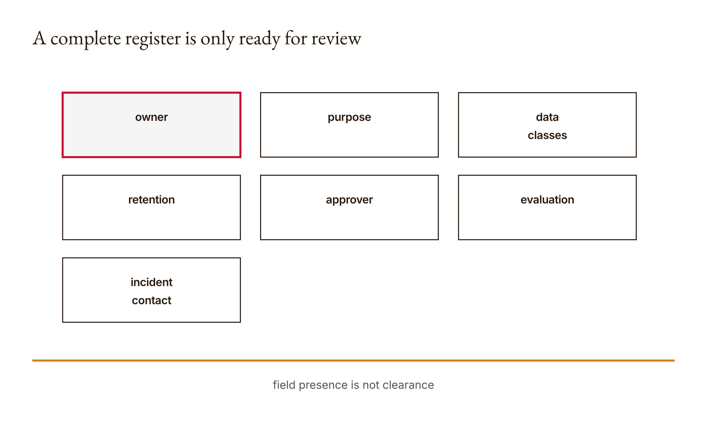
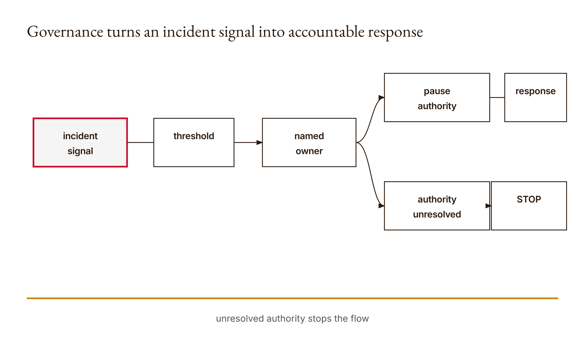

# Chapter 14 — Team Governance and Applied Ethics

Every field is filled. Nobody is responsible.

That sentence is possible because a governance record can be structurally complete and operationally hollow. The field named `owner` can contain `"project team"`. The incident contact can say `"project owner"`. The evaluation can say `"citation audit"`. Python can truthfully report `ready-for-human-review`. Yet no named person may have accepted responsibility, no affected person may have been consulted, no threshold may trigger a response, and no one may know what happens when the system causes harm.

The course fixture is deliberately modest. It checks seven required fields, validates a nonnegative retention-day count and a list of data-class strings, and routes unknown or sensitive classes and external writes to review. It is useful precisely because we can see where it stops. It makes missing governance information visible; it does not grant ethical clearance.

This chapter tears down the distance between a register and a responsible team. Governance is not prose wrapped around a technical system. It is the assignment of decisions, evidence, authority, relationships, monitoring, recourse, and response. Applied ethics begins when those abstractions are attached to people who can be affected and people who must act.

## What you will be able to do

By the end of the chapter, you should be able to:

- trace the exact structural checks performed by the course register;
- distinguish `ready-for-human-review` from approval, consent, compliance, or ethical acceptability;
- identify affected people and state concrete harms rather than generic “risk”;
- bind mitigations to named owners, observable thresholds, and bounded responses;
- design retention, deletion, access, incident, and appeal paths;
- recognize when a workflow should be narrowed, deferred, or not automated.

You should have completed Chapters 5, 12, and 13 on authority boundaries, shared memory, and approval gates. This narrative is paired with the runnable [Lesson 14 materials](../lessons/14-team-governance-and-ethics/docs/en.md). The Python example is an offline teaching mechanism, not legal advice or a compliance determination.

Before reading the implementation, make four predictions. What issues will an empty record report? Will `retention_days=True` pass as one day? What happens if `data_classes` is the string `"public"` rather than a list? Does `ready-for-human-review` mean a human has reviewed the record? Preserve the answers.

## A register makes questions inspectable

The implementation declares seven required fields:

```python
FIELDS = (
    "owner",
    "purpose",
    "data_classes",
    "retention_days",
    "approver",
    "evaluation",
    "incident_contact",
)
```

Each field opens a governance question.

The owner is accountable for the workflow as a continuing system, not merely its initial code. Purpose states why the system exists and helps reveal later use beyond that scope. Data classes describe what information crosses the boundary. Retention days make storage lifetime discussable. The approver identifies the decision route. Evaluation names the evidence used to judge performance and failure. The incident contact gives people somewhere to report a problem and gives the team a path for response.

The fields are necessary prompts, not sufficient answers. `owner: "someone"` occupies the field without assigning work. `purpose: "use AI"` does not bound use. `evaluation: "test"` does not say which outcomes were tested. A register can force omissions into view, but Python cannot infer substantive adequacy from truthy strings.

The first operation in `assess` constructs a missing list. A field counts as missing if its key is absent or its value is `None`, the empty string, or the empty list. An empty record therefore reports all seven field names. The executed research fixture observed that seven-item omission report.

Other weak values can pass this particular missing check: whitespace, zero in most fields, an empty dictionary, or a vague string. Later specialized checks catch some shapes, but the general boundary remains structural. A governance register should not advertise more intelligence than its validator contains.

<!-- [FIGURE: Cajal production brief. A complete register is only ready for review. Include owner, purpose, data classes, retention, approver, evaluation, incident contact. Show the confirmed relationship that field presence is not clearance. Exclude unverified relationships, decorative elements, product-interface simulation, gradients, shadows, rounded corners, three-dimensional effects, and color-only meaning. The SVG and PNG are generated publication assets; retain this comment as figure provenance.] -->

*Figure 14.1 — A complete register is only ready for review*

## Tear down the validator

After missing-field detection, retention receives an exact-type and range check:

```python
days = record["retention_days"]
if type(days) is not int or days < 0:
    raise ValueError("Retention must be a nonnegative day count")
```

Exact `int` typing rejects Python Booleans, even though `bool` subclasses `int`. Negative values fail. Zero is allowed and can represent a design intent such as no post-processing retention, but the implementation does not enforce immediate deletion or define transient copies. A number in a record is not evidence that the lifecycle follows it.

Data classes receive a shape check:

```python
classes = record["data_classes"]
if not isinstance(classes, list) or not all(
    isinstance(item, str) for item in classes
):
    raise ValueError("Data classes must be a list of strings")
```

The value must be a list and every element must be a string. The missing check already rejects an empty list. A single string `"public"` fails because iterability is not the same as the declared container shape. But any string inside the list passes this shape check, including unknown labels.

The next comparison creates a small classroom allowlist:

```python
if set(classes) - {"public", "synthetic", "internal"}:
    issues.append("sensitive or unknown data review")
```

Anything outside those three labels produces a review issue. The code does not decide whether an unknown class is legally sensitive, nor whether all “internal” information is safe for the proposed workflow. It chooses the conservative routing action: require review.

If the optional `external_write` value is truthy, the function adds `"external action approval"`. The fixture test confirms this issue appears. The check does not identify the external target, authenticate approval, or execute Chapter 13's fingerprint gate. It marks a condition that needs another control.

The return status is `review-required` when issues exist and `ready-for-human-review` otherwise. Both lead to people. “Ready” means the teaching record cleared these structural checks and contains no flagged class or external-write condition. It does not mean “approved.”

## Worked example: complete, reviewable, and still weak

The demo supplies:

```python
record = {
    "owner": "project team",
    "purpose": "summarize public course notes",
    "data_classes": ["public"],
    "retention_days": 30,
    "approver": "instructor",
    "evaluation": "citation audit",
    "incident_contact": "project owner",
}
```

No required field is absent or one of the explicitly empty values. Thirty has exact type `int` and is nonnegative. `data_classes` is a list whose only item is a string, and `"public"` is in the classroom allowlist. There is no truthy external-write flag. The executed fixture returns:

```python
{"status": "ready-for-human-review", "issues": []}
```

This result is accurate about the function. It is weak as governance evidence. “Project team” may name no accountable individual. “Instructor” may describe a role without proving that a particular instructor accepted this approval responsibility. “Citation audit” leaves the sampling, checker, criteria, and failure response unstated. “Project owner” may be unreachable to affected people. Thirty days says nothing about caches, backups, exported artifacts, or deletion verification.

Now run `assess({})`. The result is `incomplete` with all seven field names in `issues`. That is a useful negative case: the validator can expose total omission. Next set `data_classes` to `["personal"]` with other required values present. The status becomes `review-required` and includes the sensitive-or-unknown issue. Set `external_write=True` on a public-data record and the external-action issue appears.

These cases demonstrate routing. They do not demonstrate agreement by named people, stakeholder consent, lawful processing, effective mitigation, or outcome fairness. The research packet records precisely that boundary.

Construct a substantively weak but structurally complete variant:

```python
weak = {
    "owner": "everyone",
    "purpose": "help",
    "data_classes": ["public"],
    "retention_days": 99999,
    "approver": "manager",
    "evaluation": "looks fine",
    "incident_contact": "team",
}
```

The current function can return `ready-for-human-review`. That is not a defect relative to its narrow contract; it is a counterexample to broad claims about the status. The human review must interrogate meaning.

An evidence table keeps the distinction visible:

| Register observation | What it supports | What remains open |
|---|---|---|
| seven fields present | minimum record shape | adequacy and acceptance |
| retention is nonnegative integer | declared day count has valid shape | actual deletion lifecycle |
| classes are known labels | no unknown label under course allowlist | classification accuracy |
| external-write issue | routing trigger detected | target, authority, outcome |
| ready for human review | structural preflight completed | consent, ethics, compliance |

## From “risk” to affected people and concrete harm

Generic risk language protects the record from falsification. “There may be bias or privacy concerns” can be pasted into almost any register and tells no one what to do. Applied ethics asks who can be affected, through which mechanism, with what consequence, and whether they can contest it.

For a public-course-note summarizer, affected groups may include students whose work is quoted, instructors whose policies are paraphrased, maintainers who must correct errors, and readers who rely on the summary. Concrete harms might include misrepresenting a deadline, exposing a student's attributed work, omitting a required accommodation route, or publishing an unsupported instruction.

Not every workflow needs demographic fairness metrics. If a system ranks people, allocates opportunity, or differentially affects groups, the choice of fairness criterion must be defended along with its tradeoffs. For an unrelated file utility, inventing demographic columns performs ethics rather than applying it. Identify the harm mechanism the workflow actually has.

Ask distribution questions. Who receives the benefit? Who bears false positives and false negatives? Who has to spend time correcting the system? Who is absent from the development examples? Who can opt out? Who is exposed when data is retained? Who can reach a human when the output is wrong?

Affected people are not merely sources of feedback. Consultation can change the purpose, boundaries, retention, or decision to automate. If the team asks only how to make a predetermined deployment more acceptable, participation becomes theater.

## Owners, thresholds, and bounded responses

A mitigation without an owner is a wish. An owner without authority or resources is a label. A threshold without an observable signal is prose.

Rewrite “monitor quality and intervene if needed” into an operational record. For example: “The content owner reviews every unsupported-source flag before publication. If any public draft contains a deadline claim without an approved source identifier, publication pauses, the incident contact examines affected drafts, and work resumes only after correction and a repeated citation audit.”

This statement names a signal, threshold, owner, response, scope, and recovery condition. It can still be improved—what counts as approved, how quickly review occurs, who handles disagreement—but another person can now test whether the process ran.

Thresholds should connect to harm, not only aggregate performance. A 99 percent pass rate can conceal one severe disclosure. Some events require immediate stop on a single occurrence. Others justify trend monitoring. State the rationale and revise it from incident evidence.

Give the owner explicit authority to pause. If incentives punish delay and only reward shipping, a nominal incident contact cannot govern. Define escalation when the owner is unavailable, implicated, or lacks expertise. Avoid assigning every role to one person merely to complete the form.

<!-- [FIGURE: Cajal production brief. Governance turns an incident signal into accountable response. Include incident signal, threshold, named owner, pause authority, bounded response, recovery check. Show the confirmed relationship that unresolved authority stops the flow. Exclude unverified relationships, decorative elements, product-interface simulation, gradients, shadows, rounded corners, three-dimensional effects, and color-only meaning. The SVG and PNG are generated publication assets; retain this comment as figure provenance.] -->

*Figure 14.2 — Governance turns an incident signal into accountable response*

## Retention is a lifecycle

`retention_days: 30` is a policy input, not a deletion mechanism. Trace every copy: incoming prompt, local fixture, application log, model-provider handling under the applicable service, cache, exported report, repository history, backup, and incident record. Include only systems actually in scope and mark unknowns.

For each data class, state why it is collected, the minimum needed, who can access it, when the clock begins, how deletion is performed, what exceptions exist, and how deletion is checked. Derived summaries may still reveal source information. A hash can itself be sensitive if it enables matching against a small known set.

Zero-day retention needs clarification. It may mean delete immediately after the task, do not persist application data, or retain only de-identified evidence. Temporary memory and provider-side processing still exist. Do not turn a desired policy into a claim about systems you have not inspected.

Retention competes with incident replay. Keeping everything forever makes investigation easier and privacy risk worse. Keeping nothing may prevent accountability. Design a minimal, separated audit record: operation identity, policy decision, safe evidence references, error category, and responsible roles, with sensitive payloads stored only when justified and protected.

Test deletion like any other behavior. Insert a labeled fixture, run the lifecycle, and inspect the stores you control. State what remains unverified. “Removed from this dictionary” is not “erased everywhere.”

## Incidents, recourse, and appeal

An incident contact is useful only if people can find and reach them, and if contact can change an outcome. Publish a plain-language route. Define acknowledgment, triage, containment, correction, communication, and recovery responsibilities. Preserve the affected person's report without forcing them to translate harm into the system's internal categories.

Recourse asks more than whether the team can fix software. Can a person challenge a result? Can they obtain an explanation appropriate to the decision? Can a human correct the record? Are downstream copies updated? Is there an appeal beyond the original decision owner?

The team should not require the affected person to debate a model. Claude can organize approved feedback, but it cannot accept institutional responsibility or repair a relationship. A reachable human must own the response.

Incident exercises should use labeled simulations unless a real, consented incident is available and appropriate to share. Do not invent stakeholder testimony, distress, permission, or successful repair. A rehearsal tests the route; it does not prove people trust it.

### Design consultation that can change the project

Consultation begins before the conversation. Decide who is affected directly, who maintains the surrounding work, who has relevant domain knowledge, and who is routinely missing from design decisions. Do not ask one convenient person to stand in for every stakeholder. Participation should be voluntary where appropriate, and the team should explain what will be recorded, how it will be used, and whether declining has consequences.

Claude can help prepare a plain-language explanation: what the workflow receives, what it produces, where a person decides, what is retained, and how to report a problem. A human must check that explanation against the real system before sharing it. Fluent simplification can omit precisely the external write or retention detail a person needs to evaluate.

Questions should invite disagreement. “Does this helpful tool sound good?” solicits reassurance. Better questions ask what outcome would be unacceptable, what information should never enter the workflow, what correction process would be usable, what context the design misses, and what would make the person withdraw support. Do not promise that every request will be adopted; explain how conflicts and decisions will be recorded.

During the conversation, listen beyond the prepared categories. A student may care less about summary accuracy than about being quoted without context. A maintainer may worry that an appeal route creates unpaid support work. An instructor may distinguish public course content from student submissions even when both sit in one repository. Those situated distinctions can change data classes, access, purpose, or the decision to proceed.

Afterward, separate actual statements from AI summaries. Return a summary for confirmation when appropriate. Record concrete design changes and unresolved concerns, not personality judgments about participants. If someone withdraws permission for their contribution, the retention and deletion process must know which artifacts derived from it.

A classroom role-play is useful rehearsal. It can reveal unclear explanations and missing questions. Label every response as simulated, because invented agreement is not consent. The register should still say which real consultation remains pending and which actions are prohibited until it occurs.

### Recourse is a system path, not an email address

An incident contact field often becomes an inbox nobody owns. Build the entire path. A reporter needs a discoverable channel and a description of what information is helpful without being forced to expose more private data. The team needs an acknowledgment rule, triage owner, urgent-stop trigger, investigation access, correction authority, and escalation when the first contact cannot resolve the issue.

Different harms need different remedies. Correcting a displayed summary does not repair a decision already made from it. Removing personal data from the active store does not recall a public copy. Explaining a model's reasoning does not restore an opportunity denied to someone. Ask the affected person what meaningful correction looks like, while recognizing that institutional constraints may require additional decision makers.

Make contestability practical. Preserve the contested output, input provenance where lawful, applicable policy, and human decision record. Give the reviewer power to change the result. Provide a second route when the original owner is conflicted. State expected response times only when the team can meet them.

Close the loop into engineering. Incidents should update evaluation cases, thresholds, prompts, permissions, retention, and training. If the same class of report recurs while only the explanation template changes, the governance process is absorbing complaints rather than controlling the system.

### Worked incident rehearsal

Use a labeled fixture: a course-note agent publishes a summary stating the wrong assignment deadline. The register listed public data, a citation audit, an instructor approver, and an incident contact. Structurally, it was ready for review. The harm mechanism is reliance on a wrong deadline; students may allocate work incorrectly.

Detection occurs when a student reports a mismatch with the official schedule. The observable trigger is a published deadline claim whose cited source does not support it. The content owner pauses publication of affected summaries and captures the source identifiers, generated output, approved proposal, and publication evidence. This is a simulated response sequence, not a claim that an actual incident occurred.

Investigation finds that the citation audit checked whether a citation string existed, not whether the cited passage entailed the deadline. The mitigation did not address the harm. The team adds an entailment-oriented human check for deadline claims, creates a refusal case with conflicting schedules, and prevents external publication until the claim is reviewed. Existing copies are located within the systems the team controls and corrected; uncontrolled copies are acknowledged as a limitation.

Recovery requires more than fixing the sentence. The incident owner confirms the current official source, the approver reviews the changed proposal, and the team communicates the correction through the same channel used to publish. Dependent instructions are rechecked. The student reporting route remains open in case the correction missed an effect.

The replay exposes governance revisions:

| Before | Incident evidence | After |
|---|---|---|
| “citation audit” | citation existed but did not support claim | support check for consequential claims |
| generic project owner | uncertain pause authority | named content owner and backup |
| external write implicit | public effect under-described | explicit publication approval |
| correction means edit | downstream copies unknown | bounded copy inventory and limitation |
| contact receives report | response sequence absent | acknowledgment, triage, escalation, recovery |

This is what a useful simulation does. It does not prove the controls will work under real pressure. It makes the response specific enough to test and reveals which fields must change the running system.

Run a second variant in which the report is wrong. Perhaps the student compared the summary with an outdated schedule while the cited current schedule actually supports the published date. A respectful contest route still acknowledges and investigates. The team should not punish or dismiss the reporter merely because the original result survives review. It explains the evidence, preserves the challenge, and checks whether its public wording created reasonable ambiguity.

This counterexample protects recourse from becoming an automatic reversal mechanism. Contestability means a person can trigger genuine reconsideration, not that every challenge determines the outcome. The decision owner must weigh evidence, explain scope, and provide escalation where appropriate. Claude can assemble the two schedule passages and highlight differences; it should not impersonate the owner or decide that institutional context is irrelevant.

Also simulate an unavailable incident contact. The backup receives the alert after the declared acknowledgment threshold, pauses publication under delegated authority, and records why the escalation occurred. If no backup exists, the exercise has found an unresolved operational dependency. Do not fill the gap by having the agent nominate itself. An automated system can stop work safely; responsibility must remain with an authorized person or organization.

Finally, estimate the labor created by the remedy. Reviewing every deadline claim consumes time. If the team cannot sustain that work, narrow the feature to extracting dates with visible source passages, reduce publication frequency, or keep output as a private draft. A mitigation that cannot be maintained is not a control, even when it reads well in the register.

Governance must fit the team's real operational capacity, not its aspirational form alone.

## When deferral is the responsible output

Automation is not the default destination of every workflow. Defer when the purpose is contested, affected people have not been consulted, the data boundary is unknown, evaluation cannot observe the consequential outcome, the team lacks incident capacity, or no authorized owner will accept the decision.

Narrowing scope is often productive. Replace an autonomous external write with a draft for review. Use synthetic rather than personal data. Limit a ranking tool to organizing documents rather than people. Shorten retention. Remove a high-impact action until outcome checks exist.

Stopping is also a design result. If the benefit is marginal and the cost falls on people who cannot contest it, technical feasibility is not a reason to proceed. Record why the team deferred and what evidence or capacity would justify reconsideration.

Do not use “human in the loop” as a magic phrase. Name the human task, evidence, authority, time budget, and stop rule. Chapter 13 showed how a gate can become ceremonial under volume. Governance must limit agent throughput to review and response capacity.

## Governance failure patterns

**Complete form, absent responsibility.** Generic roles occupy fields, but nobody has accepted operational ownership.

**Mitigation mismatch.** A citation audit is offered for a privacy-retention harm. The mitigation may be useful but does not address the stated mechanism.

**Unobservable threshold.** “When quality falls” gives no signal or measurement procedure.

**Consent by simulation.** Model-generated stakeholder reactions are presented as feedback from people.

**Accuracy substitution.** Two systems have equal task accuracy, so the one with broader write authority and longer retention is called equally safe.

**Appeal to the system.** Affected people are routed back to an automated explanation rather than a responsible human.

**Compliance theater.** The register is treated as legal clearance despite its explicit classroom scope.

**Permanent pilot.** A supposedly temporary deployment accumulates data and effects without an end condition or review date.

## Compare equally accurate systems

Imagine two agents with the same measured accuracy on the same bounded evaluation set. Agent A reads public notes, creates a local draft, retains inputs for one day, and requires human publication. Agent B reads internal records, publishes externally, and retains complete traces for a year.

Equal accuracy does not produce equal risk. B has a broader action surface, more sensitive context, a longer privacy exposure, and external effects. Its rollback and incident needs differ. Accuracy describes selected outputs under selected trials; governance describes the surrounding power and consequences.

This comparison also reveals why ethics cannot be appended after model selection. Architecture choices—data minimization, authority, retention, reversibility, and review routing—shape the harm surface before the first score is calculated.

## Build the team AI-use register

Start with the actual capstone workflow, not a generic AI policy paragraph. Name the bounded purpose and non-purpose. List input sources and data classes. Trace tools and action targets. Link the Week 11 evidence matrix and Week 13 approval gate rather than restating them vaguely.

Add one concrete harm scenario. Name who bears it and how it occurs. Assign a mitigation owner who has pause authority. Define an observable threshold and response. Specify retention lifecycle and deletion evidence. Provide an incident route and appeal path. Record unresolved authority rather than assigning it fictionally.

Include a decision note: what Claude proposed, what context a person added or corrected, what evidence supports the recommendation, whose interests it serves or disadvantages, and the named human recommendation. Highlight any sentence that merely repeats Claude; repetition is not review.

Keep real consultation distinct from classroom role-play. Claude can help draft questions and plain-language explanations. Actual people conduct conversations and grant or withhold permission. If consultation is pending, say so and constrain the workflow accordingly.

## Integration with the system

The register draws evidence from every previous layer. Tool permissions define action authority. Memory records data lineage and lifetime. Evaluations describe observed behavior and exclusions. Approval gates bind decisions to exact proposals. Incident evidence feeds revisions back into those components.

Governance is therefore not a final document placed beside the system. It is a control plane that can pause execution, revoke approval, shorten retention, change evaluation, assign repair, or end the project. If updating the register changes nothing the system does, it is only documentation.

## Assessments — ungraded practice

These Assessments are ungraded practice. Preserve predictions, commands, observed results, disagreements, and revisions without fabricating stakeholders or approvals.

### Warm-up

1. **Trace omissions (Understand).** Run `assess({})`, list the seven issues, and explain what this establishes about structural completeness.

2. **Test shapes (Apply).** Predict and run negative retention, Boolean retention, string data classes, empty classes, and unknown class. Explain each different outcome.

3. **Interpret status (Analyze).** Rewrite `ready-for-human-review` and `review-required` as precise sentences that do not imply approval, consent, or compliance.

### Application

4. **Weak complete record (Evaluate).** Construct a record that passes structural assessment but has vague ownership, evaluation, and incident language. Identify the human questions required next.

5. **Concrete harm (Analyze).** Name one plausible harm in your capstone, the affected person or group, the causal path, consequence, and current evidence. Avoid generic risk labels.

6. **Operational threshold (Create).** Rewrite a vague mitigation into a signal, threshold, named owner, bounded response, escalation route, and recovery condition.

7. **Retention map (Create).** Trace one data class through controlled copies, access, deletion, and audit evidence. Mark unknown provider or backup behavior rather than guessing.

### Synthesis

8. **Equal accuracy, unequal risk (Evaluate).** Compare two equally accurate fixtures with different data, authority, retention, and reversibility. Defend which requires stronger governance.

9. **Recourse design (Create).** Design a plain-language contest and appeal route. Specify how a correction reaches downstream artifacts and how the team handles unavailable or conflicted owners.

10. **Decision note (Analyze).** Record Claude's proposal, human-supplied context, supporting evidence, affected interests, and a named recommendation. Identify where the human contribution changes rather than paraphrases the model.

### Challenge

11. **Governance stress test (Create).** Simulate one threshold breach and trace detection, pause, notification, containment, stakeholder communication, correction, and recovery. State which parts are simulated and which controls were actually executed.

Complete the existing [Lesson 14 knowledge check](../lessons/14-team-governance-and-ethics/quiz.json) after the practice. It remains self-review, not a separate graded assignment.

## Capabilities summary

You can now read an AI-use register as a set of operational claims rather than a certificate. You can reproduce the course validator's missing-field, retention, data-class, and external-write behavior while stating its limits. You can connect harms to affected people, mitigations to owners, thresholds to responses, data to a lifecycle, and incidents to recourse. You can also defend deferral when the team lacks evidence, authority, consent, or response capacity.

## Anthropics

Anthropic's current [Claude Code security](https://code.claude.com/docs/en/security) guidance can inform your analysis of access boundaries, untrusted inputs, and safe operation. Connect a relevant recommendation to a named owner, monitoring signal, and incident response in your register rather than copying general security prose.

The primary link was checked for the approved research packet on 2026-09-06. Product guidance supplements this governance analysis; applicable Northeastern policies determine institutional use. The register is a course mechanism and not a claim about Anthropic's internal governance or a legal compliance tool.

## Computational Skepticism

Fairness criteria encode values about which errors matter and to whom. If your workflow ranks or evaluates people, name and defend a criterion, identify tradeoffs, and assign the decision to a responsible human. If it does not, do not manufacture demographic metrics merely to sound ethical. Identify the actual harm mechanism instead.

Accountability includes recourse. Ask who bears an error's cost, who chose the criterion, who can challenge the result, and what evidence would change the team's choice. Put those answers into the register as owners and usable processes, not only explanatory prose.

## Conducting AI

Claude can propose a recommendation; the human must interpret what it means in the actual setting. Add the context the model lacked, connect the recommendation to evidence, and identify whose interests it advances or disadvantages. A human name attached to unchanged model prose is not judgment.

The conductor's contribution is integration: selecting inputs, setting boundaries, hearing domain disagreement, and deciding how the tools' outputs bear on the purpose. Preserve Claude's contribution separately so reviewers can see what the person added or corrected.

## Irreducibly Human

A polished stakeholder message is not evidence that a relationship exists, a person was heard, or consent was obtained.

**AI should** draft plain-language explanations, suggest questions, organize authorized sanitized feedback, surface uncertainty, and preserve objections. It should not invent stakeholder testimony, imply consent, or speak as though it represents an affected person.

**Human should** hold the actual conversation, listen for concerns outside the prepared script, negotiate expectations, obtain permission where required, remain reachable for correction, and decide how feedback changes access, retention, evaluation, or deployment.

Record the split: include one question Claude helped prepare and one actual change or unresolved concern from a real, consented discussion. If the exercise uses role-play, label it as simulation and state which real consultation remains pending. A functioning appeal route must reach a responsible person, not return the affected person to model-generated reassurance.

## Forward bridge

The team now has a register, owners, gates, evidence, and incident routes. Chapter 15 asks whether these parts form one defensible system. The capstone succeeds only when another person can reproduce its central result, observe a controlled failure, inspect recovery, and understand why the accountable owner chose to ship, narrow, defer, or stop.
