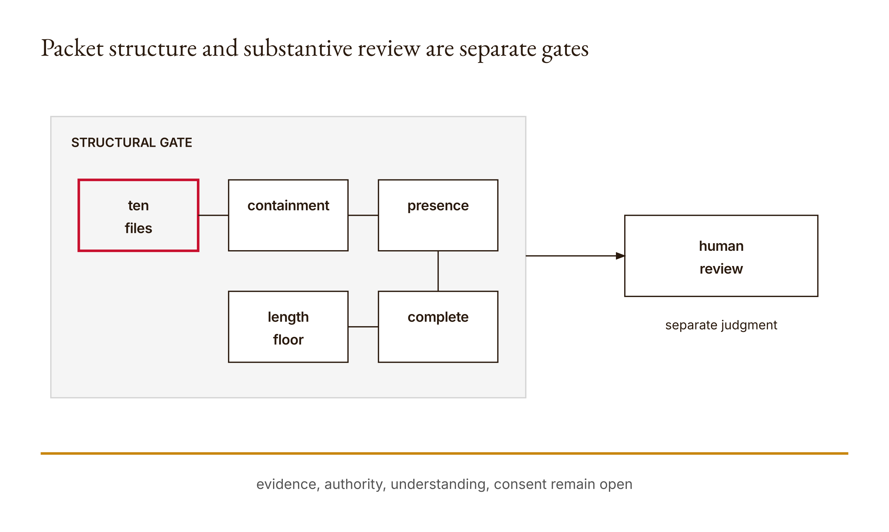
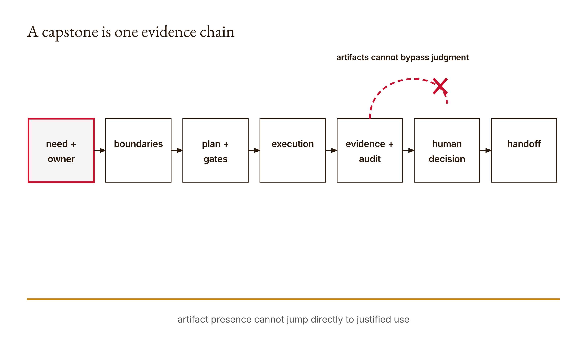

# Chapter 15 — Supervised Agentic Capstone

Ten files contain sixty copied `x` characters each. The packet validator passes.

Nothing in those files demonstrates a need, a boundary, an implementation, a controlled failure, an independent result, a consenting owner, or a defensible decision. Yet the return says `structurally_complete: True` because all ten named Markdown files exist inside the packet and exceed forty stripped characters.

This is not a trick played on a weak validator. It is the validator revealing its honest job. Structure can be checked mechanically. Substance must be established through connected evidence and accountable judgment. The course research fixture executed both sides: an empty folder reported ten missing artifacts, and ten meaningless long-enough files passed. The counterexample prevents the final capstone from becoming a scavenger hunt in which file presence substitutes for learning.

The capstone is one bounded workflow, not ten unrelated documents. Its packet should let another person trace a line from a real need and consenting owner, through data and action boundaries, into a plan, approval gates, implementation, failures, recovery, evidence, and transfer. The last decision—ship, narrow, defer, or stop—must be defended from that trace rather than from presentation quality.

## What you will be able to do

By the end of the chapter, you should be able to:

- explain the exact structural guarantees and limits of `validate_packet`;
- connect ten capstone artifacts into one inspectable argument;
- demonstrate a bounded Python workflow using Claude as its only model provider where a model is needed;
- preserve prediction, failure, reviewed recovery, and independent verification;
- prepare a handoff that distinguishes reproducible evidence from unresolved gaps;
- make and defend a human decision to ship, narrow, defer, or stop.

All previous chapters are prerequisites. This narrative is paired with the runnable [Lesson 15 materials](../lessons/15-supervised-capstone/docs/en.md). The required path uses Python and Claude Code access. Direct API calls are optional, explicit, and potentially credit-consuming. A Progress Reel can strengthen professional communication but remains optional.

Before reading the validator, predict four outcomes. How many issues will an empty folder return? Will a five-character `brief.md` count as present or insufficient? What happens when `brief.md` is a symbolic link to a file outside the packet? Can ten polished files prove that a real stakeholder consented? Preserve the predictions.

## “In the wild” means bounded reality

A real capstone is not unrestricted access to somebody else's systems. “In the wild” means the workflow serves a real context with a known owner, approved data, and explicit boundaries. Reality enters through consequences, constraints, and evidence—not through maximal autonomy.

Begin with a need stated by the person or team who owns the work. Identify who benefits, who may be affected, and who can authorize the workflow. Consent cannot be generated as fixture text. If access or consultation is pending, constrain the project to synthetic or public data and label the remaining decision.

Choose a scope narrow enough to supervise. A system that drafts a report from approved sources is easier to evaluate than one that searches private drives, edits records, and publishes externally. The capstone should still include a meaningful action and failure boundary, but ambition is demonstrated through control, not surface area.

Write a non-purpose. If the workflow summarizes public course notes, it does not evaluate students, ingest private submissions, or publish without review. Non-purposes give reviewers concrete misuse and scope-drift checks.

Define success as an observable state. “The agent completed the task” is narration. “The generated report contains the three required sections, every consequential claim maps to an approved source passage, the target file matches the reviewed diff, and publication remains pending” is inspectable. Include conditions that make the result unacceptable.

## Tear down the packet validator

The implementation declares ten artifact stems:

```python
ARTIFACTS = (
    "brief",
    "data-boundary",
    "action-surface-map",
    "plan",
    "gates",
    "pre-mortem",
    "evidence",
    "artifact",
    "audit-note",
    "transfer-reflection",
)
```

`validate_packet(folder)` resolves the supplied folder to an absolute root. For each name it constructs `root / (name + ".md")`. It then evaluates three structural conditions.

First, the resolved path must remain relative to the resolved root. This catches a required filename implemented as a symbolic link to an external target. The repository test links `brief.md` to `/etc/hosts` and expects `brief: outside packet`. The check is about containment, not content trust. A malicious file physically inside the packet can still contain harmful instructions.

Second, the path must be a file. A missing artifact produces `name: missing`. An empty temporary directory therefore produces ten issues, one for each required stem. The approved research fixture observed that count.

Third, the stripped text must contain at least forty characters. Short material produces `name: insufficient content`. The threshold catches empty placeholders and a few-word stub. It cannot judge relevance, truth, authorship, evidence, or professional quality.

The result is:

```python
{
    "structurally_complete": not issues,
    "issues": issues,
    "human_review": (
        "Evidence, authority, and understanding must still be assessed"
    ),
}
```

That final string is part of the contract, not a disclaimer to skip. The test confirms that “understanding” remains in the human-review message. Structural completeness deliberately stops before substantive approval.

<!-- [FIGURE: Cajal production brief. Packet structure and substantive review are separate gates. Include ten files, containment, presence, length floor, structurally complete, human review. Show the confirmed relationship that evidence, authority, understanding, consent remain open. Exclude unverified relationships, decorative elements, product-interface simulation, gradients, shadows, rounded corners, three-dimensional effects, and color-only meaning. The SVG and PNG are generated publication assets; retain this comment as figure provenance.] -->

*Figure 15.1 — Packet structure and substantive review are separate gates*

## Worked example: missing, escaping, meaningless, and useful

Start with an empty temporary directory. The loop checks each constructed Markdown path. None is a file, so it appends ten missing issues. `structurally_complete` is false.

Add only `brief.md` with the text `short`. The file exists inside the root, but stripped length is less than forty. Its issue changes from missing to insufficient content; nine other artifacts remain missing. This distinction helps a learner locate the structural failure.

Now make `brief.md` a symlink whose target resolves outside the packet. The containment condition runs before ordinary file presence and reports `brief: outside packet`. This prevents satisfying a required artifact by pointing the name at unrelated external content.

Finally, create all ten files with repeated `x` characters longer than forty. Every path resolves inside the root. Every path is a file. Every stripped body clears the threshold. The executed research fixture reports structural completeness.

The meaningless packet is the decisive counterexample. It proves that presence and length do not establish substance. A full human review must inspect whether each artifact performs its role and whether the links between artifacts hold.

Consider a useful `evidence.md`. It should not merely say “tests passed.” It records exact commands, versions, inputs, outputs, failures, and interpretations. It maps claims to checks that can disagree. It labels fixtures and optional live observations separately. Another authorized reader can reproduce the offline path.

Now consider `audit-note.md`. It predicts review findings before Claude critiques the packet, locates the returned findings, and records whether the learner revised, defended, or acknowledged each one. It includes a Gap Account: what remains unsettled, which evidence or expertise could help, and who owns the decision.

The validator sees only two long files. The reviewer sees whether they form evidence.

| Fixture | Structural result | Substantive conclusion |
|---|---|---|
| empty folder | ten missing issues | packet absent |
| short brief | insufficient plus missing | placeholder detected |
| escaping symlink | outside-packet issue | containment violated |
| ten repeated strings | complete | no learning established |
| connected real packet | possibly complete | requires claim-level review |

## Ten artifacts, one argument

The `brief` states the need, consenting owner, affected people, success condition, non-purpose, and decision scope. It should make clear why this workflow exists and what would make it inappropriate.

The `data-boundary` inventories sources, classifications, provenance, access, retention, deletion, and exclusions. It marks public, synthetic, internal, personal, or unknown data according to the project's real policy rather than choosing the label most likely to pass.

The `action-surface-map` shows what the workflow can read, propose, write, send, or publish. It separates capability from authority and identifies external or irreversible effects.

The `plan` decomposes the work into evidence-producing steps, dependencies, stop conditions, budgets, and replanning triggers. It records alternatives considered before execution.

The `gates` bind consequential proposals to exact content and responsible decisions. They include evidence, effects, rollback limits, expiry, and what happens while review is pending.

The `pre-mortem` predicts stale state, invalid calls, injection, duplicate actions, privacy exposure, misleading success, and other project-specific failures. Each item names detection, owner, response, and residual risk.

The `evidence` artifact contains reproducible commands and observed results. It distinguishes code inspection, deterministic fixture output, model output, human observation, and external product behavior.

The `artifact` is the usable output or a precise pointer and reproduction route. Its relationship to the code and evidence should be clear. A screenshot alone is not reproducibility.

The `audit-note` records predictions before critique, findings, evidence-based responses, failed cases, corrections, and unresolved gaps. It exposes the difference between review and verification.

The `transfer-reflection` asks what the learner will delegate more readily, what capability must remain practiced, and what decision remains human. Each claim should point to project evidence rather than generic sentiment.

Every artifact should reference the relevant others. The brief's success criterion maps to evidence. The data boundary constrains the action map. The plan invokes the gates. The premortem predicts a failure demonstrated in the audit note. The transfer reflection cites the controlled recovery. Without those links, ten documents remain ten islands.

<!-- [FIGURE: Cajal production brief. A capstone is one evidence chain. Include need + owner, boundaries, plan + gates, execution, evidence + audit, human decision, handoff. Show the confirmed relationship that artifact presence cannot jump directly to justified use. Exclude unverified relationships, decorative elements, product-interface simulation, gradients, shadows, rounded corners, three-dimensional effects, and color-only meaning. The SVG and PNG are generated publication assets; retain this comment as figure provenance.] -->

*Figure 15.2 — A capstone is one evidence chain*

## Implementation: Claude proposes, Python constrains

The capstone uses Python for deterministic orchestration, validation, storage boundaries, and checks. Claude is the only model provider where language-model assistance is needed. Claude Code through the course account is sufficient for the normal workflow; an API extension must be deliberate and labeled.

Start offline. Build fixtures that expose your mechanism. Inject a callable into the controller where possible so tests do not need network access. Validate tool names and arguments in Python. Resolve paths before action. Preserve model requests, application results, and final claims separately.

If you add a live Messages path, make it opt-in, bound requests, identify the model actually used, protect credentials, and record cost-bearing behavior. Never replace a missing live run with invented output. Live model behavior is evidence about that particular run under its recorded conditions, not a universal guarantee.

Keep authority outside the prompt. Telling Claude “do not publish” is useful task context but not the publication boundary. The application should lack or gate that capability. A prompt-injected source should not be able to grant itself tools.

The implementation should be small enough to explain. Reusing an Anthropic example is appropriate when its mechanism matches the task, but document the exact upstream source, revision or access date, changes, and license. Adaptation is not understanding until you can trace the changed behavior and tests.

## Controlled failure and reviewed recovery

A polished happy-path demo proves very little. Choose one failure that matters to the workflow and can be reproduced safely. Predict it before running. Preserve the input, action, reported outcome, independently observed outcome, and gap.

For a source-grounded report, a controlled failure might be a relevant-looking passage that does not support a deadline claim. The model produces fluent prose and a citation. The source check rejects entailment. No external publication occurs. The trace shows request, retrieved passage, draft, failed check, and stop state.

Recovery is not “ask Claude again until it passes.” A human or declared policy reviews why the case failed. The plan may narrow the claim, select a different approved source, add an abstention rule, or defer. The changed proposal goes through its gate again. A later success is compared with the original failure and checked independently.

Use different failure routes. If Claude drafts the claim, Python can validate source identifiers and structure, while a person inspects semantic support. If Python calculates a total, a separate derivation or source-level reconciliation can check it. Two Claude prompts sharing the same context are not automatically independent.

Preserve the failed output when privacy and safety permit. It is evidence of the boundary and of the learner's revision. A demo edited to show only success hides the most valuable part of supervision.

## The miniature casebook

Write the controlled failure as a compact casebook entry:

1. prediction recorded before execution;
2. exact sanitized input and provenance;
3. action or tool request;
4. system-reported outcome;
5. independently observed outcome;
6. gap between report and evidence;
7. containment and recovery decision;
8. remaining uncertainty.

The prediction prevents hindsight from smoothing the story. If you expected the system to refuse and it accepted, record that. If you expected failure and the checker correctly rejected, explain which mechanism did the work. Do not manufacture a surprising error for drama.

One observed miss does not prove a permanent limitation of every future model. It supports a bounded claim about this workflow, case, and check. Conversely, one clean run does not establish general reliability. The casebook accumulates inspectable encounters rather than universal slogans.

## Audit the reviewer

Before asking Claude Code for read-only critique, predict three specific findings with artifact locations and reasons. For example: the data boundary does not trace deletion from exported reports; the gate's rollback claim ignores an external message; the evidence matrix relies on the same parser for production and checking.

Then request critique of the existing packet without allowing edits. Preserve the actual response. For each finding, locate the relevant evidence and choose one of three legitimate responses.

Revise when the critique identifies a supported defect. Defend when the packet already addresses it, citing the exact passage and explaining why the critique missed it. Acknowledge an unresolved limit when neither revision nor defense is justified. Do not force Claude to produce a false positive so you can demonstrate independence.

Evaluate the reviewer itself. Did it find the predicted issues? Did it produce a plausible but unsupported concern? Did it overlook a controlled failure already visible? This is not a contest to make the model look good or bad. It is evidence about how review contributed.

Close with the Gap Account. Name one issue the critique did not settle, additional evidence or expertise that could help, and the person accountable for the decision now. A gap is not permission to give up; it is a boundary on the final claim.

## Independent verification and outcome state

Map every central claim to an artifact and check. “The report was created” can map to file existence and read-back. “The report is source-grounded” needs claim-to-passage inspection. “The owner consented” needs a real decision record, not model text. “The workflow is safe” is probably too broad and should be decomposed.

Inspect resulting state, not only trajectory. An agent can execute the planned calls while the destination remains wrong. A file write can succeed locally without being committed or published. A sent request can receive a success code while the intended person never receives it. State exactly what was observed.

Reproduction instructions should begin from a declared environment and contain exact commands. Remove credentials and restricted data. If another student cannot access a private source, provide an approved sanitized fixture and explain which real-world claim the fixture cannot reproduce.

### Build a claim-to-evidence graph

A packet becomes inspectable when its claims form a graph whose edges point to evidence and decisions. Start with the final recommendation. Break it into smaller claims until each can be checked by one or more artifacts.

Suppose the recommendation is: “Narrow the workflow to create a local source-grounded draft, retain only public fixtures for one day, and require a human before publication.” That sentence contains at least six claims: the workflow creates a draft; the draft uses approved sources; the target remains local; retained fixtures are public; deletion follows the stated day boundary; and publication is gated.

Map each separately:

| Claim | Producing mechanism | Evidence | Decision owner | Residual gap |
|---|---|---|---|---|
| local draft exists | bounded file tool | resolved path, read-back, diff | project owner | later mutation |
| consequential claims are supported | retrieval plus drafting | claim/passage matrix | content reviewer | interpretation disagreement |
| no external publication occurred | absent capability plus event trace | action map and trace | workflow owner | systems outside trace |
| fixtures are public | source inventory | source IDs and classification review | data owner | misclassification |
| one-day policy executed | deletion job | pre/post inventory in controlled stores | retention owner | provider copies |
| publication needs approval | bound proposal gate | rejected no-decision fixture | authorized publisher | stolen credentials |

The residual-gap column prevents the graph from becoming decorative certainty. Every evidence route has scope. Read-back establishes content at an observed time. An event trace can show no publish action inside the instrumented workflow but not every possible external channel. A classification review can be wrong. These limits inform the deployment choice.

Look for orphan nodes. A claim with no evidence should be removed, narrowed, or marked pending. An artifact supporting no claim may be busywork. A decision with no named owner is unresolved. Evidence cited by many claims deserves extra scrutiny because one defect can collapse several conclusions.

Also look for circular support. The audit note cannot establish that the evidence is correct merely by summarizing `evidence.md`, which in turn cites the audit note. A Claude review that repeats the packet's own claims adds perspective, not independent ground truth. At least the central result should connect to an observation or derivation outside its production narrative.

### Reproduce the handoff as an experiment

Do not wait until presentation day to discover that only the author can run the workflow. Treat handoff as a test with a bounded participant and sanitized environment. Give the reviewer only the documented prerequisites and commands. Observe where they must ask for hidden knowledge.

Common failures include an unstated working directory, an environment variable whose purpose is unexplained, a dependency installed globally on the author's machine, a fixture referenced by absolute personal path, an expected output that changed, and a recovery step known only from the original debugging session. Each question identifies missing transfer evidence.

The reviewer should first run the offline path. They compare actual output with the documented expectation, trigger the controlled failure, and locate the evidence matrix. Optional live behavior comes later and only with explicit authorization. A failed live credential should not prevent inspection of the course mechanism.

Record the handoff attempt as evidence: environment, commands, observed failures, questions, and revisions. Do not score the reviewer for speed. The target is whether the artifact can be understood and reproduced without private oral tradition.

Security constrains reproducibility. Do not package API keys, private data, or unauthorized source excerpts. Provide placeholders and validation that fails safely before credential access. Explain which authorized person supplies which secret through which mechanism. A reproduction guide that works only by leaking credentials is not professional.

After revising the documentation, rerun from a clean-enough context rather than assuming the prose fixed the problem. If a full clean environment is impractical, state what persisted. Reproduction is an observed property of a particular handoff, not an adjective awarded to documentation.

## Handoff that survives the author

A handoff should let a new authorized person understand the purpose, run the offline path, inspect evidence, identify decision owners, and know what not to do. Include prerequisites, versions, setup, commands, expected outputs, failure behavior, recovery, open issues, and contact routes.

State exclusions prominently. If live API behavior was not tested, say so. If stakeholder consultation is pending, say so. If only local writes were authorized, do not imply publication. If a provider's retention behavior was not verified, link current policy for the reviewer rather than guessing.

Transfer also includes maintenance. Who refreshes sources? What invalidates memory? When do approvals expire? Which threshold pauses the system? How are dependencies updated and re-evaluated? A capstone handed over without these answers is a demo, not a durable contribution.

## Ship, narrow, defer, or stop

Passing structure and tests does not oblige deployment. The final decision weighs intended benefit, affected people, evidence quality, reversibility, review capacity, unresolved gaps, and available alternatives.

Ship when evidence supports the bounded use, responsible owners accept their roles, required consent and authority exist, and recovery is credible. Narrow when a smaller action surface, data set, or audience preserves value while reducing unsupported claims. Defer when missing evidence, consultation, expertise, or capacity could realistically be obtained. Stop when the purpose is not worth the foreseeable burden or harm, or when necessary legitimacy cannot be established.

Record what would change the decision and who may revisit it. This makes the outcome accountable without pretending it is timeless. A later source change, incident, stakeholder objection, or evaluation result can reopen the choice.

Professional presentation matters because other people must inspect and use the work. It cannot compensate for missing evidence. An optional Progress Reel can show mechanism, failure, recovery, and decision clearly; it should not become a cinematic substitute for reproducibility.

### Defend the four options against the same evidence

Avoid writing the recommendation first and assembling supporting facts afterward. Put ship, narrow, defer, and stop into one comparison. Score or describe them against the same criteria: benefit, data exposure, action consequence, evidence strength, reversibility, review labor, consent, maintenance, and unresolved harm. The criteria express values, so explain who chose them.

“Ship” should mean the bounded use described in the brief, not any future expansion. Its case may rely on strong offline evidence, a consenting owner, narrow public data, reversible local effects, and available review. Its weakness may be that live behavior or long-term maintenance remains untested.

“Narrow” asks which component creates disproportionate uncertainty. Removing automatic publication may preserve most value while keeping the artifact local. Restricting retrieval to approved sources may sacrifice breadth for traceability. Narrowing is not failure; it is a design response to evidence.

“Defer” needs a concrete missing condition and owner. Defer until the data owner classifies one source, until a stakeholder conversation occurs, until a specialist reviews a consequential metric, or until an outcome checker exists. An indefinite “more research is needed” evades decision-making. State what would resume review.

“Stop” becomes appropriate when the need is not legitimate, consent cannot be obtained, harm cannot be mitigated within available capacity, or a simpler non-AI process dominates. Record what was learned and safely retire data and permissions. Technical effort already spent is not evidence for continuing.

Now test sensitivity. Would the recommendation change if the external-write capability were removed? If retention fell from a year to a day? If the owner withdrew consent? If the independent checker disagreed once? If the reviewer backlog doubled? These counterfactuals reveal which assumptions actually drive the decision.

The final recommendation should include the chosen option, rejected alternatives, evidence, affected interests, conditions, owner, review date, and change triggers. It should also contain one sentence of epistemic restraint: what the packet does not establish. That sentence is often the strongest evidence that the author understands the system.

Presentation can explain this choice through a Progress Reel. Show the need, mechanism, controlled failure, evidence-based recovery, and decision. Keep commands and packet available separately. A video is optional because some projects are best inspected directly and because media-production resources should not determine substantive credit. If peers use professional explainers effectively, that may improve comparative presentation quality, but the film never replaces the GitHub evidence.

Before handoff, perform a contradiction pass. Compare the brief's declared purpose with the implemented tools, the data inventory with actual fixtures, the action map with the trace, the plan with observed deviations, gate decisions with executed targets, and retention promises with deletion evidence. Contradictions are not resolved by choosing the newest document automatically. Determine which artifact is authoritative, correct dependent claims, and preserve the revision reason.

Then freeze the review candidate by revision or digest so later edits cannot masquerade as reviewed work. If any consequential file changes, identify the affected claims and rerun only the checks whose premises changed plus required integration checks. This is a new review candidate, not a cosmetic continuation of the old approval.

## Common capstone failures

**Packet completeness theater.** Ten long files pass while no central claim is reproducible.

**Demo-only evidence.** A screen recording shows success but omits commands, inputs, versions, and failed cases.

**Synthetic consent.** Claude-generated stakeholder language is presented as permission.

**Recovery by repetition.** The same prompt is rerun until a desired answer appears, with no reviewed change.

**Shared-check dependence.** The production and checker routes rely on the same mistaken source or helper.

**Authority drift.** A local-write approval is described as permission to publish.

**Reflection without evidence.** The learner states lessons in generic terms without identifying a changed decision or preserved capability.

**Polish as quartile strategy.** Visual sophistication obscures weak implementation or unverifiable claims. Professional communication can distinguish excellent work only after substantive requirements are met.

## Assessments — ungraded practice

These Assessments are ungraded. They prepare the capstone evidence; they do not create a second capstone.

### Warm-up

1. **Trace the validator (Understand).** Predict and run the empty-folder case. Explain why ten missing issues establish structure rather than substance.

2. **Test content floor (Apply).** Compare a short file with a forty-plus-character meaningless file. State exactly what the threshold can reject.

3. **Inspect containment (Analyze).** Reproduce the escaping-symlink case in a temporary directory and explain why containment does not imply trusted content.

### Application

4. **Claim-to-artifact map (Analyze).** Select five central capstone claims and point to the exact artifact and evidence that supports each. Mark unsupported links.

5. **Controlled failure (Create).** Record a prediction, run one safe project-specific failure, compare reported with observed outcome, and preserve containment.

6. **Reviewed recovery (Evaluate).** Explain the decision made after failure, change the mechanism or scope, rerun checks, and compare results without hiding the original trace.

7. **Independent check (Create).** Design a verifier that fails differently from the production route. Name at least one assumption they still share.

### Synthesis

8. **Packet integration (Create).** Add cross-references so the brief, boundaries, plan, gate, premortem, evidence, artifact, audit, and reflection form one argument.

9. **Predicted critique (Evaluate).** Record three expected Claude Code review findings, request read-only critique, and respond to each with revision, evidence-based defense, or unresolved limit.

10. **Handoff rehearsal (Analyze).** Have an authorized peer follow only the documented offline instructions. Record where the handoff fails and revise it; do not expose secrets or restricted data.

### Challenge

11. **Deployment decision (Evaluate).** Defend ship, narrow, defer, or stop using project evidence, affected interests, remaining gaps, reversibility, and review capacity. Name what would change the decision and who owns reconsideration.

Complete the existing [Lesson 15 knowledge check](../lessons/15-supervised-capstone/quiz.json) after the practice. It is self-review, not an additional graded assignment.

## Capabilities summary

You can now distinguish a structurally complete packet from a defensible capstone. You can trace ten required artifacts as one chain, demonstrate a controlled failure and reviewed recovery, evaluate a reviewer, and map final claims to independent evidence. You can prepare a handoff with explicit exclusions and make a bounded deployment decision that tests and presentation do not make for you.

## Anthropics

Anthropic's [Claude cookbooks](https://github.com/anthropics/claude-cookbooks) provide Python examples you may adapt when the mechanism genuinely matches your project. Record the specific source, URL, revision or date, license, changes, and evidence for those changes. Do not adopt an entire stack merely because it is upstream.

Anthropic's [Demystifying evals for AI agents](https://www.anthropic.com/engineering/demystifying-evals-for-ai-agents) can sharpen the distinction among tasks, trials, graders, transcripts, and outcomes. Compare that guidance with your evidence packet. The links were checked for the approved research packet on 2026-09-06; current product guidance may change.

## Computational Skepticism

Use the controlled failure as a miniature casebook. Preserve the prediction made before the run, input provenance, action, reported outcome, independently observed outcome, and gap. Then state what was tested, what was not, and which decisions were human.

Skepticism here is productive recordkeeping, not reflexive disbelief. It prevents fluent completion from erasing contradiction. A long packet is not evidence merely because it is difficult to read; the central claims must remain open to challenge.

## Conducting AI

The dress rehearsal evaluates both the work and its reviewer. Predict specific critique findings before Claude sees the packet. Then compare its findings with located evidence and revise, defend, or acknowledge the gap. Do not manufacture model error to prove supervision.

The Gap Account names what review did not settle, what evidence or expertise could help, and who remains accountable. One observed miss does not prove an eternal model limitation. It establishes a practical boundary for the decision now.

## Irreducibly Human

The final division of labor is not “AI writes and a human signs.” It is capable assistance joined to accountable human purpose and judgment.

**AI should** assemble existing evidence, run the Python packet validator, identify contradictions, compare bounded options—including doing less—and draft summaries. It should not invent stakeholder consent, approvals, deployment decisions, personal reflection, or confidence unsupported by the record.

**Human should** decide whether the work serves the intended people, weigh competing goods the score does not settle, own the ship/narrow/defer/stop choice, and remain answerable for revision. Humans should state who may revisit the decision and what evidence would change it.

Record the split in the transfer reflection. Identify one task you will delegate more readily, one capability you must keep practicing, and one decision you will retain. Tie all three to actual project evidence. Treat claims about irreducible human capacities as argued positions, not propositions the assignment requires you to prove.

## Closing question

You began by watching prompts produce variation. You built contracts, controllers, permissions, reviews, retrieval, protocols, configuration, plans, tool loops, memory, approval gates, and governance. Each mechanism made some claim easier to inspect and exposed another claim it could not establish.

Now ask the only closing question that matters today: which part of this system can you explain from evidence, and which part still needs a person to decide?
